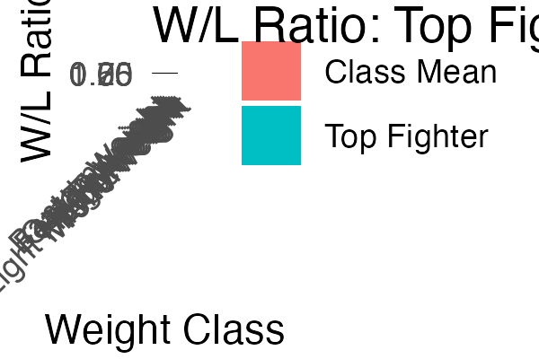
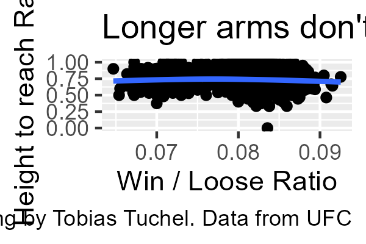
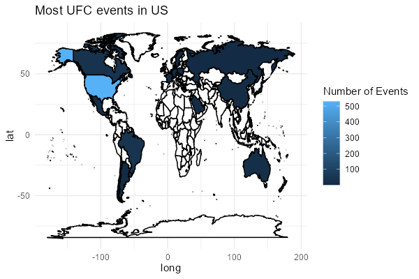
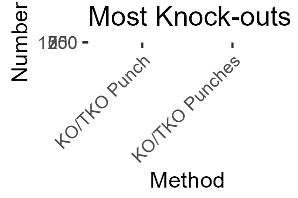
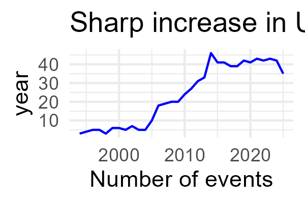

# Solution of UFC Statistics from Gabriel

## Data Import

    ufcevents <- readr::read_csv("Events.csv")

    ## Rows: 750 Columns: 4
    ## ── Column specification ────────────────────────────────────────────────────────
    ## Delimiter: ","
    ## chr  (3): Event_Id, Name, Location
    ## date (1): Date
    ## 
    ## ℹ Use `spec()` to retrieve the full column specification for this data.
    ## ℹ Specify the column types or set `show_col_types = FALSE` to quiet this message.

    ufcfightersstat <- readr::read_csv("Fighters stats.csv")

    ## Rows: 2586 Columns: 28
    ## ── Column specification ────────────────────────────────────────────────────────
    ## Delimiter: ","
    ## chr  (7): Fighter_Id, Full Name, Nickname, Stance, Weight_Class, Gender, Fig...
    ## dbl (20): Ht., Wt., W, L, D, Round, KD, STR, TD, SUB, Ctrl, Sig. Str. %, Hea...
    ## lgl  (1): Belt
    ## 
    ## ℹ Use `spec()` to retrieve the full column specification for this data.
    ## ℹ Specify the column types or set `show_col_types = FALSE` to quiet this message.

    ufcfighters <- readr::read_csv("fighters.csv")

    ## Rows: 4443 Columns: 10
    ## ── Column specification ────────────────────────────────────────────────────────
    ## Delimiter: ","
    ## chr (3): Full Name, Nickname, Stance
    ## dbl (6): Ht., Wt., Reach, W, L, D
    ## lgl (1): Belt
    ## 
    ## ℹ Use `spec()` to retrieve the full column specification for this data.
    ## ℹ Specify the column types or set `show_col_types = FALSE` to quiet this message.

    ufcfights <- readr::read_csv("Fights.csv")

    ## Rows: 8381 Columns: 44
    ## ── Column specification ────────────────────────────────────────────────────────
    ## Delimiter: ","
    ## chr  (10): Fighter_1, Fighter_2, Weight_Class, Method, Event_Id, Result_1, R...
    ## dbl  (33): KD_1, KD_2, STR_1, STR_2, TD_1, TD_2, SUB_1, SUB_2, Round, Sig. S...
    ## time  (1): Fight_Time
    ## 
    ## ℹ Use `spec()` to retrieve the full column specification for this data.
    ## ℹ Specify the column types or set `show_col_types = FALSE` to quiet this message.

## Data Manipulation and Visualization

It is structure graph centered, so manipulation and plotting are in the
same chunk.

### First Visualization:

    # hier haben wir das wlratio berechnet
    ufcfigtherswl <- ufcfightersstat %>%
      mutate(wlratio = W / (W + L) ) %>%
      group_by(Weight_Class) %>%
      summarise(mean_wlratio = mean(wlratio, na.rm = TRUE))
    # hier haben wir den jeweils stärksten rausgefiltert:
    ufc_top_per_class <- ufcfightersstat %>%
      mutate(wlratio = W / (W + L)) %>%
      group_by(Weight_Class) %>%
      slice_max(wlratio, n = 1, with_ties = FALSE)
    # Zusammenführen der Tabellen:
    ufc_combined <- ufc_top_per_class %>%
      select(Weight_Class, Fighter = `Full Name`, fighter_wlratio = wlratio) %>%
      left_join(ufcfigtherswl, by = "Weight_Class") %>%
      filter(!Weight_Class%in% c("Women's Bantamweight",
                                 "Women's Featherweight",
                                 "Women's Flyweight",
                                 "Women's Strawweight"))
    # Daten in long format:
    plotdata <- ufc_combined %>%
      pivot_longer(cols = c(fighter_wlratio, mean_wlratio),
                   names_to = "Type",
                   values_to = "Value") %>%
      mutate(Type = recode(Type,
                           "fighter_wlratio" = "Top Fighter",
                           "mean_wlratio" = "Class Mean"))

    ggplot(plotdata, aes(x = Weight_Class, y = Value, fill = Type))+
      geom_col(position = position_dodge())+
      labs(
        title = "W/L Ratio: Top Fighter vs. Class Mean",
        x = "Weight Class",
        y = "W/L Ratio",
      fill = ""
      )+
      theme_minimal()+
      theme(axis.text = element_text(angle = 45, hjust = 1))

    ggsave("tobivis1.png", path = "./plots", width = 600, height = 400, units = ("px"), dpi = 300)

### Second Visualization:

    ufcfigthershtoreach <- ufcfighters %>%
      mutate(
        heighttoreach = Ht. / Reach, na.rm = TRUE
      ) %>%
      mutate(
        wlratio = W / (W+L)
      )
      

    ggplot(ufcfigthershtoreach,aes(x = heighttoreach, y = wlratio))+
      geom_point()+
      geom_smooth()+
      labs(
        title = "Longer arms don't necessarily help figthers to win",
        caption = "Ploting by Tobias Tuchel. Data from UFC",
        x = "Win / Loose Ratio",
        y = "Height to reach Ratio"
      )

    ## `geom_smooth()` using method = 'gam' and formula = 'y ~ s(x, bs = "cs")'

    ggsave("tobivis2.png", path = "./plots", width = 600, height = 400, units = ("px"), dpi = 300)

    ## `geom_smooth()` using method = 'gam' and formula = 'y ~ s(x, bs = "cs")'

### Third Graph

    ufccountry <- ufcevents %>%
      separate(Location,
               into = c("City", "State", "Country"),
               sep = ",\\s*",
               fill = "left",
               extra = "merge")

    ufccountrygroups <- ufccountry %>%
      group_by(Country) %>%
      summarise(n = n()) %>%
      arrange(desc(n)) 

    library(maps)

    ## Warning: Paket 'maps' wurde unter R Version 4.5.2 erstellt

    ## 
    ## Attache Paket: 'maps'

    ## Das folgende Objekt ist maskiert 'package:purrr':
    ## 
    ##     map

    # Geometriedaten:
    world <- map_data("world")
    # Joining:
    events_world_map <- world %>%
      left_join(ufccountrygroups, by = c("region" = "Country"))
    # Plotten:
    ggplot(events_world_map, aes(x= long, y = lat, group = group, fill = n))+
      geom_polygon(color = "black")+
      scale_fill_continuous(name = "Number of Events", na.value = "white")+
      theme_minimal()+
      labs(title = "Most UFC events in US")

    ggsave("tobivis3.png", path = "./plots", width = 600, height = 400, units = ("px"), dpi = 300)

### Fourth Graph

Problem: Spaltennamen sind nicht vergeben, aus den Abkürzungen werde ich
nicht schlau, Feedback ist gegeben. Der jetzige Graph macht so nämlich
keinen Sinn.

    ufcmethod <- ufcfights %>%
      group_by(Method) %>%
      summarise(n = n()) %>%
      arrange(desc(n))

    graph <- ufcmethod %>%
      filter(Method %in% c("KO/TKO Punch", "KO/TKO Punches", "Submission",
                           "Doctor Stoppage", "Decision", "Draw", "Disqualification")) %>%
      ggplot(aes(x = reorder(Method, n), y = n)) +
      geom_col(fill = "blue") +
      theme(axis.text.x = element_text(angle = 45, hjust = 1))+
      labs(x = "Method",
           y = "Number",
           title = "Most Knock-outs in UFC through ")
    print(graph)

    ggsave("tobivis4.png", path = "./plots", width = 600, height = 400, units = ("px"), dpi = 300)

### Fifth Graph

    ufcyearlydata <- ufcevents %>%
      mutate(year = year(Date)) %>%
      group_by(year) %>%
      summarise(n = n()) %>%
      arrange(desc(n))

    ggplot(ufcyearlydata, aes(x = year, y = n))+
      geom_line(color = "blue")+
      labs(x = "Number of events",
           y = "year",
           title = "Sharp increase in UFC events till Pandemic")+
      theme_minimal()

    ggsave("tobivis5.png", path = "./plots", width = 600, height = 400, units = ("px"), dpi = 300)
