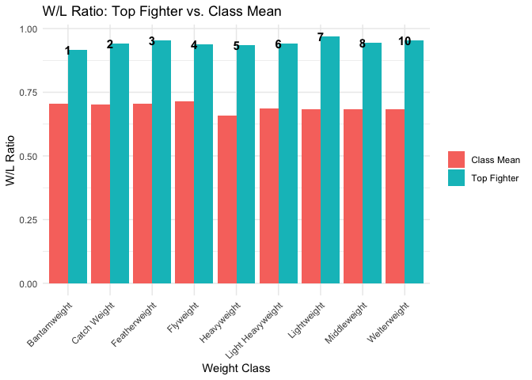
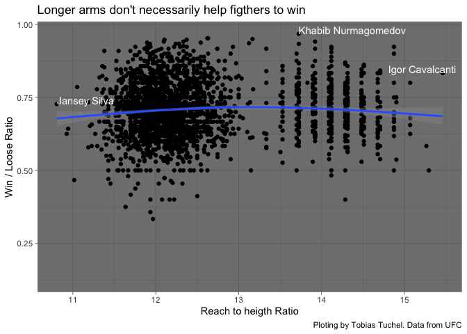
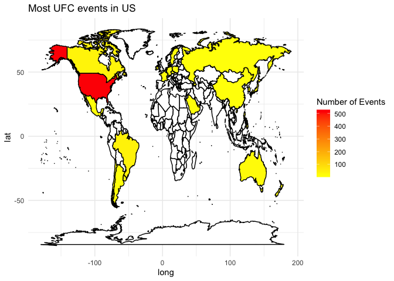
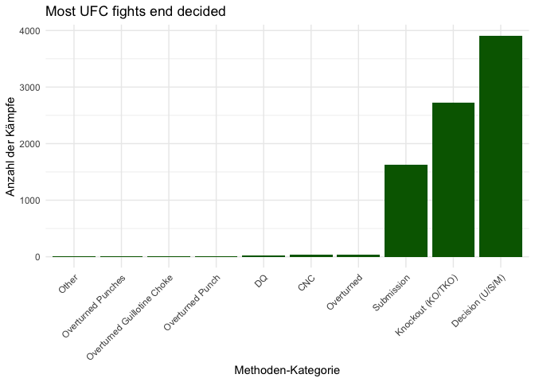
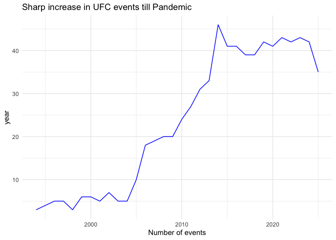

# Solution of UFC Statistics from Gabriel

## Data Import

    ufcevents <- read_csv("../Events.csv")

    ## Rows: 750 Columns: 4
    ## ── Column specification ────────────────────────────────────────────────────────
    ## Delimiter: ","
    ## chr  (3): Event_Id, Name, Location
    ## date (1): Date
    ## 
    ## ℹ Use `spec()` to retrieve the full column specification for this data.
    ## ℹ Specify the column types or set `show_col_types = FALSE` to quiet this message.

    ufcfightersstat <- read_csv("../Fighters stats.csv")

    ## Rows: 2586 Columns: 28
    ## ── Column specification ────────────────────────────────────────────────────────
    ## Delimiter: ","
    ## chr  (7): Fighter_Id, Full Name, Nickname, Stance, Weight_Class, Gender, Fig...
    ## dbl (20): Ht., Wt., W, L, D, Round, KD, STR, TD, SUB, Ctrl, Sig. Str. %, Hea...
    ## lgl  (1): Belt
    ## 
    ## ℹ Use `spec()` to retrieve the full column specification for this data.
    ## ℹ Specify the column types or set `show_col_types = FALSE` to quiet this message.

    ufcfighters <- read_csv("../fighters.csv")

    ## Rows: 4443 Columns: 10
    ## ── Column specification ────────────────────────────────────────────────────────
    ## Delimiter: ","
    ## chr (3): Full Name, Nickname, Stance
    ## dbl (6): Ht., Wt., Reach, W, L, D
    ## lgl (1): Belt
    ## 
    ## ℹ Use `spec()` to retrieve the full column specification for this data.
    ## ℹ Specify the column types or set `show_col_types = FALSE` to quiet this message.

    ufcfights <- read_csv("../Fights.csv")

    ## Rows: 8381 Columns: 44
    ## ── Column specification ────────────────────────────────────────────────────────
    ## Delimiter: ","
    ## chr  (10): Fighter_1, Fighter_2, Weight_Class, Method, Event_Id, Result_1, R...
    ## dbl  (33): KD_1, KD_2, STR_1, STR_2, TD_1, TD_2, SUB_1, SUB_2, Round, Sig. S...
    ## time  (1): Fight_Time
    ## 
    ## ℹ Use `spec()` to retrieve the full column specification for this data.
    ## ℹ Specify the column types or set `show_col_types = FALSE` to quiet this message.

## Data Manipulation and Visualization

It is structure graph centered, so manipulation and plotting are in the
same chunk.

### First Visualization:

Das Problem ist, dass die Namen zu lang sind um im Plot darstellbar zu
sein. Daher bediene ich mich einer Tabelle und einer Codierung, um die
Namen der in ihrer Gewichtsklasse jeweils besten Kämpfer aufzulisten.

    # hier haben wir das wlratio berechnet
    ufcfigtherswl <- ufcfightersstat %>%
      mutate(wlratio = (W+1) / (W + L +2) ) %>%
      group_by(Weight_Class) %>%
      summarise(mean_wlratio = mean(wlratio, na.rm = TRUE))
    # hier haben wir den jeweils stärksten rausgefiltert:
    ufc_top_per_class <- ufcfightersstat %>%
      mutate(wlratio = (W+1) / (W + L +2)) %>%
      group_by(Weight_Class) %>%
      slice_max(wlratio, n = 1, with_ties = FALSE)
    # Zusammenführen der Tabellen:
    ufc_combined <- ufc_top_per_class %>%
      ungroup() %>% 
      mutate(Fighter_Code = row_number()) %>%
      select(Weight_Class, Fighter = `Full Name`, fighter_wlratio = wlratio, Fighter_Code) %>%
      left_join(ufcfigtherswl, by = "Weight_Class") %>%
      filter(!Weight_Class%in% c("Women's Bantamweight",
                                 "Women's Featherweight",
                                 "Women's Flyweight",
                                 "Women's Strawweight",
                                 "Open Weight")) %>%
      pivot_longer(cols = c(fighter_wlratio, mean_wlratio),
                   names_to = "Type",
                   values_to = "Value") %>%
      mutate(Type = recode(Type,
                           "fighter_wlratio" = "Top Fighter",
                           "mean_wlratio" = "Class Mean"))

    ggplot(ufc_combined, aes(x = Weight_Class, y = Value, fill = Type))+
      geom_col(position = position_dodge())+
      geom_text(
        data = subset(ufc_combined, Type == "Top Fighter"),
        aes(label = Fighter_Code),
        position = position_dodge(width = 0.9), 
        vjust = 0.5,   # Vertikale Zentrierung
        color = "black", 
        fontface = "bold",
        size = 4
      )+
      labs(
        title = "W/L Ratio: Top Fighter vs. Class Mean",
        x = "Weight Class",
        y = "W/L Ratio",
        fill = ""
      )+
      theme_minimal()+
      theme(axis.text.x = element_text(angle = 45, hjust = 1))

    # ggsave("tobivis1.png", path = "./plots", width = 600, height = 400, units = ("px"), dpi = 300)

In der folgenden Legende ist der jeweilige Spitzenreiter in seiner
Gewichtsklasse aufgelistet:

    library(knitr)
    fighter_codes_legend <- ufc_combined %>%
      select(Code = Fighter_Code, Klasse = Weight_Class, Kämpfer = Fighter) %>%
      distinct()

    kable(fighter_codes_legend)

<table>
<thead>
<tr>
<th style="text-align: right;">Code</th>
<th style="text-align: left;">Klasse</th>
<th style="text-align: left;">Kämpfer</th>
</tr>
</thead>
<tbody>
<tr>
<td style="text-align: right;">1</td>
<td style="text-align: left;">Bantamweight</td>
<td style="text-align: left;">Malcolm Wellmaker</td>
</tr>
<tr>
<td style="text-align: right;">2</td>
<td style="text-align: left;">Catch Weight</td>
<td style="text-align: left;">Khamzat Chimaev</td>
</tr>
<tr>
<td style="text-align: right;">3</td>
<td style="text-align: left;">Featherweight</td>
<td style="text-align: left;">Movsar Evloev</td>
</tr>
<tr>
<td style="text-align: right;">4</td>
<td style="text-align: left;">Flyweight</td>
<td style="text-align: left;">Rafael Estevam</td>
</tr>
<tr>
<td style="text-align: right;">5</td>
<td style="text-align: left;">Heavyweight</td>
<td style="text-align: left;">Jon Jones</td>
</tr>
<tr>
<td style="text-align: right;">6</td>
<td style="text-align: left;">Light Heavyweight</td>
<td style="text-align: left;">Azamat Murzakanov</td>
</tr>
<tr>
<td style="text-align: right;">7</td>
<td style="text-align: left;">Lightweight</td>
<td style="text-align: left;">Khabib Nurmagomedov</td>
</tr>
<tr>
<td style="text-align: right;">8</td>
<td style="text-align: left;">Middleweight</td>
<td style="text-align: left;">Phillip Miller</td>
</tr>
<tr>
<td style="text-align: right;">10</td>
<td style="text-align: left;">Welterweight</td>
<td style="text-align: left;">Shavkat Rakhmonov</td>
</tr>
</tbody>
</table>

### Second Visualization:

    ufcfigthershtoreach <- ufcfighters %>%
      mutate(
        reachtoheigth = Reach / Ht., na.rm = TRUE
      ) %>%
      mutate(
        wlratio = (W+1) / (W + L +2)
      )

    ggplot(ufcfigthershtoreach,aes(x = reachtoheigth, y = wlratio))+
      geom_point()+
      geom_smooth()+
      labs(
        title = "Longer arms don't necessarily help figthers to win",
        caption = "Ploting by Tobias Tuchel. Data from UFC",
        x = "Reach to heigth Ratio",
        y = "Win / Loose Ratio"
      )+
      geom_text(
        data = ufcfigthershtoreach %>%
          slice_max(reachtoheigth, n = 1, with_ties = FALSE),
                    aes(label = `Full Name`),
        vjust = 0,
        hjust = 0.8,
        color = "white"
      )+
      geom_text(
        data = ufcfigthershtoreach %>%
          slice_min(reachtoheigth, n = 1, with_ties = FALSE),
        aes(label = `Full Name`),
        vjust = 0,
        hjust = 0,
        color = "white"
      )+
      geom_text(
        data = ufcfigthershtoreach %>%
          slice_min(wlratio, n = 1, with_ties = FALSE),
        aes(label = `Full Name`),
        vjust = 0,
        hjust = 0,
        color = "white"
      )+
      geom_text(
        data = ufcfigthershtoreach %>%
          slice_max(wlratio, n = 1, with_ties = FALSE),
        aes(label = `Full Name`),
        vjust = 0,
        hjust = 0,
        color = "white"
      )+
        theme_dark()

    ## `geom_smooth()` using method = 'gam' and formula = 'y ~ s(x, bs = "cs")'

    # ggsave("tobivis2.png", path = "./plots", width = 600, height = 400, units = ("px"), dpi = 300)

    ## `geom_smooth()` using method = 'gam' and formula = 'y ~ s(x, bs = "cs")'

### Third Graph

    ufccountry <- ufcevents %>%
      separate(Location,
               into = c("City", "State", "Country"),
               sep = ",\\s*",
               fill = "left",
               extra = "merge") %>%
      group_by(Country) %>%
      summarise(n = n()) %>%
      arrange(desc(n)) 

    library(maps)

    ## 
    ## Attaching package: 'maps'

    ## The following object is masked from 'package:purrr':
    ## 
    ##     map

    # Geometriedaten:
    world <- map_data("world")
    # Joining:
    events_world_map <- world %>%
      left_join(ufccountry, by = c("region" = "Country"))
    # Plotten:
    ggplot(events_world_map, aes(x= long, y = lat, group = group, fill = n))+
      geom_polygon(color = "black")+
      scale_fill_gradient(name = "Number of Events", na.value = "white", 
                          low = "yellow", high = "red")+
      theme_minimal()+
      labs(title = "Most UFC events in US")

    # ggsave("tobivis3.png", path = "./plots", width = 600, height = 400, units = ("px"), dpi = 300)

### Fourth Graph

Problem: Spaltennamen sind nicht vergeben, aus den Abkürzungen werde ich
nicht schlau, Feedback ist gegeben. Der jetzige Graph macht so nämlich
keinen Sinn.

    ufcmethod <- ufcfights %>%
      mutate(
        Aggregated_Method = case_when(
          grepl("KO/TKO|KO/TKO Punches|KO/TKO Punch", Method) ~ "Knockout (KO/TKO)",
          grepl("U-DEC|S-DEC|M-DEC", Method) ~ "Decision (U/S/M)",
          grepl("SUB|Sub", Method) ~ "Submission",
          TRUE ~ as.character(Method)
        )
      ) %>%
      group_by(Aggregated_Method) %>%
      summarise(n = n()) %>%
      slice_max(n, n = 10) %>%
      ggplot(aes(x = reorder(Aggregated_Method, n), y = n)) +
      geom_col(fill = "darkgreen") + 
      theme_minimal() + 
      theme(axis.text.x = element_text(angle = 45, hjust = 1))+
      labs(x = "Methoden-Kategorie",
           y = "Anzahl der Kämpfe",
           title = "Most UFC fights end decided")
    print(ufcmethod)

    # ggsave("tobivis4.png", path = "./plots", width = 600, height = 400, units = ("px"), dpi = 300)

### Fifth Graph

    ufcyearlydata <- ufcevents %>%
      mutate(year = year(Date)) %>%
      group_by(year) %>%
      summarise(n = n()) %>%
      arrange(desc(n))

    ggplot(ufcyearlydata, aes(x = year, y = n))+
      geom_line(color = "blue")+
      labs(x = "Number of events",
           y = "year",
           title = "Sharp increase in UFC events till Pandemic")+
      theme_minimal()

    # ggsave("tobivis5.png", path = "./plots", width = 600, height = 400, units = ("px"), dpi = 300)
