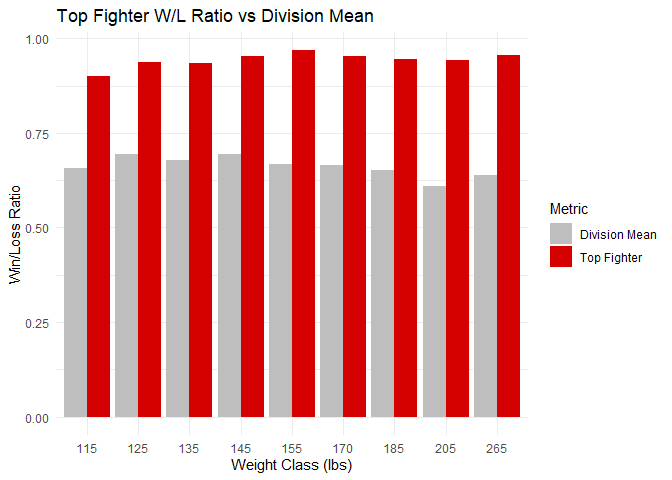
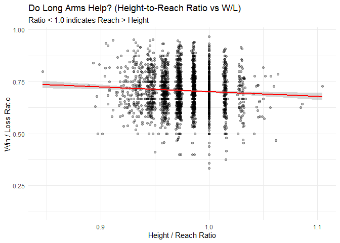
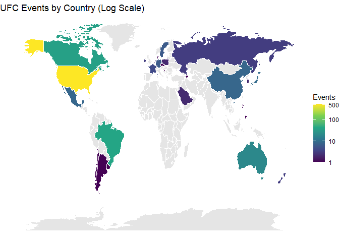
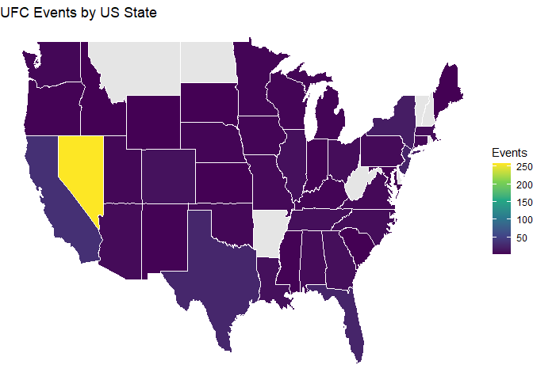

    # Use read_csv with universal name repair to maintain compatibility with existing column references (e.g., replacing spaces with dots)
    events <- read_csv("raw_events.csv", na = c("", "NA", "--"), name_repair = "universal")
    fighters <- read_csv("raw_fighters.csv", na = c("", "NA", "--"), name_repair = "universal")
    fights <- read_csv("raw_fights.csv", na = c("", "NA", "--"), name_repair = "universal")
    fights_detailed <- read_csv("raw_fights_detailed.csv", na = c("", "NA", "--"), name_repair = "universal")

    clean_height <- function(h) {
      # Convert 5' 11" format to inches
      # Note: NAs are now handled in read_csv
      as.numeric(str_extract(h, "^\\d+")) * 12 + 
      as.numeric(str_extract(h, "\\d+(?=\")"))
    }

    clean_weight <- function(w) {
      as.numeric(str_remove(w, " lbs."))
    }

    clean_reach <- function(r) {
      as.numeric(str_remove(r, "\""))
    }

    # Apply cleaning and feature engineering
    fighters_clean <- fighters %>%
      mutate(
        Height_in = clean_height(Ht.),
        Weight_lbs = clean_weight(Wt.),
        Reach_in = clean_reach(Reach),
        Total_Fights = W + L + D,
        # Laplace Smoothing: (Wins + 1) / (Wins + Losses + 2)
        WL_Ratio = (W + 1) / (W + L + 2)
      ) %>%
      drop_na(Weight_lbs) # Replaced filter(!is.na(...)) as suggested

    # Assign Standard Weight Classes
    # We define breaks at the midpoints between classes to find the nearest class using findInterval
    classes <- c(115, 125, 135, 145, 155, 170, 185, 205, 265)
    midpoints <- (classes[-1] + classes[-length(classes)]) / 2
    breaks <- c(-Inf, midpoints, Inf)

    fighters_clean$Weight_Class_Bin <- classes[findInterval(fighters_clean$Weight_lbs, breaks)]

    # Calculate Height-to-Reach Ratio
    fighters_clean <- fighters_clean %>%
      mutate(Height_Reach_Ratio = Height_in / Reach_in)

    events_clean <- events %>%
      mutate(
        Date = mdy(Date),
        Year = year(Date),
        # Extract Country: Everything after the last comma, trimmed of whitespace
        Country = str_trim(str_extract(Location, "[^,]+$")),
        # Extract State: If Country is USA, take the part before the last comma
        State = ifelse(Country == "USA", 
                       str_trim(str_extract(Location, "(?<=, )[^,]+(?=, USA)")), 
                       NA)
      )

    # Fix Country names for map matching
    events_clean$Country[events_clean$Country == "United Arab Emirates"] <- "UAE"

    fights_clean <- fights %>%
      mutate(
        Method_Simple = case_when(
          str_detect(Method, "KO|TKO") ~ "KO/TKO",
          str_detect(Method, "SUB") ~ "Submission",
          str_detect(Method, "DEC") ~ "Decision",
          str_detect(Method, "DQ") ~ "Disqualification",
          str_detect(Method, "Doctor") ~ "Doctor Stoppage",
          str_detect(Method, "Draw") ~ "Draw",
          TRUE ~ "Other"
        )
      )

    # Function to extract the last number from string "86 of 165"
    extract_strikes <- function(s) {
      as.numeric(str_extract(s, "\\d+$"))
    }

    # Prepare detailed fights for merging
    # We sum strikes for each fighter across all their fights
    strikes_1 <- fights_detailed %>% 
      select(Fight_Id, Name = Fighter_1, Strikes_Raw = `Total.Str._1`)
    strikes_2 <- fights_detailed %>% 
      select(Fight_Id, Name = Fighter_2, Strikes_Raw = `Total.Str._2`)

    # Combine and sum up
    all_strikes <- bind_rows(strikes_1, strikes_2) %>%
      mutate(Total_Strikes = extract_strikes(Strikes_Raw)) %>%
      group_by(Name) %>%
      summarise(Career_Strikes = sum(Total_Strikes, na.rm = TRUE)) %>%
      arrange(desc(Career_Strikes)) %>%
      top_n(10, Career_Strikes)

    # Calculate Division Means
    class_means <- fighters_clean %>%
      group_by(Weight_Class_Bin) %>%
      summarise(Mean_WL = mean(WL_Ratio, na.rm = TRUE))

    # Pipeline to find best fighters and plot immediately
    fighters_clean %>%
      filter(Total_Fights >= 5) %>%
      group_by(Weight_Class_Bin) %>%
      arrange(desc(WL_Ratio), desc(Total_Fights)) %>%
      slice(1) %>%
      select(Weight_Class_Bin, Name = First, Last, Top_WL = WL_Ratio) %>%
      mutate(FullName = paste(Name, Last)) %>%
      # Join with means
      left_join(class_means, by = "Weight_Class_Bin") %>%
      pivot_longer(cols = c(Top_WL, Mean_WL), names_to = "Type", values_to = "Ratio") %>%
      # Plot directly
      ggplot(aes(x = as.factor(Weight_Class_Bin), y = Ratio, fill = Type)) +
      geom_bar(stat = "identity", position = "dodge") +
      labs(title = "Top Fighter W/L Ratio vs Division Mean",
           x = "Weight Class (lbs)", y = "Win/Loss Ratio", fill = "Metric") +
      theme_minimal() +
      scale_fill_manual(values = c("Mean_WL" = "grey", "Top_WL" = "#D50000"), 
                        labels = c("Division Mean", "Top Fighter"))

    ggplot(fighters_clean, aes(x = Height_Reach_Ratio, y = WL_Ratio)) +
      geom_point(alpha = 0.3) +
      geom_smooth(method = "lm", color = "red") +
      labs(title = "Do Long Arms Help? (Height-to-Reach Ratio vs W/L)",
           subtitle = "Ratio < 1.0 indicates Reach > Height",
           x = "Height / Reach Ratio", y = "Win / Loss Ratio") +
      theme_minimal()

    # World Map
    world_data <- map_data("world")
    country_counts <- events_clean %>% count(Country)

    map_data_joined <- left_join(world_data, country_counts, by = c("region" = "Country"))

    ggplot(map_data_joined, aes(long, lat, group = group, fill = n)) +
      geom_polygon(color = "white", linewidth = 0.1) +
      # Log scaling applied here with readable breaks
      scale_fill_viridis_c(na.value = "grey90", name = "Events",
                           trans = "log",
                           breaks = c(1, 10, 100, 500)) +
      labs(title = "UFC Events by Country (Log Scale)") +
      theme_void()

    # US State Map
    us_data <- map_data("state")
    state_counts <- events_clean %>% 
      filter(Country == "USA") %>%
      mutate(State = tolower(State)) %>%
      count(State)

    us_map_joined <- left_join(us_data, state_counts, by = c("region" = "State"))

    ggplot(us_map_joined, aes(long, lat, group = group, fill = n)) +
      geom_polygon(color = "white") +
      # Log scaling applied here as well
      scale_fill_viridis_c(na.value = "grey90", name = "Events",
                           trans = "log",
                           breaks = c(1, 5, 20, 100)) +
      labs(title = "UFC Events by US State (Log Scale)") +
      theme_void()

    fights_clean %>%
      count(Method_Simple) %>%
      ggplot(aes(x = reorder(Method_Simple, n), y = n)) +
      geom_col(fill = "steelblue") +
      coord_flip() +
      labs(title = "How do fights usually end?", x = "Method", y = "Count") +
      theme_minimal()

    events_clean %>%
      count(Year) %>%
      ggplot(aes(x = Year, y = n)) +
      geom_line(color = "darkred", linewidth = 1) +
      labs(title = "Expansion of the Sport: Events per Year",
           x = "Year", y = "Number of Events") +
          theme_minimal()

    # Function to extract the last number from string "86 of 165"
    extract_strikes <- function(s) {
      as.numeric(str_extract(s, "\\d+$"))
    }

    # Prepare detailed fights for merging
    # We sum strikes for each fighter across all their fights
    strikes_1 <- fights_detailed %>% 
      select(Fight_Id, Name = Fighter_1, Strikes_Raw = `Total.Str._1`)
    strikes_2 <- fights_detailed %>% 
      select(Fight_Id, Name = Fighter_2, Strikes_Raw = `Total.Str._2`)

    # Combine and sum up
    all_strikes <- bind_rows(strikes_1, strikes_2) %>%
      mutate(Total_Strikes = extract_strikes(Strikes_Raw)) %>%
      group_by(Name) %>%
      summarise(Career_Strikes = sum(Total_Strikes, na.rm = TRUE)) %>%
      arrange(desc(Career_Strikes)) %>%
      top_n(10, Career_Strikes)

    ggplot(all_strikes, aes(x = reorder(Name, Career_Strikes), y = Career_Strikes, fill = Name)) +
      geom_col(show.legend = FALSE) +
      coord_flip() +
      labs(title = "Top 10 Fighters by Total Punches Thrown",
           x = "Fighter", y = "Total Strikes") +
      theme_minimal()

