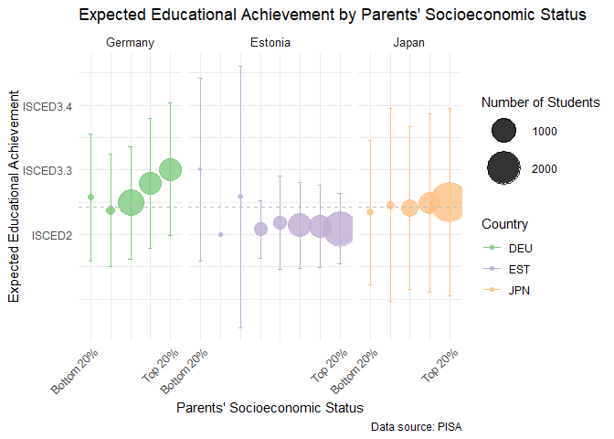

### **ArleneProjectByMohamed**

#### **Loading the Data**

    # Set working directory
    setwd("C:/Users/Admin/Downloads/Data-projects-with-R-and-GitHub/Projects/ArleneHohl")

    # Load PISA data
    load("data_PISA.Rdata")

#### **PISA Data Pre-processing**

    # Select the relevant columns for parent's education and expected education qualification
    data <- data %>%
      select(ST005Q01JA, ST007Q01JA, ST327Q01JA, ST327Q02JA, ST327Q03JA, ST327Q04JA, 
             ST327Q05JA, ST327Q06JA, ST327Q07JA, ST327Q08JA, CNT, CNTSTUID) %>%
      drop_na()

    # reverse the scores by getting the max value of the column (+1) and subtracting the actual value
    data <- data %>%
     mutate(
       ST005Q01JA = max(ST005Q01JA) +1 -ST005Q01JA,
       ST007Q01JA = max(ST007Q01JA) +1 -ST007Q01JA
     )

    # Double check that NAs are removed
    any_na <- any(is.na(data))
    print(any_na)

    ## [1] FALSE

    head(data)

    ## # A tibble: 6 × 12
    ##   ST005Q01JA ST007Q01JA ST327Q01JA ST327Q02JA ST327Q03JA ST327Q04JA ST327Q05JA
    ##        <dbl>      <dbl>      <dbl>      <dbl>      <dbl>      <dbl>      <dbl>
    ## 1          5          5          1          2          1          2          2
    ## 2          5          4          1          3          1          3          3
    ## 3          5          5          1          1          1          1          1
    ## 4          5          5          1          2          1          2          3
    ## 5          5          4          1          2          1          2          2
    ## 6          4          4          1          2          1          2          1
    ## # ℹ 5 more variables: ST327Q06JA <dbl>, ST327Q07JA <dbl>, ST327Q08JA <dbl>,
    ## #   CNT <chr>, CNTSTUID <dbl>

#### **Data Analysis**

##### Determine parents’ highest level of education for each person

    # Compute the summed score for the parents' education levels for each person
    data <- data %>%
       mutate(ED_PARENTS = rowSums(select(data, ST005Q01JA, ST007Q01JA), na.rm = TRUE))
       
    # Define the columns of interest
    education_columns <- c("ST327Q01JA", "ST327Q02JA", "ST327Q03JA", "ST327Q04JA", 
                           "ST327Q05JA", "ST327Q06JA", "ST327Q07JA", "ST327Q08JA")

##### Find the Expected Education Level for each Student

    # Define the columns related to expected education
    education_columns <- c("ST327Q01JA", "ST327Q02JA", "ST327Q03JA", "ST327Q04JA", "ST327Q05JA", "ST327Q06JA", "ST327Q07JA", "ST327Q08JA")

    # A function to get the expected education level
    get_exp_level <- function(...) {
      row <- c(...)
      education_levels <- c("ISCED_2", "ISCED_3_3", "ISCED_3_4", "ISCED_4", "ISCED_5", "ISCED_6", "ISCED_7", "ISCED_8")
      first_non_na <- which(row == 1)[1]
      if (!is.na(first_non_na)) {
        return(education_levels[first_non_na])
      }
      return(NA)
    }

    # Compute expected education
    data <- data %>%
      mutate(EXP_ED = pmap_chr(across(all_of(education_columns)), get_exp_level)) %>%
      filter(!is.na(EXP_ED), !is.na(ED_PARENTS))

##### Mapping ISCED Levels to Numerical Values

    # Define the ISCED mapping
    isced_mapping <- c(
      "ISCED_2" = 1,
      "ISCED_3_3" = 2,
      "ISCED_3_4" = 3,
      "ISCED_4" = 4,
      "ISCED_5" = 5,
      "ISCED_6" = 6,
      "ISCED_7" = 7,
      "ISCED_8" = 8
    )

    # Map the expected education to numerical values
    data <- data %>%
      mutate(EXP_ED_NUM = isced_mapping[EXP_ED],
             ED_PARENTS = as.numeric(ED_PARENTS)) %>%
      select(CNT, CNTSTUID, EXP_ED, EXP_ED_NUM, ED_PARENTS)

    print(data)

    ## # A tibble: 11,564 × 5
    ##    CNT   CNTSTUID EXP_ED  EXP_ED_NUM ED_PARENTS
    ##    <chr>    <dbl> <chr>        <dbl>      <dbl>
    ##  1 EST   23300001 ISCED_2          1         10
    ##  2 EST   23300004 ISCED_2          1          9
    ##  3 EST   23300005 ISCED_2          1         10
    ##  4 EST   23300006 ISCED_2          1         10
    ##  5 EST   23300007 ISCED_2          1          9
    ##  6 EST   23300012 ISCED_2          1          8
    ##  7 EST   23300013 ISCED_2          1          8
    ##  8 EST   23300015 ISCED_2          1         10
    ##  9 EST   23300018 ISCED_2          1         10
    ## 10 EST   23300019 ISCED_2          1          8
    ## # ℹ 11,554 more rows

##### Compute mean and stanard deviation to inlcude in plotting

    # Summarize data for plotting
    sum_data <- data %>%
      group_by(ED_PARENTS, CNT) %>%
      summarise(
        global_avg_exp_ed = mean(EXP_ED_NUM, na.rm = TRUE),
        mean_exp_ed = mean(EXP_ED_NUM, na.rm = TRUE),
        sd_exp_ed = sd(EXP_ED_NUM, na.rm = TRUE),
        no_students = n(),
        .groups = 'drop'  # This argument ensures the ungrouping of data
      )

#### Plotting Data

    # Load required libraries
    library(ggplot2)
    library(scales)

    ## 
    ## Attaching package: 'scales'

    ## The following object is masked from 'package:purrr':
    ## 
    ##     discard

    ## The following object is masked from 'package:readr':
    ## 
    ##     col_factor

    # Define country labels
    country_labels <- c("DEU" = "Germany", "EST" = "Estonia", "JPN" = "Japan")

    # Plot the data
    ggplot(sum_data, aes(x = factor(ED_PARENTS), y = mean_exp_ed, color = CNT)) +
      scale_color_brewer(palette = "Accent") +
      geom_point(aes(size = no_students), alpha = 0.8) + 
      geom_hline(aes(yintercept = mean(global_avg_exp_ed, na.rm = TRUE)), linetype = "dashed", color = "grey") +
      geom_errorbar(aes(ymin = mean_exp_ed - sd_exp_ed, ymax = mean_exp_ed + sd_exp_ed), width = 0.2) +
      scale_size(range = c(1, 15), name = "Number of Students") +
      labs(
        title = "Expected Educational Achievement by Parents' Socioeconomic Status",
        x = "Parents' Socioeconomic Status",
        y = "Expected Educational Achievement",
        color = "Country",
        caption = "Data source: PISA"
      ) +
      theme_minimal() +
      theme(
        legend.position = "right",
        strip.text = element_text(size = 10),
        axis.text.x = element_text(angle = 45, hjust = 1)
      ) +
      facet_grid(cols = vars(CNT), scales = "free_x", space = "free_x", labeller = labeller(CNT = country_labels)) +
      scale_x_discrete(labels = function(labels) {
        c("Bottom 20%", rep("", length(labels) - 2), "Top 20%")
      }) +
      scale_y_continuous(breaks = 1:8, labels = c("ISCED2", "ISCED3.3", "ISCED3.4", "ISCED4", "ISCED5", "ISCED6", "ISCED7", "ISCED8"))

