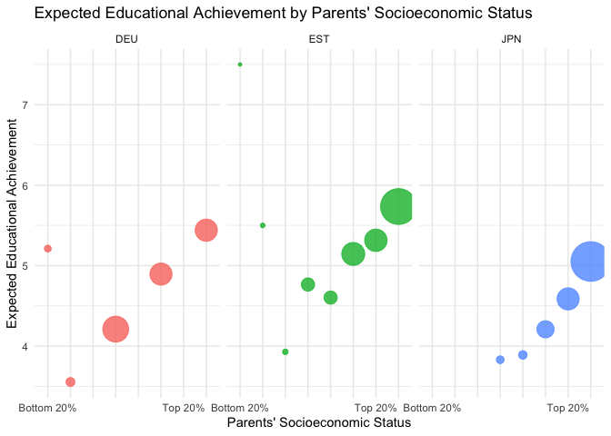

### Solution for Arlene’s project

Below is my solution for Arlene’s project. It is not quite finished yet,
at least the plot looks unfinished. I had trouble bringing it in the
same form as the example plot and eventually just gave up. So if there’s
an easier solution, I’d love to hear it :)

    # libraries
    library(tidyverse)
    library(dbplyr)
    library(ggplot2)

    # load the data
    load("~/Data Projects with R and GitHub/Projects/ArleneHohl/data_PISA.Rdata")
    head(data)

    ## # A tibble: 6 × 1,279
    ##   CNT   CNTRYID CNTSCHID CNTSTUID CYC   NatCen STRATUM SUBNATIO REGION  OECD
    ##   <chr>   <dbl>    <dbl>    <dbl> <chr> <chr>  <chr>   <chr>     <dbl> <dbl>
    ## 1 EST       233 23300149 23300001 08MS  023300 EST01   2330000   23300     1
    ## 2 EST       233 23300171 23300002 08MS  023300 EST01   2330000   23300     1
    ## 3 EST       233 23300075 23300003 08MS  023300 EST01   2330000   23300     1
    ## 4 EST       233 23300194 23300004 08MS  023300 EST01   2330000   23300     1
    ## 5 EST       233 23300079 23300005 08MS  023300 EST02   2330000   23300     1
    ## 6 EST       233 23300201 23300006 08MS  023300 EST01   2330000   23300     1
    ## # ℹ 1,269 more variables: ADMINMODE <dbl>, LANGTEST_QQQ <dbl>,
    ## #   LANGTEST_COG <dbl>, LANGTEST_PAQ <dbl>, Option_CT <dbl>, Option_FL <dbl>,
    ## #   Option_ICTQ <dbl>, Option_WBQ <dbl>, Option_PQ <dbl>, Option_TQ <dbl>,
    ## #   Option_UH <dbl>, BOOKID <dbl>, ST001D01T <dbl>, ST003D02T <dbl>,
    ## #   ST003D03T <dbl>, ST004D01T <dbl>, ST250Q01JA <dbl>, ST250Q02JA <dbl>,
    ## #   ST250Q03JA <dbl>, ST250Q04JA <dbl>, ST250Q05JA <dbl>, ST250D06JA <chr>,
    ## #   ST250D07JA <chr>, ST251Q01JA <dbl>, ST251Q02JA <dbl>, ST251Q03JA <dbl>, …

    # select only columns needed
    clean_data <- data %>%
      select(CNT, CNTSTUID, ST005Q01JA, ST007Q01JA, ST327Q01JA, ST327Q02JA, ST327Q03JA, ST327Q04JA, ST327Q05JA, ST327Q06JA, ST327Q07JA, ST327Q08JA) 
    head(clean_data)

    ## # A tibble: 6 × 12
    ##   CNT   CNTSTUID ST005Q01JA ST007Q01JA ST327Q01JA ST327Q02JA ST327Q03JA
    ##   <chr>    <dbl>      <dbl>      <dbl>      <dbl>      <dbl>      <dbl>
    ## 1 EST   23300001          1          1          1          2          1
    ## 2 EST   23300002          1          1          1          2          1
    ## 3 EST   23300003          1          1         NA         NA          1
    ## 4 EST   23300004          1          2          1          3          1
    ## 5 EST   23300005          1          1          1          1          1
    ## 6 EST   23300006          1          1          1          2          1
    ## # ℹ 5 more variables: ST327Q04JA <dbl>, ST327Q05JA <dbl>, ST327Q06JA <dbl>,
    ## #   ST327Q07JA <dbl>, ST327Q08JA <dbl>

## Data manipulation: Build parents’ highest level of education for each person

    # remove NAs 
    clean_data <- clean_data[!is.na(clean_data$ST005Q01JA) & !is.na(clean_data$ST007Q01JA), ]

    # reverse the scores by getting the max value of the column (+1) and subtracting the actual value
    max_value <- max(clean_data$ST005Q01JA)
    clean_data$ST005Q01JA <- max_value + 1 - clean_data$ST005Q01JA

    max_value <- max(clean_data$ST007Q01JA)
    clean_data$ST007Q01JA <- max_value + 1 - clean_data$ST007Q01JA

    head(clean_data)

    ## # A tibble: 6 × 12
    ##   CNT   CNTSTUID ST005Q01JA ST007Q01JA ST327Q01JA ST327Q02JA ST327Q03JA
    ##   <chr>    <dbl>      <dbl>      <dbl>      <dbl>      <dbl>      <dbl>
    ## 1 EST   23300001          5          5          1          2          1
    ## 2 EST   23300002          5          5          1          2          1
    ## 3 EST   23300003          5          5         NA         NA          1
    ## 4 EST   23300004          5          4          1          3          1
    ## 5 EST   23300005          5          5          1          1          1
    ## 6 EST   23300006          5          5          1          2          1
    ## # ℹ 5 more variables: ST327Q04JA <dbl>, ST327Q05JA <dbl>, ST327Q06JA <dbl>,
    ## #   ST327Q07JA <dbl>, ST327Q08JA <dbl>

    # store the sum of the two columns in a new column called ED_PARENTS
    clean_data$ED_PARENTS <- clean_data$ST005Q01JA + clean_data$ST007Q01JA
    head(clean_data)

    ## # A tibble: 6 × 13
    ##   CNT   CNTSTUID ST005Q01JA ST007Q01JA ST327Q01JA ST327Q02JA ST327Q03JA
    ##   <chr>    <dbl>      <dbl>      <dbl>      <dbl>      <dbl>      <dbl>
    ## 1 EST   23300001          5          5          1          2          1
    ## 2 EST   23300002          5          5          1          2          1
    ## 3 EST   23300003          5          5         NA         NA          1
    ## 4 EST   23300004          5          4          1          3          1
    ## 5 EST   23300005          5          5          1          1          1
    ## 6 EST   23300006          5          5          1          2          1
    ## # ℹ 6 more variables: ST327Q04JA <dbl>, ST327Q05JA <dbl>, ST327Q06JA <dbl>,
    ## #   ST327Q07JA <dbl>, ST327Q08JA <dbl>, ED_PARENTS <dbl>

## Data manipulation: Expected education qualification

    # find the expected education qualification of the student with a for-loop
    education_columns <- c("ST327Q01JA", "ST327Q02JA", "ST327Q03JA", "ST327Q04JA", "ST327Q05JA", "ST327Q06JA", "ST327Q07JA", "ST327Q08JA")

    exp_level <- function(row) {
      education_levels <- c("ISCED_2", "ISCED_3_3", "ISCED_3_4", "ISCED_4", "ISCED_5", "ISCED_6", "ISCED_7", "ISCED_8")
      for (i in length(row):1) {
        if (!is.na(row[i]) && row[i] == 1) {
          return(education_levels[i])
        }
      }
      return(NA) 
    }
        
    clean_data$EXP_ED <- apply(clean_data[, education_columns], 1, exp_level)

    # drop the NA values and only keep relevant columns
    clean_data <- clean_data[!is.na(clean_data$EXP_ED), ]
    clean_data %>%
      select(CNT, CNTSTUID, EXP_ED, ED_PARENTS) 

    ## # A tibble: 13,886 × 4
    ##    CNT   CNTSTUID EXP_ED    ED_PARENTS
    ##    <chr>    <dbl> <chr>          <dbl>
    ##  1 EST   23300001 ISCED_8           10
    ##  2 EST   23300002 ISCED_3_4         10
    ##  3 EST   23300003 ISCED_4           10
    ##  4 EST   23300004 ISCED_7            9
    ##  5 EST   23300005 ISCED_5           10
    ##  6 EST   23300006 ISCED_8           10
    ##  7 EST   23300007 ISCED_8            9
    ##  8 EST   23300010 ISCED_7            9
    ##  9 EST   23300012 ISCED_5            8
    ## 10 EST   23300013 ISCED_6            8
    ## # ℹ 13,876 more rows

    # also map numerical values to the expected education

    isced_mapping <- c(
      "ISCED_2" = 1,
      "ISCED_3_3" = 2,
      "ISCED_3_4" = 3,
      "ISCED_4" = 4,
      "ISCED_5" = 5,
      "ISCED_6" = 6,
      "ISCED_7" = 7,
      "ISCED_8" = 8
    )

    clean_data <- clean_data %>%
      mutate(EXP_ED_NUM = isced_mapping[EXP_ED],
             ED_PARENTS = as.numeric(ED_PARENTS))

    clean_data <- clean_data %>%
      filter(!is.na(EXP_ED_NUM), !is.na(ED_PARENTS))

# Plot the data

This plot is far away from perfect and it took me a while to even get it
into that shape (and obviously a lot of ChatGPT). What is missing are
the error bars as well as the “median line” that is shown in the
original plot. Furthermore, I have commented out the scale\_y\_discrete
part, it just removes the labels when I leave it in. The geom\_line
needs to be revised to being just one straight line, but I did not have
time to find out how that would work. Also interesting is the fact that
the bubbles for low socioeconomic status (or parent education level) for
Germany and Estonia are so high on the 2 and 4-level. Probably a mistake
from my side…

    #get data ready for plotting, add mean of numeric column. Also get number of students for the bubble plot later
    sum_data <- clean_data %>%
      group_by(ED_PARENTS, CNT) %>%
      summarise(
        mean_exp_ed = mean(EXP_ED_NUM, na.rm = TRUE),
        no_students = n()
      ) %>%
      ungroup()

    # Calculating the global average for the straight trend line later
    global_avg <- clean_data %>%
      group_by(ED_PARENTS) %>%
      summarise(global_avg_exp_ed = mean(EXP_ED_NUM, na.rm = TRUE))

    plot_data <- sum_data %>%
      left_join(global_avg, by = "ED_PARENTS")

    # Plot the data
    plot <- ggplot(plot_data, aes(x = factor(ED_PARENTS), y = mean_exp_ed, color = CNT)) +
      geom_point(aes(size = no_students), alpha = 0.8) + 
      #geom_line(aes(y = global_avg_exp_ed, group = 1), linetype = "dashed", color = "grey") +
      scale_size(range = c(1, 15)) +
      labs(
        title = "Expected Educational Achievement by Parents' Socioeconomic Status",
        x = "Parents' Socioeconomic Status",
        y = "Expected Educational Achievement"
      ) +
      theme_minimal() +
      theme(legend.position = "none") +
      facet_wrap(vars(CNT)) +
      scale_x_discrete(breaks = c("2", "4", "5", "6", "7", "8", "9", "10"),
                       labels = c("Bottom 20%", "", "", "", "", "", "Top 20%", ""))
      #scale_y_discrete(breaks = c("4", "5", "6", "7"),
                       #labels = c("ISCED4", "ISCED5", "ISCED6", "ISCED7"))

    print(plot)

