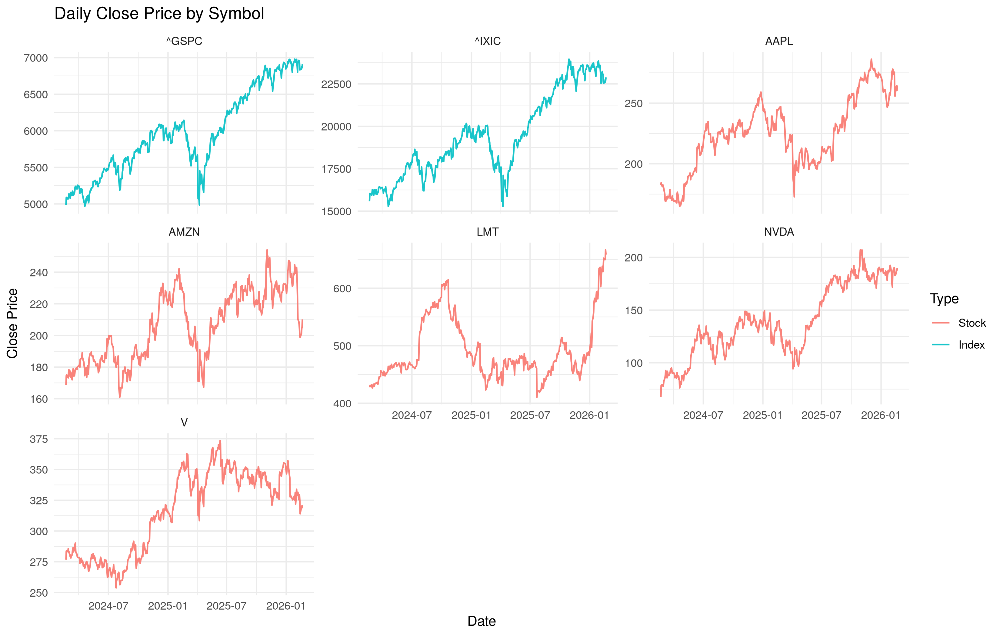
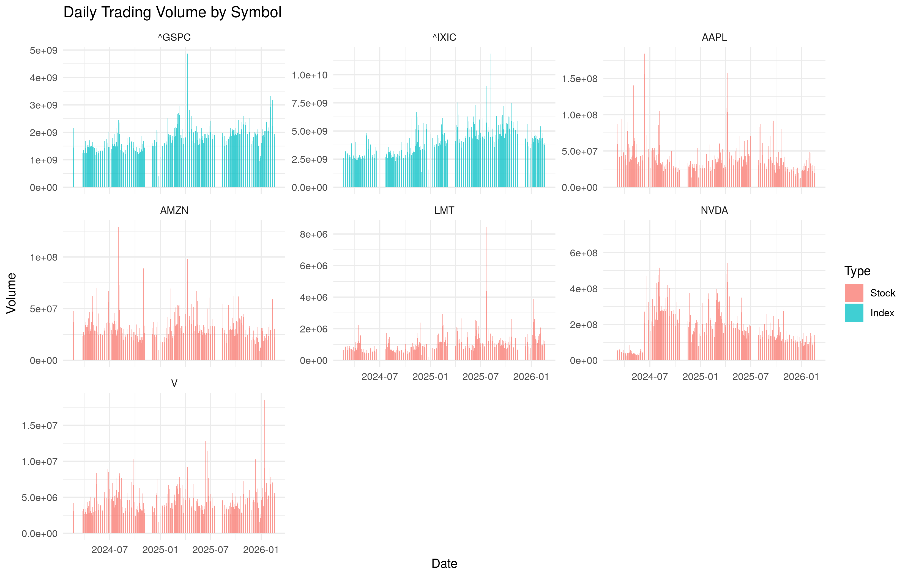
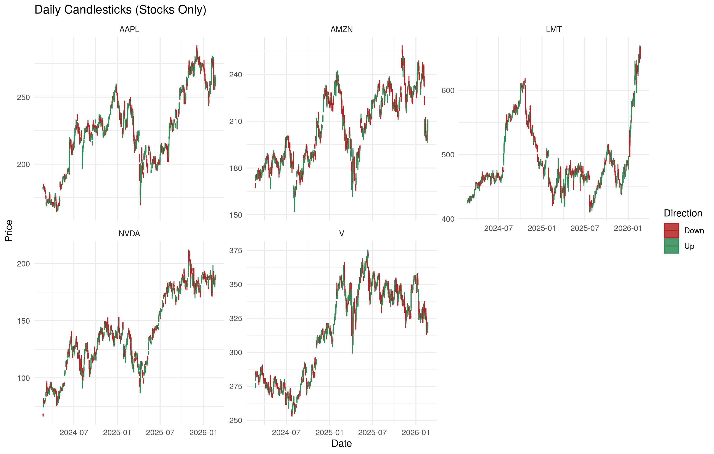
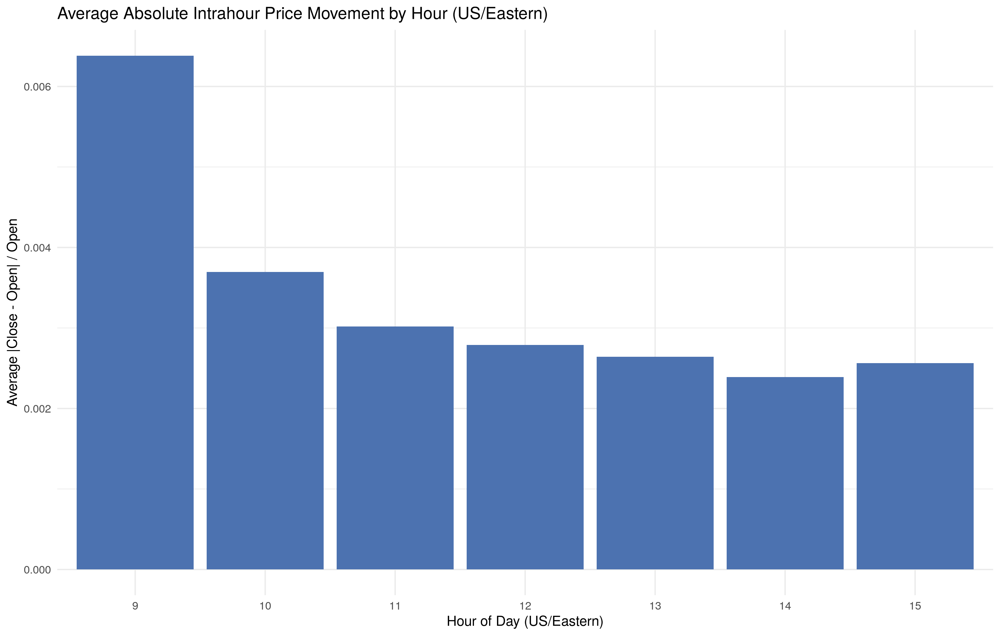
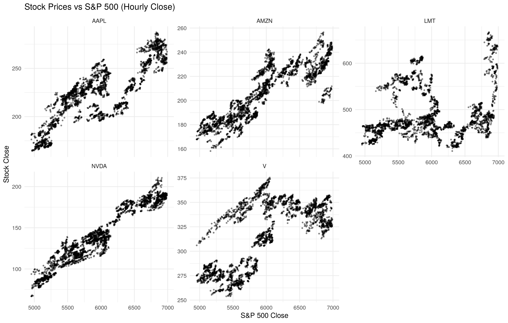
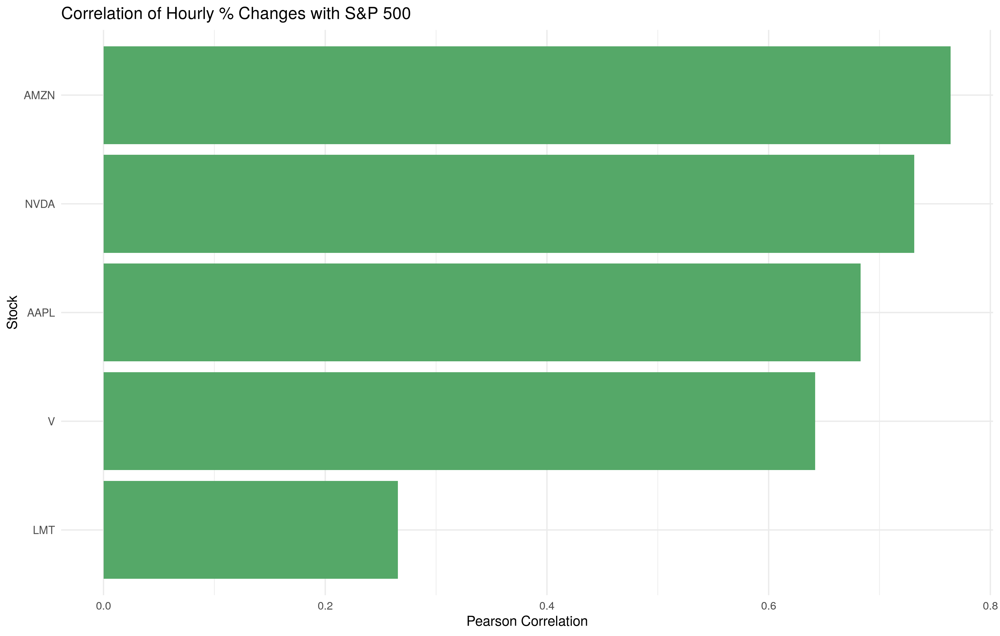

    library(tidyverse)
    library(lubridate)

    visual_dir <- "joshuaschlucke-visualisation"
    if (!dir.exists(visual_dir)) dir.create(visual_dir)

    knitr::opts_chunk$set(
        fig.path = file.path(visual_dir, ""),
        fig.width = 11,
        fig.height = 7,
        dpi = 300
    )

# 1. Data reading & cleaning

In its current state, the data is impossible to work with.

- **Reading the data**: The file should be read twice, once to generate
  sensible column names from the multi-row header and once to read the
  data itself (ignoring the headers. For this, `read_csv` features the
  argument `skip`).

  Make sure all data types are as expected (eg. `Datetime` should be a
  datetime object, `Open` should be a number, …)

- **Formatting**: Pivot this dataframe to get a dataframe with the
  following columns:

  - `Datetime`
  - `Symbol`
  - `Type` (Factor with two levels: `Stock` and `Index`)
  - `Open`
  - `High`
  - `Low`
  - `Close`
  - `Volume`

  This should result in one very tidy table.

- **Aggregation**: To make plotting the data simpler, create a new
  dataframe where the data is aggregated from hourly to daily data.

  > the new `Open` should be the `Open` of the first hour of the day
  >
  > the new `Close` should be the `Close` of the last hour of the day
  >
  > the new `High` should be the maximum `High` of all hours of the day
  >
  > the new `Low` should be the minimum `Low` of all hours of the day
  >
  > the new `Volume` should be the sum of all hourly volumes of the day

<!-- -->

    # Read the two header rows to build column names
    header_rows <- readr::read_csv(
        "stock_data.csv",
        col_names = FALSE,
        n_max = 2,
        show_col_types = FALSE
    )

    # Build column names like Close_AAPL, Open_^GSPC, etc.
    col_names <- map2_chr(header_rows[1, ], header_rows[2, ], function(h1, h2) {
        h1 <- as.character(h1)
        h2 <- as.character(h2)
        if (h2 == "Ticker") {
            "Datetime"
        } else {
            paste(h1, h2, sep = "_")
        }
    })

    # Read the actual data, skipping the header rows
    raw_data <- readr::read_csv(
        "stock_data.csv",
        skip = 3,
        col_names = col_names,
        col_types = cols(
            Datetime = col_datetime(),
            .default = col_double()
        )
    )

    # Pivot to tidy format
    indices <- c("^GSPC", "^IXIC")

    long_data <- raw_data %>%
        pivot_longer(
            cols = -Datetime,
            names_to = c("Metric", "Symbol"),
            names_sep = "_",
            values_to = "Value"
        ) %>%
        pivot_wider(
            names_from = Metric,
            values_from = Value
        ) %>%
        filter(!is.na(Datetime)) %>%
        filter(!(is.na(Open) & is.na(High) & is.na(Low) & is.na(Close) & is.na(Volume))) %>%
        mutate(
            Type = if_else(Symbol %in% indices, "Index", "Stock"),
            Type = factor(Type, levels = c("Stock", "Index"))
        ) %>%
        select(Datetime, Symbol, Type, Open, High, Low, Close, Volume)

    # Aggregate hourly data to daily data

    daily_data <- long_data %>%
        arrange(Symbol, Datetime) %>%
        group_by(Symbol, Type, Date = as_date(Datetime)) %>%
        summarise(
            Open = Open[which.min(Datetime)],
            Close = Close[which.max(Datetime)],
            High = max(High, na.rm = TRUE),
            Low = min(Low, na.rm = TRUE),
            Volume = sum(Volume, na.rm = TRUE),
            .groups = "drop"
        )

# 2. Visualization

- **Price**: Use `ggplot2`s facetting and `geom_line` to plot the daily
  price of all stocks and indices over time. You can use `Open` or
  `Close` for this.

- **Volume**: Either in the same plots as above or in a new plot, plot
  the trading volume of all stocks and indices over time as barplots
  (`geom_bar`).

- **Optional: Candlesticks**: Instead of using a line chart to plot the
  price, use candlesticks (eg. using `geom_boxplot` or `geom_segment`
  and `geom_rect`) to represent the daily price data for all stocks.

  > The top of the body is the open price, the bottom of the body is the
  > close price, and the wicks are the high and low prices.
  >
  > A candlestick is red if the price decreased during the day, and
  > green if it increased.

## Daily price (Close)

    price_plot <- ggplot(daily_data, aes(x = Date, y = Close, color = Type)) +
        geom_line(linewidth = 0.6, alpha = 0.9) +
        facet_wrap(~Symbol, scales = "free_y") +
        labs(
            title = "Daily Close Price by Symbol",
            x = "Date",
            y = "Close Price",
            color = "Type"
        ) +
        theme_minimal()

    price_plot

    ggsave(
        filename = file.path(visual_dir, "daily_close_by_symbol.png"),
        plot = price_plot,
        width = 11,
        height = 7,
        dpi = 300
    )

## Daily volume

    volume_plot <- ggplot(daily_data, aes(x = Date, y = Volume, fill = Type)) +
        geom_col(alpha = 0.75) +
        facet_wrap(~Symbol, scales = "free_y") +
        labs(
            title = "Daily Trading Volume by Symbol",
            x = "Date",
            y = "Volume",
            fill = "Type"
        ) +
        theme_minimal()

    volume_plot

    ggsave(
        filename = file.path(visual_dir, "daily_volume_by_symbol.png"),
        plot = volume_plot,
        width = 11,
        height = 7,
        dpi = 300
    )

## Optional: Candlesticks (stocks only)

    stock_daily <- daily_data %>%
        filter(Type == "Stock") %>%
        mutate(
            Direction = if_else(Close >= Open, "Up", "Down"),
            BodyTop = pmax(Open, Close),
            BodyBottom = pmin(Open, Close),
            DateTime = as.POSIXct(Date) + hours(12)
        )

    candlestick_plot <- ggplot(stock_daily, aes(x = DateTime)) +
        geom_segment(
            aes(y = Low, yend = High, xend = DateTime, color = Direction),
            linewidth = 0.5
        ) +
        geom_rect(
            aes(
                xmin = DateTime - hours(8),
                xmax = DateTime + hours(8),
                ymin = BodyBottom,
                ymax = BodyTop,
                fill = Direction,
                color = Direction
            ),
            alpha = 0.85
        ) +
        scale_fill_manual(values = c(Up = "#2E8B57", Down = "#B22222")) +
        scale_color_manual(values = c(Up = "#2E8B57", Down = "#B22222")) +
        facet_wrap(~Symbol, scales = "free_y") +
        labs(
            title = "Daily Candlesticks (Stocks Only)",
            x = "Date",
            y = "Price",
            fill = "Direction"
        ) +
        theme_minimal()

    candlestick_plot

    ggsave(
        filename = file.path(visual_dir, "daily_candlesticks_stocks.png"),
        plot = candlestick_plot,
        width = 11,
        height = 7,
        dpi = 300
    )

# 3. Pattern analysis & correlation (hourly)

For this part we will go back to hourly data, as we want to analyze
patterns throughout the day.

- Compute the percentage change in price (between `Open` or `Close`) for
  each hour (compared to the previous hour) for all stocks and indices.
  This will be used in the following tasks.

- **Price Movements/Volatility**: At which hour of the day do prices
  across all stocks & indices move/change the most? (In this case: When
  is the absolute percentage change between the `Open` price and the
  `Close` price the highest on average?)

  > Visualize the average price movement per hour of the day here (eg.
  > using a bar plot).

- **Correlation**: Take a look at how closely stock and index prices
  follow each other. Are they correlated?

  - **Visualization**: Plot all stock prices against the S&P 500 price
    to visually inspect their correlation (line or point plot). Its up
    to you whether you use individual facets per stock or plot all in
    one plot. Do they (stocks and the index) seem to move together?
  - **Optional: Quantification**: Quantify the correlation between stock
    and index price changes (percentage changes from above) by
    calculating the correlation coefficient. R has a built-in function
    for this, called `cor` (check `?cor`, usage hint:
    `cor(df$stock_change, df$index_change)`). You can do this for each
    stock/S&P 500 pair and plot the results to see which stock
    correlates the most with the S&P 500.

<!-- -->

    # Hourly percentage change in Close vs previous hour
    # Calculate changes within a trading day to avoid overnight gaps.
    hourly_changes <- long_data %>%
        mutate(
            Datetime_ny = with_tz(Datetime, "America/New_York"),
            Date_ny = as_date(Datetime_ny)
        ) %>%
        arrange(Symbol, Datetime) %>%
        group_by(Symbol, Type, Date_ny) %>%
        mutate(
            pct_change = (Close - lag(Close)) / lag(Close),
            hour = hour(Datetime_ny),
            minute = minute(Datetime_ny),
            intrahour_move = abs((Close - Open) / Open)
        ) %>%
        ungroup()

    # Filter to regular US trading hours (09:30–16:00 New York time)
    hourly_trading <- hourly_changes %>%
        filter(
            (hour > 9 & hour < 16) |
                (hour == 9 & minute == 30) |
                (hour == 16 & minute == 0)
        )

    # Average absolute intrahour movement by hour across all symbols
    hourly_volatility <- hourly_trading %>%
        group_by(hour) %>%
        summarise(
            avg_abs_move = mean(intrahour_move, na.rm = TRUE),
            .groups = "drop"
        )

## Price movements/volatility by hour

    vol_plot <- ggplot(hourly_volatility, aes(x = factor(hour), y = avg_abs_move)) +
        geom_col(fill = "#4C72B0") +
        labs(
            title = "Average Absolute Intrahour Price Movement by Hour (US/Eastern)",
            x = "Hour of Day (US/Eastern)",
            y = "Average |Close - Open| / Open"
        ) +
        theme_minimal()

    vol_plot

    ggsave(
        filename = file.path(visual_dir, "hourly_volatility_by_hour.png"),
        plot = vol_plot,
        width = 10,
        height = 6,
        dpi = 300
    )

## Correlation with S&P 500

    # Visual inspection: stock prices vs S&P 500 (hourly close)
    sp500_hourly <- long_data %>%
        filter(Symbol == "^GSPC") %>%
        select(Datetime, SP500_Close = Close)

    stock_vs_sp500 <- long_data %>%
        filter(Type == "Stock") %>%
        select(Datetime, Symbol, Stock_Close = Close) %>%
        left_join(sp500_hourly, by = "Datetime")

    scatter_plot <- ggplot(stock_vs_sp500, aes(x = SP500_Close, y = Stock_Close)) +
        geom_point(alpha = 0.4, size = 0.6) +
        facet_wrap(~Symbol, scales = "free_y") +
        labs(
            title = "Stock Prices vs S&P 500 (Hourly Close)",
            x = "S&P 500 Close",
            y = "Stock Close"
        ) +
        theme_minimal()

    scatter_plot

    ggsave(
        filename = file.path(visual_dir, "stock_vs_sp500_scatter.png"),
        plot = scatter_plot,
        width = 11,
        height = 7,
        dpi = 300
    )

    # Quantify correlation of hourly percentage changes
    sp500_changes <- hourly_trading %>%
        filter(Symbol == "^GSPC") %>%
        select(Datetime, sp500_pct = pct_change)

    stock_changes <- hourly_trading %>%
        filter(Type == "Stock") %>%
        select(Datetime, Symbol, stock_pct = pct_change)

    correlation_df <- stock_changes %>%
        left_join(sp500_changes, by = "Datetime") %>%
        group_by(Symbol) %>%
        summarise(
            correlation = cor(stock_pct, sp500_pct, use = "complete.obs"),
            .groups = "drop"
        )

    cor_plot <- ggplot(correlation_df, aes(x = reorder(Symbol, correlation), y = correlation)) +
        geom_col(fill = "#55A868") +
        coord_flip() +
        labs(
            title = "Correlation of Hourly % Changes with S&P 500",
            x = "Stock",
            y = "Pearson Correlation"
        ) +
        theme_minimal()

    cor_plot

    ggsave(
        filename = file.path(visual_dir, "correlation_with_sp500.png"),
        plot = cor_plot,
        width = 9,
        height = 5,
        dpi = 300
    )

# 4. Interpretation

Summary of key findings from the computed results (peak-movement hour
and correlation strengths).

Based on the computed hourly movements and correlations:

- The hour with the highest average intrahour movement (US/Eastern) is:
  9 am (avg abs move: 0.64%).

- The strongest positive correlation with S&P 500 hourly returns is:
  AMZN (correlation: 0.764).

- The weakest correlation with S&P 500 hourly returns is: LMT
  (correlation: 0.266).

Overall, the intrahour volatility pattern tends to spike around market
open and taper off later in the session, which is consistent with
information-dense opening auctions and early-session price discovery.
The stock–S&P 500 correlations are positive but vary in strength, which
reflects differences in sector exposure (e.g., tech-heavy names tend to
track the index more closely than defense-oriented names).
