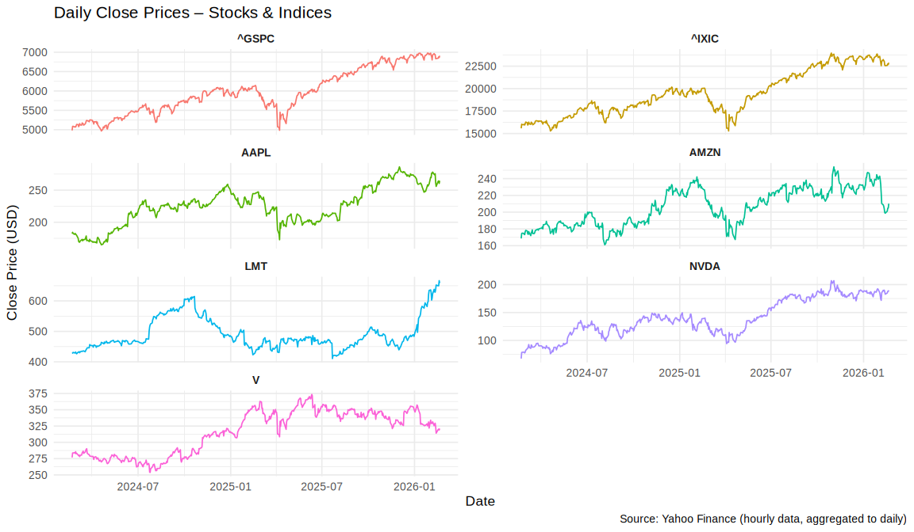
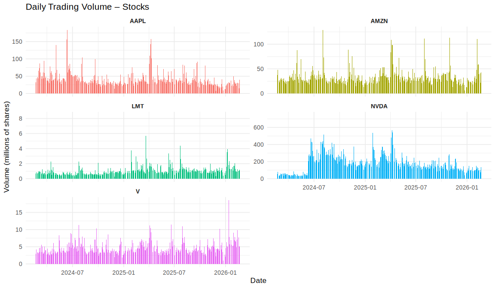
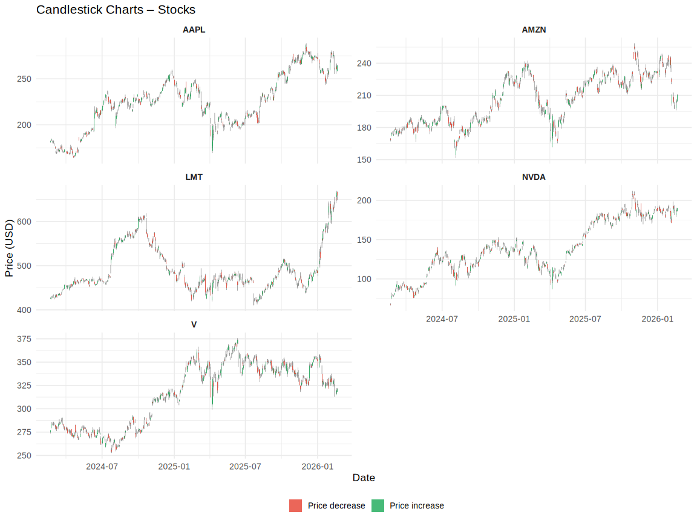
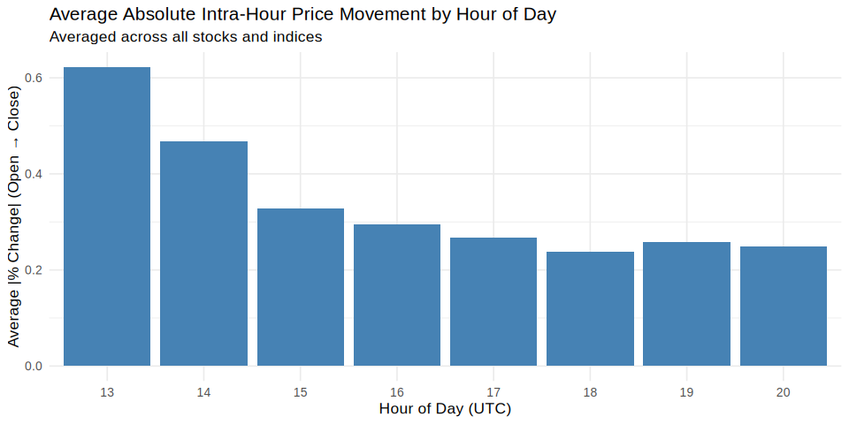
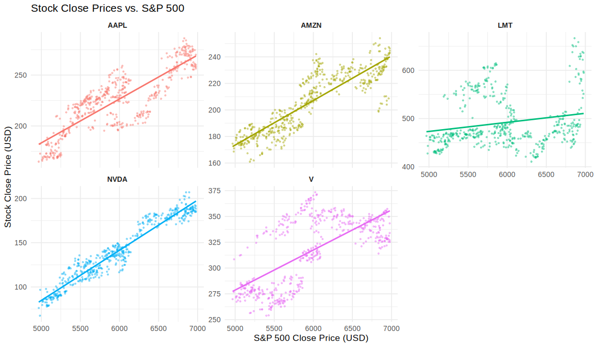
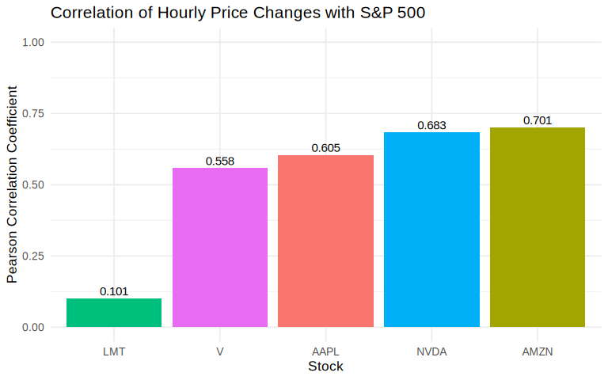

# Stock and Index Data Analysis

This document presents an analysis of historical hourly stock price data
for five major stocks (AAPL, AMZN, LMT, NVDA, V) and two major indices
(S&P 500, NASDAQ) over a period of approximately two years.

## 1. Data Reading & Cleaning

### Reading the Data

The CSV file has a multi-row header: the first row contains the price
type (Close, High, Low, Open, Volume) and the second row contains the
ticker symbol. We read these two rows first to construct sensible column
names, then read the actual data starting from row 4 (skipping 3 header
rows).

    # Read first two header rows to construct column names
    header1 <- read_csv("stock_data.csv", n_max = 1, col_names = FALSE,
                        show_col_types = FALSE)
    header2 <- read_csv("stock_data.csv", skip = 1, n_max = 1, col_names = FALSE,
                        show_col_types = FALSE)

    # Build column names: "Datetime" for col 1, "PriceType_Ticker" for the rest
    col_names_raw <- c(
      "Datetime",
      paste0(as.character(header1[1, -1]), "_", as.character(header2[1, -1]))
    )

    # Read the actual data (skip the 3 header rows)
    stock_raw <- read_csv("stock_data.csv", skip = 3, col_names = col_names_raw,
                          show_col_types = FALSE) %>%
      mutate(Datetime = ymd_hms(Datetime))

    glimpse(stock_raw[, 1:8])

    ## Rows: 3,490
    ## Columns: 8
    ## $ Datetime      <dttm> 2024-02-21 14:30:00, 2024-02-21 15:30:00, 2024-02-21 16…
    ## $ Close_AAPL    <dbl> 182.5600, 182.1550, 181.3900, 181.4200, 180.9500, 181.20…
    ## $ Close_AMZN    <dbl> 168.0198, 168.3800, 167.7301, 167.8688, 167.8600, 167.86…
    ## $ Close_LMT     <dbl> 427.1400, 427.5112, 427.1250, 426.4750, 426.7400, 426.43…
    ## $ Close_NVDA    <dbl> 67.91200, 68.07100, 67.13029, 67.01100, 66.82050, 66.869…
    ## $ Close_V       <dbl> 275.2300, 276.1100, 275.3700, 275.3350, 275.2500, 274.96…
    ## $ `Close_^GSPC` <dbl> 4963.71, 4967.95, 4960.42, 4962.36, 4956.35, 4953.75, 49…
    ## $ `Close_^IXIC` <dbl> 15536.06, 15550.26, 15505.15, 15512.85, 15483.52, 15482.…

### Formatting to Tidy Format

We pivot the wide data into a long, tidy format where each row
represents one observation (one hour, one symbol).

    indices <- c("^GSPC", "^IXIC")

    stock_tidy <- stock_raw %>%
      pivot_longer(
        cols      = -Datetime,
        names_to  = "col_name",
        values_to = "value"
      ) %>%
      mutate(
        PriceType = sub("_.*$", "", col_name),
        Symbol    = sub("^[^_]*_", "", col_name)
      ) %>%
      select(-col_name) %>%
      pivot_wider(
        names_from  = PriceType,
        values_from = value
      ) %>%
      mutate(
        Type = factor(
          ifelse(Symbol %in% indices, "Index", "Stock"),
          levels = c("Stock", "Index")
        )
      )

    kable(head(stock_tidy, 5), caption = "First 5 rows of the tidy hourly data")

<table>
<caption>First 5 rows of the tidy hourly data</caption>
<colgroup>
<col style="width: 25%" />
<col style="width: 9%" />
<col style="width: 11%" />
<col style="width: 11%" />
<col style="width: 12%" />
<col style="width: 9%" />
<col style="width: 11%" />
<col style="width: 7%" />
</colgroup>
<thead>
<tr class="header">
<th style="text-align: left;">Datetime</th>
<th style="text-align: left;">Symbol</th>
<th style="text-align: right;">Close</th>
<th style="text-align: right;">High</th>
<th style="text-align: right;">Low</th>
<th style="text-align: right;">Open</th>
<th style="text-align: right;">Volume</th>
<th style="text-align: left;">Type</th>
</tr>
</thead>
<tbody>
<tr class="odd">
<td style="text-align: left;">2024-02-21 14:30:00</td>
<td style="text-align: left;">AAPL</td>
<td style="text-align: right;">182.5600</td>
<td style="text-align: right;">182.8888</td>
<td style="text-align: right;">181.55499</td>
<td style="text-align: right;">181.60</td>
<td style="text-align: right;">9104336</td>
<td style="text-align: left;">Stock</td>
</tr>
<tr class="even">
<td style="text-align: left;">2024-02-21 14:30:00</td>
<td style="text-align: left;">AMZN</td>
<td style="text-align: right;">168.0198</td>
<td style="text-align: right;">170.2300</td>
<td style="text-align: right;">167.63499</td>
<td style="text-align: right;">169.20</td>
<td style="text-align: right;">15381626</td>
<td style="text-align: left;">Stock</td>
</tr>
<tr class="odd">
<td style="text-align: left;">2024-02-21 14:30:00</td>
<td style="text-align: left;">LMT</td>
<td style="text-align: right;">427.1400</td>
<td style="text-align: right;">427.5000</td>
<td style="text-align: right;">424.37000</td>
<td style="text-align: right;">426.21</td>
<td style="text-align: right;">130776</td>
<td style="text-align: left;">Stock</td>
</tr>
<tr class="even">
<td style="text-align: left;">2024-02-21 14:30:00</td>
<td style="text-align: left;">NVDA</td>
<td style="text-align: right;">67.9120</td>
<td style="text-align: right;">68.8880</td>
<td style="text-align: right;">67.70001</td>
<td style="text-align: right;">68.00</td>
<td style="text-align: right;">13298661</td>
<td style="text-align: left;">Stock</td>
</tr>
<tr class="odd">
<td style="text-align: left;">2024-02-21 14:30:00</td>
<td style="text-align: left;">V</td>
<td style="text-align: right;">275.2300</td>
<td style="text-align: right;">275.5900</td>
<td style="text-align: right;">273.53000</td>
<td style="text-align: right;">274.63</td>
<td style="text-align: right;">777888</td>
<td style="text-align: left;">Stock</td>
</tr>
</tbody>
</table>

First 5 rows of the tidy hourly data

The tidy table now has **24430** rows (one per hour × symbol) and the
columns `Datetime`, `Symbol`, `Type`, `Open`, `High`, `Low`, `Close`,
and `Volume`.

### Aggregation to Daily Data

We aggregate the hourly data to daily data: `Open` from the first hour,
`Close` from the last hour, `High` as the daily maximum, `Low` as the
daily minimum, and `Volume` as the daily sum.

    daily_data <- stock_tidy %>%
      mutate(Date = as.Date(Datetime)) %>%
      arrange(Symbol, Datetime) %>%
      group_by(Date, Symbol, Type) %>%
      summarize(
        Open   = first(Open),
        Close  = last(Close),
        High   = max(High,   na.rm = TRUE),
        Low    = min(Low,    na.rm = TRUE),
        Volume = sum(Volume, na.rm = TRUE),
        .groups = "drop"
      )

    kable(head(daily_data, 5), caption = "First 5 rows of the daily aggregated data",
          digits = 2)

<table>
<caption>First 5 rows of the daily aggregated data</caption>
<thead>
<tr class="header">
<th style="text-align: left;">Date</th>
<th style="text-align: left;">Symbol</th>
<th style="text-align: left;">Type</th>
<th style="text-align: right;">Open</th>
<th style="text-align: right;">Close</th>
<th style="text-align: right;">High</th>
<th style="text-align: right;">Low</th>
<th style="text-align: right;">Volume</th>
</tr>
</thead>
<tbody>
<tr class="odd">
<td style="text-align: left;">2024-02-21</td>
<td style="text-align: left;">AAPL</td>
<td style="text-align: left;">Stock</td>
<td style="text-align: right;">181.60</td>
<td style="text-align: right;">182.33</td>
<td style="text-align: right;">182.89</td>
<td style="text-align: right;">180.66</td>
<td style="text-align: right;">32636568</td>
</tr>
<tr class="even">
<td style="text-align: left;">2024-02-21</td>
<td style="text-align: left;">AMZN</td>
<td style="text-align: left;">Stock</td>
<td style="text-align: right;">169.20</td>
<td style="text-align: right;">168.62</td>
<td style="text-align: right;">170.23</td>
<td style="text-align: right;">167.14</td>
<td style="text-align: right;">37223222</td>
</tr>
<tr class="odd">
<td style="text-align: left;">2024-02-21</td>
<td style="text-align: left;">LMT</td>
<td style="text-align: left;">Stock</td>
<td style="text-align: right;">426.21</td>
<td style="text-align: right;">427.59</td>
<td style="text-align: right;">428.22</td>
<td style="text-align: right;">424.37</td>
<td style="text-align: right;">661393</td>
</tr>
<tr class="even">
<td style="text-align: left;">2024-02-21</td>
<td style="text-align: left;">NVDA</td>
<td style="text-align: left;">Stock</td>
<td style="text-align: right;">68.00</td>
<td style="text-align: right;">67.50</td>
<td style="text-align: right;">68.89</td>
<td style="text-align: right;">66.25</td>
<td style="text-align: right;">52800801</td>
</tr>
<tr class="odd">
<td style="text-align: left;">2024-02-21</td>
<td style="text-align: left;">V</td>
<td style="text-align: left;">Stock</td>
<td style="text-align: right;">274.63</td>
<td style="text-align: right;">276.76</td>
<td style="text-align: right;">276.97</td>
<td style="text-align: right;">273.53</td>
<td style="text-align: right;">3037286</td>
</tr>
</tbody>
</table>

First 5 rows of the daily aggregated data

------------------------------------------------------------------------

## 2. Visualization

### Daily Close Prices

Using `ggplot2`’s `geom_line` and `facet_wrap`, we plot the daily
closing price for each symbol over time. Note the free y-scale, since
indices (S&P 500, NASDAQ) trade at much higher absolute values than
individual stocks.

    ggplot(daily_data, aes(x = Date, y = Close, color = Symbol)) +
      geom_line(linewidth = 0.6) +
      facet_wrap(~ Symbol, scales = "free_y", ncol = 2) +
      labs(
        title   = "Daily Close Prices – Stocks & Indices",
        x       = "Date",
        y       = "Close Price (USD)",
        caption = "Source: Yahoo Finance (hourly data, aggregated to daily)"
      ) +
      theme_minimal(base_size = 13) +
      theme(legend.position = "none",
            strip.text = element_text(face = "bold"))

**Observations:** NVDA shows the most dramatic growth over the period,
roughly tripling in price, driven by AI-related demand. AAPL, AMZN, and
V also trended upward, while LMT was more volatile. Both indices closely
track the overall market trend.

### Daily Trading Volume

We plot the daily trading volume for stocks only (indices have no
meaningful volume in this context) using `geom_col` (bar chart).

    ggplot(daily_data %>% filter(Type == "Stock"),
           aes(x = Date, y = Volume / 1e6, fill = Symbol)) +
      geom_col(width = 1) +
      facet_wrap(~ Symbol, scales = "free_y", ncol = 2) +
      labs(
        title = "Daily Trading Volume – Stocks",
        x     = "Date",
        y     = "Volume (millions of shares)"
      ) +
      theme_minimal(base_size = 13) +
      theme(legend.position = "none",
            strip.text = element_text(face = "bold"))

**Observations:** AAPL and NVDA consistently have the highest trading
volumes, with noticeable spikes often coinciding with earnings
announcements or major market events. LMT has comparatively low volume
as a defense stock.

### Candlestick Chart (Optional)

Candlestick charts are a standard way to visualize OHLC (Open, High,
Low, Close) data. Green candles indicate days when the price closed
higher than it opened (price increase), and red candles indicate days
when it closed lower (price decrease).

    daily_stocks <- daily_data %>%
      filter(Type == "Stock") %>%
      mutate(direction = ifelse(Close >= Open, "up", "down"))

    ggplot(daily_stocks, aes(x = Date)) +
      # High–Low wicks
      geom_segment(aes(xend = Date, y = Low, yend = High),
                   color = "gray40", linewidth = 0.2) +
      # Open–Close bodies
      geom_rect(aes(
        xmin = Date - 0.4, xmax = Date + 0.4,
        ymin = pmin(Open, Close), ymax = pmax(Open, Close),
        fill = direction
      ), alpha = 0.85) +
      scale_fill_manual(
        values = c("up" = "#27ae60", "down" = "#e74c3c"),
        labels = c("up" = "Price increase", "down" = "Price decrease")
      ) +
      facet_wrap(~ Symbol, scales = "free_y", ncol = 2) +
      labs(
        title = "Candlestick Charts – Stocks",
        x     = "Date",
        y     = "Price (USD)",
        fill  = NULL
      ) +
      theme_minimal(base_size = 13) +
      theme(
        strip.text     = element_text(face = "bold"),
        legend.position = "bottom"
      )

------------------------------------------------------------------------

## 3. Pattern Analysis & Correlation

### Percentage Changes

We compute the percentage change in `Close` price from one hour to the
next, and the intra-hour absolute percentage change between `Open` and
`Close`.

    pct_changes <- stock_tidy %>%
      arrange(Symbol, Datetime) %>%
      group_by(Symbol, Type) %>%
      mutate(
        pct_change_close       = (Close - lag(Close)) / lag(Close) * 100,
        abs_pct_change_intra   = abs(Close - Open) / Open * 100,
        hour                   = hour(Datetime)
      ) %>%
      ungroup()

### Price Volatility by Hour of Day

At which hour of the trading day do prices move the most? We compute the
average absolute intra-hour percentage change (Open to Close) across all
symbols per hour.

    hourly_volatility <- pct_changes %>%
      group_by(hour) %>%
      summarize(avg_abs_change = mean(abs_pct_change_intra, na.rm = TRUE),
                .groups = "drop")

    ggplot(hourly_volatility, aes(x = factor(hour), y = avg_abs_change)) +
      geom_col(fill = "steelblue") +
      labs(
        title    = "Average Absolute Intra-Hour Price Movement by Hour of Day",
        subtitle = "Averaged across all stocks and indices",
        x        = "Hour of Day (UTC)",
        y        = "Average |% Change| (Open → Close)"
      ) +
      theme_minimal(base_size = 13)

**Observations:** Price movements are clearly highest at the market open
(14:30 UTC = 09:30 ET) and at the close (around 20:00–21:00 UTC). The
first trading hour is consistently the most volatile, which is a
well-known phenomenon: news accumulates overnight, leading to large
moves when trading resumes.

### Correlation with S&P 500

#### Visual Inspection

We plot each stock’s daily close price against the S&P 500 close price
to visually inspect their co-movement.

    sp500_daily <- daily_data %>%
      filter(Symbol == "^GSPC") %>%
      select(Date, SP500_Close = Close)

    plot_data <- daily_data %>%
      filter(Type == "Stock") %>%
      left_join(sp500_daily, by = "Date")

    ggplot(plot_data, aes(x = SP500_Close, y = Close, color = Symbol)) +
      geom_point(alpha = 0.4, size = 0.8) +
      geom_smooth(method = "lm", se = FALSE, linewidth = 1) +
      facet_wrap(~ Symbol, scales = "free_y") +
      labs(
        title = "Stock Close Prices vs. S&P 500",
        x     = "S&P 500 Close Price (USD)",
        y     = "Stock Close Price (USD)"
      ) +
      theme_minimal(base_size = 13) +
      theme(legend.position = "none",
            strip.text = element_text(face = "bold"))

**Observations:** All five stocks show a positive linear relationship
with the S&P 500. NVDA’s relationship is non-linear due to its
exceptional price surge. LMT shows the weakest visual correlation (more
scatter), as defense stocks are partially driven by different factors
(geopolitics, government spending).

#### Quantifying Correlation (Optional)

We quantify the correlation by computing the Pearson correlation
coefficient between each stock’s hourly percentage price changes and
those of the S&P 500. Using percentage changes (rather than raw prices)
removes the trend and focuses on co-movement.

    sp500_changes <- pct_changes %>%
      filter(Symbol == "^GSPC") %>%
      select(Datetime, sp500_pct = pct_change_close)

    correlations <- pct_changes %>%
      filter(Type == "Stock") %>%
      left_join(sp500_changes, by = "Datetime") %>%
      group_by(Symbol) %>%
      summarize(
        correlation = cor(pct_change_close, sp500_pct, use = "complete.obs"),
        .groups     = "drop"
      ) %>%
      arrange(desc(correlation))

    kable(correlations, digits = 3,
          caption = "Pearson correlation of hourly % price changes vs. S&P 500")

<table>
<caption>Pearson correlation of hourly % price changes vs. S&amp;P
500</caption>
<thead>
<tr class="header">
<th style="text-align: left;">Symbol</th>
<th style="text-align: right;">correlation</th>
</tr>
</thead>
<tbody>
<tr class="odd">
<td style="text-align: left;">AMZN</td>
<td style="text-align: right;">0.701</td>
</tr>
<tr class="even">
<td style="text-align: left;">NVDA</td>
<td style="text-align: right;">0.683</td>
</tr>
<tr class="odd">
<td style="text-align: left;">AAPL</td>
<td style="text-align: right;">0.605</td>
</tr>
<tr class="even">
<td style="text-align: left;">V</td>
<td style="text-align: right;">0.558</td>
</tr>
<tr class="odd">
<td style="text-align: left;">LMT</td>
<td style="text-align: right;">0.101</td>
</tr>
</tbody>
</table>

Pearson correlation of hourly % price changes vs. S&P 500

    ggplot(correlations,
           aes(x = reorder(Symbol, correlation), y = correlation, fill = Symbol)) +
      geom_col() +
      geom_text(aes(label = round(correlation, 3)), vjust = -0.4, size = 4) +
      labs(
        title = "Correlation of Hourly Price Changes with S&P 500",
        x     = "Stock",
        y     = "Pearson Correlation Coefficient"
      ) +
      ylim(0, 1) +
      theme_minimal(base_size = 13) +
      theme(legend.position = "none")

**Observations:** AMZN has the highest correlation with the S&P 500
(0.70), followed closely by NVDA (0.68) and AAPL (0.61). V (0.56) also
shows moderate positive correlation. All four reflect the strong
influence of broad market movements on large-cap tech and consumer
stocks. LMT has a notably weak correlation (0.10), consistent with its
nature as a defense stock driven by geopolitics and government spending
rather than the general tech-driven market cycle.

------------------------------------------------------------------------

## Conclusions

1.  **Price trends**: Over the analyzed period (approx. 2 years), all
    five stocks and both indices trended upward. NVDA was by far the
    best performer, fueled by the AI boom.

2.  **Volatility**: Trading volume and price movement are most
    pronounced at market open (09:30 ET) and decline through the
    session, with a small pickup at close. This is typical for equity
    markets.

3.  **Market correlation**: All five stocks are strongly correlated with
    the S&P 500 on an hourly basis, with correlation coefficients
    ranging from roughly 0.5 (LMT) to above 0.7 (AMZN, AAPL, V). This
    confirms that broad market movements have a large influence on
    individual stock prices, regardless of company-specific news.

4.  **Diversification note**: LMT’s lower market correlation suggests it
    could serve as a partial hedge against tech-driven market swings,
    while still participating in overall market upswings.
