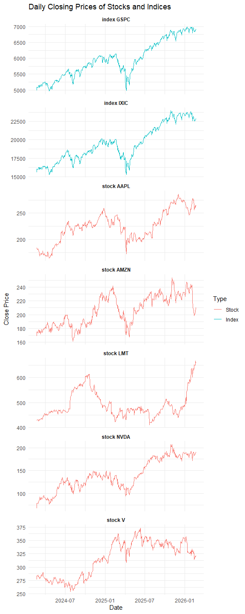
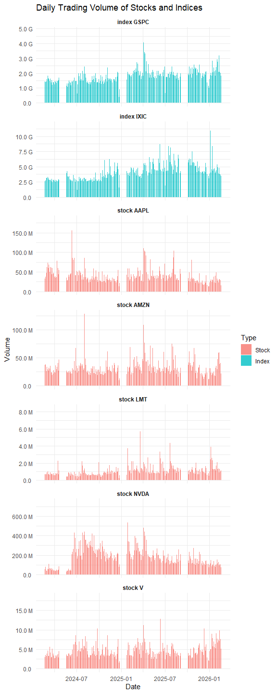
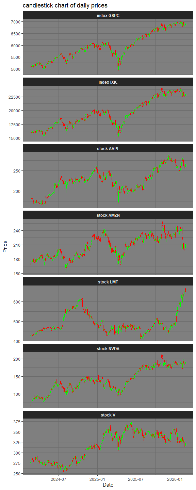
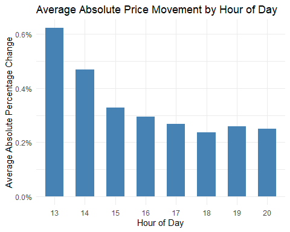
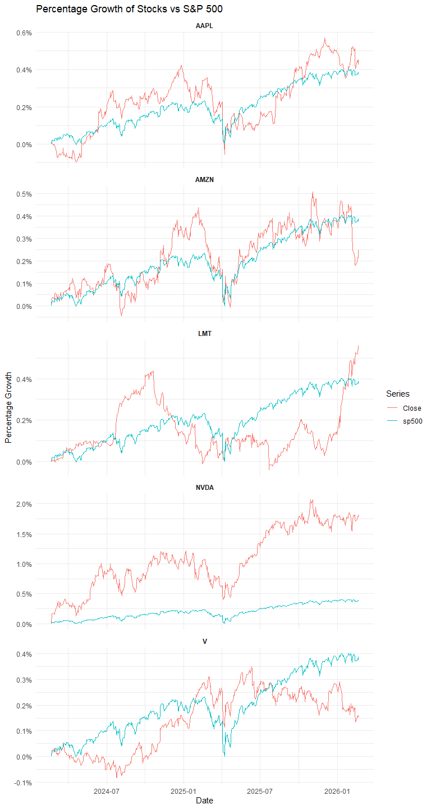
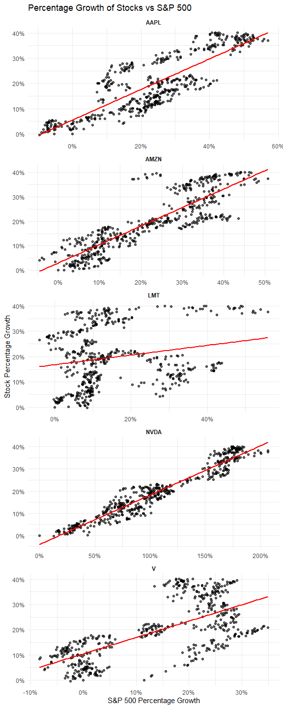
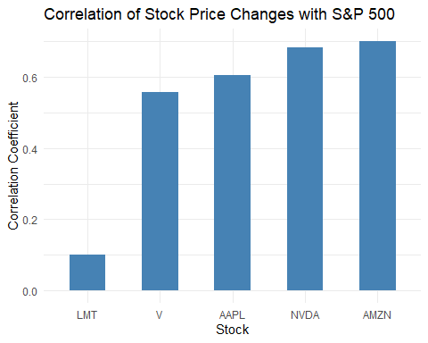

# Stock and Index data

Financial markets are highly complex systems that are influenced by many
factors. Both stocks (pieces of ownership for individual companies) and
ETFs/Indices (a sort of aggregation of multiple stocks/companies) are
represented and traded on these markets. Nowadays, some combination of
stocks and ETFs (which pretty much track indices) make up the long term
investments of many people. In this project, you will take a closer look
at the historical data of a few stocks and some indices in which they
are included, analyzing their performance and the relationship between
them. How closely do you think stock and index prices correlate?

# Get tidy data

## Data cleaning

-   read data and combine the two header rows into meaningful column
    names.

-   Skip the header rows and apply the new column names.

-   Convert columns to appropriate data types.

-   Check the cleaned dataset.

<table>
<colgroup>
<col style="width: 5%" />
<col style="width: 2%" />
<col style="width: 2%" />
<col style="width: 2%" />
<col style="width: 2%" />
<col style="width: 2%" />
<col style="width: 3%" />
<col style="width: 3%" />
<col style="width: 2%" />
<col style="width: 2%" />
<col style="width: 2%" />
<col style="width: 2%" />
<col style="width: 2%" />
<col style="width: 2%" />
<col style="width: 2%" />
<col style="width: 2%" />
<col style="width: 2%" />
<col style="width: 2%" />
<col style="width: 2%" />
<col style="width: 1%" />
<col style="width: 2%" />
<col style="width: 2%" />
<col style="width: 2%" />
<col style="width: 2%" />
<col style="width: 2%" />
<col style="width: 2%" />
<col style="width: 2%" />
<col style="width: 2%" />
<col style="width: 2%" />
<col style="width: 3%" />
<col style="width: 3%" />
<col style="width: 2%" />
<col style="width: 3%" />
<col style="width: 2%" />
<col style="width: 3%" />
<col style="width: 3%" />
</colgroup>
<thead>
<tr>
<th style="text-align: left;">Datetime</th>
<th style="text-align: right;">AAPL_Close</th>
<th style="text-align: right;">AMZN_Close</th>
<th style="text-align: right;">LMT_Close</th>
<th style="text-align: right;">NVDA_Close</th>
<th style="text-align: right;">V_Close</th>
<th style="text-align: right;">^GSPC_Close</th>
<th style="text-align: right;">^IXIC_Close</th>
<th style="text-align: right;">AAPL_High</th>
<th style="text-align: right;">AMZN_High</th>
<th style="text-align: right;">LMT_High</th>
<th style="text-align: right;">NVDA_High</th>
<th style="text-align: right;">V_High</th>
<th style="text-align: right;">^GSPC_High</th>
<th style="text-align: right;">^IXIC_High</th>
<th style="text-align: right;">AAPL_Low</th>
<th style="text-align: right;">AMZN_Low</th>
<th style="text-align: right;">LMT_Low</th>
<th style="text-align: right;">NVDA_Low</th>
<th style="text-align: right;">V_Low</th>
<th style="text-align: right;">^GSPC_Low</th>
<th style="text-align: right;">^IXIC_Low</th>
<th style="text-align: right;">AAPL_Open</th>
<th style="text-align: right;">AMZN_Open</th>
<th style="text-align: right;">LMT_Open</th>
<th style="text-align: right;">NVDA_Open</th>
<th style="text-align: right;">V_Open</th>
<th style="text-align: right;">^GSPC_Open</th>
<th style="text-align: right;">^IXIC_Open</th>
<th style="text-align: right;">AAPL_Volume</th>
<th style="text-align: right;">AMZN_Volume</th>
<th style="text-align: right;">LMT_Volume</th>
<th style="text-align: right;">NVDA_Volume</th>
<th style="text-align: right;">V_Volume</th>
<th style="text-align: right;">^GSPC_Volume</th>
<th style="text-align: right;">^IXIC_Volume</th>
</tr>
</thead>
<tbody>
<tr>
<td style="text-align: left;">2024-02-21 14:30:00</td>
<td style="text-align: right;">182.560</td>
<td style="text-align: right;">168.0198</td>
<td style="text-align: right;">427.1400</td>
<td style="text-align: right;">67.91200</td>
<td style="text-align: right;">275.230</td>
<td style="text-align: right;">4963.71</td>
<td style="text-align: right;">15536.06</td>
<td style="text-align: right;">182.8888</td>
<td style="text-align: right;">170.230</td>
<td style="text-align: right;">427.50</td>
<td style="text-align: right;">68.888</td>
<td style="text-align: right;">275.590</td>
<td style="text-align: right;">4970.10</td>
<td style="text-align: right;">15577.20</td>
<td style="text-align: right;">181.555</td>
<td style="text-align: right;">167.635</td>
<td style="text-align: right;">424.3700</td>
<td style="text-align: right;">67.70001</td>
<td style="text-align: right;">273.53</td>
<td style="text-align: right;">4958.34</td>
<td style="text-align: right;">15520.47</td>
<td style="text-align: right;">181.60</td>
<td style="text-align: right;">169.200</td>
<td style="text-align: right;">426.21</td>
<td style="text-align: right;">68.00000</td>
<td style="text-align: right;">274.6300</td>
<td style="text-align: right;">4963.03</td>
<td style="text-align: right;">15533.40</td>
<td style="text-align: right;">9104336</td>
<td style="text-align: right;">15381626</td>
<td style="text-align: right;">130776</td>
<td style="text-align: right;">13298661</td>
<td style="text-align: right;">777888</td>
<td style="text-align: right;">0</td>
<td style="text-align: right;">0</td>
</tr>
<tr>
<td style="text-align: left;">2024-02-21 15:30:00</td>
<td style="text-align: right;">182.155</td>
<td style="text-align: right;">168.3800</td>
<td style="text-align: right;">427.5112</td>
<td style="text-align: right;">68.07100</td>
<td style="text-align: right;">276.110</td>
<td style="text-align: right;">4967.95</td>
<td style="text-align: right;">15550.26</td>
<td style="text-align: right;">182.6500</td>
<td style="text-align: right;">168.700</td>
<td style="text-align: right;">428.22</td>
<td style="text-align: right;">68.335</td>
<td style="text-align: right;">276.170</td>
<td style="text-align: right;">4972.80</td>
<td style="text-align: right;">15571.21</td>
<td style="text-align: right;">182.070</td>
<td style="text-align: right;">167.595</td>
<td style="text-align: right;">426.7150</td>
<td style="text-align: right;">67.76600</td>
<td style="text-align: right;">275.09</td>
<td style="text-align: right;">4959.92</td>
<td style="text-align: right;">15519.68</td>
<td style="text-align: right;">182.56</td>
<td style="text-align: right;">168.020</td>
<td style="text-align: right;">427.15</td>
<td style="text-align: right;">67.91200</td>
<td style="text-align: right;">275.2050</td>
<td style="text-align: right;">4963.68</td>
<td style="text-align: right;">15535.73</td>
<td style="text-align: right;">4359759</td>
<td style="text-align: right;">4724713</td>
<td style="text-align: right;">128386</td>
<td style="text-align: right;">5318878</td>
<td style="text-align: right;">470207</td>
<td style="text-align: right;">255577595</td>
<td style="text-align: right;">533987000</td>
</tr>
<tr>
<td style="text-align: left;">2024-02-21 16:30:00</td>
<td style="text-align: right;">181.390</td>
<td style="text-align: right;">167.7301</td>
<td style="text-align: right;">427.1250</td>
<td style="text-align: right;">67.13029</td>
<td style="text-align: right;">275.370</td>
<td style="text-align: right;">4960.42</td>
<td style="text-align: right;">15505.15</td>
<td style="text-align: right;">182.3300</td>
<td style="text-align: right;">168.630</td>
<td style="text-align: right;">427.96</td>
<td style="text-align: right;">68.208</td>
<td style="text-align: right;">276.120</td>
<td style="text-align: right;">4970.42</td>
<td style="text-align: right;">15561.06</td>
<td style="text-align: right;">181.360</td>
<td style="text-align: right;">167.560</td>
<td style="text-align: right;">426.9501</td>
<td style="text-align: right;">66.61300</td>
<td style="text-align: right;">275.27</td>
<td style="text-align: right;">4958.38</td>
<td style="text-align: right;">15495.98</td>
<td style="text-align: right;">182.15</td>
<td style="text-align: right;">168.390</td>
<td style="text-align: right;">427.51</td>
<td style="text-align: right;">68.08100</td>
<td style="text-align: right;">276.1100</td>
<td style="text-align: right;">4967.90</td>
<td style="text-align: right;">15551.03</td>
<td style="text-align: right;">3729837</td>
<td style="text-align: right;">3750105</td>
<td style="text-align: right;">55144</td>
<td style="text-align: right;">7946663</td>
<td style="text-align: right;">226068</td>
<td style="text-align: right;">217414563</td>
<td style="text-align: right;">435763000</td>
</tr>
<tr>
<td style="text-align: left;">2024-02-21 17:30:00</td>
<td style="text-align: right;">181.420</td>
<td style="text-align: right;">167.8688</td>
<td style="text-align: right;">426.4750</td>
<td style="text-align: right;">67.01100</td>
<td style="text-align: right;">275.335</td>
<td style="text-align: right;">4962.36</td>
<td style="text-align: right;">15512.85</td>
<td style="text-align: right;">181.7250</td>
<td style="text-align: right;">168.120</td>
<td style="text-align: right;">427.25</td>
<td style="text-align: right;">67.423</td>
<td style="text-align: right;">275.610</td>
<td style="text-align: right;">4966.73</td>
<td style="text-align: right;">15534.86</td>
<td style="text-align: right;">181.060</td>
<td style="text-align: right;">167.410</td>
<td style="text-align: right;">426.3701</td>
<td style="text-align: right;">66.86950</td>
<td style="text-align: right;">274.93</td>
<td style="text-align: right;">4954.27</td>
<td style="text-align: right;">15490.18</td>
<td style="text-align: right;">181.39</td>
<td style="text-align: right;">167.732</td>
<td style="text-align: right;">426.82</td>
<td style="text-align: right;">67.12500</td>
<td style="text-align: right;">275.3900</td>
<td style="text-align: right;">4960.44</td>
<td style="text-align: right;">15504.98</td>
<td style="text-align: right;">3311637</td>
<td style="text-align: right;">3018610</td>
<td style="text-align: right;">51062</td>
<td style="text-align: right;">5478248</td>
<td style="text-align: right;">267162</td>
<td style="text-align: right;">190459349</td>
<td style="text-align: right;">362273000</td>
</tr>
<tr>
<td style="text-align: left;">2024-02-21 18:30:00</td>
<td style="text-align: right;">180.950</td>
<td style="text-align: right;">167.8600</td>
<td style="text-align: right;">426.7400</td>
<td style="text-align: right;">66.82050</td>
<td style="text-align: right;">275.250</td>
<td style="text-align: right;">4956.35</td>
<td style="text-align: right;">15483.52</td>
<td style="text-align: right;">181.5200</td>
<td style="text-align: right;">168.655</td>
<td style="text-align: right;">427.18</td>
<td style="text-align: right;">67.495</td>
<td style="text-align: right;">275.639</td>
<td style="text-align: right;">4969.78</td>
<td style="text-align: right;">15538.51</td>
<td style="text-align: right;">180.660</td>
<td style="text-align: right;">167.670</td>
<td style="text-align: right;">426.3001</td>
<td style="text-align: right;">66.72400</td>
<td style="text-align: right;">275.00</td>
<td style="text-align: right;">4952.30</td>
<td style="text-align: right;">15471.91</td>
<td style="text-align: right;">181.43</td>
<td style="text-align: right;">167.900</td>
<td style="text-align: right;">426.48</td>
<td style="text-align: right;">66.98788</td>
<td style="text-align: right;">275.3375</td>
<td style="text-align: right;">4962.42</td>
<td style="text-align: right;">15513.82</td>
<td style="text-align: right;">3555971</td>
<td style="text-align: right;">3295368</td>
<td style="text-align: right;">58232</td>
<td style="text-align: right;">5470657</td>
<td style="text-align: right;">280452</td>
<td style="text-align: right;">205373000</td>
<td style="text-align: right;">371440000</td>
</tr>
</tbody>
</table>

## Data formatting

-   Pivot all price related columns into a long format and separate the
    symbol from the price type.

-   Transform the measurement variable (`Measure`) into individual
    columns.

-   Add a `Type` Column indicating whether each symbol is a stock or an
    index.

-   Check tidy dataset

<table style="width:100%;">
<colgroup>
<col style="width: 23%" />
<col style="width: 8%" />
<col style="width: 7%" />
<col style="width: 10%" />
<col style="width: 12%" />
<col style="width: 14%" />
<col style="width: 12%" />
<col style="width: 10%" />
</colgroup>
<thead>
<tr>
<th style="text-align: left;">Datetime</th>
<th style="text-align: left;">Symbol</th>
<th style="text-align: left;">Type</th>
<th style="text-align: right;">Open</th>
<th style="text-align: right;">High</th>
<th style="text-align: right;">Low</th>
<th style="text-align: right;">Close</th>
<th style="text-align: right;">Volume</th>
</tr>
</thead>
<tbody>
<tr>
<td style="text-align: left;">2024-02-21 14:30:00</td>
<td style="text-align: left;">AAPL</td>
<td style="text-align: left;">Stock</td>
<td style="text-align: right;">181.60</td>
<td style="text-align: right;">182.8888</td>
<td style="text-align: right;">181.55499</td>
<td style="text-align: right;">182.5600</td>
<td style="text-align: right;">9104336</td>
</tr>
<tr>
<td style="text-align: left;">2024-02-21 14:30:00</td>
<td style="text-align: left;">AMZN</td>
<td style="text-align: left;">Stock</td>
<td style="text-align: right;">169.20</td>
<td style="text-align: right;">170.2300</td>
<td style="text-align: right;">167.63499</td>
<td style="text-align: right;">168.0198</td>
<td style="text-align: right;">15381626</td>
</tr>
<tr>
<td style="text-align: left;">2024-02-21 14:30:00</td>
<td style="text-align: left;">LMT</td>
<td style="text-align: left;">Stock</td>
<td style="text-align: right;">426.21</td>
<td style="text-align: right;">427.5000</td>
<td style="text-align: right;">424.37000</td>
<td style="text-align: right;">427.1400</td>
<td style="text-align: right;">130776</td>
</tr>
<tr>
<td style="text-align: left;">2024-02-21 14:30:00</td>
<td style="text-align: left;">NVDA</td>
<td style="text-align: left;">Stock</td>
<td style="text-align: right;">68.00</td>
<td style="text-align: right;">68.8880</td>
<td style="text-align: right;">67.70001</td>
<td style="text-align: right;">67.9120</td>
<td style="text-align: right;">13298661</td>
</tr>
<tr>
<td style="text-align: left;">2024-02-21 14:30:00</td>
<td style="text-align: left;">V</td>
<td style="text-align: left;">Stock</td>
<td style="text-align: right;">274.63</td>
<td style="text-align: right;">275.5900</td>
<td style="text-align: right;">273.53000</td>
<td style="text-align: right;">275.2300</td>
<td style="text-align: right;">777888</td>
</tr>
<tr>
<td style="text-align: left;">2024-02-21 14:30:00</td>
<td style="text-align: left;">^GSPC</td>
<td style="text-align: left;">Index</td>
<td style="text-align: right;">4963.03</td>
<td style="text-align: right;">4970.1001</td>
<td style="text-align: right;">4958.33984</td>
<td style="text-align: right;">4963.7100</td>
<td style="text-align: right;">0</td>
</tr>
<tr>
<td style="text-align: left;">2024-02-21 14:30:00</td>
<td style="text-align: left;">^IXIC</td>
<td style="text-align: left;">Index</td>
<td style="text-align: right;">15533.40</td>
<td style="text-align: right;">15577.2021</td>
<td style="text-align: right;">15520.46680</td>
<td style="text-align: right;">15536.0576</td>
<td style="text-align: right;">0</td>
</tr>
</tbody>
</table>

## Aggregation

-   Extract the date from the datetime column

-   Summarise the data for each day and symbol according to the required
    rules.

-   Check aggregated data

<table>
<colgroup>
<col style="width: 16%" />
<col style="width: 10%" />
<col style="width: 9%" />
<col style="width: 10%" />
<col style="width: 12%" />
<col style="width: 13%" />
<col style="width: 12%" />
<col style="width: 13%" />
</colgroup>
<thead>
<tr>
<th style="text-align: left;">Date</th>
<th style="text-align: left;">Symbol</th>
<th style="text-align: left;">Type</th>
<th style="text-align: right;">Open</th>
<th style="text-align: right;">Close</th>
<th style="text-align: right;">High</th>
<th style="text-align: right;">Low</th>
<th style="text-align: right;">Volume</th>
</tr>
</thead>
<tbody>
<tr>
<td style="text-align: left;">2024-02-21</td>
<td style="text-align: left;">AAPL</td>
<td style="text-align: left;">Stock</td>
<td style="text-align: right;">181.60</td>
<td style="text-align: right;">182.330</td>
<td style="text-align: right;">182.8888</td>
<td style="text-align: right;">180.660</td>
<td style="text-align: right;">32636568</td>
</tr>
<tr>
<td style="text-align: left;">2024-02-21</td>
<td style="text-align: left;">AMZN</td>
<td style="text-align: left;">Stock</td>
<td style="text-align: right;">169.20</td>
<td style="text-align: right;">168.620</td>
<td style="text-align: right;">170.2300</td>
<td style="text-align: right;">167.140</td>
<td style="text-align: right;">37223222</td>
</tr>
<tr>
<td style="text-align: left;">2024-02-21</td>
<td style="text-align: left;">LMT</td>
<td style="text-align: left;">Stock</td>
<td style="text-align: right;">426.21</td>
<td style="text-align: right;">427.590</td>
<td style="text-align: right;">428.2200</td>
<td style="text-align: right;">424.370</td>
<td style="text-align: right;">661393</td>
</tr>
<tr>
<td style="text-align: left;">2024-02-21</td>
<td style="text-align: left;">NVDA</td>
<td style="text-align: left;">Stock</td>
<td style="text-align: right;">68.00</td>
<td style="text-align: right;">67.495</td>
<td style="text-align: right;">68.8880</td>
<td style="text-align: right;">66.248</td>
<td style="text-align: right;">52800801</td>
</tr>
<tr>
<td style="text-align: left;">2024-02-21</td>
<td style="text-align: left;">V</td>
<td style="text-align: left;">Stock</td>
<td style="text-align: right;">274.63</td>
<td style="text-align: right;">276.760</td>
<td style="text-align: right;">276.9700</td>
<td style="text-align: right;">273.530</td>
<td style="text-align: right;">3037286</td>
</tr>
</tbody>
</table>

# Visualization

## Price

Plot the daily closing prices for all stocks and indices using `facet`.

## Volume

-   Visualize the daily trading volume for all stocks and indices using
    bar plots with `facet`.
    

## Candlesticks

-   Represent daily price data using candlesticks based on open, high,
    low, and close values.
    

(I wanted to include a bar chart showing the daily volume in the same
graph, but as the y-axes couldn’t be merged and required scaling, I
found it too difficult to achieve, so I gave up.)

# Pattern analysis & correlation

## Percentage computing

-   Calculate the percentage change in closing price compared to the
    previous hour for each stock and index.

-   check the computed percentage changes

<table>
<thead>
<tr>
<th style="text-align: left;">Datetime</th>
<th style="text-align: left;">Symbol</th>
<th style="text-align: right;">Close</th>
<th style="text-align: left;">price_change</th>
</tr>
</thead>
<tbody>
<tr>
<td style="text-align: left;">2024-02-21 14:30:00</td>
<td style="text-align: left;">AAPL</td>
<td style="text-align: right;">182.560</td>
<td style="text-align: left;">NA%</td>
</tr>
<tr>
<td style="text-align: left;">2024-02-21 15:30:00</td>
<td style="text-align: left;">AAPL</td>
<td style="text-align: right;">182.155</td>
<td style="text-align: left;">-0.22%</td>
</tr>
<tr>
<td style="text-align: left;">2024-02-21 16:30:00</td>
<td style="text-align: left;">AAPL</td>
<td style="text-align: right;">181.390</td>
<td style="text-align: left;">-0.42%</td>
</tr>
<tr>
<td style="text-align: left;">2024-02-21 17:30:00</td>
<td style="text-align: left;">AAPL</td>
<td style="text-align: right;">181.420</td>
<td style="text-align: left;">0.02%</td>
</tr>
<tr>
<td style="text-align: left;">2024-02-21 18:30:00</td>
<td style="text-align: left;">AAPL</td>
<td style="text-align: right;">180.950</td>
<td style="text-align: left;">-0.26%</td>
</tr>
<tr>
<td style="text-align: left;">2024-02-21 19:30:00</td>
<td style="text-align: left;">AAPL</td>
<td style="text-align: right;">181.205</td>
<td style="text-align: left;">0.14%</td>
</tr>
<tr>
<td style="text-align: left;">2024-02-21 20:30:00</td>
<td style="text-align: left;">AAPL</td>
<td style="text-align: right;">182.330</td>
<td style="text-align: left;">0.62%</td>
</tr>
</tbody>
</table>

## Volatility movement (bar-plot)

-   Calculate the absolute percentage change between the hourly open and
    close prices.

-   Aggregate the average absolute price movement by hour across all
    stocks and indices.

-   Visualize the average price movement per hour of the day using a bar
    plot.
    

-   Answer: Prices change the most at 13:00 on average.

## Correlation

### line-plot

-   As the data on the y-axis varied too widely (If draw a plot with the
    y-axis showing price, the difference between the index and the
    stocks is too big and hard to compare), making it difficult to
    visualise clearly, so there are two way to show the correlation
    between index and the stocks

    -   use a percentage change trend chart for comparison (two lines)
        
    -   or plot a scatter plot with the index value (growth percentage)
        in x Axis and stock value (growth percentage) in y axis:
        

-   Interpretation：This plot illustrates the relationship between the
    percentage growth of individual stocks and the index (S&P 500). By
    adding a fitted linear trend line using `geom_smooth`, the
    correlation between the two can be observed more intuitively: the
    more closely the data points cluster around the fitted line, the
    stronger the linear relationship between the stock and the index;
    conversely, greater dispersion indicates a weaker correlation. Based
    on the plot, AMZN and NVDA appear to have data points that lie
    closer to the fitted line, suggesting a stronger alignment with the
    overall market trend.

### correlation coefficient

-   calculate:

<table>
<thead>
<tr>
<th style="text-align: left;">Symbol</th>
<th style="text-align: right;">correlation</th>
</tr>
</thead>
<tbody>
<tr>
<td style="text-align: left;">AMZN</td>
<td style="text-align: right;">0.7007750</td>
</tr>
<tr>
<td style="text-align: left;">NVDA</td>
<td style="text-align: right;">0.6833758</td>
</tr>
<tr>
<td style="text-align: left;">AAPL</td>
<td style="text-align: right;">0.6045046</td>
</tr>
<tr>
<td style="text-align: left;">V</td>
<td style="text-align: right;">0.5578949</td>
</tr>
<tr>
<td style="text-align: left;">LMT</td>
<td style="text-align: right;">0.1009323</td>
</tr>
</tbody>
</table>

-   plot
    

-   Now the question could be answered, stock prices are generally
    positively correlated with the S&P 500, although the strength of the
    correlation varies across companies. Both the growth percentage
    scatter plot and the correlation coefficient illustrate this point,
    AMZN and NVDA shows the higher correlation with the S&P 500 and is
    therefore the more similar in terms of price movements.
