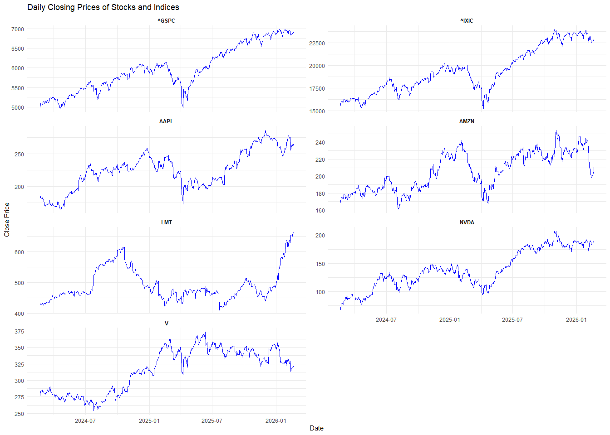
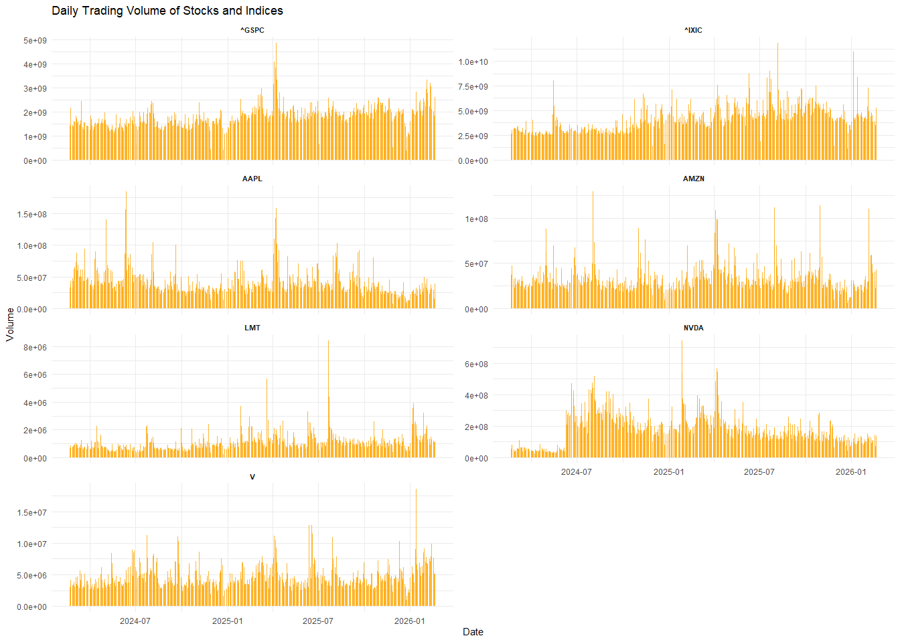
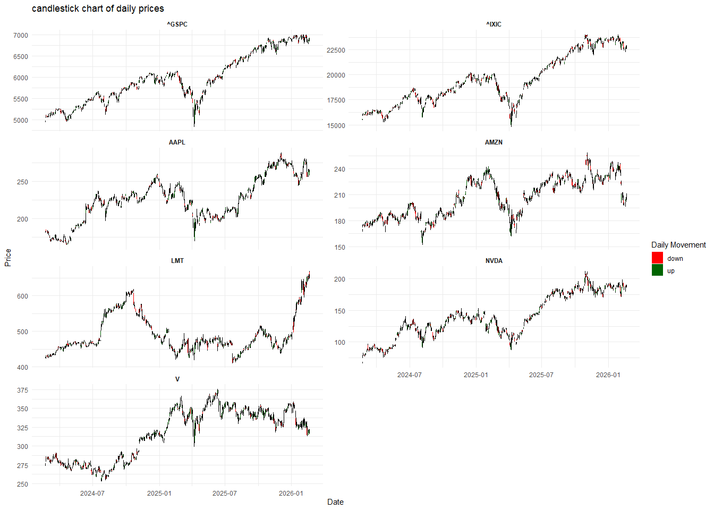
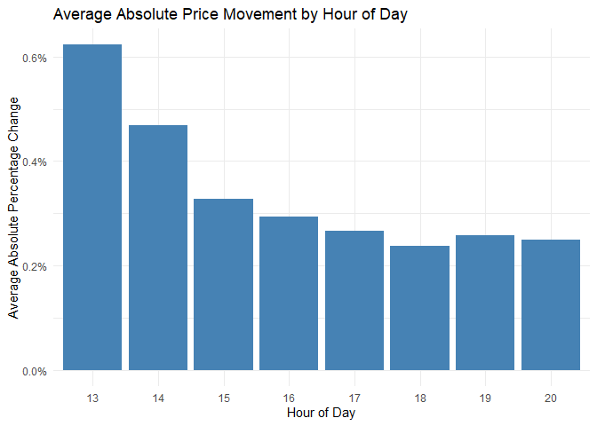
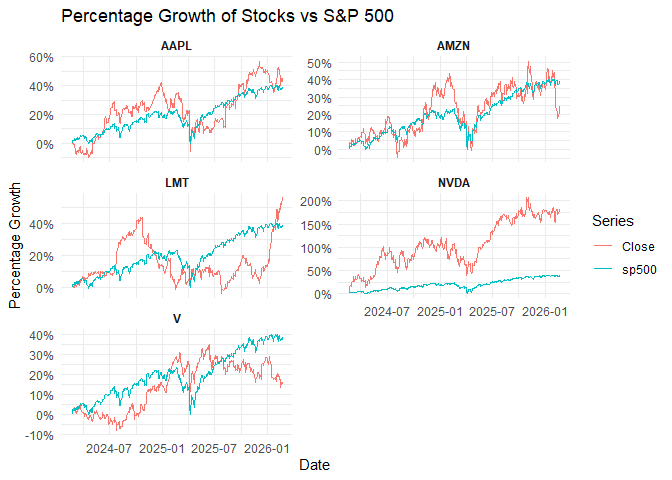
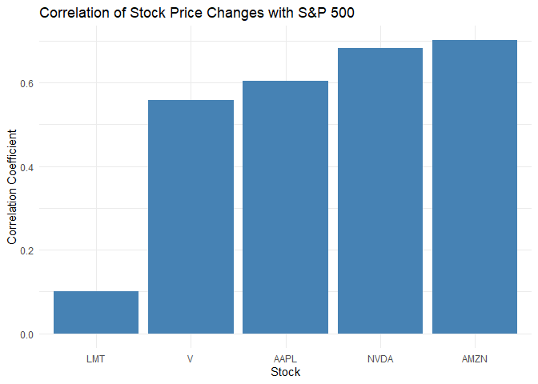

# Stock and Index data

Financial markets are highly complex systems that are influenced by many
factors. Both stocks (pieces of ownership for individual companies) and
ETFs/Indices (a sort of aggregation of multiple stocks/companies) are
represented and traded on these markets. Nowadays, some combination of
stocks and ETFs (which pretty much track indices) make up the long term
investments of many people. In this project, you will take a closer look
at the historical data of a few stocks and some indices in which they
are included, analyzing their performance and the relationship between
them. How closely do you think stock and index prices correlate?

# Get tidy data

## Data cleaning

-   Read the first three rows f the file to extract the column names.

-   combine the two header rows into meaningful column names.

<!-- -->

    ## Warning in col_name[1] <- Datetime: number of items to replace is not a
    ## multiple of replacement length

-   Skip the header rows and apply the new column names.

-   Convert columns to appropriate data types.

-   Check the cleaned dataset.

<!-- -->

    ## # A tibble: 5 × 36
    ##   Datetime            AAPL_Close AMZN_Close LMT_Close NVDA_Close V_Close
    ##   <dttm>                   <dbl>      <dbl>     <dbl>      <dbl>   <dbl>
    ## 1 2024-02-21 14:30:00       183.       168.      427.       67.9    275.
    ## 2 2024-02-21 15:30:00       182.       168.      428.       68.1    276.
    ## 3 2024-02-21 16:30:00       181.       168.      427.       67.1    275.
    ## 4 2024-02-21 17:30:00       181.       168.      426.       67.0    275.
    ## 5 2024-02-21 18:30:00       181.       168.      427.       66.8    275.
    ## # ℹ 30 more variables: `^GSPC_Close` <dbl>, `^IXIC_Close` <dbl>,
    ## #   AAPL_High <dbl>, AMZN_High <dbl>, LMT_High <dbl>, NVDA_High <dbl>,
    ## #   V_High <dbl>, `^GSPC_High` <dbl>, `^IXIC_High` <dbl>, AAPL_Low <dbl>,
    ## #   AMZN_Low <dbl>, LMT_Low <dbl>, NVDA_Low <dbl>, V_Low <dbl>,
    ## #   `^GSPC_Low` <dbl>, `^IXIC_Low` <dbl>, AAPL_Open <dbl>, AMZN_Open <dbl>,
    ## #   LMT_Open <dbl>, NVDA_Open <dbl>, V_Open <dbl>, `^GSPC_Open` <dbl>,
    ## #   `^IXIC_Open` <dbl>, AAPL_Volume <dbl>, AMZN_Volume <dbl>, …

## Data formatting

-   Pivot all price related columns into a long format and separate the
    symbol from the price type.

-   Transform the measurement variable (`Measure`) into individual
    columns.

-   Add a `Tpye` Column indicating whether each symbol is a stock or an
    index.

-   Check tidy dataset

<!-- -->

    ## # A tibble: 7 × 8
    ##   Datetime            Symbol Type    Open    High     Low   Close   Volume
    ##   <dttm>              <chr>  <fct>  <dbl>   <dbl>   <dbl>   <dbl>    <dbl>
    ## 1 2024-02-21 14:30:00 AAPL   Stock   182.   183.    182.    183.   9104336
    ## 2 2024-02-21 14:30:00 AMZN   Stock   169.   170.    168.    168.  15381626
    ## 3 2024-02-21 14:30:00 LMT    Stock   426.   428.    424.    427.    130776
    ## 4 2024-02-21 14:30:00 NVDA   Stock    68     68.9    67.7    67.9 13298661
    ## 5 2024-02-21 14:30:00 V      Stock   275.   276.    274.    275.    777888
    ## 6 2024-02-21 14:30:00 ^GSPC  Index  4963.  4970.   4958.   4964.         0
    ## 7 2024-02-21 14:30:00 ^IXIC  Index 15533. 15577.  15520.  15536.         0

## Aggregation

-   Extract the date from the datetime column

-   Summarise the data for each day and symbol according to the required
    rules.

-   Check aggregated data

<!-- -->

    ## # A tibble: 5 × 8
    ##   Date       Symbol Type   Open Close  High   Low   Volume
    ##   <date>     <chr>  <fct> <dbl> <dbl> <dbl> <dbl>    <dbl>
    ## 1 2024-02-21 AAPL   Stock  182. 182.  183.  181.  32636568
    ## 2 2024-02-21 AMZN   Stock  169. 169.  170.  167.  37223222
    ## 3 2024-02-21 LMT    Stock  426. 428.  428.  424.    661393
    ## 4 2024-02-21 NVDA   Stock   68   67.5  68.9  66.2 52800801
    ## 5 2024-02-21 V      Stock  275. 277.  277.  274.   3037286

# Visualization

## Price

Plot the daily closing prices for all stocks and indices using `facet`.

\## Volume Visualize the daily trading volume for all stocks and indices
using bar plots with `facet`.

\## Candlesticks Represent daily price data using candlesticks based on
open, high, low, and close values.

(I wanted to include a bar chart showing the daily volume in the same
graph, but as the y-axes couldn’t be merged and required scaling, I
found it too difficult to achieve, so I gave up.)

# Pattern analysis & correlation

## Percentage computing

-   Calculate the percentage change in closing price compared to the
    previous hour for each stock and index.

-   check the computed percentage changes

<!-- -->

    ## # A tibble: 7 × 4
    ##   Datetime            Symbol Close price_change
    ##   <dttm>              <chr>  <dbl> <chr>       
    ## 1 2024-02-21 14:30:00 AAPL    183. NA%         
    ## 2 2024-02-21 15:30:00 AAPL    182. -0.22%      
    ## 3 2024-02-21 16:30:00 AAPL    181. -0.42%      
    ## 4 2024-02-21 17:30:00 AAPL    181. 0.02%       
    ## 5 2024-02-21 18:30:00 AAPL    181. -0.26%      
    ## 6 2024-02-21 19:30:00 AAPL    181. 0.14%       
    ## 7 2024-02-21 20:30:00 AAPL    182. 0.62%

## Volatility movement (bar-plot)

-   Calculate the absolute percentage change between the hourly open and
    close prices.

-   Aggregate the average absolute price movement by hour across all
    stocks and indices.

-   Visualize the average price movement per hour of the day using a bar
    plot. 

-   Answer: Prices change the most at 13:00 on average.

## Correlation

### line-plot

-   Compare each stock’s price with the S&P 500 index over time using
    line plots.
    

-   As the data on the y-axis varied too widely, making it difficult to
    visualise clearly, I decided to use a percentage change trend chart
    for comparison
     \###
    correlation coefficient

-   calculate:

<!-- -->

    ## # A tibble: 5 × 2
    ##   Symbol correlation
    ##   <chr>        <dbl>
    ## 1 AMZN         0.701
    ## 2 NVDA         0.683
    ## 3 AAPL         0.605
    ## 4 V            0.558
    ## 5 LMT          0.101

-   plot 

-   Now the question could be answered, stock prices are generally
    positively correlated with the S&P 500, although the strength of the
    correlation varies across companies. Both the trend line plot and
    the correlation coefficient illustrate this point, AMZN shows the
    highest correlation with the S&P 500 and is therefore the most
    similar in terms of price movements.

-   (However, I should also point out that the trend line chart should
    only be used as a guide; the correlation coefficient measures
    whether the patterns of change in the share price and the index are
    consistent, and conclusions should primarily be drawn by referring
    to the correlation coefficient.)
