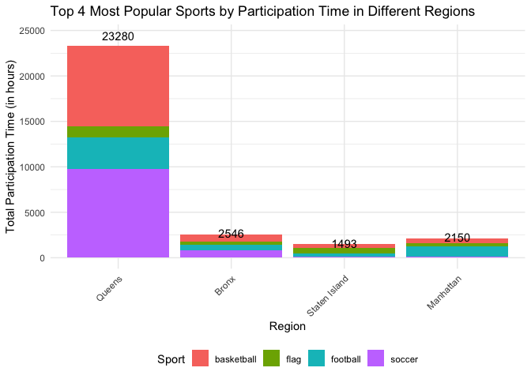

This project analyzes participation trends in summer sports programs
across different regions using the attendance data from 2017 to 2021.
The goal is to identify the top four most popular sports based on
participation time and visualize regional trends through stacked bar
charts. By cleaning, transforming, and aggregating the data, the project
provides insights into regional sports preferences and overall
participation patterns.

