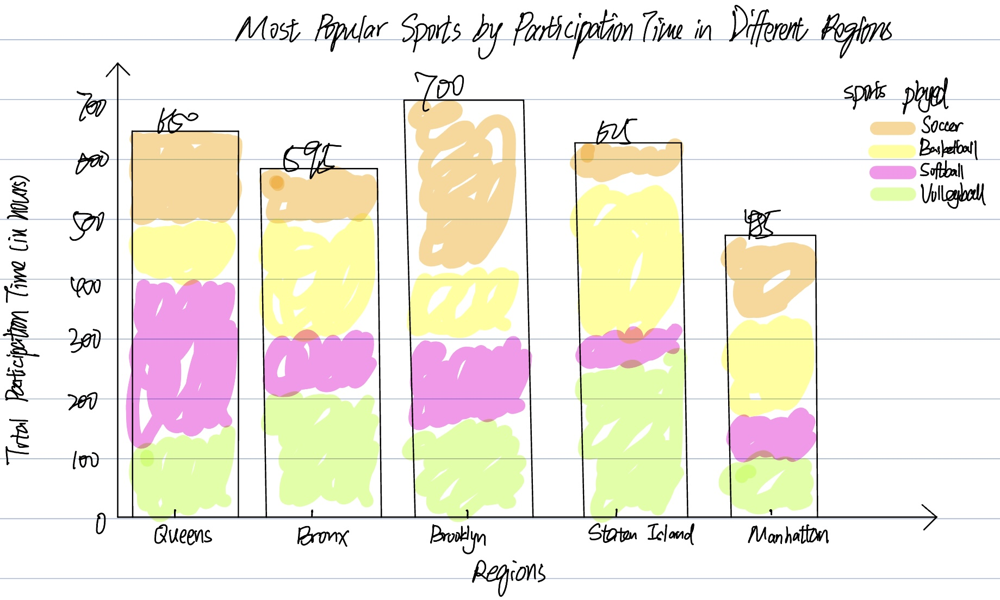

# [Data-projects-with-R-and-GitHub](https://dr-eberle-zentrum.github.io/Data-projects-with-R-and-GitHub/)

## General Topic

The aim of this project is to analyze and visualize the most popular sports among children aged 8 to 14 in different regions, focusing on weekend activity data recorded in parks. The aim is to understand regional differences in children's participation in sports and to determine which sports are the most popular and most frequently played by children.

## The Data Set

The data set, titled “Summer Sports Experiences,” documents weekend sports activities for children ages 8 to 14 in different neighborhoods (e.g., Queens, Bronx, Brooklyn, Staten Island, Manhattan). You can find the [file](https://catalog.data.gov/dataset/summer-sports-experience) here. It documents the duration and type of weekend sports activities in parks. In this project, we will use these data to identify the sports with the longest duration of participation in each borough and analyze differences in sport preferences across boroughs.

## Manipulation Goals

-   Filter the data set by region and summarize the total time spent on each sport during weekends.

-   Identify the sport with the four longest duration for each region.

-   Compare the four most popular sport across all regions to determine which region has the highest level of sports participation and which four sports are the most popular overall.

## Visualization Goal

Create a stacked bar chart to compare the most popular sports across regions, showing the total participation time for the most popular sport in each region.