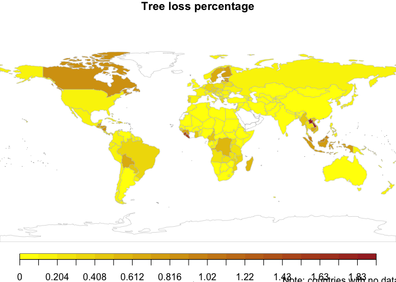

## data wrangling and manipulation

    library(readxl)
    library(tidyverse)

    ## ── Attaching core tidyverse packages ──────────────────────── tidyverse 2.0.0 ──
    ## ✔ dplyr     1.1.4     ✔ readr     2.1.5
    ## ✔ forcats   1.0.0     ✔ stringr   1.5.1
    ## ✔ ggplot2   3.5.1     ✔ tibble    3.2.1
    ## ✔ lubridate 1.9.3     ✔ tidyr     1.3.1
    ## ✔ purrr     1.0.2     
    ## ── Conflicts ────────────────────────────────────────── tidyverse_conflicts() ──
    ## ✖ dplyr::filter() masks stats::filter()
    ## ✖ dplyr::lag()    masks stats::lag()
    ## ℹ Use the conflicted package (<http://conflicted.r-lib.org/>) to force all conflicts to become errors

    # ensure file is in the working dir
    file = "gfw_2023_statistics_summary_v30102024.xlsx"
                      
    # import the 2ns sheet from the .xlsx file
    df <- read_xlsx(file, sheet=2) |>
      as_tibble() %>%
      # re-arranging the data 
      filter(threshold==30) %>% # only considering the 30% threshold data %>%
      filter(rowSums(select(., starts_with("tc_loss_ha_"))) > 0) %>%
      select(
        country,
        area_ha,
        starts_with("tc_loss_ha_")
      ) 

    year_to_predict <- 2050
      
    # pivot the table to long side 
    df_pivot <- pivot_longer(df,
                             cols=starts_with("tc_loss_ha_"),
                             names_to = "year",
                             names_prefix = "tc_loss_ha_", # removes the prefix from column name
                             values_to = "tc_loss_ha") %>%
                mutate(year = as.numeric(year)) %>% # make sure x-axis has numeric data type
                group_by(country) 

    predictions <- df_pivot %>%
      do({
        model <- lm(tc_loss_ha ~ poly(year, 2, raw = TRUE), data = .)  # fit a model by "year", for each country 
        data.frame(country = unique(.$country), 
                   expected_tc_ha_2050 = predict(model, data.frame(year = year_to_predict)), # create a data frame that contains the predictor from the model
                   var_expected_tc_ha_2050 = mean((resid(model))^2),
                   R_squared = summary(model)$r.squared)
      }) %>%
      ungroup() 

    # join the predicted column data to the original data sheet
    final_df <- left_join(df, predictions, by="country") 

    view(final_df)

    sample_final_df <- final_df %>% filter(row_number() %% 10 == 1) 

    knitr::kable(sample_final_df, format = "pipe", caption="ountry tree cover loss and prediction for year 2050")

<table style="width:100%;">
<caption>ountry tree cover loss and prediction for year 2050</caption>
<colgroup>
<col style="width: 5%" />
<col style="width: 2%" />
<col style="width: 3%" />
<col style="width: 3%" />
<col style="width: 3%" />
<col style="width: 3%" />
<col style="width: 3%" />
<col style="width: 3%" />
<col style="width: 3%" />
<col style="width: 3%" />
<col style="width: 3%" />
<col style="width: 3%" />
<col style="width: 3%" />
<col style="width: 3%" />
<col style="width: 3%" />
<col style="width: 3%" />
<col style="width: 3%" />
<col style="width: 3%" />
<col style="width: 3%" />
<col style="width: 3%" />
<col style="width: 3%" />
<col style="width: 3%" />
<col style="width: 3%" />
<col style="width: 3%" />
<col style="width: 3%" />
<col style="width: 4%" />
<col style="width: 5%" />
<col style="width: 2%" />
</colgroup>
<thead>
<tr>
<th style="text-align: left;">country</th>
<th style="text-align: right;">area_ha</th>
<th style="text-align: right;">tc_loss_ha_2001</th>
<th style="text-align: right;">tc_loss_ha_2002</th>
<th style="text-align: right;">tc_loss_ha_2003</th>
<th style="text-align: right;">tc_loss_ha_2004</th>
<th style="text-align: right;">tc_loss_ha_2005</th>
<th style="text-align: right;">tc_loss_ha_2006</th>
<th style="text-align: right;">tc_loss_ha_2007</th>
<th style="text-align: right;">tc_loss_ha_2008</th>
<th style="text-align: right;">tc_loss_ha_2009</th>
<th style="text-align: right;">tc_loss_ha_2010</th>
<th style="text-align: right;">tc_loss_ha_2011</th>
<th style="text-align: right;">tc_loss_ha_2012</th>
<th style="text-align: right;">tc_loss_ha_2013</th>
<th style="text-align: right;">tc_loss_ha_2014</th>
<th style="text-align: right;">tc_loss_ha_2015</th>
<th style="text-align: right;">tc_loss_ha_2016</th>
<th style="text-align: right;">tc_loss_ha_2017</th>
<th style="text-align: right;">tc_loss_ha_2018</th>
<th style="text-align: right;">tc_loss_ha_2019</th>
<th style="text-align: right;">tc_loss_ha_2020</th>
<th style="text-align: right;">tc_loss_ha_2021</th>
<th style="text-align: right;">tc_loss_ha_2022</th>
<th style="text-align: right;">tc_loss_ha_2023</th>
<th style="text-align: right;">expected_tc_ha_2050</th>
<th style="text-align: right;">var_expected_tc_ha_2050</th>
<th style="text-align: right;">R_squared</th>
</tr>
</thead>
<tbody>
<tr>
<td style="text-align: left;">Afghanistan</td>
<td style="text-align: right;">64385715</td>
<td style="text-align: right;">88</td>
<td style="text-align: right;">179</td>
<td style="text-align: right;">244</td>
<td style="text-align: right;">201</td>
<td style="text-align: right;">236</td>
<td style="text-align: right;">152</td>
<td style="text-align: right;">253</td>
<td style="text-align: right;">107</td>
<td style="text-align: right;">70</td>
<td style="text-align: right;">88</td>
<td style="text-align: right;">113</td>
<td style="text-align: right;">39</td>
<td style="text-align: right;">1</td>
<td style="text-align: right;">3</td>
<td style="text-align: right;">0</td>
<td style="text-align: right;">0</td>
<td style="text-align: right;">0</td>
<td style="text-align: right;">26</td>
<td style="text-align: right;">17</td>
<td style="text-align: right;">37</td>
<td style="text-align: right;">26</td>
<td style="text-align: right;">6</td>
<td style="text-align: right;">15</td>
<td style="text-align: right;">185.579051</td>
<td style="text-align: right;">2.535080e+03</td>
<td style="text-align: right;">0.6510103</td>
</tr>
<tr>
<td style="text-align: left;">Aruba</td>
<td style="text-align: right;">18198</td>
<td style="text-align: right;">0</td>
<td style="text-align: right;">1</td>
<td style="text-align: right;">1</td>
<td style="text-align: right;">0</td>
<td style="text-align: right;">0</td>
<td style="text-align: right;">0</td>
<td style="text-align: right;">0</td>
<td style="text-align: right;">0</td>
<td style="text-align: right;">0</td>
<td style="text-align: right;">0</td>
<td style="text-align: right;">0</td>
<td style="text-align: right;">0</td>
<td style="text-align: right;">0</td>
<td style="text-align: right;">0</td>
<td style="text-align: right;">0</td>
<td style="text-align: right;">0</td>
<td style="text-align: right;">0</td>
<td style="text-align: right;">0</td>
<td style="text-align: right;">0</td>
<td style="text-align: right;">0</td>
<td style="text-align: right;">0</td>
<td style="text-align: right;">0</td>
<td style="text-align: right;">0</td>
<td style="text-align: right;">3.049407</td>
<td style="text-align: right;">5.326880e-02</td>
<td style="text-align: right;">0.3290662</td>
</tr>
<tr>
<td style="text-align: left;">Benin</td>
<td style="text-align: right;">11542318</td>
<td style="text-align: right;">3749</td>
<td style="text-align: right;">3480</td>
<td style="text-align: right;">3476</td>
<td style="text-align: right;">684</td>
<td style="text-align: right;">1591</td>
<td style="text-align: right;">1795</td>
<td style="text-align: right;">4660</td>
<td style="text-align: right;">482</td>
<td style="text-align: right;">4929</td>
<td style="text-align: right;">529</td>
<td style="text-align: right;">655</td>
<td style="text-align: right;">2865</td>
<td style="text-align: right;">1313</td>
<td style="text-align: right;">1358</td>
<td style="text-align: right;">598</td>
<td style="text-align: right;">2016</td>
<td style="text-align: right;">2238</td>
<td style="text-align: right;">1826</td>
<td style="text-align: right;">775</td>
<td style="text-align: right;">1606</td>
<td style="text-align: right;">1705</td>
<td style="text-align: right;">1674</td>
<td style="text-align: right;">2617</td>
<td style="text-align: right;">12317.932806</td>
<td style="text-align: right;">1.331608e+06</td>
<td style="text-align: right;">0.1766759</td>
</tr>
<tr>
<td style="text-align: left;">Bulgaria</td>
<td style="text-align: right;">11158731</td>
<td style="text-align: right;">8202</td>
<td style="text-align: right;">4639</td>
<td style="text-align: right;">5199</td>
<td style="text-align: right;">8170</td>
<td style="text-align: right;">6567</td>
<td style="text-align: right;">5171</td>
<td style="text-align: right;">9557</td>
<td style="text-align: right;">6448</td>
<td style="text-align: right;">6100</td>
<td style="text-align: right;">3569</td>
<td style="text-align: right;">3332</td>
<td style="text-align: right;">9978</td>
<td style="text-align: right;">3693</td>
<td style="text-align: right;">6689</td>
<td style="text-align: right;">7293</td>
<td style="text-align: right;">7395</td>
<td style="text-align: right;">7688</td>
<td style="text-align: right;">9754</td>
<td style="text-align: right;">4125</td>
<td style="text-align: right;">4795</td>
<td style="text-align: right;">6684</td>
<td style="text-align: right;">4093</td>
<td style="text-align: right;">5653</td>
<td style="text-align: right;">-704.001976</td>
<td style="text-align: right;">3.769256e+06</td>
<td style="text-align: right;">0.0184023</td>
</tr>
<tr>
<td style="text-align: left;">Chad</td>
<td style="text-align: right;">126995175</td>
<td style="text-align: right;">884</td>
<td style="text-align: right;">1958</td>
<td style="text-align: right;">194</td>
<td style="text-align: right;">457</td>
<td style="text-align: right;">472</td>
<td style="text-align: right;">2982</td>
<td style="text-align: right;">1001</td>
<td style="text-align: right;">3402</td>
<td style="text-align: right;">1066</td>
<td style="text-align: right;">255</td>
<td style="text-align: right;">920</td>
<td style="text-align: right;">2491</td>
<td style="text-align: right;">2895</td>
<td style="text-align: right;">3001</td>
<td style="text-align: right;">2591</td>
<td style="text-align: right;">3166</td>
<td style="text-align: right;">6765</td>
<td style="text-align: right;">6932</td>
<td style="text-align: right;">5059</td>
<td style="text-align: right;">3433</td>
<td style="text-align: right;">5095</td>
<td style="text-align: right;">5445</td>
<td style="text-align: right;">11067</td>
<td style="text-align: right;">42172.875494</td>
<td style="text-align: right;">2.038842e+06</td>
<td style="text-align: right;">0.6989132</td>
</tr>
<tr>
<td style="text-align: left;">Czech Republic</td>
<td style="text-align: right;">7883559</td>
<td style="text-align: right;">3460</td>
<td style="text-align: right;">6766</td>
<td style="text-align: right;">3925</td>
<td style="text-align: right;">13454</td>
<td style="text-align: right;">25560</td>
<td style="text-align: right;">8607</td>
<td style="text-align: right;">21325</td>
<td style="text-align: right;">16873</td>
<td style="text-align: right;">13514</td>
<td style="text-align: right;">15442</td>
<td style="text-align: right;">21853</td>
<td style="text-align: right;">14006</td>
<td style="text-align: right;">7659</td>
<td style="text-align: right;">13940</td>
<td style="text-align: right;">8047</td>
<td style="text-align: right;">22808</td>
<td style="text-align: right;">26512</td>
<td style="text-align: right;">39206</td>
<td style="text-align: right;">73295</td>
<td style="text-align: right;">100258</td>
<td style="text-align: right;">56293</td>
<td style="text-align: right;">34756</td>
<td style="text-align: right;">24393</td>
<td style="text-align: right;">236253.245060</td>
<td style="text-align: right;">3.018920e+08</td>
<td style="text-align: right;">0.4245616</td>
</tr>
<tr>
<td style="text-align: left;">Eritrea</td>
<td style="text-align: right;">12045733</td>
<td style="text-align: right;">3</td>
<td style="text-align: right;">0</td>
<td style="text-align: right;">0</td>
<td style="text-align: right;">0</td>
<td style="text-align: right;">0</td>
<td style="text-align: right;">0</td>
<td style="text-align: right;">0</td>
<td style="text-align: right;">0</td>
<td style="text-align: right;">0</td>
<td style="text-align: right;">0</td>
<td style="text-align: right;">0</td>
<td style="text-align: right;">0</td>
<td style="text-align: right;">0</td>
<td style="text-align: right;">0</td>
<td style="text-align: right;">0</td>
<td style="text-align: right;">0</td>
<td style="text-align: right;">0</td>
<td style="text-align: right;">0</td>
<td style="text-align: right;">0</td>
<td style="text-align: right;">0</td>
<td style="text-align: right;">0</td>
<td style="text-align: right;">0</td>
<td style="text-align: right;">0</td>
<td style="text-align: right;">8.021739</td>
<td style="text-align: right;">2.620038e-01</td>
<td style="text-align: right;">0.3000000</td>
</tr>
<tr>
<td style="text-align: left;">Georgia</td>
<td style="text-align: right;">6984457</td>
<td style="text-align: right;">667</td>
<td style="text-align: right;">536</td>
<td style="text-align: right;">292</td>
<td style="text-align: right;">1967</td>
<td style="text-align: right;">549</td>
<td style="text-align: right;">531</td>
<td style="text-align: right;">992</td>
<td style="text-align: right;">746</td>
<td style="text-align: right;">448</td>
<td style="text-align: right;">819</td>
<td style="text-align: right;">540</td>
<td style="text-align: right;">473</td>
<td style="text-align: right;">252</td>
<td style="text-align: right;">114</td>
<td style="text-align: right;">43</td>
<td style="text-align: right;">523</td>
<td style="text-align: right;">208</td>
<td style="text-align: right;">300</td>
<td style="text-align: right;">166</td>
<td style="text-align: right;">222</td>
<td style="text-align: right;">420</td>
<td style="text-align: right;">291</td>
<td style="text-align: right;">785</td>
<td style="text-align: right;">1820.948617</td>
<td style="text-align: right;">1.194621e+05</td>
<td style="text-align: right;">0.2140991</td>
</tr>
<tr>
<td style="text-align: left;">Guyana</td>
<td style="text-align: right;">20974416</td>
<td style="text-align: right;">10040</td>
<td style="text-align: right;">4827</td>
<td style="text-align: right;">7419</td>
<td style="text-align: right;">4062</td>
<td style="text-align: right;">5832</td>
<td style="text-align: right;">5934</td>
<td style="text-align: right;">5250</td>
<td style="text-align: right;">9460</td>
<td style="text-align: right;">8267</td>
<td style="text-align: right;">10099</td>
<td style="text-align: right;">8363</td>
<td style="text-align: right;">13112</td>
<td style="text-align: right;">7117</td>
<td style="text-align: right;">12154</td>
<td style="text-align: right;">13084</td>
<td style="text-align: right;">26512</td>
<td style="text-align: right;">19434</td>
<td style="text-align: right;">11761</td>
<td style="text-align: right;">22324</td>
<td style="text-align: right;">15770</td>
<td style="text-align: right;">9537</td>
<td style="text-align: right;">10564</td>
<td style="text-align: right;">27882</td>
<td style="text-align: right;">54710.199604</td>
<td style="text-align: right;">2.237001e+07</td>
<td style="text-align: right;">0.4684999</td>
</tr>
<tr>
<td style="text-align: left;">Isle of Man</td>
<td style="text-align: right;">57967</td>
<td style="text-align: right;">16</td>
<td style="text-align: right;">14</td>
<td style="text-align: right;">2</td>
<td style="text-align: right;">9</td>
<td style="text-align: right;">11</td>
<td style="text-align: right;">26</td>
<td style="text-align: right;">30</td>
<td style="text-align: right;">0</td>
<td style="text-align: right;">47</td>
<td style="text-align: right;">50</td>
<td style="text-align: right;">12</td>
<td style="text-align: right;">31</td>
<td style="text-align: right;">17</td>
<td style="text-align: right;">43</td>
<td style="text-align: right;">11</td>
<td style="text-align: right;">18</td>
<td style="text-align: right;">18</td>
<td style="text-align: right;">12</td>
<td style="text-align: right;">20</td>
<td style="text-align: right;">7</td>
<td style="text-align: right;">14</td>
<td style="text-align: right;">17</td>
<td style="text-align: right;">8</td>
<td style="text-align: right;">-199.252964</td>
<td style="text-align: right;">1.349784e+02</td>
<td style="text-align: right;">0.2131141</td>
</tr>
<tr>
<td style="text-align: left;">Kyrgyzstan</td>
<td style="text-align: right;">19864899</td>
<td style="text-align: right;">589</td>
<td style="text-align: right;">305</td>
<td style="text-align: right;">111</td>
<td style="text-align: right;">192</td>
<td style="text-align: right;">82</td>
<td style="text-align: right;">111</td>
<td style="text-align: right;">107</td>
<td style="text-align: right;">107</td>
<td style="text-align: right;">201</td>
<td style="text-align: right;">261</td>
<td style="text-align: right;">112</td>
<td style="text-align: right;">85</td>
<td style="text-align: right;">27</td>
<td style="text-align: right;">14</td>
<td style="text-align: right;">0</td>
<td style="text-align: right;">12</td>
<td style="text-align: right;">56</td>
<td style="text-align: right;">17</td>
<td style="text-align: right;">16</td>
<td style="text-align: right;">12</td>
<td style="text-align: right;">18</td>
<td style="text-align: right;">32</td>
<td style="text-align: right;">94</td>
<td style="text-align: right;">1414.539526</td>
<td style="text-align: right;">6.778771e+03</td>
<td style="text-align: right;">0.5994882</td>
</tr>
<tr>
<td style="text-align: left;">Macao</td>
<td style="text-align: right;">3413</td>
<td style="text-align: right;">1</td>
<td style="text-align: right;">1</td>
<td style="text-align: right;">0</td>
<td style="text-align: right;">0</td>
<td style="text-align: right;">0</td>
<td style="text-align: right;">3</td>
<td style="text-align: right;">4</td>
<td style="text-align: right;">4</td>
<td style="text-align: right;">2</td>
<td style="text-align: right;">1</td>
<td style="text-align: right;">1</td>
<td style="text-align: right;">1</td>
<td style="text-align: right;">0</td>
<td style="text-align: right;">1</td>
<td style="text-align: right;">1</td>
<td style="text-align: right;">0</td>
<td style="text-align: right;">4</td>
<td style="text-align: right;">1</td>
<td style="text-align: right;">3</td>
<td style="text-align: right;">1</td>
<td style="text-align: right;">0</td>
<td style="text-align: right;">1</td>
<td style="text-align: right;">16</td>
<td style="text-align: right;">43.181818</td>
<td style="text-align: right;">8.513240e+00</td>
<td style="text-align: right;">0.1975225</td>
</tr>
<tr>
<td style="text-align: left;">Mauritius</td>
<td style="text-align: right;">191367</td>
<td style="text-align: right;">157</td>
<td style="text-align: right;">154</td>
<td style="text-align: right;">120</td>
<td style="text-align: right;">329</td>
<td style="text-align: right;">174</td>
<td style="text-align: right;">142</td>
<td style="text-align: right;">132</td>
<td style="text-align: right;">189</td>
<td style="text-align: right;">242</td>
<td style="text-align: right;">23</td>
<td style="text-align: right;">487</td>
<td style="text-align: right;">152</td>
<td style="text-align: right;">219</td>
<td style="text-align: right;">532</td>
<td style="text-align: right;">0</td>
<td style="text-align: right;">0</td>
<td style="text-align: right;">0</td>
<td style="text-align: right;">0</td>
<td style="text-align: right;">0</td>
<td style="text-align: right;">0</td>
<td style="text-align: right;">0</td>
<td style="text-align: right;">0</td>
<td style="text-align: right;">0</td>
<td style="text-align: right;">-2000.424901</td>
<td style="text-align: right;">1.554143e+04</td>
<td style="text-align: right;">0.3125310</td>
</tr>
<tr>
<td style="text-align: left;">Myanmar</td>
<td style="text-align: right;">66929667</td>
<td style="text-align: right;">44804</td>
<td style="text-align: right;">66120</td>
<td style="text-align: right;">77224</td>
<td style="text-align: right;">102186</td>
<td style="text-align: right;">91847</td>
<td style="text-align: right;">127464</td>
<td style="text-align: right;">146598</td>
<td style="text-align: right;">119216</td>
<td style="text-align: right;">216306</td>
<td style="text-align: right;">169913</td>
<td style="text-align: right;">135716</td>
<td style="text-align: right;">225189</td>
<td style="text-align: right;">248186</td>
<td style="text-align: right;">331445</td>
<td style="text-align: right;">293305</td>
<td style="text-align: right;">362552</td>
<td style="text-align: right;">341845</td>
<td style="text-align: right;">278709</td>
<td style="text-align: right;">309418</td>
<td style="text-align: right;">310005</td>
<td style="text-align: right;">304152</td>
<td style="text-align: right;">260938</td>
<td style="text-align: right;">307184</td>
<td style="text-align: right;">-90230.349806</td>
<td style="text-align: right;">1.417815e+09</td>
<td style="text-align: right;">0.8562910</td>
</tr>
<tr>
<td style="text-align: left;">Northern Cyprus</td>
<td style="text-align: right;">331407</td>
<td style="text-align: right;">18</td>
<td style="text-align: right;">3</td>
<td style="text-align: right;">2</td>
<td style="text-align: right;">15</td>
<td style="text-align: right;">4</td>
<td style="text-align: right;">16</td>
<td style="text-align: right;">13</td>
<td style="text-align: right;">20</td>
<td style="text-align: right;">21</td>
<td style="text-align: right;">10</td>
<td style="text-align: right;">14</td>
<td style="text-align: right;">6</td>
<td style="text-align: right;">16</td>
<td style="text-align: right;">28</td>
<td style="text-align: right;">15</td>
<td style="text-align: right;">22</td>
<td style="text-align: right;">28</td>
<td style="text-align: right;">18</td>
<td style="text-align: right;">13</td>
<td style="text-align: right;">6</td>
<td style="text-align: right;">3</td>
<td style="text-align: right;">527</td>
<td style="text-align: right;">41</td>
<td style="text-align: right;">1368.557312</td>
<td style="text-align: right;">8.643655e+03</td>
<td style="text-align: right;">0.2128916</td>
</tr>
<tr>
<td style="text-align: left;">Poland</td>
<td style="text-align: right;">31239918</td>
<td style="text-align: right;">19066</td>
<td style="text-align: right;">31070</td>
<td style="text-align: right;">33293</td>
<td style="text-align: right;">41874</td>
<td style="text-align: right;">82379</td>
<td style="text-align: right;">37680</td>
<td style="text-align: right;">57311</td>
<td style="text-align: right;">47941</td>
<td style="text-align: right;">46926</td>
<td style="text-align: right;">71835</td>
<td style="text-align: right;">56650</td>
<td style="text-align: right;">54896</td>
<td style="text-align: right;">35015</td>
<td style="text-align: right;">56279</td>
<td style="text-align: right;">42743</td>
<td style="text-align: right;">86510</td>
<td style="text-align: right;">96252</td>
<td style="text-align: right;">96846</td>
<td style="text-align: right;">76721</td>
<td style="text-align: right;">74959</td>
<td style="text-align: right;">77568</td>
<td style="text-align: right;">72193</td>
<td style="text-align: right;">76138</td>
<td style="text-align: right;">65789.521740</td>
<td style="text-align: right;">2.275556e+08</td>
<td style="text-align: right;">0.5054640</td>
</tr>
<tr>
<td style="text-align: left;">Saint Pierre and Miquelon</td>
<td style="text-align: right;">22663</td>
<td style="text-align: right;">0</td>
<td style="text-align: right;">0</td>
<td style="text-align: right;">0</td>
<td style="text-align: right;">0</td>
<td style="text-align: right;">0</td>
<td style="text-align: right;">0</td>
<td style="text-align: right;">0</td>
<td style="text-align: right;">0</td>
<td style="text-align: right;">0</td>
<td style="text-align: right;">0</td>
<td style="text-align: right;">0</td>
<td style="text-align: right;">0</td>
<td style="text-align: right;">5</td>
<td style="text-align: right;">1</td>
<td style="text-align: right;">0</td>
<td style="text-align: right;">0</td>
<td style="text-align: right;">0</td>
<td style="text-align: right;">0</td>
<td style="text-align: right;">0</td>
<td style="text-align: right;">1</td>
<td style="text-align: right;">0</td>
<td style="text-align: right;">0</td>
<td style="text-align: right;">0</td>
<td style="text-align: right;">-8.420949</td>
<td style="text-align: right;">1.003830e+00</td>
<td style="text-align: right;">0.0716329</td>
</tr>
<tr>
<td style="text-align: left;">Slovakia</td>
<td style="text-align: right;">4909916</td>
<td style="text-align: right;">3897</td>
<td style="text-align: right;">4016</td>
<td style="text-align: right;">3750</td>
<td style="text-align: right;">4625</td>
<td style="text-align: right;">27674</td>
<td style="text-align: right;">8023</td>
<td style="text-align: right;">9486</td>
<td style="text-align: right;">13466</td>
<td style="text-align: right;">11237</td>
<td style="text-align: right;">17104</td>
<td style="text-align: right;">11544</td>
<td style="text-align: right;">9170</td>
<td style="text-align: right;">5076</td>
<td style="text-align: right;">17366</td>
<td style="text-align: right;">5283</td>
<td style="text-align: right;">16943</td>
<td style="text-align: right;">14213</td>
<td style="text-align: right;">17699</td>
<td style="text-align: right;">10331</td>
<td style="text-align: right;">11947</td>
<td style="text-align: right;">6098</td>
<td style="text-align: right;">5207</td>
<td style="text-align: right;">9852</td>
<td style="text-align: right;">-69213.440712</td>
<td style="text-align: right;">2.807387e+07</td>
<td style="text-align: right;">0.1766221</td>
</tr>
<tr>
<td style="text-align: left;">Suriname</td>
<td style="text-align: right;">14642557</td>
<td style="text-align: right;">3689</td>
<td style="text-align: right;">3717</td>
<td style="text-align: right;">4546</td>
<td style="text-align: right;">5423</td>
<td style="text-align: right;">3512</td>
<td style="text-align: right;">3404</td>
<td style="text-align: right;">3626</td>
<td style="text-align: right;">7511</td>
<td style="text-align: right;">7362</td>
<td style="text-align: right;">7000</td>
<td style="text-align: right;">5697</td>
<td style="text-align: right;">19502</td>
<td style="text-align: right;">10203</td>
<td style="text-align: right;">14748</td>
<td style="text-align: right;">11921</td>
<td style="text-align: right;">16878</td>
<td style="text-align: right;">18018</td>
<td style="text-align: right;">19001</td>
<td style="text-align: right;">18454</td>
<td style="text-align: right;">15096</td>
<td style="text-align: right;">12262</td>
<td style="text-align: right;">14542</td>
<td style="text-align: right;">26116</td>
<td style="text-align: right;">46560.075099</td>
<td style="text-align: right;">1.151763e+07</td>
<td style="text-align: right;">0.7261972</td>
</tr>
<tr>
<td style="text-align: left;">Timor-Leste</td>
<td style="text-align: right;">1491565</td>
<td style="text-align: right;">677</td>
<td style="text-align: right;">1605</td>
<td style="text-align: right;">691</td>
<td style="text-align: right;">2062</td>
<td style="text-align: right;">1311</td>
<td style="text-align: right;">2929</td>
<td style="text-align: right;">1556</td>
<td style="text-align: right;">833</td>
<td style="text-align: right;">2634</td>
<td style="text-align: right;">649</td>
<td style="text-align: right;">1463</td>
<td style="text-align: right;">1887</td>
<td style="text-align: right;">463</td>
<td style="text-align: right;">1883</td>
<td style="text-align: right;">863</td>
<td style="text-align: right;">1296</td>
<td style="text-align: right;">1713</td>
<td style="text-align: right;">1244</td>
<td style="text-align: right;">1501</td>
<td style="text-align: right;">1459</td>
<td style="text-align: right;">1431</td>
<td style="text-align: right;">1113</td>
<td style="text-align: right;">1477</td>
<td style="text-align: right;">-1249.501976</td>
<td style="text-align: right;">3.485241e+05</td>
<td style="text-align: right;">0.0162145</td>
</tr>
<tr>
<td style="text-align: left;">United States</td>
<td style="text-align: right;">947295610</td>
<td style="text-align: right;">1943319</td>
<td style="text-align: right;">2038436</td>
<td style="text-align: right;">1649384</td>
<td style="text-align: right;">2746257</td>
<td style="text-align: right;">2691544</td>
<td style="text-align: right;">2605856</td>
<td style="text-align: right;">2435128</td>
<td style="text-align: right;">2213724</td>
<td style="text-align: right;">1608981</td>
<td style="text-align: right;">2167662</td>
<td style="text-align: right;">1663692</td>
<td style="text-align: right;">1964094</td>
<td style="text-align: right;">1736445</td>
<td style="text-align: right;">1736527</td>
<td style="text-align: right;">2289649</td>
<td style="text-align: right;">2264067</td>
<td style="text-align: right;">2311358</td>
<td style="text-align: right;">2092359</td>
<td style="text-align: right;">2109918</td>
<td style="text-align: right;">1966716</td>
<td style="text-align: right;">2044299</td>
<td style="text-align: right;">2204643</td>
<td style="text-align: right;">1382421</td>
<td style="text-align: right;">397467.972342</td>
<td style="text-align: right;">1.104296e+11</td>
<td style="text-align: right;">0.0747842</td>
</tr>
<tr>
<td style="text-align: left;">Åland</td>
<td style="text-align: right;">150643</td>
<td style="text-align: right;">397</td>
<td style="text-align: right;">278</td>
<td style="text-align: right;">221</td>
<td style="text-align: right;">736</td>
<td style="text-align: right;">699</td>
<td style="text-align: right;">100</td>
<td style="text-align: right;">248</td>
<td style="text-align: right;">1292</td>
<td style="text-align: right;">676</td>
<td style="text-align: right;">634</td>
<td style="text-align: right;">466</td>
<td style="text-align: right;">655</td>
<td style="text-align: right;">510</td>
<td style="text-align: right;">550</td>
<td style="text-align: right;">567</td>
<td style="text-align: right;">673</td>
<td style="text-align: right;">735</td>
<td style="text-align: right;">620</td>
<td style="text-align: right;">2361</td>
<td style="text-align: right;">673</td>
<td style="text-align: right;">1355</td>
<td style="text-align: right;">1166</td>
<td style="text-align: right;">1093</td>
<td style="text-align: right;">4471.403162</td>
<td style="text-align: right;">1.476482e+05</td>
<td style="text-align: right;">0.3349339</td>
</tr>
</tbody>
</table>

## Data Visualisation

### Prediction 2050 - model fit

    # boil down the final_df to pivot-scale for 2050 predictions
    prediction_pivot <- final_df %>%
      mutate(year=2050) %>%
      select(country, year, expected_tc_ha_2050) %>%
      rename(tc_loss_ha = expected_tc_ha_2050) %>% view()

    # prepare the pivot table including the predicted value of 2050
    df_pivot_to_2050 <- df_pivot %>%
      select(country, year, tc_loss_ha) %>%
      bind_rows(prediction_pivot) %>% 
      arrange(country, year) %>% view()

    # set labels for r2 values for plotting
    r_squared_values <- setNames(final_df$R_squared, final_df$country)

    # Function to update facet labels with R² values
    update_labels <- function(country) {
      r2 <- r_squared_values[country]
      paste0(country, " (R² = ", round(r2, 2), ")")
    }

    countries_selected <- c("Laos", "Norway", "India", "United States")

    # extract only the wanted countries from prediction table
    selected_prediction_pivot <- prediction_pivot %>% filter(country %in% countries_selected)
      
    specific_country_plot <- df_pivot_to_2050 %>%
      filter(country %in% countries_selected) %>%
      ggplot(aes(x = year, y = tc_loss_ha)) + 
      geom_point() + 
      geom_smooth(method = "lm", formula = y ~ poly(x, 2), alpha=.5) +
      geom_point(data = selected_prediction_pivot,
                 aes(x = year, y = tc_loss_ha),
                 color = "red") +
      geom_hline(data = selected_prediction_pivot,
                 aes(yintercept = tc_loss_ha), 
                 linetype = "dashed", 
                 color = "blue") +
      facet_wrap(~ country, scales = "free", ncol=1, labeller = as_labeller(update_labels)) +
      labs(
        title = "Country Tree Cover Loss and Prediction for 2050",
        x = "year",
        y = "tree cover loss (in hectres)",
        subtitle = str_wrap("the graphs show country tree coverage loss from 2001-2023 data. Additionally, based on the data, an estimated figure for 2050 is modeled.")
      ) +
      theme(
        strip.text = element_text(size = 10, face = "bold"),
        plot.subtitle=element_text(size=9)
      )

    specific_country_plot

### World map

    # world map visualisation
    library(rworldmap)

    ## Loading required package: sp

    ## ### Welcome to rworldmap ###

    ## For a short introduction type :   vignette('rworldmap')

    color_palette <- colorRampPalette(c("yellow", "brown"))(20)

    df_world <- df %>%
      mutate(tc_loss_ha_2023 = as.numeric(tc_loss_ha_2023)) %>%
      mutate(loss_percentage = 100 * tc_loss_ha_2023 / area_ha) %>%
      joinCountryData2Map( df,
                           joinCode = "NAME",
                           nameJoinColumn = "country" )

    ## 195 codes from your data successfully matched countries in the map
    ## 16 codes from your data failed to match with a country code in the map
    ## 48 codes from the map weren't represented in your data

    breaks_seq <- seq(min(df_world$loss_percentage, na.rm = TRUE), 
                      max(df_world$loss_percentage, na.rm = TRUE), 
                      length.out = 20)

    par(mai=c(0,0,0.2,0),xaxs="i",yaxs="i")
    mapParams<- mapCountryData(df_world,
                   nameColumnToPlot="loss_percentage",
                   mapTitle="Tree loss percentage",
                   colourPalette=color_palette,
                   numCats=100,
                   catMethod=breaks_seq,
                   addLegend=FALSE)

    ## Warning in rwmGetColours(colourPalette, numColours): 20 colours specified and
    ## 19 required, using interpolation to calculate colours

    do.call(addMapLegend , c( mapParams,
                              legendLabels="all",
                              legendWidth=0.5,
                              legendMar = 2 ))
    text(x = -10, y = -130, labels = "percentage", cex = 1, font = .5)
    text(x = 130, y = -130, labels = str_wrap("Note: countries with no data is shown with white color", width=30), font = 0.04)

