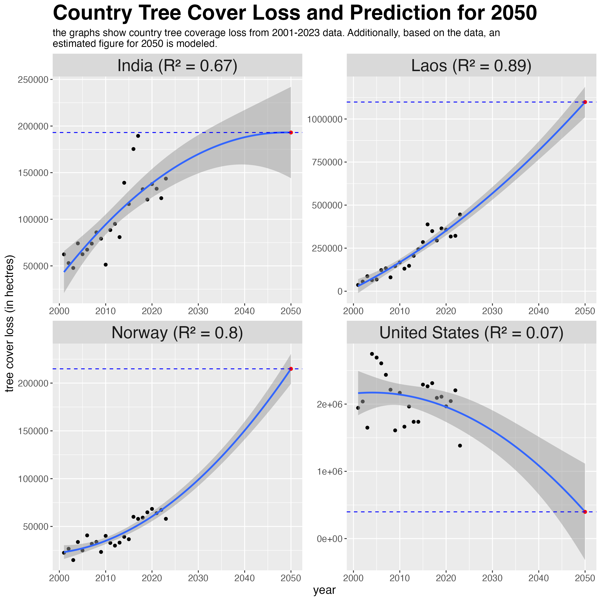
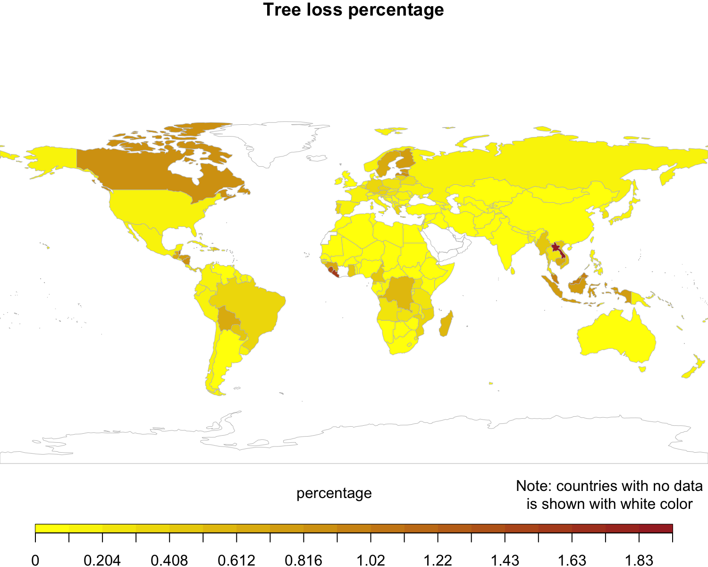

## data wrangling and manipulation

    library(readxl)
    library(tidyverse)

    setwd(dirname(rstudioapi::getActiveDocumentContext()$path))

    # ensure file is in the working dir
    file = "gfw_2023_statistics_summary_v30102024.xlsx"
                      
    # import the 2ns sheet from the .xlsx file
    df <- read_xlsx(file, sheet=2) |>
      as_tibble() %>%
      # re-arranging the data 
      filter(threshold==30) %>% # only considering the 30% threshold data %>%
      filter(rowSums(select(., starts_with("tc_loss_ha_"))) > 0) %>%
      select(
        country,
        area_ha,
        starts_with("tc_loss_ha_")
      ) 

    year_to_predict <- 2050
      
    # pivot the table to long side 
    df_pivot <- pivot_longer(df,
                             cols=starts_with("tc_loss_ha_"),
                             names_to = "year",
                             names_prefix = "tc_loss_ha_", # removes the prefix from column name
                             values_to = "tc_loss_ha") %>%
                mutate(year = as.numeric(year)) # make sure x-axis has numeric data type

    predictions <- df_pivot %>%
      group_by(country) %>%
      do({
        model <- lm(tc_loss_ha ~ poly(year, 2, raw = TRUE), data = .)  # fit a model by "year", for each country 
        data.frame(country = unique(.$country), 
                   expected_tc_ha_2050 = predict(model, data.frame(year = year_to_predict)), # create a data frame that contains the predictor from the model
                   var_expected_tc_ha_2050 = mean((resid(model))^2),
                   R_squared = summary(model)$r.squared)
      }) %>%
      ungroup() 

    # join the predicted column data to the original data sheet
    final_df <- left_join(df, predictions, by="country") 

    view(final_df)

    sample_final_df <- final_df %>% slice_sample(n=10) 

    knitr::kable(sample_final_df, format = "pipe", caption="country tree cover loss and prediction for year 2050")

<table style="width:100%;">
<caption>country tree cover loss and prediction for year 2050</caption>
<colgroup>
<col style="width: 5%" />
<col style="width: 2%" />
<col style="width: 3%" />
<col style="width: 3%" />
<col style="width: 3%" />
<col style="width: 3%" />
<col style="width: 3%" />
<col style="width: 3%" />
<col style="width: 3%" />
<col style="width: 3%" />
<col style="width: 3%" />
<col style="width: 3%" />
<col style="width: 3%" />
<col style="width: 3%" />
<col style="width: 3%" />
<col style="width: 3%" />
<col style="width: 3%" />
<col style="width: 3%" />
<col style="width: 3%" />
<col style="width: 3%" />
<col style="width: 3%" />
<col style="width: 3%" />
<col style="width: 3%" />
<col style="width: 3%" />
<col style="width: 3%" />
<col style="width: 4%" />
<col style="width: 5%" />
<col style="width: 2%" />
</colgroup>
<thead>
<tr>
<th style="text-align: left;">country</th>
<th style="text-align: right;">area_ha</th>
<th style="text-align: right;">tc_loss_ha_2001</th>
<th style="text-align: right;">tc_loss_ha_2002</th>
<th style="text-align: right;">tc_loss_ha_2003</th>
<th style="text-align: right;">tc_loss_ha_2004</th>
<th style="text-align: right;">tc_loss_ha_2005</th>
<th style="text-align: right;">tc_loss_ha_2006</th>
<th style="text-align: right;">tc_loss_ha_2007</th>
<th style="text-align: right;">tc_loss_ha_2008</th>
<th style="text-align: right;">tc_loss_ha_2009</th>
<th style="text-align: right;">tc_loss_ha_2010</th>
<th style="text-align: right;">tc_loss_ha_2011</th>
<th style="text-align: right;">tc_loss_ha_2012</th>
<th style="text-align: right;">tc_loss_ha_2013</th>
<th style="text-align: right;">tc_loss_ha_2014</th>
<th style="text-align: right;">tc_loss_ha_2015</th>
<th style="text-align: right;">tc_loss_ha_2016</th>
<th style="text-align: right;">tc_loss_ha_2017</th>
<th style="text-align: right;">tc_loss_ha_2018</th>
<th style="text-align: right;">tc_loss_ha_2019</th>
<th style="text-align: right;">tc_loss_ha_2020</th>
<th style="text-align: right;">tc_loss_ha_2021</th>
<th style="text-align: right;">tc_loss_ha_2022</th>
<th style="text-align: right;">tc_loss_ha_2023</th>
<th style="text-align: right;">expected_tc_ha_2050</th>
<th style="text-align: right;">var_expected_tc_ha_2050</th>
<th style="text-align: right;">R_squared</th>
</tr>
</thead>
<tbody>
<tr>
<td style="text-align: left;">Togo</td>
<td style="text-align: right;">5699519</td>
<td style="text-align: right;">2776</td>
<td style="text-align: right;">2021</td>
<td style="text-align: right;">2054</td>
<td style="text-align: right;">2761</td>
<td style="text-align: right;">2048</td>
<td style="text-align: right;">1688</td>
<td style="text-align: right;">3187</td>
<td style="text-align: right;">1178</td>
<td style="text-align: right;">5580</td>
<td style="text-align: right;">514</td>
<td style="text-align: right;">1256</td>
<td style="text-align: right;">1747</td>
<td style="text-align: right;">2953</td>
<td style="text-align: right;">2526</td>
<td style="text-align: right;">940</td>
<td style="text-align: right;">3464</td>
<td style="text-align: right;">7186</td>
<td style="text-align: right;">6784</td>
<td style="text-align: right;">5230</td>
<td style="text-align: right;">5507</td>
<td style="text-align: right;">5898</td>
<td style="text-align: right;">5034</td>
<td style="text-align: right;">4461</td>
<td style="text-align: right;">2.768179e+04</td>
<td style="text-align: right;">2.083773e+06</td>
<td style="text-align: right;">0.4375166</td>
</tr>
<tr>
<td style="text-align: left;">Mongolia</td>
<td style="text-align: right;">156624745</td>
<td style="text-align: right;">21057</td>
<td style="text-align: right;">18728</td>
<td style="text-align: right;">38434</td>
<td style="text-align: right;">53303</td>
<td style="text-align: right;">7467</td>
<td style="text-align: right;">13249</td>
<td style="text-align: right;">48082</td>
<td style="text-align: right;">56001</td>
<td style="text-align: right;">81793</td>
<td style="text-align: right;">8764</td>
<td style="text-align: right;">3551</td>
<td style="text-align: right;">34640</td>
<td style="text-align: right;">629</td>
<td style="text-align: right;">523</td>
<td style="text-align: right;">7145</td>
<td style="text-align: right;">4142</td>
<td style="text-align: right;">25238</td>
<td style="text-align: right;">9225</td>
<td style="text-align: right;">2815</td>
<td style="text-align: right;">465</td>
<td style="text-align: right;">187</td>
<td style="text-align: right;">103</td>
<td style="text-align: right;">839</td>
<td style="text-align: right;">-1.729730e+05</td>
<td style="text-align: right;">3.399889e+08</td>
<td style="text-align: right;">0.3074729</td>
</tr>
<tr>
<td style="text-align: left;">Åland</td>
<td style="text-align: right;">150643</td>
<td style="text-align: right;">397</td>
<td style="text-align: right;">278</td>
<td style="text-align: right;">221</td>
<td style="text-align: right;">736</td>
<td style="text-align: right;">699</td>
<td style="text-align: right;">100</td>
<td style="text-align: right;">248</td>
<td style="text-align: right;">1292</td>
<td style="text-align: right;">676</td>
<td style="text-align: right;">634</td>
<td style="text-align: right;">466</td>
<td style="text-align: right;">655</td>
<td style="text-align: right;">510</td>
<td style="text-align: right;">550</td>
<td style="text-align: right;">567</td>
<td style="text-align: right;">673</td>
<td style="text-align: right;">735</td>
<td style="text-align: right;">620</td>
<td style="text-align: right;">2361</td>
<td style="text-align: right;">673</td>
<td style="text-align: right;">1355</td>
<td style="text-align: right;">1166</td>
<td style="text-align: right;">1093</td>
<td style="text-align: right;">4.471403e+03</td>
<td style="text-align: right;">1.476482e+05</td>
<td style="text-align: right;">0.3349339</td>
</tr>
<tr>
<td style="text-align: left;">Kazakhstan</td>
<td style="text-align: right;">273053036</td>
<td style="text-align: right;">4535</td>
<td style="text-align: right;">2952</td>
<td style="text-align: right;">3352</td>
<td style="text-align: right;">5513</td>
<td style="text-align: right;">3167</td>
<td style="text-align: right;">3142</td>
<td style="text-align: right;">4605</td>
<td style="text-align: right;">4549</td>
<td style="text-align: right;">6433</td>
<td style="text-align: right;">3109</td>
<td style="text-align: right;">4852</td>
<td style="text-align: right;">3742</td>
<td style="text-align: right;">2864</td>
<td style="text-align: right;">596</td>
<td style="text-align: right;">181</td>
<td style="text-align: right;">1289</td>
<td style="text-align: right;">975</td>
<td style="text-align: right;">1139</td>
<td style="text-align: right;">1282</td>
<td style="text-align: right;">1853</td>
<td style="text-align: right;">718</td>
<td style="text-align: right;">3629</td>
<td style="text-align: right;">20112</td>
<td style="text-align: right;">6.088972e+04</td>
<td style="text-align: right;">1.253362e+07</td>
<td style="text-align: right;">0.1667436</td>
</tr>
<tr>
<td style="text-align: left;">Bermuda</td>
<td style="text-align: right;">6808</td>
<td style="text-align: right;">0</td>
<td style="text-align: right;">1</td>
<td style="text-align: right;">0</td>
<td style="text-align: right;">1</td>
<td style="text-align: right;">0</td>
<td style="text-align: right;">0</td>
<td style="text-align: right;">0</td>
<td style="text-align: right;">0</td>
<td style="text-align: right;">0</td>
<td style="text-align: right;">1</td>
<td style="text-align: right;">0</td>
<td style="text-align: right;">1</td>
<td style="text-align: right;">1</td>
<td style="text-align: right;">1</td>
<td style="text-align: right;">0</td>
<td style="text-align: right;">0</td>
<td style="text-align: right;">0</td>
<td style="text-align: right;">0</td>
<td style="text-align: right;">0</td>
<td style="text-align: right;">0</td>
<td style="text-align: right;">0</td>
<td style="text-align: right;">0</td>
<td style="text-align: right;">0</td>
<td style="text-align: right;">-3.974308e+00</td>
<td style="text-align: right;">1.702354e-01</td>
<td style="text-align: right;">0.1171123</td>
</tr>
<tr>
<td style="text-align: left;">Norway</td>
<td style="text-align: right;">32512221</td>
<td style="text-align: right;">22446</td>
<td style="text-align: right;">26636</td>
<td style="text-align: right;">14817</td>
<td style="text-align: right;">33742</td>
<td style="text-align: right;">24919</td>
<td style="text-align: right;">40649</td>
<td style="text-align: right;">31841</td>
<td style="text-align: right;">33815</td>
<td style="text-align: right;">23317</td>
<td style="text-align: right;">40129</td>
<td style="text-align: right;">32769</td>
<td style="text-align: right;">29947</td>
<td style="text-align: right;">33069</td>
<td style="text-align: right;">39149</td>
<td style="text-align: right;">36639</td>
<td style="text-align: right;">60082</td>
<td style="text-align: right;">57917</td>
<td style="text-align: right;">59220</td>
<td style="text-align: right;">64784</td>
<td style="text-align: right;">68363</td>
<td style="text-align: right;">63937</td>
<td style="text-align: right;">67306</td>
<td style="text-align: right;">57971</td>
<td style="text-align: right;">2.149072e+05</td>
<td style="text-align: right;">5.247649e+07</td>
<td style="text-align: right;">0.8007119</td>
</tr>
<tr>
<td style="text-align: left;">Saint Pierre and Miquelon</td>
<td style="text-align: right;">22663</td>
<td style="text-align: right;">0</td>
<td style="text-align: right;">0</td>
<td style="text-align: right;">0</td>
<td style="text-align: right;">0</td>
<td style="text-align: right;">0</td>
<td style="text-align: right;">0</td>
<td style="text-align: right;">0</td>
<td style="text-align: right;">0</td>
<td style="text-align: right;">0</td>
<td style="text-align: right;">0</td>
<td style="text-align: right;">0</td>
<td style="text-align: right;">0</td>
<td style="text-align: right;">5</td>
<td style="text-align: right;">1</td>
<td style="text-align: right;">0</td>
<td style="text-align: right;">0</td>
<td style="text-align: right;">0</td>
<td style="text-align: right;">0</td>
<td style="text-align: right;">0</td>
<td style="text-align: right;">1</td>
<td style="text-align: right;">0</td>
<td style="text-align: right;">0</td>
<td style="text-align: right;">0</td>
<td style="text-align: right;">-8.420949e+00</td>
<td style="text-align: right;">1.003830e+00</td>
<td style="text-align: right;">0.0716329</td>
</tr>
<tr>
<td style="text-align: left;">Croatia</td>
<td style="text-align: right;">5707840</td>
<td style="text-align: right;">3378</td>
<td style="text-align: right;">2340</td>
<td style="text-align: right;">1739</td>
<td style="text-align: right;">6727</td>
<td style="text-align: right;">2747</td>
<td style="text-align: right;">2204</td>
<td style="text-align: right;">3237</td>
<td style="text-align: right;">3891</td>
<td style="text-align: right;">2903</td>
<td style="text-align: right;">3499</td>
<td style="text-align: right;">2919</td>
<td style="text-align: right;">5004</td>
<td style="text-align: right;">2998</td>
<td style="text-align: right;">4559</td>
<td style="text-align: right;">2669</td>
<td style="text-align: right;">5373</td>
<td style="text-align: right;">5847</td>
<td style="text-align: right;">8285</td>
<td style="text-align: right;">5978</td>
<td style="text-align: right;">6052</td>
<td style="text-align: right;">5264</td>
<td style="text-align: right;">7826</td>
<td style="text-align: right;">10503</td>
<td style="text-align: right;">4.080313e+04</td>
<td style="text-align: right;">1.728629e+06</td>
<td style="text-align: right;">0.6374205</td>
</tr>
<tr>
<td style="text-align: left;">Solomon Islands</td>
<td style="text-align: right;">2853324</td>
<td style="text-align: right;">2187</td>
<td style="text-align: right;">3866</td>
<td style="text-align: right;">2375</td>
<td style="text-align: right;">3543</td>
<td style="text-align: right;">6549</td>
<td style="text-align: right;">5068</td>
<td style="text-align: right;">5665</td>
<td style="text-align: right;">8171</td>
<td style="text-align: right;">6035</td>
<td style="text-align: right;">6418</td>
<td style="text-align: right;">5861</td>
<td style="text-align: right;">8807</td>
<td style="text-align: right;">9471</td>
<td style="text-align: right;">16939</td>
<td style="text-align: right;">14970</td>
<td style="text-align: right;">17993</td>
<td style="text-align: right;">19761</td>
<td style="text-align: right;">17825</td>
<td style="text-align: right;">16550</td>
<td style="text-align: right;">14599</td>
<td style="text-align: right;">12000</td>
<td style="text-align: right;">14502</td>
<td style="text-align: right;">9578</td>
<td style="text-align: right;">-1.113664e+04</td>
<td style="text-align: right;">8.826772e+06</td>
<td style="text-align: right;">0.7040312</td>
</tr>
<tr>
<td style="text-align: left;">Iraq</td>
<td style="text-align: right;">44535865</td>
<td style="text-align: right;">16</td>
<td style="text-align: right;">11</td>
<td style="text-align: right;">20</td>
<td style="text-align: right;">4</td>
<td style="text-align: right;">5</td>
<td style="text-align: right;">6</td>
<td style="text-align: right;">10</td>
<td style="text-align: right;">18</td>
<td style="text-align: right;">16</td>
<td style="text-align: right;">13</td>
<td style="text-align: right;">3</td>
<td style="text-align: right;">9</td>
<td style="text-align: right;">3</td>
<td style="text-align: right;">1</td>
<td style="text-align: right;">0</td>
<td style="text-align: right;">0</td>
<td style="text-align: right;">1</td>
<td style="text-align: right;">0</td>
<td style="text-align: right;">0</td>
<td style="text-align: right;">0</td>
<td style="text-align: right;">0</td>
<td style="text-align: right;">0</td>
<td style="text-align: right;">3</td>
<td style="text-align: right;">-5.804348e+00</td>
<td style="text-align: right;">1.953444e+01</td>
<td style="text-align: right;">0.5382198</td>
</tr>
</tbody>
</table>

## Data Visualisation

### Prediction 2050 - model fit

    # boil down the final_df to pivot-scale for 2050 predictions
    prediction_pivot <- final_df %>%
      mutate(year=2050) %>%
      select(country, year, expected_tc_ha_2050) %>%
      rename(tc_loss_ha = expected_tc_ha_2050) %>% view()

    # prepare the pivot table including the predicted value of 2050
    df_pivot_to_2050 <- df_pivot %>%
      select(country, year, tc_loss_ha) %>%
      bind_rows(prediction_pivot) %>% 
      arrange(country, year) %>% view()

    # set labels for r2 values for plotting
    r_squared_values <- setNames(final_df$R_squared, final_df$country)

    # Function to update facet labels with R² values
    update_labels <- function(country) {
      r2 <- r_squared_values[country]
      paste0(country, " (R² = ", round(r2, 2), ")")
    }

    countries_selected <- c("Laos", "Norway", "India", "United States")

    # extract only the wanted countries from prediction table
    selected_prediction_pivot <- prediction_pivot %>% filter(country %in% countries_selected)
      
    specific_country_plot <- df_pivot_to_2050 %>%
      filter(country %in% countries_selected) %>%
      ggplot(aes(x = year, y = tc_loss_ha)) + 
      geom_point() + 
      geom_smooth(method = "lm", formula = y ~ poly(x, 2), alpha=.5) +
      geom_point(data = selected_prediction_pivot,
                 aes(x = year, y = tc_loss_ha),
                 color = "red") +
      geom_hline(data = selected_prediction_pivot,
                 aes(yintercept = tc_loss_ha), 
                 linetype = "dashed", 
                 color = "blue") +
      facet_wrap(~ country, scales = "free", nrow=2, labeller = as_labeller(update_labels)) +
      labs(
        title = "Country Tree Cover Loss and Prediction for 2050",
        x = "year",
        y = "tree cover loss (in hectres)",
        subtitle = str_wrap("the graphs show country tree coverage loss from 2001-2023 data. Additionally, based on the data, an estimated figure for 2050 is modeled.", width=100)
      ) +
      theme(
        strip.text = element_text(size = 20),
        plot.subtitle=element_text(size=12),
        plot.title=element_text(size=25, face="bold"),
        axis.title.x = element_text(size=14),
        axis.title.y = element_text(size=14),
        axis.text.x = element_text(size=11),
        axis.text.y = element_text(size=11)
      )
      

### World map

    # world map visualisation
    library(rworldmap)

    color_palette <- colorRampPalette(c("yellow", "brown"))(20)

    df_world <- df %>%
      mutate(tc_loss_ha_2023 = as.numeric(tc_loss_ha_2023)) %>%
      mutate(loss_percentage = 100 * tc_loss_ha_2023 / area_ha) %>%
      joinCountryData2Map( df,
                           joinCode = "NAME",
                           nameJoinColumn = "country" )

    ## 195 codes from your data successfully matched countries in the map
    ## 16 codes from your data failed to match with a country code in the map
    ## 48 codes from the map weren't represented in your data

    breaks_seq <- seq(min(df_world$loss_percentage, na.rm = TRUE), 
                      max(df_world$loss_percentage, na.rm = TRUE), 
                      length.out = 20)

    par(mai=c(0,0,0.2,0),xaxs="i",yaxs="i")
    mapParams<- mapCountryData(df_world,
                   nameColumnToPlot="loss_percentage",
                   mapTitle="Tree loss percentage",
                   colourPalette=color_palette,
                   numCats=100,
                   catMethod=breaks_seq,
                   addLegend=FALSE)

    do.call(addMapLegend , c( mapParams,
                              legendLabels="all",
                              legendWidth=0.5,
                              legendMar = 2 ))
    text(x = -10, y = -130, labels = "percentage", cex = 1, font = .5)
    text(x = 130, y = -130, labels = str_wrap("Note: countries with no data is shown with white color", width=30), font = 0.04)

