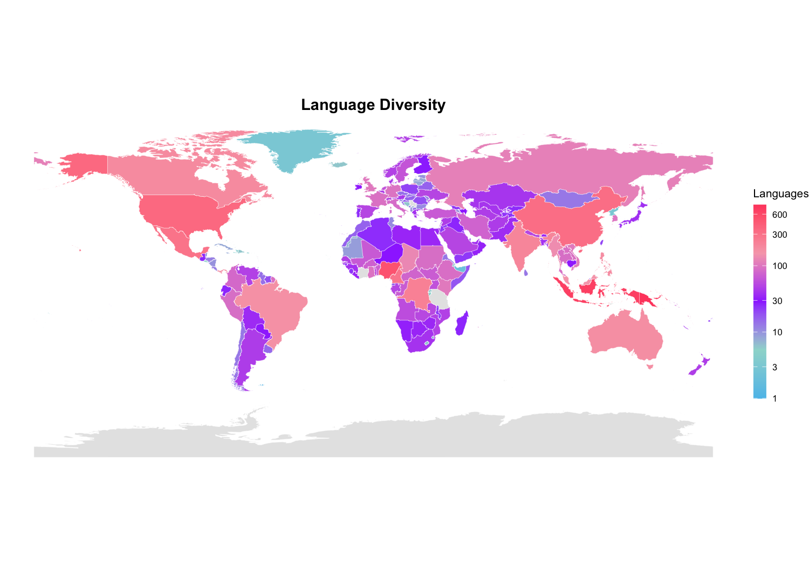
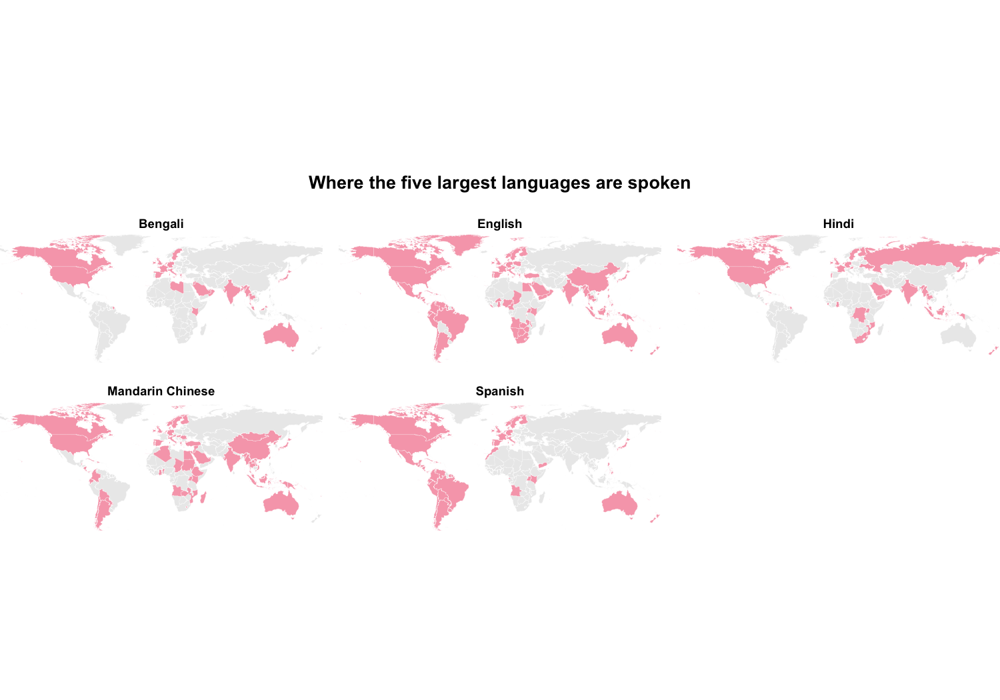
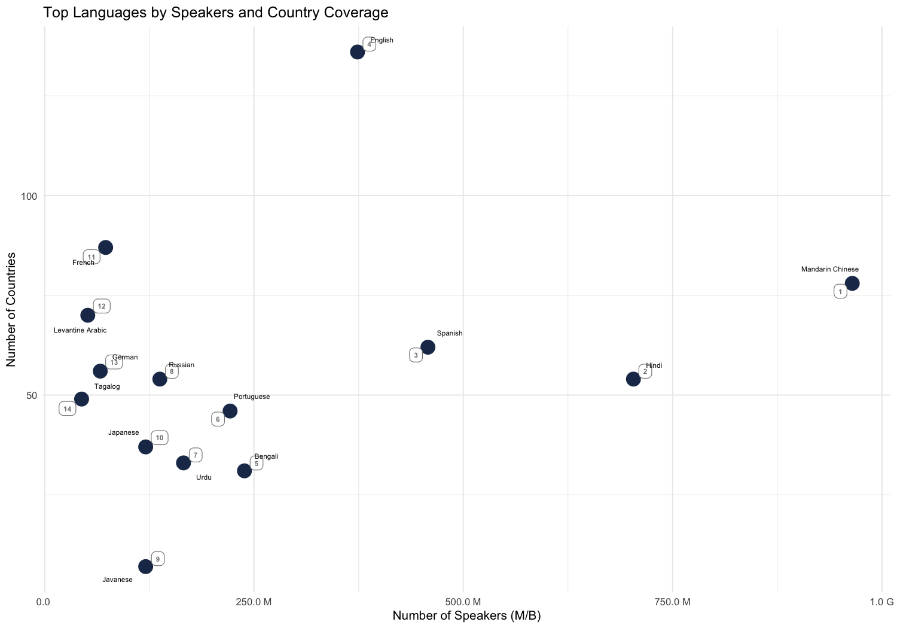
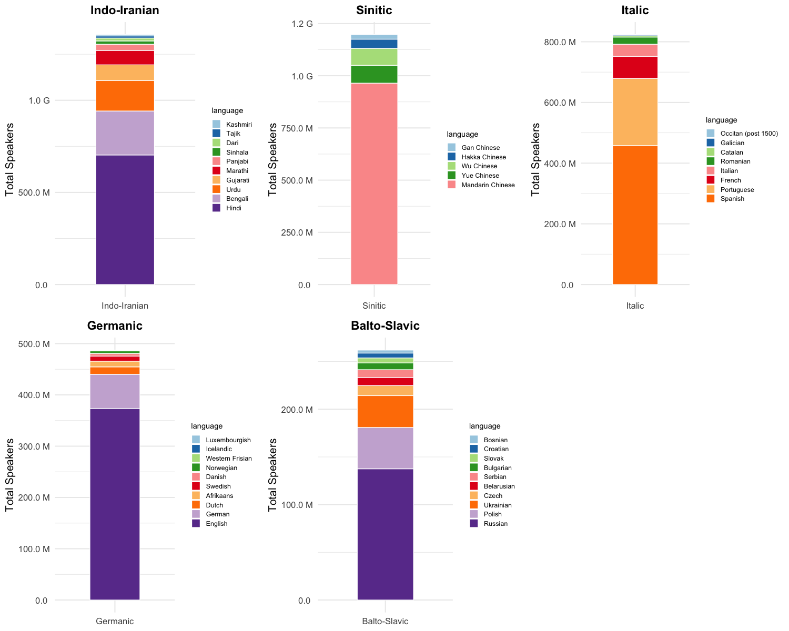

Project-Solution
================

## Clean Data

Two things have to be solved before any plot can be drawn:

1.  **Flattening.** `extract_language_entry()` pulls exactly four fields
    out of each entry and returns a one-row tibble; `map_dfr()` stacks
    them into a rectangular data frame. The `%||%` operator substitutes
    `NA` whenever a field is absent, so a missing value never silently
    drops a whole record. A language spoken in several countries
    produces several rows — this long format is what we want for
    counting and for joining to the map.
2.  **Country names.** The country strings in the JSON do not always
    match the `admin` names used by `rnaturalearth` (e.g. *“USA”* vs
    *“United States of America”*). I therefore fuzzy-match every country
    against the map’s names with the Jaro–Winkler distance and keep the
    closest candidate. The result is stored in a separate column
    `country_map_sf`, so the original value stays available for
    inspection.

``` r
# Load world map for country matching
world_basemap <- ne_countries(scale = "medium", returnclass = "sf") 
map_names <- world_basemap$admin

# Fuzzy‑match country names to map data
match_country <- function(x) {
  if (is.na(x)) return(NA)
  distances <- stringdist(x, map_names, method = "jw")
  map_names[which.min(distances)][1]
}

# Extract relevant fields from each language entry
extract_language_entry <- function(entry) {
  tibble(
    language = entry$name %||% NA_character_,
    country  = {
      ctry <- entry$speaker_count$metadata$countries
      if (is.null(ctry) || length(ctry) == 0) NA_character_
      else as.character(unlist(ctry))   
    },
    speakers = entry$speaker_count$count %||% NA_real_,
    family   = {
      path <- entry$language_history$family_tree$path
      if (!is.null(path) && length(path) >= 3) as.character(path[[3]])
      else NA_character_
    }
  )
}

# Build cleaned language dataset
language_data <- raw %>%
  map_dfr(extract_language_entry) %>%
  filter(!is.na(language)) %>%
  mutate(country_map_sf = sapply(country, match_country))

# data summary
n_rows <- nrow(language_data)
n_country_na <- sum(is.na(language_data$country))
n_speakers_na <- sum(is.na(language_data$speakers))
n_family_na <- sum(is.na(language_data$family))
```

The cleaned dataset contains 11715 rows in total.

*Missing values summary:*

- Missing country information: 980
- Missing speaker counts: 980
- Missing language family information: 9452

## Visualization

### 1. Where is the place with the most diversity (regarding languages)?

We read “diversity” as *the number of distinct languages spoken in a
country*. Because the long format contains one row per language–country
pair, a language spoken in ten countries would otherwise be counted ten
times in the same country if the source lists it repeatedly;
`distinct()` before `count()` guarantees that every language is counted
**once per country**.

``` r
# Find the 20 countries with the most languages
country_diversity <- language_data %>%
  drop_na(country_map_sf) %>%
  distinct(language, country_map_sf) %>%
  count(country_map_sf, name = "n_languages")
 
top20_country_diversity <- country_diversity %>%
  arrange(desc(n_languages)) %>%
  slice_head(n = 20)
```

**Top 20 countries by number of languages**

| Country                          | Number of languages |
|:---------------------------------|:-------------------:|
| Papua New Guinea                 |         826         |
| Indonesia                        |         687         |
| Nigeria                          |         504         |
| United States of America         |         353         |
| China                            |         315         |
| Mexico                           |         289         |
| Cameroon                         |         281         |
| Democratic Republic of the Congo |         225         |
| India                            |         209         |
| Canada                           |         185         |
| Philippines                      |         179         |
| Australia                        |         175         |
| Brazil                           |         169         |
| Panama                           |         157         |
| Malaysia                         |         154         |
| Myanmar                          |         138         |
| Chad                             |         128         |
| Russia                           |         116         |
| Vanuatu                          |         107         |
| Vietnam                          |         106         |

The counts are extremely skewed: a handful of countries host several
hundred languages while most host only a few. On a linear colour scale
everything except the top few countries would collapse into a single
shade, so we map the fill to `log10(n_languages)` and re-label the
colour bar with the original counts (1, 3, 10, … 1000). Countries with
no data keep a neutral grey, which distinguishes “no information” from
“few languages”.

``` r
# Log‑transform for color scale
country_diversity_log <- country_diversity %>%
  mutate(
    log_lang = log10(n_languages),
    log_lang = ifelse(is.infinite(log_lang), NA, log_lang)
  )


plot_diversity_map <- world_basemap %>%
  left_join(country_diversity_log, by = c("admin" = "country_map_sf")) %>%
  ggplot() +
  geom_sf(aes(fill = log_lang), color = "white", size = 0.1) +
  scale_fill_gradientn(
    colours = c("#5BC0EB", "#9DD9D2", "#9e3dff", "#F7A8B8", "#FF4D6D"),
    na.value = "grey90",
    name = "Languages",
    breaks = log10(c(1, 3, 10, 30, 100, 300, 600, 1000)),
    labels = c("1", "3", "10", "30", "100", "300", "600", "1000"),
    guide = guide_colorbar(
      barheight = 12,   
      barwidth  = 0.8,  
      title.position = "top"
    )
  ) +
  labs(title = "Language Diversity") +
  theme_void() +
  theme(
    plot.title = element_text(face = "bold", size = 14, hjust = 0.5),
    legend.position = "right",   
    legend.title = element_text(size = 10),
    legend.text  = element_text(size = 8)
  )

plot_diversity_map
```



The map shows that linguistic diversity is not evenly spread: it
concentrates in a tropical belt — Papua New Guinea, Indonesia, Nigeria,
India — whereas large, historically centralised states (Russia, most of
Europe, the Americas) are comparatively homogeneous.

### 2. How are these languages distributed?

Two different notions of “big” are worth separating: a language can have
many **speakers** (Mandarin) or be present in many **countries**
(English). I therefore summarise each language once, with both measures.
`first(speakers)` is used rather than `sum()` because the speaker count
is a *language-level* attribute that is repeated on every country row —
summing it would multiply the count by the number of countries.

``` r
# Summarize languages by total speakers and number of countries
lang_summary <- language_data %>%
  filter(!is.na(country), !is.na(speakers)) %>%
  group_by(language) %>%
  summarise(
    total_speakers = first(speakers),
    n_countries    = n_distinct(country),
    .groups        = "drop"
  )

top5_by_speakers <- lang_summary %>%
  arrange(desc(total_speakers)) %>%
  slice_head(n = 5)
```

**Top 5 languages by number of speakers**

| Language         | Total speakers | Countries |
|:-----------------|:--------------:|:---------:|
| Mandarin Chinese |   964553200    |    78     |
| Hindi            |   703211800    |    54     |
| Spanish          |   457774910    |    62     |
| English          |   373691840    |    136    |
| Bengali          |   238634300    |    31     |

To show *where* these five languages live, I join them back onto the
world map and facet by language. Each panel is a binary map (spoken /
not spoken), which makes the geographical footprints directly comparable
across panels.

``` r
top5 <- top5_by_speakers$language

spoken_pairs <- language_data %>%
  filter(language %in% top5) %>%
  distinct(language, country_map_sf) %>%
  drop_na(country_map_sf) %>%
  mutate(spoken = TRUE)

map_facets <- crossing(
    language = top5,
    admin    = world_basemap$admin
  ) %>%
  left_join(spoken_pairs, by = c("language", "admin" = "country_map_sf")) %>%
  mutate(spoken = !is.na(spoken))

world_basemap %>%
  filter(admin != "Antarctica") %>%          
  left_join(map_facets, by = "admin") %>%   
  ggplot() +
  geom_sf(aes(fill = spoken), color = "white", linewidth = 0.05) +
  scale_fill_manual(
    values = c("TRUE" = "#F7A8B8", "FALSE" = "grey92"),
    guide  = "none"
  ) +
  coord_sf(ylim = c(-56, 84), expand = FALSE) +   # 裁掉上下空白
  facet_wrap(~ language, ncol = 3) +
  labs(title = "Where the five largest languages are spoken") +
  theme_void(base_size = 10) +
  theme(
    plot.title    = element_text(face = "bold", size = 13, hjust = 0.5, margin = margin(t = 5, b = 14) ),
    strip.text    = element_text(face = "bold", size = 9, margin = margin(t = 4, b = 4)),
    panel.spacing = unit(0.8, "lines")
  )
```



``` r
# Remove NA or 0 country counts
lang_summary_clean <- lang_summary %>%
  filter(
    !is.na(total_speakers),
    !is.na(n_countries),
    n_countries > 0
  )

# 10 most spoken
top10_speakers <- lang_summary_clean %>%
  arrange(desc(total_speakers)) %>%
  slice(1:10)

# 10 most wide-spread
top10_countries <- lang_summary_clean %>%
  arrange(desc(n_countries)) %>%
  slice(1:10)

selected_langs <- top10_speakers %>%
  bind_rows(top10_countries) %>%
  distinct(language, .keep_all = TRUE) %>%
  mutate(label_id = row_number())

plot_q2_2 <- ggplot(selected_langs, aes(
  x = total_speakers,
  y = n_countries
)) +
  geom_point(size = 5, color = "#1D3557") +

  # number labels
  geom_label_repel(
    aes(label = label_id),
    size = 2,
    color = "grey50",
   
    fontface = "bold",
    label.size = 0.3,
    label.r = unit(0.25, "lines"),
    box.padding = 0.2,       
    point.padding = 0.1
  ) +

  # language labels
  geom_text_repel(
    aes(label = language),
    size = 2,
    color = "black",
    box.padding = 0.6,       
    point.padding = 0.4,
    segment.color = "grey50"
  ) +

  scale_x_continuous(labels = function(x) format_million_billion(x)) +
  labs(
    title = "Top Languages by Speakers and Country Coverage",
    x = "Number of Speakers (M/B)",
    y = "Number of Countries"
  ) +
  theme_minimal(base_size = 10)

plot_q2_2
```


\### 3. Languages and language families with the most speakers

A language family aggregates its languages, so its speaker total is the
sum over its members. The `distinct(language, speakers, family)` step is
essential: without it, a language listed for 20 countries would
contribute its speaker count 20 times and inflate its family.

``` r
# Keep one row per language to avoid double‑counting speakers
lang_by_family <- language_data %>%
  filter(!is.na(speakers), !is.na(family)) %>%
  distinct(language, speakers, family)

# Compute total speakers per language family
family_summary <- lang_by_family %>%
  group_by(family) %>%
  summarise(total_speakers = sum(speakers), .groups = "drop") %>%
  arrange(desc(total_speakers))

top5_families <- family_summary %>% slice_head(n = 5) %>% pull(family)
```

**Top 5 language families by number of speakers**

| Language family | Total speakers |
|:----------------|:--------------:|
| Indo-Iranian    |   1357864800   |
| Sinitic         |   1197272500   |
| Italic          |   823744970    |
| Germanic        |   487451040    |
| Balto-Slavic    |   268649810    |

For each of these five families we draw a stacked bar of its ten largest
languages. The stacking shows two things at once: the **height** is the
family total, the **segments** show how that total is composed — whether
the family is dominated by one giant language or spread over several
mid-sized ones. Because the same plot is needed five times, it is
written once as a function and mapped over the families (`purrr::map`),
then arranged in a grid.

``` r
# Plot top‑10 languages within a family using a unified blue gradient palette
plot_family_bar <- function(fam_name) {
  lang_by_family %>%
    filter(family == fam_name) %>%
    slice_max(speakers, n = 10) %>%
    mutate(language = fct_reorder(language, speakers)) %>%
    
    ggplot(aes(x = fam_name, y = speakers, fill = language)) +
    geom_col(width = 0.5, color = "white", linewidth = 0.3) +
    scale_y_continuous(labels = format_million_billion) +
    scale_fill_brewer(palette = "Paired") +
    labs(
      title = fam_name,
      x = NULL,
      y = "Total Speakers"
    ) +
    theme_minimal(base_size = 10) +
    theme(
      plot.title = element_text(face = "bold", size = 11, hjust = 0.5,
                                 margin = margin(b = 5)),
      legend.key.size = unit(0.3, "cm"),
      legend.text = element_text(size = 6),
      legend.title = element_text(size = 7)
    )
}


family_plots <- purrr::map(top5_families, plot_family_bar)

big_family_plot <- grid.arrange(
  grobs = family_plots,
  ncol = 3
)
```



# Data Source & License

This project uses the [World Languages
dataset](https://huggingface.co/datasets/lukeslp/world-languages) by
lukeslp, licensed under the MIT License. See `license.txt` in this
repository for the full license text.
