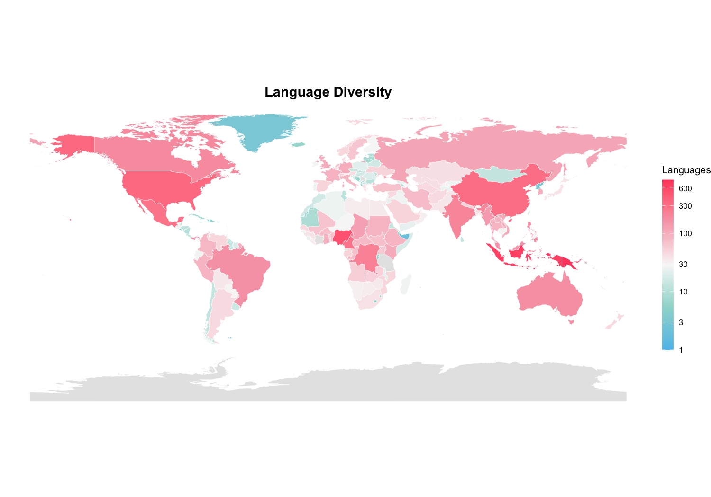
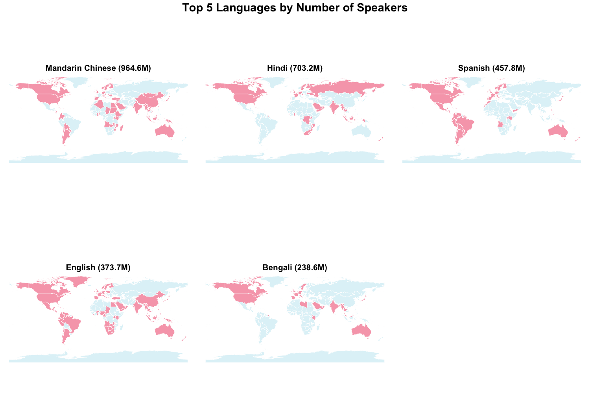
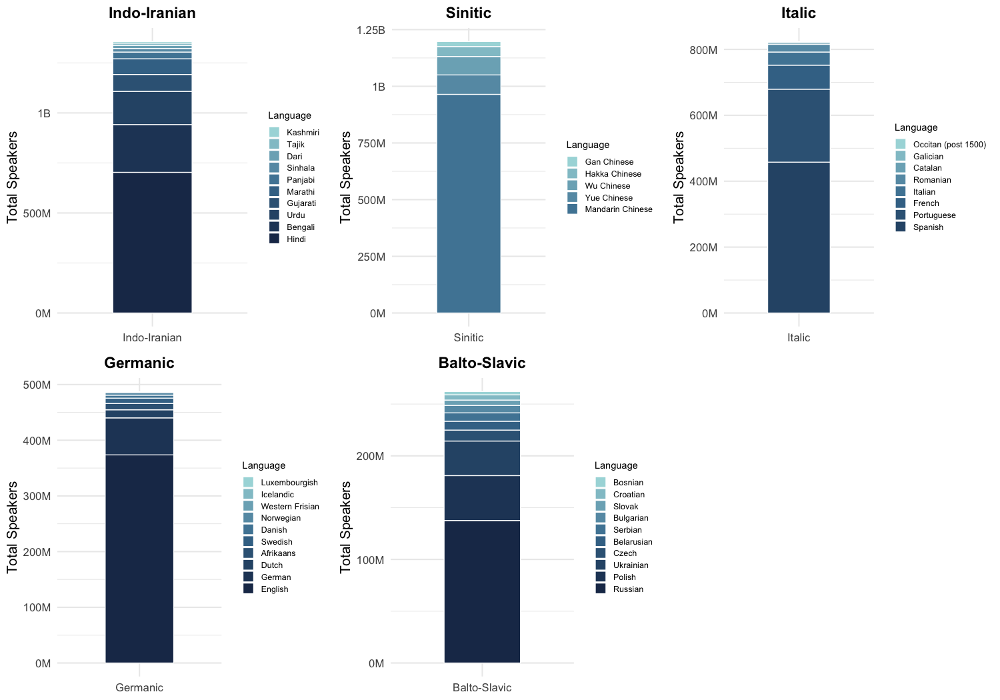

Project-Solution
================

``` r
#figure size
knitr::opts_chunk$set(
  fig.width = 10,
  fig.height = 7,
  dpi = 150,
  out.width = "100%"
)

# transfer speaker counts in millions/billions
format_million_billion <- function(x) {
  sapply(x, function(v) {
    if (is.na(v)) return(NA_character_)
    if (v >= 1e9) {
      paste0(round(v / 1e9, 2), "B")
    } else {
      paste0(round(v / 1e6, 1), "M")
    }
  })
}


library(tidyverse)
```

    ## ── Attaching core tidyverse packages ──────────────────────── tidyverse 2.0.0 ──
    ## ✔ dplyr     1.2.0     ✔ readr     2.2.0
    ## ✔ forcats   1.0.1     ✔ stringr   1.6.0
    ## ✔ ggplot2   4.0.2     ✔ tibble    3.3.1
    ## ✔ lubridate 1.9.5     ✔ tidyr     1.3.2
    ## ✔ purrr     1.2.1     
    ## ── Conflicts ────────────────────────────────────────── tidyverse_conflicts() ──
    ## ✖ dplyr::filter() masks stats::filter()
    ## ✖ dplyr::lag()    masks stats::lag()
    ## ℹ Use the conflicted package (<http://conflicted.r-lib.org/>) to force all conflicts to become errors

``` r
library(jsonlite)
```

    ## 
    ## Attaching package: 'jsonlite'
    ## 
    ## The following object is masked from 'package:purrr':
    ## 
    ##     flatten

``` r
library(ggrepel)
library(scales)
```

    ## 
    ## Attaching package: 'scales'
    ## 
    ## The following object is masked from 'package:purrr':
    ## 
    ##     discard
    ## 
    ## The following object is masked from 'package:readr':
    ## 
    ##     col_factor

``` r
library(gridExtra)
```

    ## 
    ## Attaching package: 'gridExtra'
    ## 
    ## The following object is masked from 'package:dplyr':
    ## 
    ##     combine

``` r
library(rnaturalearth)
library(rnaturalearthdata)
```

    ## 
    ## Attaching package: 'rnaturalearthdata'
    ## 
    ## The following object is masked from 'package:rnaturalearth':
    ## 
    ##     countries110

``` r
library(stringdist)
```

    ## 
    ## Attaching package: 'stringdist'
    ## 
    ## The following object is masked from 'package:tidyr':
    ## 
    ##     extract

``` r
library(purrr)
library(grid)
library(ggplot2)
```

``` r
raw <- jsonlite::fromJSON("world_languages_integrated.json", simplifyVector = FALSE)
```

``` r
# ============================================================
# Clean Data
# ============================================================

# Load world map for country matching
world_basemap <- ne_countries(scale = "medium", returnclass = "sf") 
map_names <- world_basemap$admin

# Extract relevant fields from each language entry
extract_language_entry <- function(entry) {
  tibble(
    language = entry$name %||% NA_character_,
    country  = {
      ctry <- entry$speaker_count$metadata$countries
      if (is.null(ctry) || length(ctry) == 0) NA_character_
      else as.character(unlist(ctry))   
    },
    speakers = entry$speaker_count$count %||% NA_real_,
    family   = {
      path <- entry$language_history$family_tree$path
      if (!is.null(path) && length(path) >= 3) as.character(path[[3]])
      else NA_character_
    }
  )
}

# Build cleaned language dataset
language_data <- raw %>%
  map_dfr(extract_language_entry) %>%
  filter(!is.na(language))

# Fuzzy‑match country names to map data
match_country <- function(x) {
  if (is.na(x)) return(NA)
  distances <- stringdist(x, map_names, method = "jw")
  map_names[which.min(distances)]
}


language_data <- language_data %>%
  mutate(country_map_sf = sapply(country, match_country))


cat(sprintf(
  "rows: %d | country NA: %d | speakers NA: %d | family NA: %d\n",
  nrow(language_data),
  sum(is.na(language_data$country)),
  sum(is.na(language_data$speakers)),
  sum(is.na(language_data$family))
))
```

    ## rows: 11715 | country NA: 980 | speakers NA: 980 | family NA: 9452

``` r
# ============================================================
# 1. Where is the place with the most diversity (regarding languages)?
# ============================================================
 
# Find the 20 countries with the most languages
country_diversity <- language_data %>%
  filter(!is.na(country_map_sf)) %>%
  distinct(language, country_map_sf) %>%
  count(country_map_sf, name = "n_languages") 
 
print(slice_head(country_diversity, n = 20), n = 20)
```

    ## # A tibble: 20 × 2
    ##    country_map_sf      n_languages
    ##    <chr>                     <int>
    ##  1 Afghanistan                  45
    ##  2 Albania                      10
    ##  3 Algeria                      25
    ##  4 American Samoa                7
    ##  5 Andorra                       9
    ##  6 Angola                       56
    ##  7 Anguilla                      3
    ##  8 Antigua and Barbuda           2
    ##  9 Argentina                    45
    ## 10 Armenia                      10
    ## 11 Aruba                         8
    ## 12 Australia                   175
    ## 13 Austria                      43
    ## 14 Azerbaijan                   29
    ## 15 Bahrain                      17
    ## 16 Bangladesh                   39
    ## 17 Barbados                      2
    ## 18 Belarus                      16
    ## 19 Belgium                      46
    ## 20 Belize                       11

``` r
# Log‑transform for color scale
country_diversity_log <- country_diversity %>%
  mutate(
    log_lang = log10(n_languages),
    log_lang = ifelse(is.infinite(log_lang), NA, log_lang)
  )


plot_diversity_map <- world_basemap %>%
  left_join(country_diversity_log, by = c("admin" = "country_map_sf")) %>%
  ggplot() +
  geom_sf(aes(fill = log_lang), color = "white", size = 0.1) +
  scale_fill_gradientn(
    colours = c("#5BC0EB", "#9DD9D2", "#F7F7F7", "#F7A8B8", "#FF4D6D"),
    na.value = "grey90",
    name = "Languages",
    breaks = log10(c(1, 3, 10, 30, 100, 300, 600, 1000)),
    labels = c("1", "3", "10", "30", "100", "300", "600", "1000"),
    guide = guide_colorbar(
      barheight = 12,   
      barwidth  = 0.8,  
      title.position = "top"
    )
  ) +
  labs(title = "Language Diversity") +
  theme_void() +
  theme(
    plot.title = element_text(face = "bold", size = 14, hjust = 0.5),
    legend.position = "right",   
    legend.title = element_text(size = 10),
    legend.text  = element_text(size = 8)
  )

plot_diversity_map
```



``` r
# ============================================================
# 2. How are these languages distributed?
# ============================================================
 
# Summarize languages by total speakers and number of countries
lang_summary <- language_data %>%
  filter(!is.na(country), !is.na(speakers)) %>%
  group_by(language) %>%
  summarise(
    total_speakers = first(speakers),
    n_countries    = n_distinct(country),
    .groups        = "drop"
  )

# Top 5 
top5_by_speakers <- lang_summary %>% slice_max(total_speakers, n = 5)

print(top5_by_speakers)
```

    ## # A tibble: 5 × 3
    ##   language         total_speakers n_countries
    ##   <chr>                     <dbl>       <int>
    ## 1 Mandarin Chinese      964553200          78
    ## 2 Hindi                 703211800          54
    ## 3 Spanish               457774910          62
    ## 4 English               373691840         136
    ## 5 Bengali               238634300          31

``` r
# Plot world map showing where a given language is spoken
plot_language_map <- function(lang_name) {

  # Retrieve speaker count from top‑5 table
  total_speakers <- top5_by_speakers %>%
    filter(language %in% lang_name) %>%
    pull(total_speakers)
  
  total_label <- format_million_billion(total_speakers)

 # Countries where the language is spoken
  spoken_regions <- language_data %>%
    filter(language %in% lang_name) %>%
    pull(country_map_sf)

  world_basemap %>%
    mutate(spoken = admin %in% spoken_regions) %>%
    ggplot() +
    geom_sf(aes(fill = spoken), color = "white", size = 0.1) +
    scale_fill_manual(
      values = c("TRUE" = "#F7A8B8", "FALSE" = "#e0f3f8")
    ) +
    labs(
      title = paste0(lang_name, " (", total_label, ")")
    ) +
    theme_void() +
    theme(
      plot.title = element_text(face = "bold", size = 10, hjust = 0.5),
      legend.position = "none"
    )
}

plots <- purrr::map(top5_by_speakers$language, plot_language_map)


big_plot <- grid.arrange(
  grobs = plots,
  ncol = 3,
  top = textGrob(
    "Top 5 Languages by Number of Speakers",
    gp = gpar(fontsize = 14, fontface = "bold")
  )
)
```



``` r
# Remove NA or 0 country counts
lang_summary_clean <- lang_summary %>%
  filter(
    !is.na(total_speakers),
    !is.na(n_countries),
    n_countries > 0
  )

# 10 most spoken
top10_speakers <- lang_summary_clean %>%
  arrange(desc(total_speakers)) %>%
  slice(1:10)

# 10 most wide-spread
top10_countries <- lang_summary_clean %>%
  arrange(desc(n_countries)) %>%
  slice(1:10)

# combine
selected_langs <- bind_rows(top10_speakers, top10_countries) %>%
  distinct(language, .keep_all = TRUE)


selected_langs <- selected_langs %>%
  mutate(label_id = row_number())

plot_q2_2 <- ggplot(selected_langs, aes(
  x = total_speakers,
  y = n_countries
)) +
  geom_point(size = 5, color = "#1D3557") +

  # number labels
  geom_label_repel(
    aes(label = label_id),
    size = 2,
    color = "grey50",
   
    fontface = "bold",
    label.size = 0.3,
    label.r = unit(0.25, "lines"),
    box.padding = 0.2,       
    point.padding = 0.1
  ) +

  # language labels
  geom_text_repel(
    aes(label = language),
    size = 2,
    color = "black",
    box.padding = 0.6,       
    point.padding = 0.4,
    segment.color = "grey50"
  ) +

  scale_x_continuous(labels = function(x) format_million_billion(x)) +
  labs(
    title = "Top Languages by Speakers and Country Coverage",
    x = "Number of Speakers (M/B)",
    y = "Number of Countries"
  ) +
  theme_minimal(base_size = 10)

plot_q2_2
```


``` r
# ============================================================
# 3. Languages and language families with the most speakers
# ============================================================

# Keep one row per language to avoid double‑counting speakers
lang_by_family <- language_data %>%
  filter(!is.na(speakers), !is.na(family)) %>%
  distinct(language, speakers, family)

# Compute total speakers per language family
family_summary <- lang_by_family %>%
  group_by(family) %>%
  summarise(total_speakers = sum(speakers), .groups = "drop") %>%
  arrange(desc(total_speakers))

cat("Top 10 language families by speakers:\n")
```

    ## Top 10 language families by speakers:

``` r
print(slice_head(family_summary, n = 10))
```

    ## # A tibble: 10 × 2
    ##    family            total_speakers
    ##    <chr>                      <dbl>
    ##  1 Indo-Iranian          1357864800
    ##  2 Sinitic               1197272500
    ##  3 Italic                 823744970
    ##  4 Germanic               487451040
    ##  5 Balto-Slavic           268649810
    ##  6 Malayo-Polynesian      246002270
    ##  7 Atlantic-Congo         176053500
    ##  8 Japanese               120668000
    ##  9 Mon-Khmer              108931700
    ## 10 Korean                  80144200

``` r
# Plot top‑10 languages within a family using a unified blue gradient palette
plot_family_bar <- function(fam_name) {
  lang_by_family %>%
    filter(family == fam_name) %>%
    slice_max(speakers, n = 10) %>%
    mutate(language = fct_reorder(language, speakers)) %>%
    ggplot(aes(x = fam_name, y = speakers, fill = language)) +
    geom_col(width = 0.5, color = "white", linewidth = 0.3) +
    scale_y_continuous(labels = format_million_billion) +
    scale_fill_manual(
      values = colorRampPalette(c("#A8DADC", "#457B9D", "#1D3557"))(10),
      name = "Language"
    ) +
    labs(
      title = fam_name,
      x = NULL,
      y = "Total Speakers"
    ) +
    theme_minimal(base_size = 10) +
    theme(
      plot.title = element_text(face = "bold", size = 11, hjust = 0.5,
                                 margin = margin(b = 5)),
      legend.key.size = unit(0.3, "cm"),
      legend.text = element_text(size = 6),
      legend.title = element_text(size = 7)
    )
}

top5_families <- family_summary %>% slice_head(n = 5) %>% pull(family)

family_plots <- purrr::map(top5_families, plot_family_bar)

big_family_plot <- grid.arrange(
  grobs = family_plots,
  ncol = 3
)
```



## Data Source & License

This project uses the [World Languages
dataset](https://huggingface.co/datasets/lukeslp/world-languages) by
lukeslp, licensed under the MIT License. See `license.txt` in this
repository for the full license text.
