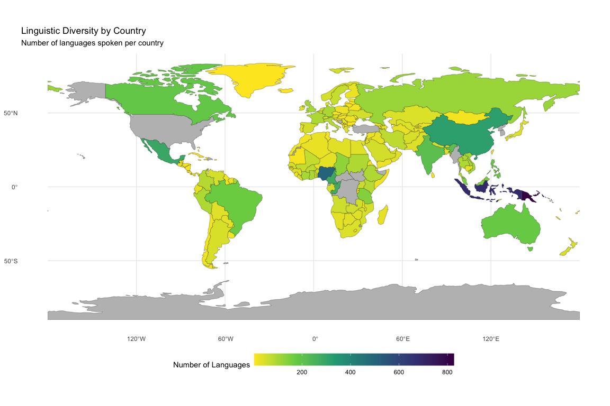
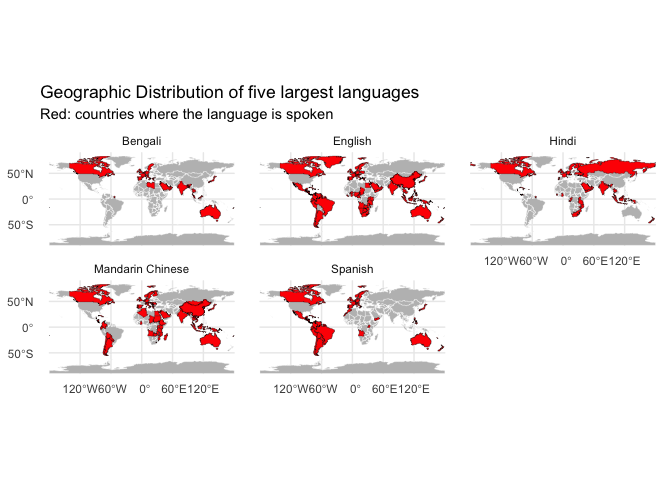
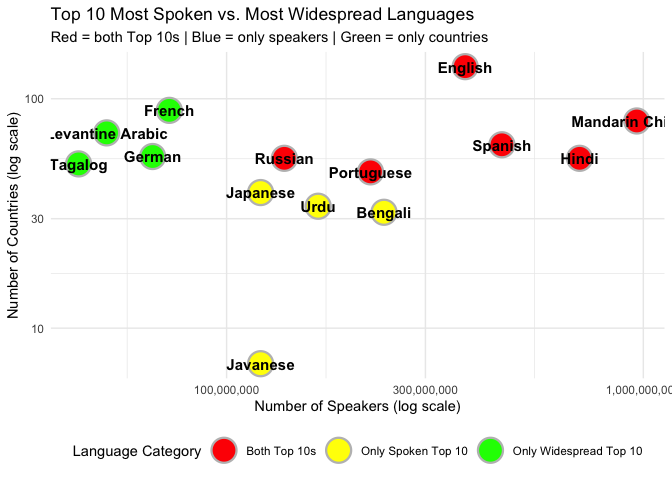
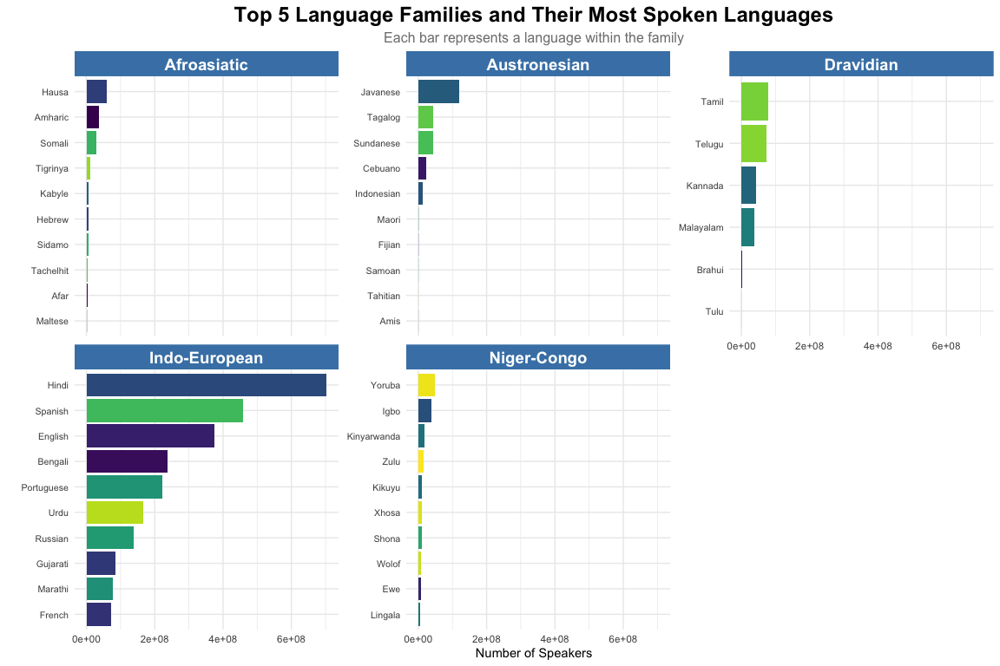

Calculating the number of languages spoken in each country:

    ## # A tibble: 241 × 2
    ##    speaking_country       language_count
    ##    <chr>                           <int>
    ##  1 Papua New Guinea                  826
    ##  2 Indonesia                         687
    ##  3 Nigeria                           504
    ##  4 United States                     353
    ##  5 China                             315
    ##  6 Mexico                            289
    ##  7 Cameroon                          281
    ##  8 Congo                             278
    ##  9 Democratic Republic of            225
    ## 10 India                             209
    ## # ℹ 231 more rows

Plot1: showing linguistic diversity per countries

Plot2.1 showing geographic distribution of five largest languages

Top-5 language\_families:

    ## # A tibble: 5 × 2
    ##   family             count
    ##   <chr>              <dbl>
    ## 1 Indo-European 2908859120
    ## 2 Austronesian   246194270
    ## 3 Dravidian      235339900
    ## 4 Niger-Congo    169907800
    ## 5 Afroasiatic    163248090

Top 5 Language Families and Their Most Spoken Languages:

\# Data attribution: \# This dataset is
`world_languages_integrated.json` by Luke Steuber (MIT License) \# Data
sources: \# 1. Glottolog 5.0 (Max Planck Institute for Evolutionary
Anthropology) <https://glottolog.org/> \# Geographic coordinates,
language family classification, glottocodes, and macroareas (License:
CC-BY-4.0) <https://creativecommons.org/licenses/by/4.0/> \# 2. Joshua
Project <https://joshuaproject.net/> \# Speaker population aggregates,
Bible translation status, and religion data

# Full license information <https://huggingface.co/datasets/lukeslp/world-languages/blob/main/LICENSE.md>

# This project is not for commercial purposes but for educational purposes only.
