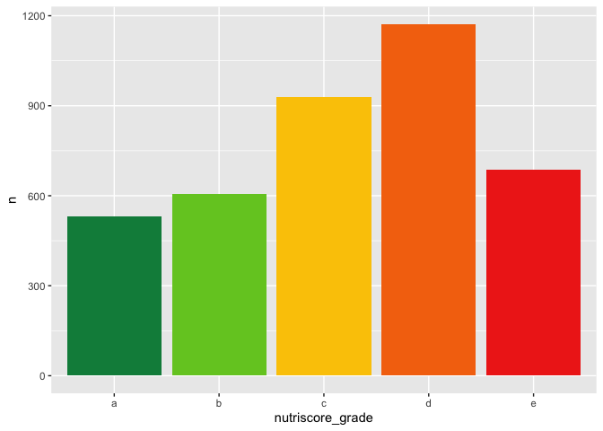
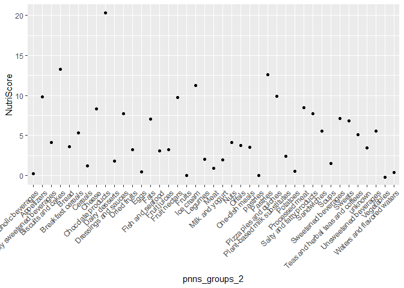
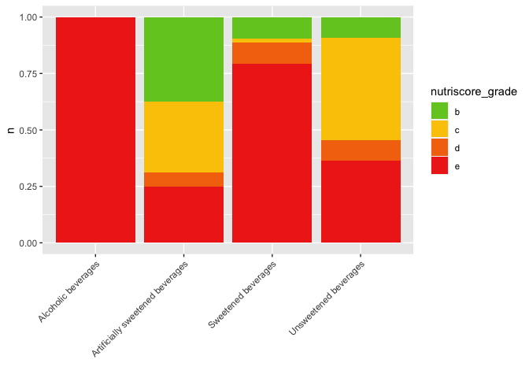
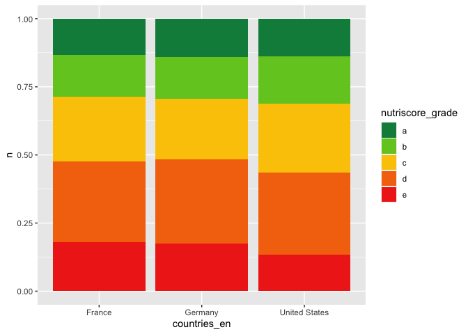

## Nutriscore project

The data set was quite a mess so data preparation took quite a lot of
time. I used the fread() function to import the data sets. I only
imported two out of five data sets. The second data set didn’t have
column names so I added the column names of the first data set to the
second and merged the two tables. Then I did a pipe to delete all
columns except of those which I needed. So the table shrank from 201
variable to 13. Then I dropped all rows from Nestle.

As a first overview we want to see what the distribution of the
nutriscore is.

We wanted to see the mean nutriscore for each food category

Then we are interessted in beverages therefore we check how the
nutriscore is distributed by different beverage categories.

Then I wanted to know if the distribution of the nutriscore is different
between the countries. But it seems that the proportion in all 4
countries are similar.

