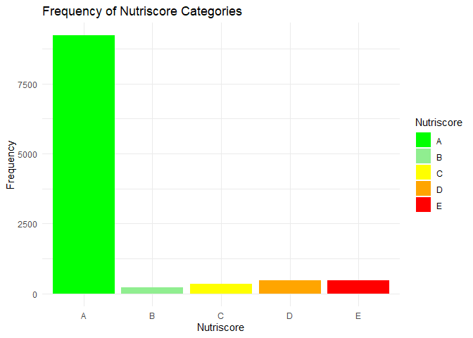

## R Markdown

    library(readr)
    library(ggplot2)

    setwd("C:/Users/Pleasant Pillai/Desktop/R Programming/R2/Advanced-data-processing-with-R/Projects/DanielaKemp")

    # Read the output.csv file
    output_data <- read_csv("output.csv")

    ## New names:
    ## • `` -> `...201`

    ## Warning: One or more parsing issues, call `problems()` on your data frame for details,
    ## e.g.:
    ##   dat <- vroom(...)
    ##   problems(dat)

    ## Rows: 24999 Columns: 201
    ## ── Column specification ────────────────────────────────────────────────────────
    ## Delimiter: ","
    ## chr (81): code, url, creator, created_t, created_datetime, last_modified_t, ...
    ## dbl (97): no_nutrition_data, additives_tags, ecoscore_grade, owner, energy-k...
    ## lgl (23): caproic-acid_100g, caprylic-acid_100g, capric-acid_100g, lauric-ac...
    ## 
    ## ℹ Use `spec()` to retrieve the full column specification for this data.
    ## ℹ Specify the column types or set `show_col_types = FALSE` to quiet this message.

    # Define the Nutriscore categories
    nutriscore_categories <- c("A", "B", "C", "D", "E")

    # Create a function to map Nutriscore labels
    map_nutriscore_label <- function(label) {
      if (grepl("A", label, ignore.case = TRUE)) {
        return("A")
      } else if (grepl("B", label, ignore.case = TRUE)) {
        return("B")
      } else if (grepl("C", label, ignore.case = TRUE)) {
        return("C")
      } else if (grepl("D", label, ignore.case = TRUE)) {
        return("D")
      } else if (grepl("E", label, ignore.case = TRUE)) {
        return("E")
      } else {
        return(NA)
      }
    }

    # Apply the mapping function to create Nutriscore category column
    output_data$nutriscore_category <- sapply(output_data$labels, map_nutriscore_label)
    output_data$nutriscore_category[is.na(output_data$nutriscore_category)] <- sapply(output_data$emb_codes, map_nutriscore_label)

    ## Warning in
    ## output_data$nutriscore_category[is.na(output_data$nutriscore_category)] <-
    ## sapply(output_data$emb_codes, : number of items to replace is not a multiple of
    ## replacement length

    # Remove NA values in nutriscore_category
    output_data <- output_data[complete.cases(output_data$nutriscore_category), ]

    # Count the frequency of Nutriscore categories
    nutriscore_counts <- table(output_data$nutriscore_category)

    # Order the counts based on the Nutriscore categories
    nutriscore_counts <- nutriscore_counts[nutriscore_categories]

    # Create a data frame for plotting
    plot_data <- data.frame(Nutriscore = nutriscore_categories, Frequency = as.numeric(nutriscore_counts))

    # Define colors for the bars
    colors <- c("A" = "green", "B" = "lightgreen", "C" = "yellow", "D" = "orange", "E" = "red")

    # Create the bar plot
    bar_plot <- ggplot(plot_data, aes(x = Nutriscore, y = Frequency, fill = Nutriscore)) +
      geom_bar(stat = "identity") +
      scale_fill_manual(values = colors) +
      labs(x = "Nutriscore", y = "Frequency", title = "Frequency of Nutriscore Categories") +
      theme_minimal()

    # Display the bar plot
    print(bar_plot)

