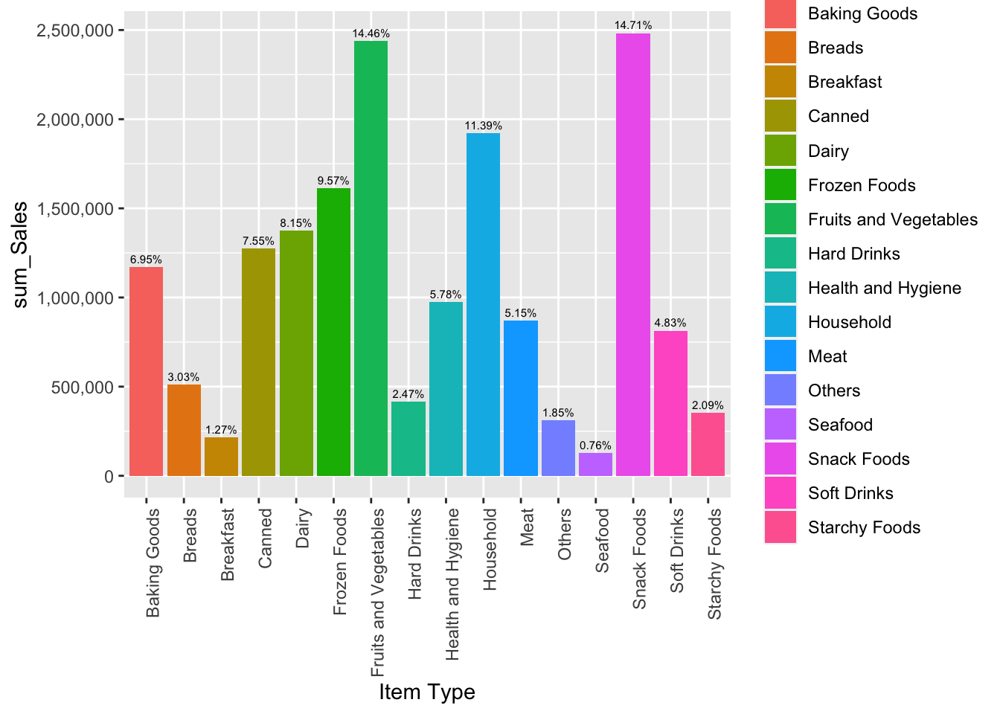
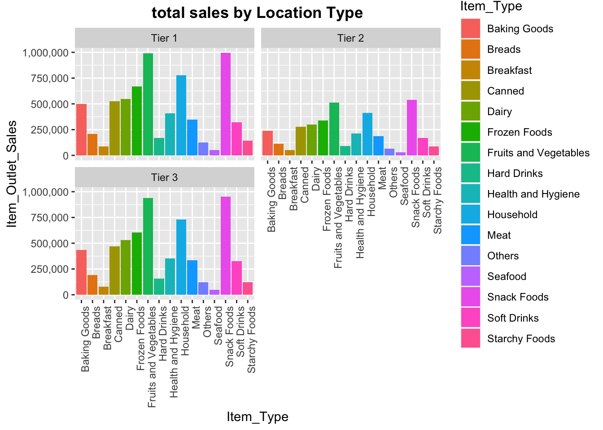

# Marketing analysis of Bigmart sales

## Project Description

Big Mart is Grocery Super Market Brand. Grocery stores house thousands
of products that you can find in many different locations and sizes.
When considering their marketing, grocery stores can analyze different
variables to see what products need to be promoted or offered discounts
on. The BigMart dataset provides 14204 observations and 12
variables.These variables include weight, fat content, visibility, item
type, location, and more. It also includes over 1,500 products across 10
different stores. The [dataset](data.csv) can be downloaded on kaggle
<https://www.kaggle.com/datasets/thedevastator/bigmart-product-sales-factors>

## Current Data

The Dataset has the following attributes:

-   `Item_Identifier` ID for every Item
    

-   `Item_Weight` is the weight of the product in kilograms. *(Numeric)*
    

-   `Item_Fat_Content` is the fat content of the product.
    *(Categorical)*
    

-   `Item_Visibility` is the visibility of the product in store or
    online. *(Numeric)*
    

-   `Item_Type` is the type of product, such as limited offers or no
    offer. *(Categorical)*
    

-   `Item_MRP` is the maximum retail price of the product. *(Numeric)*
    

-   `Outlet_Establishment_Year` is the year the outlet was established.
    *(Numeric)*
    

-   `Outlet_Size` is the size of the outlet, either retail or
    supermarket. *(Categorical)*
    

-   `Outlet_Location_Type` is the type of location of the outlet, such
    as urban or rural area. *(Categorical)*
    

-   `Outlet_Type` is the type of outlet, such as sales departmental
    store or supermarket. *(Categorical)*
    

-   `Item_Outlet_Sales` is the sales of the product in the outlet.
    *(Numeric)*
    

## Goal

My aim is to evaluate the effects of the variables on purchasing
behavior.

First of all I need to **clean the data**. There are many missing values
that needed to be converted to NA values. A decision must also be made
on what to do with the N/A values in the corresponding categories. I
have decided to drop all observations with N/A if they become relevant.

After the Data Cleaning I would like to answer the following questions
by **creating charts with ggplot**:

**1. Which products are sold the most?**

To answer this question I want to create a bar chart that shows the sum
of all sales by item category. In addition, I want to show the relative
share as a number above each bar. Also I would like to create a chart
total revenue by item category.

*Example to illustrate*

**2. Does this effect differ according to location, size, type of
supermarket?**

To figure this out, I would like to create the same plot from 1.
Separated by the attribute’s location, size and type of supermarket. To
really see the effect of the attributes, it is important to divide the
total sum of sales by the number of stores. Using location type as an
example, I would then have a plot showing total sales/number of stores
for location type (tier 1, tier 2 & tier 3) split by item category. I
would like to create these plots to show the influence of location, size
and type of supermarket on sales. For example, “Does a Tier 1 location
increases sales?”. I also want to create the same plots with
revenue/number of stores on the y-axis.

*Example to illustrate*

