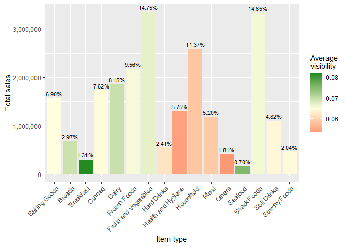
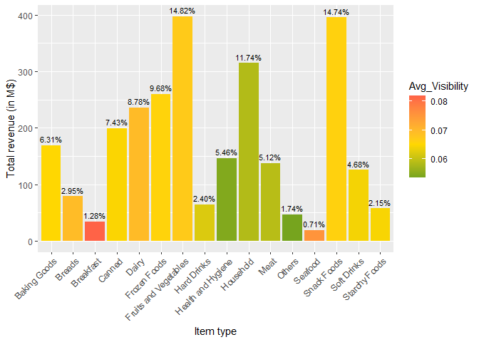
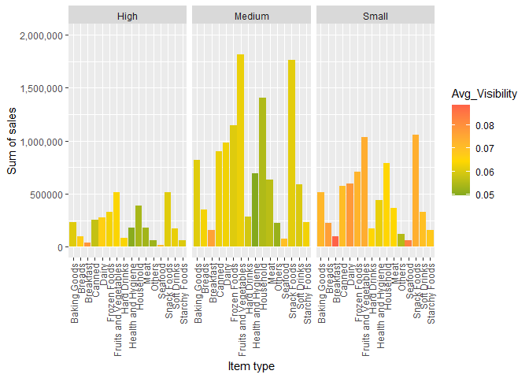
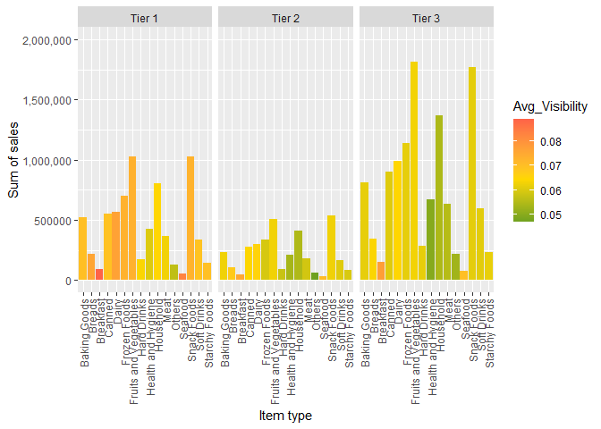
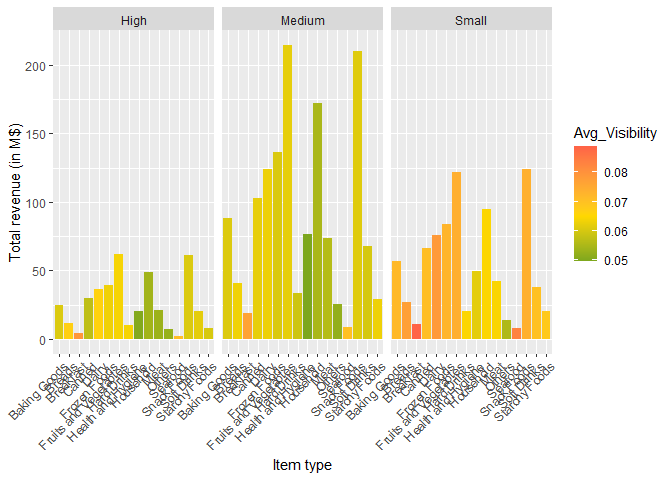
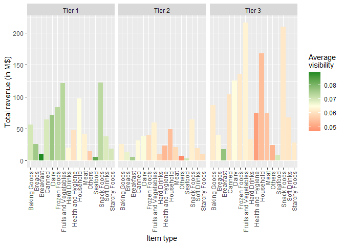

# Marketing analysis of Bigmart sales - Solution by Baptiste

## Data wrangling

### The original `Dataset` needs some small changes:

-   Creation of `Item_Revenue`
-   Removing the rows with `NA` in `Outlet_Size`
-   I decided to keep the rows having `NA` in `Item_Weight` since we
    will not use this variable, so it will not cause any problems

<table>
<colgroup>
<col style="width: 7%" />
<col style="width: 5%" />
<col style="width: 7%" />
<col style="width: 7%" />
<col style="width: 10%" />
<col style="width: 4%" />
<col style="width: 8%" />
<col style="width: 11%" />
<col style="width: 5%" />
<col style="width: 9%" />
<col style="width: 8%" />
<col style="width: 8%" />
<col style="width: 5%" />
</colgroup>
<thead>
<tr class="header">
<th style="text-align: left;">Item_Identifier</th>
<th style="text-align: right;">Item_Weight</th>
<th style="text-align: left;">Item_Fat_Content</th>
<th style="text-align: right;">Item_Visibility</th>
<th style="text-align: left;">Item_Type</th>
<th style="text-align: right;">Item_MRP</th>
<th style="text-align: left;">Outlet_Identifier</th>
<th style="text-align: right;">Outlet_Establishment_Year</th>
<th style="text-align: left;">Outlet_Size</th>
<th style="text-align: left;">Outlet_Location_Type</th>
<th style="text-align: left;">Outlet_Type</th>
<th style="text-align: right;">Item_Outlet_Sales</th>
<th style="text-align: right;">Item_Revenue</th>
</tr>
</thead>
<tbody>
<tr class="odd">
<td style="text-align: left;">FDA15</td>
<td style="text-align: right;">9.300</td>
<td style="text-align: left;">Low Fat</td>
<td style="text-align: right;">0.0160473</td>
<td style="text-align: left;">Dairy</td>
<td style="text-align: right;">249.8092</td>
<td style="text-align: left;">OUT049</td>
<td style="text-align: right;">1999</td>
<td style="text-align: left;">Medium</td>
<td style="text-align: left;">Tier 1</td>
<td style="text-align: left;">Supermarket Type1</td>
<td style="text-align: right;">3735.1380</td>
<td style="text-align: right;">653150.28</td>
</tr>
<tr class="even">
<td style="text-align: left;">DRC01</td>
<td style="text-align: right;">5.920</td>
<td style="text-align: left;">Regular</td>
<td style="text-align: right;">0.0192782</td>
<td style="text-align: left;">Soft Drinks</td>
<td style="text-align: right;">48.2692</td>
<td style="text-align: left;">OUT018</td>
<td style="text-align: right;">2009</td>
<td style="text-align: left;">Medium</td>
<td style="text-align: left;">Tier 3</td>
<td style="text-align: left;">Supermarket Type2</td>
<td style="text-align: right;">443.4228</td>
<td style="text-align: right;">14982.56</td>
</tr>
<tr class="odd">
<td style="text-align: left;">FDN15</td>
<td style="text-align: right;">17.500</td>
<td style="text-align: left;">Low Fat</td>
<td style="text-align: right;">0.0167601</td>
<td style="text-align: left;">Meat</td>
<td style="text-align: right;">141.6180</td>
<td style="text-align: left;">OUT049</td>
<td style="text-align: right;">1999</td>
<td style="text-align: left;">Medium</td>
<td style="text-align: left;">Tier 1</td>
<td style="text-align: left;">Supermarket Type1</td>
<td style="text-align: right;">2097.2700</td>
<td style="text-align: right;">207907.83</td>
</tr>
<tr class="even">
<td style="text-align: left;">NCD19</td>
<td style="text-align: right;">8.930</td>
<td style="text-align: left;">Low Fat</td>
<td style="text-align: right;">0.0000000</td>
<td style="text-align: left;">Household</td>
<td style="text-align: right;">53.8614</td>
<td style="text-align: left;">OUT013</td>
<td style="text-align: right;">1987</td>
<td style="text-align: left;">High</td>
<td style="text-align: left;">Tier 3</td>
<td style="text-align: left;">Supermarket Type1</td>
<td style="text-align: right;">994.7052</td>
<td style="text-align: right;">37503.35</td>
</tr>
<tr class="odd">
<td style="text-align: left;">FDP36</td>
<td style="text-align: right;">10.395</td>
<td style="text-align: left;">Regular</td>
<td style="text-align: right;">0.0000000</td>
<td style="text-align: left;">Baking Goods</td>
<td style="text-align: right;">51.4008</td>
<td style="text-align: left;">OUT018</td>
<td style="text-align: right;">2009</td>
<td style="text-align: left;">Medium</td>
<td style="text-align: left;">Tier 3</td>
<td style="text-align: left;">Supermarket Type2</td>
<td style="text-align: right;">556.6088</td>
<td style="text-align: right;">20027.10</td>
</tr>
<tr class="even">
<td style="text-align: left;">FDO10</td>
<td style="text-align: right;">13.650</td>
<td style="text-align: left;">Regular</td>
<td style="text-align: right;">0.0127411</td>
<td style="text-align: left;">Snack Foods</td>
<td style="text-align: right;">57.6588</td>
<td style="text-align: left;">OUT013</td>
<td style="text-align: right;">1987</td>
<td style="text-align: left;">High</td>
<td style="text-align: left;">Tier 3</td>
<td style="text-align: left;">Supermarket Type1</td>
<td style="text-align: right;">343.5528</td>
<td style="text-align: right;">13866.19</td>
</tr>
<tr class="odd">
<td style="text-align: left;">FDP10</td>
<td style="text-align: right;">NA</td>
<td style="text-align: left;">Low Fat</td>
<td style="text-align: right;">0.1274699</td>
<td style="text-align: left;">Snack Foods</td>
<td style="text-align: right;">107.7622</td>
<td style="text-align: left;">OUT027</td>
<td style="text-align: right;">1985</td>
<td style="text-align: left;">Medium</td>
<td style="text-align: left;">Tier 3</td>
<td style="text-align: left;">Supermarket Type3</td>
<td style="text-align: right;">4022.7636</td>
<td style="text-align: right;">303451.30</td>
</tr>
<tr class="even">
<td style="text-align: left;">FDY07</td>
<td style="text-align: right;">11.800</td>
<td style="text-align: left;">Low Fat</td>
<td style="text-align: right;">0.0000000</td>
<td style="text-align: left;">Fruits and Vegetables</td>
<td style="text-align: right;">45.5402</td>
<td style="text-align: left;">OUT049</td>
<td style="text-align: right;">1999</td>
<td style="text-align: left;">Medium</td>
<td style="text-align: left;">Tier 1</td>
<td style="text-align: left;">Supermarket Type1</td>
<td style="text-align: right;">1516.0266</td>
<td style="text-align: right;">48328.11</td>
</tr>
<tr class="odd">
<td style="text-align: left;">FDA03</td>
<td style="text-align: right;">18.500</td>
<td style="text-align: left;">Regular</td>
<td style="text-align: right;">0.0454638</td>
<td style="text-align: left;">Dairy</td>
<td style="text-align: right;">144.1102</td>
<td style="text-align: left;">OUT046</td>
<td style="text-align: right;">1997</td>
<td style="text-align: left;">Small</td>
<td style="text-align: left;">Tier 1</td>
<td style="text-align: left;">Supermarket Type1</td>
<td style="text-align: right;">2187.1530</td>
<td style="text-align: right;">220633.74</td>
</tr>
<tr class="even">
<td style="text-align: left;">FDX32</td>
<td style="text-align: right;">15.100</td>
<td style="text-align: left;">Regular</td>
<td style="text-align: right;">0.1000135</td>
<td style="text-align: left;">Fruits and Vegetables</td>
<td style="text-align: right;">145.4786</td>
<td style="text-align: left;">OUT049</td>
<td style="text-align: right;">1999</td>
<td style="text-align: left;">Medium</td>
<td style="text-align: left;">Tier 1</td>
<td style="text-align: left;">Supermarket Type1</td>
<td style="text-align: right;">1589.2646</td>
<td style="text-align: right;">161842.79</td>
</tr>
</tbody>
</table>

### New dataset for visualisation 1

To simplify data handling before the visualisation of Sales or Revenue
vs. Item type, I suggest to create a intermdiate data table
`Dataset_V1`, which summarise: - the sum of all `Item_Outlet_Sales` of
each `Item_Type` into `Sum_Sales` - the sum of all `Item_Revenue` of
each `Item_Type` into `Sum_Sales` - the average `Item_visibility` of
each `Item_Type` into `Avg_Visibility`  
Additionally, we can already add the proportions taken by each
`Item_Type` for those new variations, which will be usefull for
labelling the bars in the barplots.

Here is the new `Dataset_V1` table:

<table>
<colgroup>
<col style="width: 26%" />
<col style="width: 12%" />
<col style="width: 14%" />
<col style="width: 18%" />
<col style="width: 13%" />
<col style="width: 15%" />
</colgroup>
<thead>
<tr class="header">
<th style="text-align: left;">Item_Type</th>
<th style="text-align: right;">Sum_Sales</th>
<th style="text-align: right;">Sum_Revenue</th>
<th style="text-align: right;">Avg_Visibility</th>
<th style="text-align: left;">Prop_Sales</th>
<th style="text-align: left;">Prop_Revenue</th>
</tr>
</thead>
<tbody>
<tr class="odd">
<td style="text-align: left;">Baking Goods</td>
<td style="text-align: right;">1570068.8</td>
<td style="text-align: right;">169308117</td>
<td style="text-align: right;">0.0650101</td>
<td style="text-align: left;">6.90%</td>
<td style="text-align: left;">6.31%</td>
</tr>
<tr class="even">
<td style="text-align: left;">Breads</td>
<td style="text-align: right;">675871.1</td>
<td style="text-align: right;">79072793</td>
<td style="text-align: right;">0.0692290</td>
<td style="text-align: left;">2.97%</td>
<td style="text-align: left;">2.95%</td>
</tr>
<tr class="odd">
<td style="text-align: left;">Breakfast</td>
<td style="text-align: right;">297418.1</td>
<td style="text-align: right;">34359988</td>
<td style="text-align: right;">0.0817859</td>
<td style="text-align: left;">1.31%</td>
<td style="text-align: left;">1.28%</td>
</tr>
<tr class="even">
<td style="text-align: left;">Canned</td>
<td style="text-align: right;">1733425.9</td>
<td style="text-align: right;">199341944</td>
<td style="text-align: right;">0.0646045</td>
<td style="text-align: left;">7.62%</td>
<td style="text-align: left;">7.43%</td>
</tr>
<tr class="odd">
<td style="text-align: left;">Dairy</td>
<td style="text-align: right;">1855828.6</td>
<td style="text-align: right;">235641680</td>
<td style="text-align: right;">0.0694151</td>
<td style="text-align: left;">8.15%</td>
<td style="text-align: left;">8.78%</td>
</tr>
<tr class="even">
<td style="text-align: left;">Frozen Foods</td>
<td style="text-align: right;">2175878.7</td>
<td style="text-align: right;">259750929</td>
<td style="text-align: right;">0.0656703</td>
<td style="text-align: left;">9.56%</td>
<td style="text-align: left;">9.68%</td>
</tr>
<tr class="odd">
<td style="text-align: left;">Fruits and Vegetables</td>
<td style="text-align: right;">3357843.1</td>
<td style="text-align: right;">397573494</td>
<td style="text-align: right;">0.0669981</td>
<td style="text-align: left;">14.75%</td>
<td style="text-align: left;">14.82%</td>
</tr>
<tr class="even">
<td style="text-align: left;">Hard Drinks</td>
<td style="text-align: right;">548716.5</td>
<td style="text-align: right;">64366055</td>
<td style="text-align: right;">0.0619031</td>
<td style="text-align: left;">2.41%</td>
<td style="text-align: left;">2.40%</td>
</tr>
<tr class="odd">
<td style="text-align: left;">Health and Hygiene</td>
<td style="text-align: right;">1308425.6</td>
<td style="text-align: right;">146422241</td>
<td style="text-align: right;">0.0544399</td>
<td style="text-align: left;">5.75%</td>
<td style="text-align: left;">5.46%</td>
</tr>
<tr class="even">
<td style="text-align: left;">Household</td>
<td style="text-align: right;">2587679.5</td>
<td style="text-align: right;">314880983</td>
<td style="text-align: right;">0.0584622</td>
<td style="text-align: left;">11.37%</td>
<td style="text-align: left;">11.74%</td>
</tr>
<tr class="odd">
<td style="text-align: left;">Meat</td>
<td style="text-align: right;">1183661.5</td>
<td style="text-align: right;">137395668</td>
<td style="text-align: right;">0.0589317</td>
<td style="text-align: left;">5.20%</td>
<td style="text-align: left;">5.12%</td>
</tr>
<tr class="even">
<td style="text-align: left;">Others</td>
<td style="text-align: right;">411993.1</td>
<td style="text-align: right;">46703417</td>
<td style="text-align: right;">0.0534826</td>
<td style="text-align: left;">1.81%</td>
<td style="text-align: left;">1.74%</td>
</tr>
<tr class="odd">
<td style="text-align: left;">Seafood</td>
<td style="text-align: right;">159888.9</td>
<td style="text-align: right;">18968539</td>
<td style="text-align: right;">0.0752740</td>
<td style="text-align: left;">0.70%</td>
<td style="text-align: left;">0.71%</td>
</tr>
<tr class="even">
<td style="text-align: left;">Snack Foods</td>
<td style="text-align: right;">3334432.1</td>
<td style="text-align: right;">395509957</td>
<td style="text-align: right;">0.0658738</td>
<td style="text-align: left;">14.65%</td>
<td style="text-align: left;">14.74%</td>
</tr>
<tr class="odd">
<td style="text-align: left;">Soft Drinks</td>
<td style="text-align: right;">1095972.2</td>
<td style="text-align: right;">125641130</td>
<td style="text-align: right;">0.0640731</td>
<td style="text-align: left;">4.82%</td>
<td style="text-align: left;">4.68%</td>
</tr>
<tr class="even">
<td style="text-align: left;">Starchy Foods</td>
<td style="text-align: right;">463224.0</td>
<td style="text-align: right;">57581123</td>
<td style="text-align: right;">0.0644054</td>
<td style="text-align: left;">2.04%</td>
<td style="text-align: left;">2.15%</td>
</tr>
</tbody>
</table>

### New dataset for visualisation 2

For the objectives of visualisation 2, we will need to create two subset
of the orinigal `Dataset`: - `Dataset_V2a` that summarise the sales and
revenue of the items by `Outlet_Type` - `Dataset_V2b` that summarise the
sales and revenue of the items by `Outlet_Size`

Here we have `Dataset_V2a`:

<table>
<colgroup>
<col style="width: 30%" />
<col style="width: 16%" />
<col style="width: 15%" />
<col style="width: 16%" />
<col style="width: 20%" />
</colgroup>
<thead>
<tr class="header">
<th style="text-align: left;">Item_Type</th>
<th style="text-align: left;">Outlet_Size</th>
<th style="text-align: right;">Sum_Sales</th>
<th style="text-align: right;">Sum_Revenue</th>
<th style="text-align: right;">Avg_Visibility</th>
</tr>
</thead>
<tbody>
<tr class="odd">
<td style="text-align: left;">Baking Goods</td>
<td style="text-align: left;">High</td>
<td style="text-align: right;">230800.51</td>
<td style="text-align: right;">24812892</td>
<td style="text-align: right;">0.0606052</td>
</tr>
<tr class="even">
<td style="text-align: left;">Baking Goods</td>
<td style="text-align: left;">Medium</td>
<td style="text-align: right;">820327.16</td>
<td style="text-align: right;">87950420</td>
<td style="text-align: right;">0.0607233</td>
</tr>
<tr class="odd">
<td style="text-align: left;">Baking Goods</td>
<td style="text-align: left;">Small</td>
<td style="text-align: right;">518941.13</td>
<td style="text-align: right;">56544805</td>
<td style="text-align: right;">0.0717687</td>
</tr>
<tr class="even">
<td style="text-align: left;">Breads</td>
<td style="text-align: left;">High</td>
<td style="text-align: right;">98197.70</td>
<td style="text-align: right;">11367276</td>
<td style="text-align: right;">0.0667221</td>
</tr>
<tr class="odd">
<td style="text-align: left;">Breads</td>
<td style="text-align: left;">Medium</td>
<td style="text-align: right;">352582.41</td>
<td style="text-align: right;">40949451</td>
<td style="text-align: right;">0.0631757</td>
</tr>
<tr class="even">
<td style="text-align: left;">Breads</td>
<td style="text-align: left;">Small</td>
<td style="text-align: right;">225090.97</td>
<td style="text-align: right;">26756065</td>
<td style="text-align: right;">0.0771777</td>
</tr>
<tr class="odd">
<td style="text-align: left;">Breakfast</td>
<td style="text-align: left;">High</td>
<td style="text-align: right;">37961.44</td>
<td style="text-align: right;">4348939</td>
<td style="text-align: right;">0.0789256</td>
</tr>
<tr class="even">
<td style="text-align: left;">Breakfast</td>
<td style="text-align: left;">Medium</td>
<td style="text-align: right;">162183.08</td>
<td style="text-align: right;">18849658</td>
<td style="text-align: right;">0.0764854</td>
</tr>
<tr class="odd">
<td style="text-align: left;">Breakfast</td>
<td style="text-align: left;">Small</td>
<td style="text-align: right;">97273.56</td>
<td style="text-align: right;">11161390</td>
<td style="text-align: right;">0.0887347</td>
</tr>
<tr class="even">
<td style="text-align: left;">Canned</td>
<td style="text-align: left;">High</td>
<td style="text-align: right;">254267.10</td>
<td style="text-align: right;">29808042</td>
<td style="text-align: right;">0.0572070</td>
</tr>
<tr class="odd">
<td style="text-align: left;">Canned</td>
<td style="text-align: left;">Medium</td>
<td style="text-align: right;">901446.60</td>
<td style="text-align: right;">103041681</td>
<td style="text-align: right;">0.0620426</td>
</tr>
<tr class="even">
<td style="text-align: left;">Canned</td>
<td style="text-align: left;">Small</td>
<td style="text-align: right;">577712.24</td>
<td style="text-align: right;">66492222</td>
<td style="text-align: right;">0.0704928</td>
</tr>
<tr class="odd">
<td style="text-align: left;">Dairy</td>
<td style="text-align: left;">High</td>
<td style="text-align: right;">278823.61</td>
<td style="text-align: right;">36294194</td>
<td style="text-align: right;">0.0661984</td>
</tr>
<tr class="even">
<td style="text-align: left;">Dairy</td>
<td style="text-align: left;">Medium</td>
<td style="text-align: right;">980925.50</td>
<td style="text-align: right;">123614748</td>
<td style="text-align: right;">0.0628003</td>
</tr>
<tr class="odd">
<td style="text-align: left;">Dairy</td>
<td style="text-align: left;">Small</td>
<td style="text-align: right;">596079.46</td>
<td style="text-align: right;">75732738</td>
<td style="text-align: right;">0.0784284</td>
</tr>
<tr class="even">
<td style="text-align: left;">Frozen Foods</td>
<td style="text-align: left;">High</td>
<td style="text-align: right;">326583.64</td>
<td style="text-align: right;">39250130</td>
<td style="text-align: right;">0.0631470</td>
</tr>
<tr class="odd">
<td style="text-align: left;">Frozen Foods</td>
<td style="text-align: left;">Medium</td>
<td style="text-align: right;">1143870.06</td>
<td style="text-align: right;">136651725</td>
<td style="text-align: right;">0.0605081</td>
</tr>
<tr class="even">
<td style="text-align: left;">Frozen Foods</td>
<td style="text-align: left;">Small</td>
<td style="text-align: right;">705424.96</td>
<td style="text-align: right;">83849074</td>
<td style="text-align: right;">0.0725502</td>
</tr>
<tr class="odd">
<td style="text-align: left;">Fruits and Vegetables</td>
<td style="text-align: left;">High</td>
<td style="text-align: right;">512402.17</td>
<td style="text-align: right;">61775413</td>
<td style="text-align: right;">0.0639415</td>
</tr>
<tr class="even">
<td style="text-align: left;">Fruits and Vegetables</td>
<td style="text-align: left;">Medium</td>
<td style="text-align: right;">1811697.83</td>
<td style="text-align: right;">214226951</td>
<td style="text-align: right;">0.0620216</td>
</tr>
<tr class="odd">
<td style="text-align: left;">Fruits and Vegetables</td>
<td style="text-align: left;">Small</td>
<td style="text-align: right;">1033743.09</td>
<td style="text-align: right;">121571131</td>
<td style="text-align: right;">0.0739839</td>
</tr>
<tr class="even">
<td style="text-align: left;">Hard Drinks</td>
<td style="text-align: left;">High</td>
<td style="text-align: right;">86111.68</td>
<td style="text-align: right;">10353317</td>
<td style="text-align: right;">0.0639563</td>
</tr>
<tr class="odd">
<td style="text-align: left;">Hard Drinks</td>
<td style="text-align: left;">Medium</td>
<td style="text-align: right;">286732.50</td>
<td style="text-align: right;">33290047</td>
<td style="text-align: right;">0.0589704</td>
</tr>
<tr class="even">
<td style="text-align: left;">Hard Drinks</td>
<td style="text-align: left;">Small</td>
<td style="text-align: right;">175872.27</td>
<td style="text-align: right;">20722691</td>
<td style="text-align: right;">0.0646261</td>
</tr>
<tr class="odd">
<td style="text-align: left;">Health and Hygiene</td>
<td style="text-align: left;">High</td>
<td style="text-align: right;">179864.00</td>
<td style="text-align: right;">20413605</td>
<td style="text-align: right;">0.0502767</td>
</tr>
<tr class="even">
<td style="text-align: left;">Health and Hygiene</td>
<td style="text-align: left;">Medium</td>
<td style="text-align: right;">690259.69</td>
<td style="text-align: right;">76470735</td>
<td style="text-align: right;">0.0495474</td>
</tr>
<tr class="odd">
<td style="text-align: left;">Health and Hygiene</td>
<td style="text-align: left;">Small</td>
<td style="text-align: right;">438301.93</td>
<td style="text-align: right;">49537901</td>
<td style="text-align: right;">0.0617884</td>
</tr>
<tr class="even">
<td style="text-align: left;">Household</td>
<td style="text-align: left;">High</td>
<td style="text-align: right;">391832.72</td>
<td style="text-align: right;">48585948</td>
<td style="text-align: right;">0.0537933</td>
</tr>
<tr class="odd">
<td style="text-align: left;">Household</td>
<td style="text-align: left;">Medium</td>
<td style="text-align: right;">1407660.98</td>
<td style="text-align: right;">171711991</td>
<td style="text-align: right;">0.0547566</td>
</tr>
<tr class="even">
<td style="text-align: left;">Household</td>
<td style="text-align: left;">Small</td>
<td style="text-align: right;">788185.77</td>
<td style="text-align: right;">94583044</td>
<td style="text-align: right;">0.0646325</td>
</tr>
<tr class="odd">
<td style="text-align: left;">Meat</td>
<td style="text-align: left;">High</td>
<td style="text-align: right;">180291.97</td>
<td style="text-align: right;">21352671</td>
<td style="text-align: right;">0.0531255</td>
</tr>
<tr class="even">
<td style="text-align: left;">Meat</td>
<td style="text-align: left;">Medium</td>
<td style="text-align: right;">633725.42</td>
<td style="text-align: right;">73545823</td>
<td style="text-align: right;">0.0561018</td>
</tr>
<tr class="odd">
<td style="text-align: left;">Meat</td>
<td style="text-align: left;">Small</td>
<td style="text-align: right;">369644.10</td>
<td style="text-align: right;">42497174</td>
<td style="text-align: right;">0.0643496</td>
</tr>
<tr class="even">
<td style="text-align: left;">Others</td>
<td style="text-align: left;">High</td>
<td style="text-align: right;">62964.31</td>
<td style="text-align: right;">7213443</td>
<td style="text-align: right;">0.0525748</td>
</tr>
<tr class="odd">
<td style="text-align: left;">Others</td>
<td style="text-align: left;">Medium</td>
<td style="text-align: right;">224071.96</td>
<td style="text-align: right;">25538558</td>
<td style="text-align: right;">0.0520830</td>
</tr>
<tr class="even">
<td style="text-align: left;">Others</td>
<td style="text-align: left;">Small</td>
<td style="text-align: right;">124956.78</td>
<td style="text-align: right;">13951416</td>
<td style="text-align: right;">0.0553508</td>
</tr>
<tr class="odd">
<td style="text-align: left;">Seafood</td>
<td style="text-align: left;">High</td>
<td style="text-align: right;">19738.01</td>
<td style="text-align: right;">2361381</td>
<td style="text-align: right;">0.0706995</td>
</tr>
<tr class="even">
<td style="text-align: left;">Seafood</td>
<td style="text-align: left;">Medium</td>
<td style="text-align: right;">75756.84</td>
<td style="text-align: right;">8979763</td>
<td style="text-align: right;">0.0700626</td>
</tr>
<tr class="odd">
<td style="text-align: left;">Seafood</td>
<td style="text-align: left;">Small</td>
<td style="text-align: right;">64394.07</td>
<td style="text-align: right;">7627395</td>
<td style="text-align: right;">0.0830467</td>
</tr>
<tr class="even">
<td style="text-align: left;">Snack Foods</td>
<td style="text-align: left;">High</td>
<td style="text-align: right;">516571.48</td>
<td style="text-align: right;">61158341</td>
<td style="text-align: right;">0.0606604</td>
</tr>
<tr class="odd">
<td style="text-align: left;">Snack Foods</td>
<td style="text-align: left;">Medium</td>
<td style="text-align: right;">1764133.13</td>
<td style="text-align: right;">210263214</td>
<td style="text-align: right;">0.0611182</td>
</tr>
<tr class="even">
<td style="text-align: left;">Snack Foods</td>
<td style="text-align: left;">Small</td>
<td style="text-align: right;">1053727.47</td>
<td style="text-align: right;">124088402</td>
<td style="text-align: right;">0.0736344</td>
</tr>
<tr class="odd">
<td style="text-align: left;">Soft Drinks</td>
<td style="text-align: left;">High</td>
<td style="text-align: right;">177682.67</td>
<td style="text-align: right;">20146983</td>
<td style="text-align: right;">0.0617576</td>
</tr>
<tr class="even">
<td style="text-align: left;">Soft Drinks</td>
<td style="text-align: left;">Medium</td>
<td style="text-align: right;">588480.70</td>
<td style="text-align: right;">67774148</td>
<td style="text-align: right;">0.0599540</td>
</tr>
<tr class="odd">
<td style="text-align: left;">Soft Drinks</td>
<td style="text-align: left;">Small</td>
<td style="text-align: right;">329808.81</td>
<td style="text-align: right;">37719999</td>
<td style="text-align: right;">0.0698351</td>
</tr>
<tr class="even">
<td style="text-align: left;">Starchy Foods</td>
<td style="text-align: left;">High</td>
<td style="text-align: right;">64512.81</td>
<td style="text-align: right;">8061661</td>
<td style="text-align: right;">0.0602160</td>
</tr>
<tr class="odd">
<td style="text-align: left;">Starchy Foods</td>
<td style="text-align: left;">Medium</td>
<td style="text-align: right;">236511.36</td>
<td style="text-align: right;">29101373</td>
<td style="text-align: right;">0.0628947</td>
</tr>
<tr class="even">
<td style="text-align: left;">Starchy Foods</td>
<td style="text-align: left;">Small</td>
<td style="text-align: right;">162199.80</td>
<td style="text-align: right;">20418090</td>
<td style="text-align: right;">0.0680394</td>
</tr>
</tbody>
</table>

And here we have `Dataset_V2b`:

<table style="width:100%;">
<colgroup>
<col style="width: 27%" />
<col style="width: 25%" />
<col style="width: 13%" />
<col style="width: 14%" />
<col style="width: 18%" />
</colgroup>
<thead>
<tr class="header">
<th style="text-align: left;">Item_Type</th>
<th style="text-align: left;">Outlet_Location_Type</th>
<th style="text-align: right;">Sum_Sales</th>
<th style="text-align: right;">Sum_Revenue</th>
<th style="text-align: right;">Avg_Visibility</th>
</tr>
</thead>
<tbody>
<tr class="odd">
<td style="text-align: left;">Baking Goods</td>
<td style="text-align: left;">Tier 1</td>
<td style="text-align: right;">522299.02</td>
<td style="text-align: right;">56134987</td>
<td style="text-align: right;">0.0700132</td>
</tr>
<tr class="even">
<td style="text-align: left;">Baking Goods</td>
<td style="text-align: left;">Tier 2</td>
<td style="text-align: right;">237145.45</td>
<td style="text-align: right;">26385470</td>
<td style="text-align: right;">0.0626393</td>
</tr>
<tr class="odd">
<td style="text-align: left;">Baking Goods</td>
<td style="text-align: left;">Tier 3</td>
<td style="text-align: right;">810624.34</td>
<td style="text-align: right;">86787660</td>
<td style="text-align: right;">0.0615195</td>
</tr>
<tr class="even">
<td style="text-align: left;">Breads</td>
<td style="text-align: left;">Tier 1</td>
<td style="text-align: right;">217368.82</td>
<td style="text-align: right;">25864284</td>
<td style="text-align: right;">0.0759657</td>
</tr>
<tr class="odd">
<td style="text-align: left;">Breads</td>
<td style="text-align: left;">Tier 2</td>
<td style="text-align: right;">110667.94</td>
<td style="text-align: right;">13103125</td>
<td style="text-align: right;">0.0675557</td>
</tr>
<tr class="even">
<td style="text-align: left;">Breads</td>
<td style="text-align: left;">Tier 3</td>
<td style="text-align: right;">347834.32</td>
<td style="text-align: right;">40105385</td>
<td style="text-align: right;">0.0639483</td>
</tr>
<tr class="odd">
<td style="text-align: left;">Breakfast</td>
<td style="text-align: left;">Tier 1</td>
<td style="text-align: right;">90860.66</td>
<td style="text-align: right;">10484137</td>
<td style="text-align: right;">0.0890010</td>
</tr>
<tr class="even">
<td style="text-align: left;">Breakfast</td>
<td style="text-align: left;">Tier 2</td>
<td style="text-align: right;">50964.89</td>
<td style="text-align: right;">5940999</td>
<td style="text-align: right;">0.0753571</td>
</tr>
<tr class="odd">
<td style="text-align: left;">Breakfast</td>
<td style="text-align: left;">Tier 3</td>
<td style="text-align: right;">155592.53</td>
<td style="text-align: right;">17934851</td>
<td style="text-align: right;">0.0774353</td>
</tr>
<tr class="even">
<td style="text-align: left;">Canned</td>
<td style="text-align: left;">Tier 1</td>
<td style="text-align: right;">552927.86</td>
<td style="text-align: right;">64173452</td>
<td style="text-align: right;">0.0694726</td>
</tr>
<tr class="odd">
<td style="text-align: left;">Canned</td>
<td style="text-align: left;">Tier 2</td>
<td style="text-align: right;">275668.12</td>
<td style="text-align: right;">31618031</td>
<td style="text-align: right;">0.0641917</td>
</tr>
<tr class="even">
<td style="text-align: left;">Canned</td>
<td style="text-align: left;">Tier 3</td>
<td style="text-align: right;">904829.96</td>
<td style="text-align: right;">103550461</td>
<td style="text-align: right;">0.0605818</td>
</tr>
<tr class="odd">
<td style="text-align: left;">Dairy</td>
<td style="text-align: left;">Tier 1</td>
<td style="text-align: right;">568899.25</td>
<td style="text-align: right;">71514909</td>
<td style="text-align: right;">0.0765667</td>
</tr>
<tr class="even">
<td style="text-align: left;">Dairy</td>
<td style="text-align: left;">Tier 2</td>
<td style="text-align: right;">300025.93</td>
<td style="text-align: right;">38588044</td>
<td style="text-align: right;">0.0654980</td>
</tr>
<tr class="odd">
<td style="text-align: left;">Dairy</td>
<td style="text-align: left;">Tier 3</td>
<td style="text-align: right;">986903.39</td>
<td style="text-align: right;">125538726</td>
<td style="text-align: right;">0.0646203</td>
</tr>
<tr class="even">
<td style="text-align: left;">Frozen Foods</td>
<td style="text-align: left;">Tier 1</td>
<td style="text-align: right;">697486.02</td>
<td style="text-align: right;">83389216</td>
<td style="text-align: right;">0.0729475</td>
</tr>
<tr class="odd">
<td style="text-align: left;">Frozen Foods</td>
<td style="text-align: left;">Tier 2</td>
<td style="text-align: right;">339241.08</td>
<td style="text-align: right;">40616513</td>
<td style="text-align: right;">0.0594102</td>
</tr>
<tr class="even">
<td style="text-align: left;">Frozen Foods</td>
<td style="text-align: left;">Tier 3</td>
<td style="text-align: right;">1139151.57</td>
<td style="text-align: right;">135745200</td>
<td style="text-align: right;">0.0614095</td>
</tr>
<tr class="odd">
<td style="text-align: left;">Fruits and Vegetables</td>
<td style="text-align: left;">Tier 1</td>
<td style="text-align: right;">1029326.16</td>
<td style="text-align: right;">121481857</td>
<td style="text-align: right;">0.0732734</td>
</tr>
<tr class="even">
<td style="text-align: left;">Fruits and Vegetables</td>
<td style="text-align: left;">Tier 2</td>
<td style="text-align: right;">511425.86</td>
<td style="text-align: right;">60079660</td>
<td style="text-align: right;">0.0628147</td>
</tr>
<tr class="odd">
<td style="text-align: left;">Fruits and Vegetables</td>
<td style="text-align: left;">Tier 3</td>
<td style="text-align: right;">1817091.08</td>
<td style="text-align: right;">216011977</td>
<td style="text-align: right;">0.0630081</td>
</tr>
<tr class="even">
<td style="text-align: left;">Hard Drinks</td>
<td style="text-align: left;">Tier 1</td>
<td style="text-align: right;">173999.04</td>
<td style="text-align: right;">20406929</td>
<td style="text-align: right;">0.0640385</td>
</tr>
<tr class="odd">
<td style="text-align: left;">Hard Drinks</td>
<td style="text-align: left;">Tier 2</td>
<td style="text-align: right;">89893.70</td>
<td style="text-align: right;">10587500</td>
<td style="text-align: right;">0.0576364</td>
</tr>
<tr class="even">
<td style="text-align: left;">Hard Drinks</td>
<td style="text-align: left;">Tier 3</td>
<td style="text-align: right;">284823.71</td>
<td style="text-align: right;">33371626</td>
<td style="text-align: right;">0.0615786</td>
</tr>
<tr class="odd">
<td style="text-align: left;">Health and Hygiene</td>
<td style="text-align: left;">Tier 1</td>
<td style="text-align: right;">426642.93</td>
<td style="text-align: right;">47561307</td>
<td style="text-align: right;">0.0603062</td>
</tr>
<tr class="even">
<td style="text-align: left;">Health and Hygiene</td>
<td style="text-align: left;">Tier 2</td>
<td style="text-align: right;">211767.15</td>
<td style="text-align: right;">23954168</td>
<td style="text-align: right;">0.0534999</td>
</tr>
<tr class="odd">
<td style="text-align: left;">Health and Hygiene</td>
<td style="text-align: left;">Tier 3</td>
<td style="text-align: right;">670015.54</td>
<td style="text-align: right;">74906766</td>
<td style="text-align: right;">0.0496779</td>
</tr>
<tr class="even">
<td style="text-align: left;">Household</td>
<td style="text-align: left;">Tier 1</td>
<td style="text-align: right;">807818.09</td>
<td style="text-align: right;">97672406</td>
<td style="text-align: right;">0.0647865</td>
</tr>
<tr class="odd">
<td style="text-align: left;">Household</td>
<td style="text-align: left;">Tier 2</td>
<td style="text-align: right;">410985.92</td>
<td style="text-align: right;">49329687</td>
<td style="text-align: right;">0.0546088</td>
</tr>
<tr class="even">
<td style="text-align: left;">Household</td>
<td style="text-align: left;">Tier 3</td>
<td style="text-align: right;">1368875.45</td>
<td style="text-align: right;">167878890</td>
<td style="text-align: right;">0.0543748</td>
</tr>
<tr class="odd">
<td style="text-align: left;">Meat</td>
<td style="text-align: left;">Tier 1</td>
<td style="text-align: right;">365212.77</td>
<td style="text-align: right;">41882557</td>
<td style="text-align: right;">0.0629181</td>
</tr>
<tr class="even">
<td style="text-align: left;">Meat</td>
<td style="text-align: left;">Tier 2</td>
<td style="text-align: right;">184436.98</td>
<td style="text-align: right;">21314779</td>
<td style="text-align: right;">0.0589087</td>
</tr>
<tr class="odd">
<td style="text-align: left;">Meat</td>
<td style="text-align: left;">Tier 3</td>
<td style="text-align: right;">634011.75</td>
<td style="text-align: right;">74198332</td>
<td style="text-align: right;">0.0554723</td>
</tr>
<tr class="even">
<td style="text-align: left;">Others</td>
<td style="text-align: left;">Tier 1</td>
<td style="text-align: right;">132009.34</td>
<td style="text-align: right;">15130893</td>
<td style="text-align: right;">0.0565265</td>
</tr>
<tr class="odd">
<td style="text-align: left;">Others</td>
<td style="text-align: left;">Tier 2</td>
<td style="text-align: right;">64816.57</td>
<td style="text-align: right;">7230116</td>
<td style="text-align: right;">0.0469010</td>
</tr>
<tr class="even">
<td style="text-align: left;">Others</td>
<td style="text-align: left;">Tier 3</td>
<td style="text-align: right;">215167.13</td>
<td style="text-align: right;">24342408</td>
<td style="text-align: right;">0.0529030</td>
</tr>
<tr class="odd">
<td style="text-align: left;">Seafood</td>
<td style="text-align: left;">Tier 1</td>
<td style="text-align: right;">52434.10</td>
<td style="text-align: right;">6189225</td>
<td style="text-align: right;">0.0830941</td>
</tr>
<tr class="even">
<td style="text-align: left;">Seafood</td>
<td style="text-align: left;">Tier 2</td>
<td style="text-align: right;">30272.42</td>
<td style="text-align: right;">3576879</td>
<td style="text-align: right;">0.0707450</td>
</tr>
<tr class="odd">
<td style="text-align: left;">Seafood</td>
<td style="text-align: left;">Tier 3</td>
<td style="text-align: right;">77182.39</td>
<td style="text-align: right;">9202436</td>
<td style="text-align: right;">0.0700063</td>
</tr>
<tr class="even">
<td style="text-align: left;">Snack Foods</td>
<td style="text-align: left;">Tier 1</td>
<td style="text-align: right;">1030670.92</td>
<td style="text-align: right;">122001639</td>
<td style="text-align: right;">0.0727492</td>
</tr>
<tr class="odd">
<td style="text-align: left;">Snack Foods</td>
<td style="text-align: left;">Tier 2</td>
<td style="text-align: right;">537471.06</td>
<td style="text-align: right;">64280554</td>
<td style="text-align: right;">0.0626123</td>
</tr>
<tr class="even">
<td style="text-align: left;">Snack Foods</td>
<td style="text-align: left;">Tier 3</td>
<td style="text-align: right;">1766290.09</td>
<td style="text-align: right;">209227764</td>
<td style="text-align: right;">0.0612090</td>
</tr>
<tr class="odd">
<td style="text-align: left;">Soft Drinks</td>
<td style="text-align: left;">Tier 1</td>
<td style="text-align: right;">334117.62</td>
<td style="text-align: right;">38269735</td>
<td style="text-align: right;">0.0692328</td>
</tr>
<tr class="even">
<td style="text-align: left;">Soft Drinks</td>
<td style="text-align: left;">Tier 2</td>
<td style="text-align: right;">167419.33</td>
<td style="text-align: right;">19283345</td>
<td style="text-align: right;">0.0605358</td>
</tr>
<tr class="odd">
<td style="text-align: left;">Soft Drinks</td>
<td style="text-align: left;">Tier 3</td>
<td style="text-align: right;">594435.24</td>
<td style="text-align: right;">68088050</td>
<td style="text-align: right;">0.0609094</td>
</tr>
<tr class="even">
<td style="text-align: left;">Starchy Foods</td>
<td style="text-align: left;">Tier 1</td>
<td style="text-align: right;">147667.05</td>
<td style="text-align: right;">18544647</td>
<td style="text-align: right;">0.0698898</td>
</tr>
<tr class="odd">
<td style="text-align: left;">Starchy Foods</td>
<td style="text-align: left;">Tier 2</td>
<td style="text-align: right;">85042.29</td>
<td style="text-align: right;">10583739</td>
<td style="text-align: right;">0.0596121</td>
</tr>
<tr class="even">
<td style="text-align: left;">Starchy Foods</td>
<td style="text-align: left;">Tier 3</td>
<td style="text-align: right;">230514.63</td>
<td style="text-align: right;">28452738</td>
<td style="text-align: right;">0.0616157</td>
</tr>
</tbody>
</table>

------------------------------------------------------------------------

## Visualisation goals

### Sales vs. Item type

Turns out that there are not much difference in `Avg_Visibility` between
the different `Item_Type`.  
An explanation could be that the `Item_Visibility` is calculated for
each indiviual item within its own category (= `Item_Type`), i.e.,
already homogenised.

### Sales vs. Item type

I took the liberty of putting the scale of `Sum_Revenue` in million
dollars.  

Looks like the relative proportion of `Sum_Sales` and `Sum_Revenue` are
pretty much the same between `Item_Type`.

### Total sales by outlet size

For the next 4 facet plots, I took the liberty to display the facets on
the same row, so the comparison of the y-axis is easier to make. I also
kept the labels on the x-axis turned to 90° and not slanted, otherwise
they are too cramped to be displayed properly.

There are more sales in medium-sized outlets.  
Here it seems that the `Avg_Visibility` changes according to
`Outlet_Size`. The small-sized outlets have the best average visibility
of their products.

### Total sales by location type

Interestingly, there are more sales in Tier 3 outlets, although the
highest visibility is seen in Tier 1 outlets.

### Total revenue by outlet size

Similarly to what we observed in the total number of sales, the sum of
revenue is higher in medium-sized outlets.

### Total revenue by outlet location type

Again, we have a similar results than for the total number of sales: the
revenues are generally higher in Tier 3 outlets.
