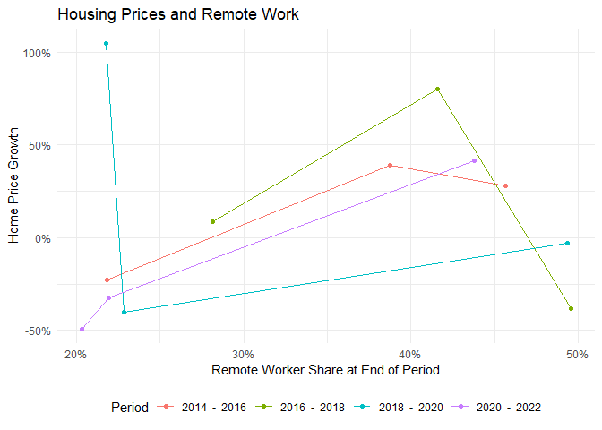
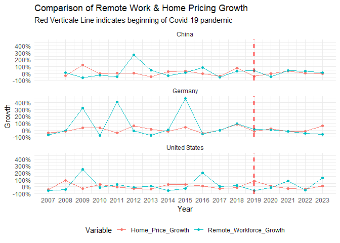
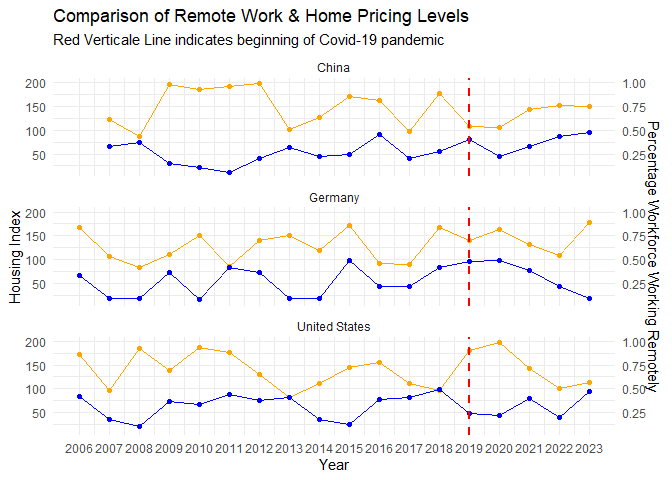

    rm(list = ls()) #Clears the workspace to avoid any conflicts when first running the code
    options(scipen=999) #Disable scientific notation

    ##################################### Importing Packages #####################################

    if (!require(magrittr)) install.packages(magrittr)

    ## Loading required package: magrittr

    if (!require(dplyr)) install.packages(dplyr)

    ## Loading required package: dplyr

    ## 
    ## Attaching package: 'dplyr'

    ## The following objects are masked from 'package:stats':
    ## 
    ##     filter, lag

    ## The following objects are masked from 'package:base':
    ## 
    ##     intersect, setdiff, setequal, union

    if (!require(ggplot2)) install.packages(ggplot)

    ## Loading required package: ggplot2

    if (!require(tidyr)) install.packages(tidyr)

    ## Loading required package: tidyr

    ## 
    ## Attaching package: 'tidyr'

    ## The following object is masked from 'package:magrittr':
    ## 
    ##     extract

    library(magrittr) #Used for piping
    library(dplyr) #Used for adding new column  
    library(ggplot2) #Used for visualizations
    library(tidyr) #Pivot data

    ##################################### Setting Working Directory #####################################

    #I get the data directly from the GitHub site
    url_to_csv <- "https://dr-eberle-zentrum.github.io/Data-projects-with-R-and-GitHub/Projects/Deeznis/Housing_prices.csv"

    #I use ; as seperator.
    housing_prices <- read.csv(url_to_csv, sep =";")

# Data Manipulation Goals

    #I first replace the . in the names of the columns with a _
    #This makes it easier to read
    colnames(housing_prices) <- gsub("\\.", "_", colnames(housing_prices))

    #I remove any excess _ at the end of the column names.
    remove_excess_ <- function(data) {
      names(data) <- gsub("_+$", "", names(data))
      return(data)
    }

    housing_prices <- remove_excess_(housing_prices)

    #I change the values of the below columns so that:

    # - Percentage Columns are shown as Decimal
    # - Infrastructure Investment values are actually in million. 

    housing_prices <- housing_prices %>%
      mutate(Percentage_of_Workforce_Working_Remotely = Percentage_of_Workforce_Working_Remotely / 100) %>%
      mutate(Urban_Population_Growth_Rate = Urban_Population_Growth_Rate / 100) %>%
      mutate(Rural_Population_Growth_Rate = Rural_Population_Growth_Rate / 100) %>%
      mutate(Public_Transport_Ridership_Change = Public_Transport_Ridership_Change / 100) %>%
      mutate(Internet_Infrastructure_Investment__Million_USD = Internet_Infrastructure_Investment__Million_USD * 10^6)

    #I reorder the data by Country and Year in preparation of calculating the home price growth
    housing_prices <- housing_prices %>%
      arrange(Country, Year)

    #For Germany the row for the year 2018 exists twice. I remove any duplicate values for the columns Year and Country
    housing_prices$duplicate_finder <- paste(housing_prices$Year, housing_prices$Country, sep = "-")
    housing_prices <- housing_prices[!duplicated(housing_prices$duplicate_finder), ]
    housing_prices$duplicate_finder <- NULL #Remove column after it isn't needed anymore

    #I calculate the home price growth as the current index divided by the lagged index - 1 for each country.
    #I do this by grouping the operation by the Country column.
    housing_prices <- housing_prices %>% 
      group_by(Country) %>% 
      mutate(Home_Price_Growth = (Average_Urban_Housing_Price_Index / lag(Average_Urban_Housing_Price_Index)) - 1) %>%
      mutate(Remote_Workforce_Growth = (Percentage_of_Workforce_Working_Remotely / lag(Percentage_of_Workforce_Working_Remotely)) - 1)

    #Prints for rows of table
    head(housing_prices)

    ## # A tibble: 6 × 12
    ## # Groups:   Country [1]
    ##    Year Country Country_Abbreviation Percentage_of_Workforce_Working_Remotely
    ##   <int> <chr>   <chr>                                                   <dbl>
    ## 1  2007 China   CN                                                     0.329 
    ## 2  2008 China   CN                                                     0.367 
    ## 3  2009 China   CN                                                     0.146 
    ## 4  2010 China   CN                                                     0.111 
    ## 5  2011 China   CN                                                     0.0565
    ## 6  2012 China   CN                                                     0.208 
    ## # ℹ 8 more variables: Average_Urban_Housing_Price_Index <dbl>,
    ## #   Urban_Population_Growth_Rate <dbl>, Rural_Population_Growth_Rate <dbl>,
    ## #   Public_Transport_Ridership_Change <dbl>,
    ## #   Internet_Infrastructure_Investment__Million_USD <dbl>,
    ## #   Environmental_Impact_Score__1_100 <dbl>, Home_Price_Growth <dbl>,
    ## #   Remote_Workforce_Growth <dbl>

    #Now I transpose the data to make it easier to use for the visualization goals.
    housing_Prices_rel_long <- pivot_longer(housing_prices, 
                                        cols = c(Home_Price_Growth, Remote_Workforce_Growth), 
                                        names_to = "Variable",
                                        values_to = "Value")

    #I only keep the relevant columns & drop missing values
    housing_Prices_rel_long <- na.omit(housing_Prices_rel_long[, c("Year", "Country", "Variable", "Value")])
    head(housing_Prices_rel_long)

    ## # A tibble: 6 × 4
    ## # Groups:   Country [1]
    ##    Year Country Variable                  Value
    ##   <int> <chr>   <chr>                     <dbl>
    ## 1  2008 China   Home_Price_Growth       -0.287 
    ## 2  2008 China   Remote_Workforce_Growth  0.115 
    ## 3  2009 China   Home_Price_Growth        1.26  
    ## 4  2009 China   Remote_Workforce_Growth -0.602 
    ## 5  2010 China   Home_Price_Growth       -0.0522
    ## 6  2010 China   Remote_Workforce_Growth -0.236

    #Now I subset the data to be used for the scatterplot.
    subsetted_data <- housing_prices %>% 
      filter(Year %in% c(2014, 2016, 2018, 2020, 2022)) %>% 
      group_by(Country) %>% 
      mutate(Home_Price_Growth = (Average_Urban_Housing_Price_Index / lag(Average_Urban_Housing_Price_Index)) - 1) %>% 
      mutate(Period = paste(lag(Year, 1), " - ", Year))

    subsetted_data <- na.omit(subsetted_data[, c("Year", "Country", "Period", "Percentage_of_Workforce_Working_Remotely", "Home_Price_Growth")])
    head(subsetted_data)

    ## # A tibble: 6 × 5
    ## # Groups:   Country [2]
    ##    Year Country Period        Percentage_of_Workforce_Workin…¹ Home_Price_Growth
    ##   <int> <chr>   <chr>                                    <dbl>             <dbl>
    ## 1  2016 China   2014  -  2016                            0.457            0.282 
    ## 2  2018 China   2016  -  2018                            0.281            0.0879
    ## 3  2020 China   2018  -  2020                            0.228           -0.399 
    ## 4  2022 China   2020  -  2022                            0.438            0.415 
    ## 5  2016 Germany 2014  -  2016                            0.218           -0.227 
    ## 6  2018 Germany 2016  -  2018                            0.416            0.804 
    ## # ℹ abbreviated name: ¹​Percentage_of_Workforce_Working_Remotely

# Visualization Goals

## (1) Scatter Plot

    subsetted_data %>% 
      ggplot(aes(x=Percentage_of_Workforce_Working_Remotely, y=Home_Price_Growth, color=Period)) +
      geom_point() +
      geom_line() +
      theme_minimal() +
      
      labs(
        title = "Housing Prices and Remote Work",
        x = "Remote Worker Share at End of Period",
        y = "Home Price Growth",
      ) +
      
      scale_y_continuous(labels = scales::percent_format(scale = 100)) + #Formats the values on the y-axis as percentage.
      scale_x_continuous(labels = scales::percent_format(scale = 100)) +
      
      theme(
        legend.position = "bottom", #Prepositions the legend at the bottom
      )

## (2) Comparison of Remote Work & Home Pricing (Growth Data)

    # Still working on the scale on y-axis. -> Check Values! 

    housing_Prices_rel_long %>%
      ggplot(aes(x = Year, y = Value, color=Variable)) + #Color = Variables distinguishes between the two variables that are plotted
      
      geom_point() + #Creates scatter plot
      geom_line() + #Adds lines between single dots of the scatter lot
      
      theme_minimal() + #Minimal theme looks good!
      
      labs(
        title = "Comparison of Remote Work & Home Pricing Growth",
        subtitle = "Red Verticale Line indicates beginning of Covid-19 pandemic",
        x = "Year",
        y = "Growth",
      ) +
      
      facet_wrap(~Country, ncol = 1) + #Split the graph into 3 graphs by country but formats the plot as 1 column & 3 rows.
      
      theme(
        legend.position = "bottom", #Prepositions the legend at the bottom
        #panel.grid.major = element_blank(), #Removes the grid from the background
        #panel.grid.minor = element_blank(), #Removes the grid from the background
      ) + 
      
      scale_y_continuous(labels = scales::percent_format(scale = 100)) + #Formats the values on the y-axis as percentage.
      scale_x_continuous(breaks = unique(housing_Prices_rel_long$Year)) +  #Shows each year on the x-axis. 
      geom_vline(xintercept = 2019, linetype="dashed", color="red", size=1) # Highlighting the year of the Covid-19 pandemic.

    ## Warning: Using `size` aesthetic for lines was deprecated in ggplot2 3.4.0.
    ## ℹ Please use `linewidth` instead.
    ## This warning is displayed once every 8 hours.
    ## Call `lifecycle::last_lifecycle_warnings()` to see where this warning was
    ## generated.

## (2) Comparison of Remote Work & Home Pricing (Absolute Data)

    #Second axis scaling source: https://finchstudio.io/blog/ggplot-dual-y-axes/

    scale <- 0.005

    housing_prices %>%
      ggplot(aes(x = Year)) + #Color = Variables distinguishes between the two variables that are plotted
      
      geom_point(aes(y = Average_Urban_Housing_Price_Index), color = "orange") +
      geom_line(aes(y = Average_Urban_Housing_Price_Index), color = "orange") + 
      
      #Here I add the values that are shown on the second axis and divide by the scaling factor. 
      geom_point(aes(y=Percentage_of_Workforce_Working_Remotely/scale), color="blue") + #Creates scatter plot
      geom_line(aes(y=Percentage_of_Workforce_Working_Remotely/scale), color="blue") + #Adds lines between single dots of the scatter lot
      
      theme_minimal() + #Minimal theme looks good!
      
      labs(
        title = "Comparison of Remote Work & Home Pricing Levels",
        subtitle = "Red Verticale Line indicates beginning of Covid-19 pandemic",
        x = "Year",
        y = "Growth",
      ) +
      
      facet_wrap(~Country, ncol = 1) + #Split the graph into 3 graphs by country but formats the plot as 1 column & 3 rows.
      
      theme(
        legend.position = "bottom", #Prepositions the legend at the bottom
      ) +
      
      scale_x_continuous(breaks = unique(housing_prices$Year)) +  #Shows each year on the x-axis. 
      
      #I add a second axis 
      scale_y_continuous(
        name = "Housing Index",
        sec.axis = sec_axis(~.*scale, name="Percentage Workforce Working Remotely")
      ) +
      
      geom_vline(xintercept = 2019, linetype="dashed", color="red", size=1)

