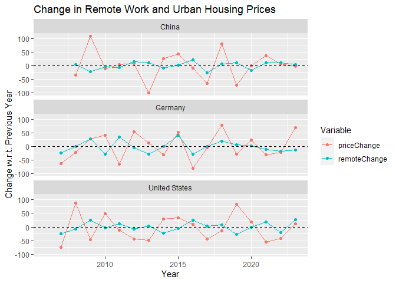
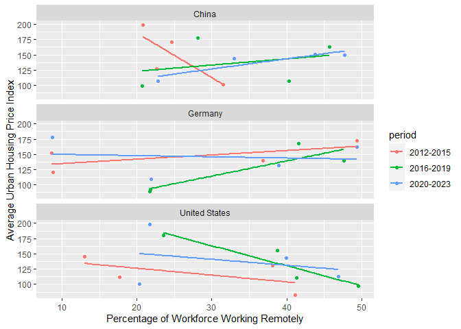

# Time series

    data <- read_delim("Housing prices.csv", delim=";")

    ## Rows: 55 Columns: 10
    ## ── Column specification ────────────────────────────────────────────────────────
    ## Delimiter: ";"
    ## chr (2): Country, Country Abbreviation
    ## dbl (8): Year, Percentage of Workforce Working Remotely, Average Urban Housi...
    ## 
    ## ℹ Use `spec()` to retrieve the full column specification for this data.
    ## ℹ Specify the column types or set `show_col_types = FALSE` to quiet this message.

    data %>% 
      select(Year, Country, `Average Urban Housing Price Index`, `Percentage of Workforce Working Remotely`) %>%
      distinct() |> 
      group_by(Country) %>%
      arrange(Year) %>%
      mutate(
        priceChange = `Average Urban Housing Price Index`-lag(`Average Urban Housing Price Index`),
        remoteChange = `Percentage of Workforce Working Remotely`-lag(`Percentage of Workforce Working Remotely`)
      ) |> 
      ungroup() |> 
      pivot_longer(cols = c(priceChange, remoteChange), names_to = "Variable", values_to = "Change") |>
      ggplot(aes( x = Year, y = Change, col=Variable )) +
      geom_point() +
      geom_line() +
      facet_wrap(~Country, ncol=1) +
      geom_hline(yintercept = 0, linetype="dashed") +
      labs(title = "Change in Remote Work and Urban Housing Prices", y = "Change w.r.t. Previous Year") 

    ## Warning: Removed 6 rows containing missing values (`geom_point()`).

    ## Warning: Removed 2 rows containing missing values (`geom_line()`).

# Correlation trends analog to example image

    data <- read_delim("Housing prices.csv", delim=";")

    ## Rows: 55 Columns: 10
    ## ── Column specification ────────────────────────────────────────────────────────
    ## Delimiter: ";"
    ## chr (2): Country, Country Abbreviation
    ## dbl (8): Year, Percentage of Workforce Working Remotely, Average Urban Housi...
    ## 
    ## ℹ Use `spec()` to retrieve the full column specification for this data.
    ## ℹ Specify the column types or set `show_col_types = FALSE` to quiet this message.

    data %>% 
      select(Year, Country, `Average Urban Housing Price Index`, `Percentage of Workforce Working Remotely`) %>%
      distinct() |> 
      group_by(Country) %>%
      arrange(Year) %>%
      mutate(
        priceChange = `Average Urban Housing Price Index`-lag(`Average Urban Housing Price Index`),
        remoteChange = `Percentage of Workforce Working Remotely`-lag(`Percentage of Workforce Working Remotely`)
      ) |> 
      ungroup() |> 
      mutate(period = case_when(
                Year %in% 2012:2015 ~ "2012-2015",
                Year %in% 2016:2019 ~ "2016-2019",
                Year %in% 2020:2023 ~ "2020-2023",
                TRUE ~ NA_character_)) |> 
      drop_na(period) |>
      # ggplot(aes( x = priceChange, y = priceChange, col=Year<2019 )) +
      ggplot(aes( y = `Average Urban Housing Price Index`, 
                  x = `Percentage of Workforce Working Remotely`, 
                  col=period )) +
      geom_point() +
      geom_smooth(method = "lm", se = F) +
      facet_wrap(~Country, ncol=1)

    ## `geom_smooth()` using formula = 'y ~ x'

