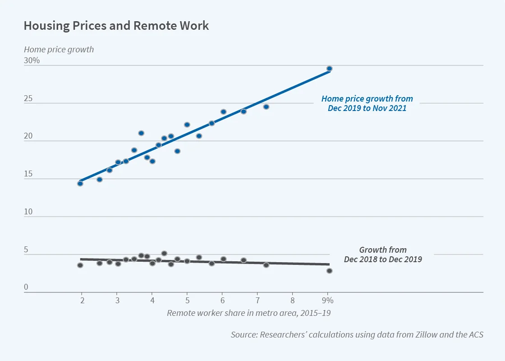

```{r setup, include = F}
library(tidyverse)
```

# The Economic Impact of Remote Work on Urban Housing Markets

In this project, we'll analyze housing prices and remote work. With the recent surge in remote work, especially due to the pandemic, we're curious to see how this trend has impacted urban housing markets over the years.

## Introduction to the Dataset

The dataset used in this analysis is from the Harvard Dataverse and contains information on housing prices and several other relevant variables across different countries. The variables included in the dataset are as follows:

-   **Percentage of Workforce Working Remotely**
-   **Average Urban Housing Price Index**
-   **Urban Population Growth Rate (%)**
-   **Rural Population Growth Rate (%)**
-   **Public Transport Ridership Change (%)**
-   **Internet Infrastructure Investment (Million USD)**
-   **Environmental Impact Score (1-100)**

Here is an extract of the ([Housing_prices.csv](Housing_prices.csv)) data:

```{r, include=F}
Housing_prices <- read_delim("Housing_prices.csv", delim = ";",)
```

```{r, echo=F}
knitr::kable(Housing_prices[1:5, ],  caption = "Housing prices dataset")
```


## Data Manipulation Goals

The primary goal of data manipulation in this project is to prepare the dataset for analysis. This involves sorting the data, identifying and handling missing values, and ensuring that the dataset is in a suitable format for visualization and analysis.

There is one missing datapoint for "Public Transport Ridership Change%" for Germany inthe year 2023:

```{r, echo=F}
knitr::kable(Housing_prices[22:24, ],  caption = "Missing data table")
```


There is also one missing row: The data for China in 2006 is not included.

For the visualization goals, the missing data is not a problem and will be ignored.

## Visualization Goals

The main visualization goal is to create a scatterplot that illustrates the relationship between housing prices and the percentage of the workforce working remotely in different countries. This visualization will help us understand if there is any discernible correlation between remote work trends and urban housing market dynamics.

**Y-Axis name:** Home price growth in %
**X-Axis name:** Remote worker share in metro area 2018 - 2023

(the following images is for illustration only)



For more advanced users, here are some more tasks to fulfill:

- comparison of remote work and home pricing over time (scatter plot with dots for each and respective loess model curves; all within one plot)
- to make the data (and curves) comparable: compute the standard score (Z-score) for each data set and use it as respective y-value for plotting
- draw independent plots for each country and one for all via facetting, i.e. in total 4 plots
- highlight the year 2019 as the starting point of the covid pandemy
- draw different background colors for the area before 2019 and after
- discuss the result of the comparison in a short text below figure
