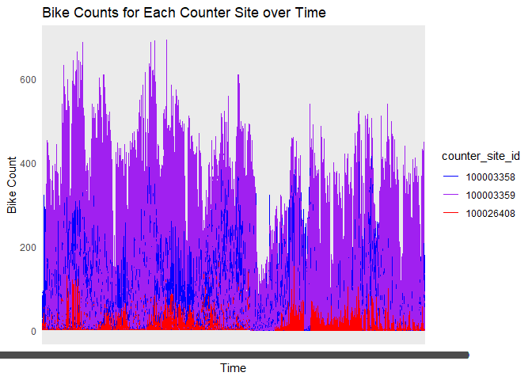
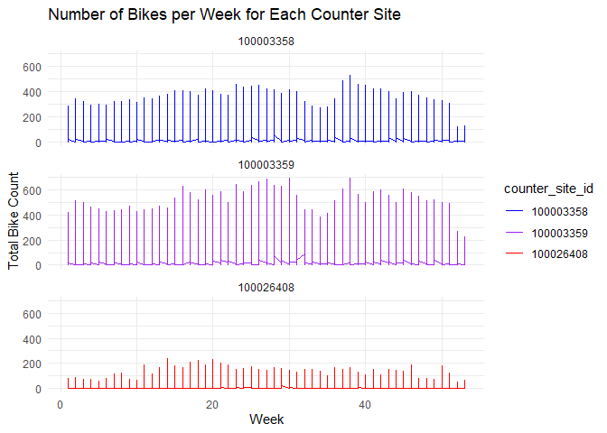
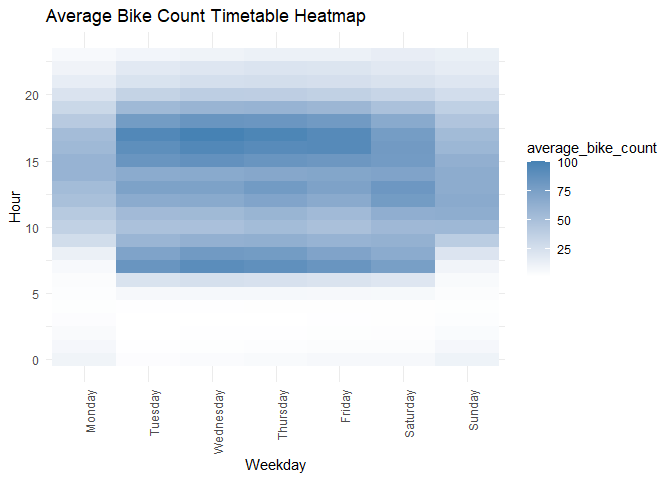

## Data Visualization 1

    merged$counter_site_id <- factor(merged$counter_site_id)
    custom_colors <- c("100003358" = "blue", "100003359" = "purple", "100026408" = "red")
    Graph1 <- ggplot(merged, aes(x = time, y = bike_count, color = counter_site_id)) +
      geom_line() +
      scale_color_manual(values = custom_colors) +
      labs(x = "Time", y = "Bike Count", title = "Bike Counts for Each Counter Site over Time") +
      theme_minimal()
    print(Graph1)

## Data Visualization 2

    Graph2 <- ggplot(merged, aes(x = week, y = bike_count, color = counter_site_id)) +
      geom_line() +
      facet_wrap(~ counter_site_id, nrow = 3) +
      scale_color_manual(values = custom_colors) +
      labs(x = "Week", y = "Total Bike Count", title = "Number of Bikes per Week for Each Counter Site") +
      theme_minimal()
    print(Graph2)

## Data Visualization 3

    weekdays <- c("Monday", "Tuesday", "Wednesday", "Thursday", "Friday", "Saturday", "Sunday")
    bike_count_wday$wday <- factor(bike_count_wday$wday, labels = weekdays)
      heatmap_data <- dcast(bike_count_wday, hour ~ wday, value.var = "avg_count")
      heatmap_data_long <- melt(heatmap_data, id.vars = "hour", variable.name = "weekday", value.name = "average_bike_count")
    Heatmap <- ggplot(heatmap_data_long, aes(x = weekday, y = hour, fill = average_bike_count)) +
      geom_tile() +
      scale_fill_gradient(low = "white", high = "steelblue") +
      labs(x = "Weekday", y = "Hour", title = "Average Bike Count Timetable Heatmap") +
      theme_minimal() +
      theme(axis.text.x = element_text(angle = 90, hjust = 1))
    print(Heatmap)

