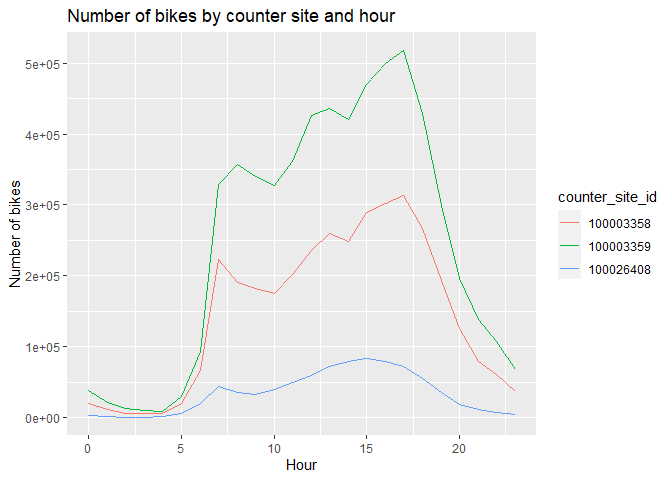

## Load the data

First let’s load the data.

    library(readr)
    library(purrr)

    # Set the working directory to the folder where this file is located
    setwd(dirname(rstudioapi::getActiveDocumentContext()$path))

    # Load the data from the RData file that is in the same folder as this Rmd file
    list.files(path = paste0(getwd(), "/BikeData/"), pattern = "*.csv", full.names = TRUE) %>% 
        set_names(nm = tools::file_path_sans_ext(basename(.))) %>% 
        walk2(.x = ., .y = names(.), ~ assign(.y, read_csv(.x), envir = .GlobalEnv))

    ## Rows: 545022 Columns: 4
    ## ── Column specification ────────────────────────────────────────────────────────
    ## Delimiter: ","
    ## dbl  (3): bike_count, channel_id, counter_site_id
    ## dttm (1): time
    ## 
    ## ℹ Use `spec()` to retrieve the full column specification for this data.
    ## ℹ Specify the column types or set `show_col_types = FALSE` to quiet this message.
    ## Rows: 3 Columns: 5
    ## ── Column specification ────────────────────────────────────────────────────────
    ## Delimiter: ","
    ## chr (2): counter_site, counter_serial
    ## dbl (3): counter_site_id, longitude, latitude
    ## 
    ## ℹ Use `spec()` to retrieve the full column specification for this data.
    ## ℹ Specify the column types or set `show_col_types = FALSE` to quiet this message.
    ## Rows: 1130 Columns: 4
    ## ── Column specification ────────────────────────────────────────────────────────
    ## Delimiter: ","
    ## dbl  (3): semester_break, school_holiday, public_holiday
    ## date (1): date
    ## 
    ## ℹ Use `spec()` to retrieve the full column specification for this data.
    ## ℹ Specify the column types or set `show_col_types = FALSE` to quiet this message.
    ## Rows: 46212 Columns: 9
    ## ── Column specification ────────────────────────────────────────────────────────
    ## Delimiter: ","
    ## dbl  (8): temperature, windspeed, humidity, heaven, rain, snow, thunderstorm...
    ## dttm (1): time
    ## 
    ## ℹ Use `spec()` to retrieve the full column specification for this data.
    ## ℹ Specify the column types or set `show_col_types = FALSE` to quiet this message.

## Merge the data

The data frame bike\_counts contains the number of bikes that passed
through each point every hour and the weather data frame contains the
weather information for each hour. We need to merge both data frames to
analyze the relationship between the number of bikes and the weather.
Since the data frames cointain a column with the date and hour, we can
use this column to merge the data frames.

    # Merge the data frames
    bike_data <- merge(bike_counts, weather, by = "time")
    head(bike_data)

    ##                  time bike_count channel_id counter_site_id temperature
    ## 1 2018-01-01 01:00:00         18  102003358       100003358           9
    ## 2 2018-01-01 01:00:00          3  101026408       100026408           9
    ## 3 2018-01-01 01:00:00         23  101003358       100003358           9
    ## 4 2018-01-01 01:00:00          1  102026408       100026408           9
    ## 5 2018-01-01 01:00:00          0  102003359       100003359           9
    ## 6 2018-01-01 01:00:00          0  101003359       100003359           9
    ##   windspeed humidity heaven rain snow thunderstorms fog
    ## 1         9       71      5    0    0             0   0
    ## 2         9       71      5    0    0             0   0
    ## 3         9       71      5    0    0             0   0
    ## 4         9       71      5    0    0             0   0
    ## 5         9       71      5    0    0             0   0
    ## 6         9       71      5    0    0             0   0

The holydays dataset contains the dates of the holidays in the city. We
need to merge this data with the bike\_data data frame to analyze the
relationship between the number of bikes and the holidays. The first
column is the data with the format “YYYY-MM-DD”, on the other hand the
bike\_data frame has the date and hour in a combined column. We need to
extract the date from the time column to merge the data frames.

    # Extract the date from the time column
    bike_data$date <- as.Date(bike_data$time)
    # Merge the data frames
    bike_data <- merge(bike_data, holidays, by = "date")
    #divide the time column into date and hour
    bike_data$time <- as.POSIXct(bike_data$time)
    bike_data$hour <- as.numeric(format(bike_data$time, "%H"))
    bike_data$counter_site_id <- as.factor(bike_data$counter_site_id)
    bike_data$rain <- as.factor(bike_data$rain)
    bike_data$holiday <- as.factor(bike_data$school_holiday+bike_data$public_holiday)
    bike_data$channel_id <- as.factor(bike_data$channel_id)

    head(bike_data)

    ##         date                time bike_count channel_id counter_site_id
    ## 1 2018-01-01 2018-01-01 05:00:00          0  102003359       100003359
    ## 2 2018-01-01 2018-01-01 16:00:00         35  101003358       100003358
    ## 3 2018-01-01 2018-01-01 05:00:00          1  101026408       100026408
    ## 4 2018-01-01 2018-01-01 04:00:00          0  101003359       100003359
    ## 5 2018-01-01 2018-01-01 02:00:00          0  101026408       100026408
    ## 6 2018-01-01 2018-01-01 05:00:00          1  102003358       100003358
    ##   temperature windspeed humidity heaven rain snow thunderstorms fog
    ## 1           7        19       81      5    0    0             0   0
    ## 2           8        15       57      5    0    0             0   0
    ## 3           7        19       81      5    0    0             0   0
    ## 4           8        19       76      5    0    0             0   0
    ## 5           8        11       87      5    3    0             0   0
    ## 6           7        19       81      5    0    0             0   0
    ##   semester_break school_holiday public_holiday hour holiday
    ## 1              0              1              1    5       2
    ## 2              0              1              1   16       2
    ## 3              0              1              1    5       2
    ## 4              0              1              1    4       2
    ## 5              0              1              1    2       2
    ## 6              0              1              1    5       2

## Explore the data to find missing values

Let’s explore the data to find missing values.

    # Number of missing values
    colSums(is.na(bike_data))

    ##            date            time      bike_count      channel_id counter_site_id 
    ##               0               0               0               0               0 
    ##     temperature       windspeed        humidity          heaven            rain 
    ##               0               0               0               0               0 
    ##            snow   thunderstorms             fog  semester_break  school_holiday 
    ##               0               0               0               0               0 
    ##  public_holiday            hour         holiday 
    ##               0               0               0

No missing values were found, however, we only teste for NA values. We
need to check if there are any other type of missing values as zeros in
the channel\_id or counter\_site\_id column

    # Number of zeros in the channel_id column
    sum(bike_data$channel_id == 0)

    ## [1] 0

    # Number of zeros in the counter_site_id column
    sum(bike_data$counter_site_id == 0)

    ## [1] 0

No outliers were found in the channel\_id or counter\_site\_id columns.
We can now proceed with the analysis.

## Plot the data

Lets plot the number of bikes that passed through each point every hour
separating the data by counter\_site\_id and group by the hour of the
day.

    library(ggplot2)
    library(dplyr)

    ## 
    ## Attache Paket: 'dplyr'

    ## Die folgenden Objekte sind maskiert von 'package:stats':
    ## 
    ##     filter, lag

    ## Die folgenden Objekte sind maskiert von 'package:base':
    ## 
    ##     intersect, setdiff, setequal, union

    # Agrupar por hour y counter_site_id, y sumar bike_count
    bike_data_per_hour <- bike_data %>%
        group_by(hour, counter_site_id) %>%
        summarise(bike_count = sum(bike_count), .groups = 'drop')

    bike_data_per_hour$counter_site_id <- as.factor(bike_data_per_hour$counter_site_id)

    # Plot
    ggplot(bike_data_per_hour, aes(x = hour, y = bike_count, color = counter_site_id, group = counter_site_id)) +
        geom_line() +
        labs(title = "Number of bikes by counter site and hour", x = "Hour", y = "Number of bikes")

We can see that the number of bikes that pass through each point varies
throughout the day. There is a peak in the morning and another in the
afternoon. The number of bikes is higher in the afternoon than in the
morning.

## Analyze the relationship between the number of bikes and the weather

Let’s plot the number of bikes that passed through each point every hour
and the weather information. We will create a new data frame with the
sum of the number of bikes by hour in all the counter sites and merge it
with the weather data frame.

    # Summarize the number of bikes by hour
    bike_data_per_hour_all <- bike_data %>%
        group_by(hour) %>%
        summarise(bike_count = sum(bike_count), .groups = 'drop')
    #extract the hour from the time column in the weather data
    weather$hour <- as.numeric(format(weather$time, "%H"))
    #merge with the weather data
    bike_data_per_hour_all <- merge(bike_data_per_hour_all, weather, by = "hour")
    bike_data_per_hour_all$rain <- as.factor(bike_data_per_hour_all$rain)
    bike_data_per_hour_all$snow <- as.factor(bike_data_per_hour_all$snow)
    #bike_data_per_hour_all$holiday <- as.factor(bike_data_per_hour_all$holiday)
    bike_data_per_hour_all$temperature <- as.numeric(bike_data_per_hour_all$temperature)
    bike_data_per_hour_all$windspeed <- as.numeric(bike_data_per_hour_all$windspeed)

Now we can plot the number of bikes that passed through all the counter
sites every hour and the weather information.

    # Plot
    ggplot(bike_data_per_hour_all, aes(x = hour, y = bike_count, color = rain, linetype = rain)) +
        geom_line() +
        labs(title = "Number of bikes by hour and rain", x = "Hour", y = "Number of bikes", color = "Rain", linetype = "Rain")

