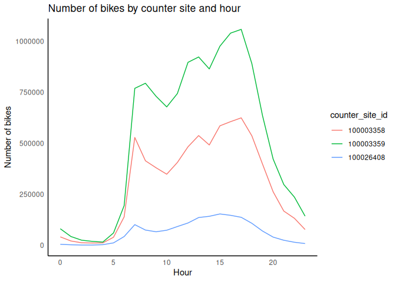
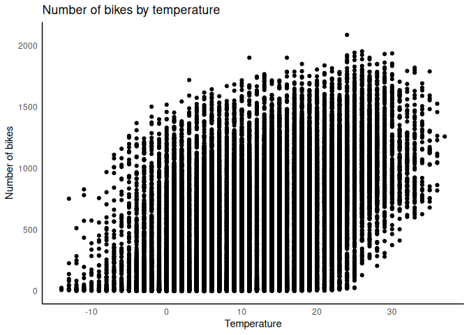
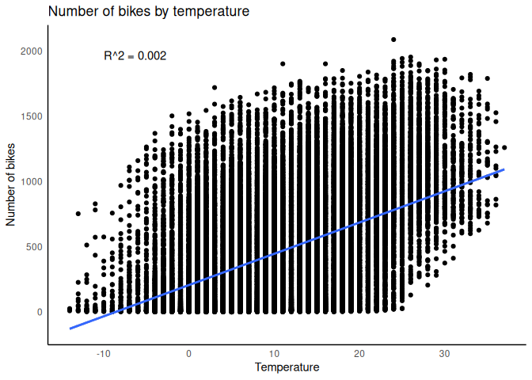
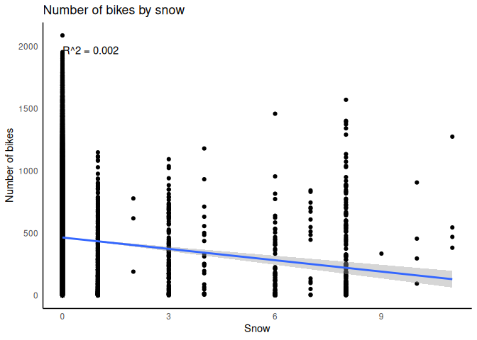
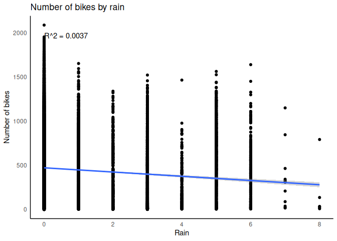

## Load the data

First let’s load the data.

    # Load necessary libraries
    library(here)
    library(readr)
    library(purrr)
    library(magrittr)
    library(dplyr)

    list.files(path = here("Projects/DrMohamedElsherif/BikeData"), pattern = "*.csv", full.names = TRUE) %>% 
        set_names(nm = tools::file_path_sans_ext(basename(.))) %>% 
        walk2(.x = ., .y = names(.), ~ assign(.y, read_csv(.x), envir = .GlobalEnv))

## Merge the data

The data frame bike\_counts contains the number of bikes that passed
through each point every hour and the weather data frame contains the
weather information for each hour. We need to merge both data frames to
analyze the relationship between the number of bikes and the weather.
Since the data frames cointain a column with the date and hour, we can
use this column to merge the data frames.

    # Merge the data frames
    bike_data <- merge(bike_counts, weather, by = "time")
    head(bike_data)

    ##                  time bike_count channel_id counter_site_id temperature
    ## 1 2018-01-01 01:00:00         18  102003358       100003358           9
    ## 2 2018-01-01 01:00:00          3  101026408       100026408           9
    ## 3 2018-01-01 01:00:00         23  101003358       100003358           9
    ## 4 2018-01-01 01:00:00          1  102026408       100026408           9
    ## 5 2018-01-01 01:00:00          0  102003359       100003359           9
    ## 6 2018-01-01 01:00:00          0  101003359       100003359           9
    ##   windspeed humidity heaven rain snow thunderstorms fog
    ## 1         9       71      5    0    0             0   0
    ## 2         9       71      5    0    0             0   0
    ## 3         9       71      5    0    0             0   0
    ## 4         9       71      5    0    0             0   0
    ## 5         9       71      5    0    0             0   0
    ## 6         9       71      5    0    0             0   0

## Explore the data to find missing values

Let’s explore the data to find missing values.

    # Number of missing values
    colSums(is.na(bike_data))

    ##            time      bike_count      channel_id counter_site_id     temperature 
    ##               0               0               0               0               0 
    ##       windspeed        humidity          heaven            rain            snow 
    ##               0               0               0               0               0 
    ##   thunderstorms             fog 
    ##               0               0

No missing values were found, however, we only teste for NA values. We
need to check if there are any other type of missing values as zeros in
the channel\_id or counter\_site\_id column

    # Number of zeros in the channel_id column
    sum(bike_data$channel_id == 0)

    ## [1] 0

    # Number of zeros in the counter_site_id column
    sum(bike_data$counter_site_id == 0)

    ## [1] 0

No outliers were found in the channel\_id or counter\_site\_id columns.
We can now proceed with the analysis.

## Plot the data

Lets plot the number of bikes that passed through each point every hour
separating the data by counter\_site\_id and group by the hour of the
day.

    library(ggplot2)
    library(dplyr)

    # Extract the hour from the time column adding it as a new column
    bike_data$hour <- as.numeric(format(bike_data$time, "%H"))

    # Agrupar por hour y counter_site_id, y sumar bike_count
    bike_data_per_hour <- bike_data %>%
        group_by(hour, counter_site_id) %>%
        summarise(bike_count = sum(bike_count), .groups = 'drop')

    bike_data_per_hour$counter_site_id <- as.factor(bike_data_per_hour$counter_site_id)

    # Plot
    ggplot(bike_data_per_hour, aes(x = hour, y = bike_count, color = counter_site_id, group = counter_site_id)) +
        geom_line() +
        labs(title = "Number of bikes by counter site and hour", x = "Hour", y = "Number of bikes")+ 
        theme_minimal() +
        theme(panel.grid.major = element_blank(), panel.grid.minor = element_blank(),
              panel.background = element_blank(), axis.line = element_line(colour = "black"))

We can see that the number of bikes that pass through each point varies
throughout the day. There is a peak in the morning and another in the
afternoon. The number of bikes is higher in the afternoon than in the
morning.

## Analyze the relationship between the number of bikes and the weather

Let’s plot the number of bikes that passed through each point every hour
and the weather information. We will create a new data frame with the
sum of the number of bikes by hour in all the counter sites and merge it
with the weather data frame.

    bike_data_weather <- bike_data %>%
        mutate(time = as.POSIXct(time, format = "%Y-%m-%d %H:%M:%S")) %>%
        group_by(time) %>% 
        summarise(bike_count = sum(bike_count), .groups = 'drop') %>%
        left_join(weather, by = "time")

Now we will plot the number of bikes per hour in the Y axe against the
temperature in the X axe.

    ggplot(bike_data_weather, aes(x = temperature, y = bike_count)) +
        geom_point() +
        labs(title = "Number of bikes by temperature", x = "Temperature", y = "Number of bikes")+
        theme_minimal() + 
        theme(panel.grid.major = element_blank(), panel.grid.minor = element_blank(),
              panel.background = element_blank(), axis.line = element_line(colour = "black"))

In this plot we can see that the number of bikes that pass through each
point increases as the temperature increases. There is a positive
relationship between the number of bikes and the temperature.

We may add a linear regression line to the plot to visualize the
relationship between the number of bikes and the temperature.

    ggplot(bike_data_weather, aes(x = temperature, y = bike_count)) +
        geom_point() +
        geom_smooth(method = "lm") +
        labs(title = "Number of bikes by temperature", x = "Temperature", y = "Number of bikes")+
        theme_minimal() + 
        theme(panel.grid.major = element_blank(), panel.grid.minor = element_blank(),
              panel.background = element_blank(), axis.line = element_line(colour = "black"))+
              #add the R squared value
        annotate("text", x = -10, y = 2000, label = paste("R^2 =", round(summary(lm(bike_count ~ snow, data = bike_data_weather))$r.squared, 4)), hjust = 0, vjust = 1)

    ## `geom_smooth()` using formula = 'y ~ x'

Regardless the positive relationship between the number of bikes and the
temperature, the R squared value is very low, which means that the
temperature is not a good predictor of the number of bikes.

We can do the same analysis with the snow column.

    ggplot(bike_data_weather, aes(x = snow, y = bike_count)) +
        geom_point() +
        geom_smooth(method = "lm") +
        labs(title = "Number of bikes by snow", x = "Snow", y = "Number of bikes")+
        theme_minimal() + 
        theme(panel.grid.major = element_blank(), panel.grid.minor = element_blank(),
            panel.background = element_blank(), axis.line = element_line(colour = "black"))+
        annotate("text", x = 0, y = 2000, label = paste("R^2 =", round(summary(lm(bike_count ~ snow, data = bike_data_weather))$r.squared, 4)), hjust = 0, vjust = 1)

    ## `geom_smooth()` using formula = 'y ~ x'

In the case of the snow, a low R squared value is obtained, which means
that the snow is not a good predictor of the number of bikes. This may
be because even when it is not snowing, the stations register a low
number of bikes. The reason may be related to failed sensors or other
factors that are not related to the weather.

Let’s analyze if the rain is a good predictor of the number of bikes.

    ggplot(bike_data_weather, aes(x = rain, y = bike_count)) +
        geom_point() +
        geom_smooth(method = "lm") +
        labs(title = "Number of bikes by rain", x = "Rain", y = "Number of bikes")+
        theme_minimal() + 
        theme(panel.grid.major = element_blank(), panel.grid.minor = element_blank(),
            panel.background = element_blank(), axis.line = element_line(colour = "black"))+
        annotate("text", x = 0, y = 2000, label = paste("R^2 =", round(summary(lm(bike_count ~ rain, data = bike_data_weather))$r.squared, 4)), hjust = 0, vjust = 1)

    ## `geom_smooth()` using formula = 'y ~ x'

It is interesting to notiece that in the days of rain and snow, the
records of the stations are lower than in the days without rain or snow.
This is because the sensors may be affected by the weather. Also it
could be possible that the points are being overploted in the plot, so
we may need to check the number of records for each type of weather.

    bike_data_weather %>%
        count(rain)

    ## # A tibble: 9 × 2
    ##    rain     n
    ##   <dbl> <int>
    ## 1     0 40590
    ## 2     1  1105
    ## 3     2   384
    ## 4     3  2964
    ## 5     4   168
    ## 6     5   685
    ## 7     6   233
    ## 8     7    12
    ## 9     8     6

As we can see, the number of records for the days without rain is higher
than the number of records for the days with rain.

Let’s do the same for the snow column.

    bike_data_weather %>%
        count(snow)

    ## # A tibble: 11 × 2
    ##     snow     n
    ##    <dbl> <int>
    ##  1     0 45066
    ##  2     1   650
    ##  3     2     3
    ##  4     3   124
    ##  5     4    23
    ##  6     6    66
    ##  7     7    17
    ##  8     8   189
    ##  9     9     1
    ## 10    10     4
    ## 11    11     4

The number of records for the days without snow is higher than the
number of records for the days with snow. This lead us to the conclusion
that the weather may be affecting the sensors of the stations.
