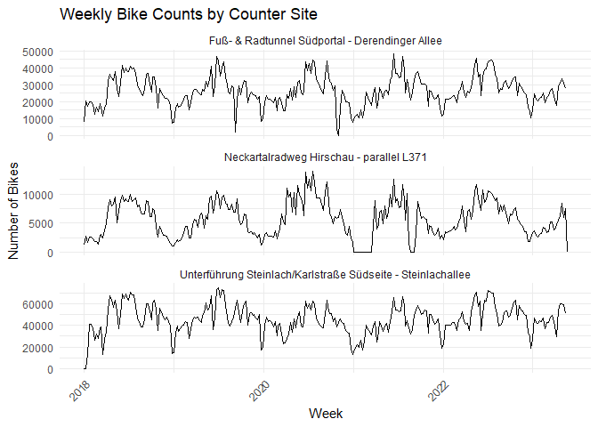
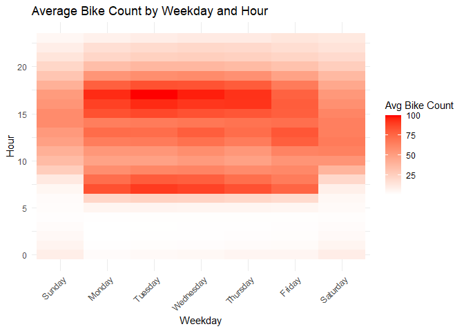
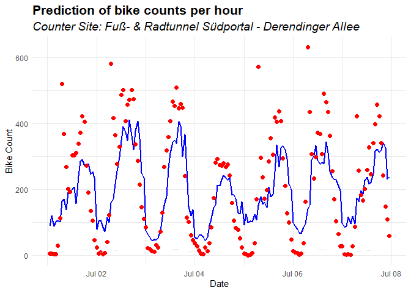

------------------------------------------------------------------------

### Bike count data

1.  Load all csv files into data frames. For each, create a variable and
    name the variable according to the respective filename. Familiarize
    yourself with the data.

    library(readr)

    ## Warning: package 'readr' was built under R version 4.3.3

    # Define file paths
    data_path <- "C:/Users/Admin/Downloads/DS400 Data Science Project Management WS23-24/Assignments/Assignment2/data/"

    # Load datasets
    bike_counts <- read_csv(paste0(data_path, "bike_counts.csv"))

    ## Rows: 545022 Columns: 4
    ## ── Column specification ────────────────────────────────────────────────────────
    ## Delimiter: ","
    ## dbl  (3): bike_count, channel_id, counter_site_id
    ## dttm (1): time
    ## 
    ## ℹ Use `spec()` to retrieve the full column specification for this data.
    ## ℹ Specify the column types or set `show_col_types = FALSE` to quiet this message.

    counter_sites <- read_csv(paste0(data_path, "counter_sites.csv"))

    ## Rows: 3 Columns: 5
    ## ── Column specification ────────────────────────────────────────────────────────
    ## Delimiter: ","
    ## chr (2): counter_site, counter_serial
    ## dbl (3): counter_site_id, longitude, latitude
    ## 
    ## ℹ Use `spec()` to retrieve the full column specification for this data.
    ## ℹ Specify the column types or set `show_col_types = FALSE` to quiet this message.

    holidays <- read_csv(paste0(data_path, "holidays.csv"))

    ## Rows: 1130 Columns: 4
    ## ── Column specification ────────────────────────────────────────────────────────
    ## Delimiter: ","
    ## dbl  (3): semester_break, school_holiday, public_holiday
    ## date (1): date
    ## 
    ## ℹ Use `spec()` to retrieve the full column specification for this data.
    ## ℹ Specify the column types or set `show_col_types = FALSE` to quiet this message.

    weather <- read_csv(paste0(data_path, "weather.csv"))

    ## Rows: 46212 Columns: 9
    ## ── Column specification ────────────────────────────────────────────────────────
    ## Delimiter: ","
    ## dbl  (8): temperature, windspeed, humidity, heaven, rain, snow, thunderstorm...
    ## dttm (1): time
    ## 
    ## ℹ Use `spec()` to retrieve the full column specification for this data.
    ## ℹ Specify the column types or set `show_col_types = FALSE` to quiet this message.

    # Display the first few rows of each dataset
    head(bike_counts)

    ## # A tibble: 6 × 4
    ##   time                bike_count channel_id counter_site_id
    ##   <dttm>                   <dbl>      <dbl>           <dbl>
    ## 1 2018-01-01 01:00:00         23  101003358       100003358
    ## 2 2018-01-01 02:00:00         13  101003358       100003358
    ## 3 2018-01-01 03:00:00         19  101003358       100003358
    ## 4 2018-01-01 04:00:00          6  101003358       100003358
    ## 5 2018-01-01 05:00:00          3  101003358       100003358
    ## 6 2018-01-01 06:00:00          4  101003358       100003358

    head(counter_sites)

    ## # A tibble: 3 × 5
    ##   counter_site_id counter_site                 longitude latitude counter_serial
    ##             <dbl> <chr>                            <dbl>    <dbl> <chr>         
    ## 1       100003359 Unterführung Steinlach/Karl…      9.06     48.5 Y2H17123962   
    ## 2       100003358 Fuß- & Radtunnel Südportal …      9.05     48.5 YTG13063794   
    ## 3       100026408 Neckartalradweg Hirschau - …      9.02     48.5 Y2H21035424

    head(holidays)

    ## # A tibble: 6 × 4
    ##   date       semester_break school_holiday public_holiday
    ##   <date>              <dbl>          <dbl>          <dbl>
    ## 1 2018-01-01              0              1              1
    ## 2 2018-01-02              0              1              0
    ## 3 2018-01-03              0              1              0
    ## 4 2018-01-04              0              1              0
    ## 5 2018-01-05              0              1              0
    ## 6 2018-01-06              0              0              1

    head(weather)

    ## # A tibble: 6 × 9
    ##   time                temperature windspeed humidity heaven  rain  snow
    ##   <dttm>                    <dbl>     <dbl>    <dbl>  <dbl> <dbl> <dbl>
    ## 1 2018-01-01 00:00:00           8         7       71      5     0     0
    ## 2 2018-01-01 01:00:00           9         9       71      5     0     0
    ## 3 2018-01-01 02:00:00           8        11       87      5     3     0
    ## 4 2018-01-01 03:00:00           8        20       76      5     0     0
    ## 5 2018-01-01 04:00:00           8        19       76      5     0     0
    ## 6 2018-01-01 05:00:00           7        19       81      5     0     0
    ## # ℹ 2 more variables: thunderstorms <dbl>, fog <dbl>

1.  Convert all date or datetime columns to a date/datetime datatype. In
    R, this should have been done automatically when importing the csv.

1.  Aggregate the `bike_counts` dataset by `counter_site` such that the
    number of bikes per hour is now the sum of the `bike_counts` across
    all channels. Call the resulting object `bike_counts_agg`.

    # Load necessary libraries
    library(readr)
    library(dplyr)

    ## Warning: package 'dplyr' was built under R version 4.3.3

    ## 
    ## Attaching package: 'dplyr'

    ## The following objects are masked from 'package:stats':
    ## 
    ##     filter, lag

    ## The following objects are masked from 'package:base':
    ## 
    ##     intersect, setdiff, setequal, union

    # Aggregate bike counts by counter_site_id and time
    bike_counts_agg <- bike_counts %>%
      group_by(counter_site_id, time) %>%
      summarise(bike_count = sum(bike_count), .groups = 'drop')

    # Display the aggregated dataset
    head(bike_counts_agg)

    ## # A tibble: 6 × 3
    ##   counter_site_id time                bike_count
    ##             <dbl> <dttm>                   <dbl>
    ## 1       100003358 2018-01-01 01:00:00         41
    ## 2       100003358 2018-01-01 02:00:00         21
    ## 3       100003358 2018-01-01 03:00:00         32
    ## 4       100003358 2018-01-01 04:00:00         18
    ## 5       100003358 2018-01-01 05:00:00          4
    ## 6       100003358 2018-01-01 06:00:00         13

------------------------------------------------------------------------

### Merging the data

1.  Merge all datasets by the appropriate key. Use a left-join for all
    datasets except the `weather` data. The first ‘left’ dataset should
    be the `bike_counts_agg`. For the `weather` data use an inner-join.
    Call the result `merged`.

As you might have noticed, for the `holidays` dataset there is no column
in the `bike_counts` data that can be directly used for the merge.
Therefore, you first have to create a new column which contains just the
date of the respective timestamp. In R it is possible with the
`as.Date()` function. After the merge, drop the `date` column as it is
not needed anymore.

    # Merge bike_counts_agg with counter_sites using left join
    merged <- bike_counts_agg %>%
      left_join(counter_sites, by = "counter_site_id")

    # Add date column for merging with holidays
    merged <- merged %>%
      mutate(date = as.Date(time)) %>%
      left_join(holidays, by = "date") %>%
      select(-date)  # Drop the date column after the merge

    # Merge the resulting data with weather using inner join
    merged <- merged %>%
      inner_join(weather, by = c("time" = "time"))

    # Display the merged dataset
    head(merged)

    ## # A tibble: 6 × 18
    ##   counter_site_id time                bike_count counter_site longitude latitude
    ##             <dbl> <dttm>                   <dbl> <chr>            <dbl>    <dbl>
    ## 1       100003358 2018-01-01 01:00:00         41 Fuß- & Radt…      9.05     48.5
    ## 2       100003358 2018-01-01 02:00:00         21 Fuß- & Radt…      9.05     48.5
    ## 3       100003358 2018-01-01 03:00:00         32 Fuß- & Radt…      9.05     48.5
    ## 4       100003358 2018-01-01 04:00:00         18 Fuß- & Radt…      9.05     48.5
    ## 5       100003358 2018-01-01 05:00:00          4 Fuß- & Radt…      9.05     48.5
    ## 6       100003358 2018-01-01 06:00:00         13 Fuß- & Radt…      9.05     48.5
    ## # ℹ 12 more variables: counter_serial <chr>, semester_break <dbl>,
    ## #   school_holiday <dbl>, public_holiday <dbl>, temperature <dbl>,
    ## #   windspeed <dbl>, humidity <dbl>, heaven <dbl>, rain <dbl>, snow <dbl>,
    ## #   thunderstorms <dbl>, fog <dbl>

------------------------------------------------------------------------

### Missing values

1.  For the columns contained in bike\_counts and counter\_sites there
    should be no missing values. For the holidays columns, however, you
    will encounter a lot of missing values after the join. Briefly
    describe the reason for this. Can you come up with a reasonable
    approach to fill these missing values? Implement your approach.

    library(tidyr) 

    ## Warning: package 'tidyr' was built under R version 4.3.3

    # Function to check for missing values and return column names with missing values
    check_missing_values <- function(df) {
      missing_cols <- sapply(df, function(x) sum(is.na(x)) > 0)
      colnames(df)[missing_cols]
    }

    # Check for missing values in each table
    bike_counts_missing <- check_missing_values(bike_counts_agg)
    counter_sites_missing <- check_missing_values(counter_sites)
    holidays_missing <- check_missing_values(holidays)
    weather_missing <- check_missing_values(weather)
    merged_missing <- check_missing_values(merged)

    # Display columns with missing values
    print("Bike Counts missing columns:")

    ## [1] "Bike Counts missing columns:"

    print(bike_counts_missing)

    ## character(0)

    print("Counter Sites missing columns:")

    ## [1] "Counter Sites missing columns:"

    print(counter_sites_missing)

    ## character(0)

    print("Holidays missing columns:")

    ## [1] "Holidays missing columns:"

    print(holidays_missing)

    ## character(0)

    print("Weather missing columns:")

    ## [1] "Weather missing columns:"

    print(weather_missing)

    ## character(0)

    print("Merged missing columns:")

    ## [1] "Merged missing columns:"

    print(merged_missing)

    ## [1] "semester_break" "school_holiday" "public_holiday"

    # Fill missing values in holidays columns with 0
    merged <- merged %>%
      mutate(across(starts_with("semester_break"), ~replace_na(., 0))) %>%
      mutate(across(starts_with("school_holiday"), ~replace_na(., 0))) %>%
      mutate(across(starts_with("public_holiday"), ~replace_na(., 0)))

    # Check for remaining missing values
    merged_missing_after_fill <- check_missing_values(merged)
    print("Merged missing columns after fill:")

    ## [1] "Merged missing columns after fill:"

    print(merged_missing_after_fill)

    ## character(0)

1.  Since we used an inner-join for the `weather` data, there should be
    no missing values as well. Can you confirm this?

The missing values in the holidays columns arise because not all
timestamps in the bike\_counts\_agg dataset have corresponding dates in
the holidays dataset. Specifically, the holidays dataset only marks
certain days (e.g., public holidays, school holidays), and if there is
no entry for a specific date, it results in a missing value when joined.

    holidays_missing <- check_missing_values(holidays)
    holidays_missing

    ## character(0)

------------------------------------------------------------------------

### Visual data exploration

Before estimating a model on the data, we try to get a feeling for
possible patterns in the data. That helps to feed the data to the model
in a meaningful way.

#### A: Bike counts per week

The first thing we want to have a look at is just the time series of
aggregated bike counts.

1.  Aggregate the `bike_counts` (per hour) to bike counts per week.
    Hint: For the grouping part you might want to have a look at the API
    documentation of
    [{lubridate}](https://lubridate.tidyverse.org/reference/round_date.html)
    (R).

    library(lubridate)

    ## Warning: package 'lubridate' was built under R version 4.3.3

    ## 
    ## Attaching package: 'lubridate'

    ## The following objects are masked from 'package:base':
    ## 
    ##     date, intersect, setdiff, union

    # Aggregate bike counts to weekly counts
    bike_counts_weekly <- bike_counts %>%
      mutate(week = floor_date(time, unit = "week")) %>%
      group_by(counter_site_id, week) %>%
      summarise(bike_count = sum(bike_count), .groups = 'drop')

    # Display the aggregated dataset
    head(bike_counts_weekly)

    ## # A tibble: 6 × 3
    ##   counter_site_id week                bike_count
    ##             <dbl> <dttm>                   <dbl>
    ## 1       100003358 2017-12-31 00:00:00       7665
    ## 2       100003358 2018-01-07 00:00:00      20547
    ## 3       100003358 2018-01-14 00:00:00      17066
    ## 4       100003358 2018-01-21 00:00:00      19776
    ## 5       100003358 2018-01-28 00:00:00      19888
    ## 6       100003358 2018-02-04 00:00:00      18336

1.  Create a faceted lineplot that shows the number of bikes per week.
    For each counter site there should be a facet with the respective
    counter site name as label, arranged such that the resulting figure
    has 3 rows and 1 column. The x and y axis should be shared so that
    the subplots are comparable.

    library(ggplot2)

    ## Warning: package 'ggplot2' was built under R version 4.3.3

    # Merge with counter_sites to get the counter site names
    bike_counts_weekly <- bike_counts_weekly %>%
      left_join(counter_sites, by = "counter_site_id")

    # Create faceted line plot
    ggplot(bike_counts_weekly, aes(x = week, y = bike_count)) +
      geom_line() +
      facet_wrap(~ counter_site, scales = "free_y", nrow = 3) +
      labs(title = "Weekly Bike Counts by Counter Site", x = "Week", y = "Number of Bikes") +
      theme_minimal() +
      theme(axis.text.x = element_text(angle = 45, hjust = 1))

------------------------------------------------------------------------

#### B: Bike counts per hour and weekday

Next, we want to look for timetable-ish patterns.

1.  Aggregate the `bike_counts` dataset to get the average number of
    bikes per hour separated by weekday (across all counter sites).

    # Extract weekday from the time column
    bike_counts <- bike_counts %>%
      mutate(weekday = wday(time, label = TRUE, abbr = FALSE))

    # Aggregate to get the average number of bikes per hour by weekday
    avg_bikes_per_weekday <- bike_counts %>%
      group_by(weekday) %>%
      summarise(avg_bike_count = mean(bike_count, na.rm = TRUE))

    # Display the aggregated dataset
    print(avg_bikes_per_weekday)

    ## # A tibble: 7 × 2
    ##   weekday   avg_bike_count
    ##   <ord>              <dbl>
    ## 1 Sunday              25.0
    ## 2 Monday              43.3
    ## 3 Tuesday             45.8
    ## 4 Wednesday           46.3
    ## 5 Thursday            44.5
    ## 6 Friday              43.0
    ## 7 Saturday            31.0

1.  Plot the resulting average bike count in a heatmap such that it
    looks like a timetable (`weekday` on the x-axis and `hour` on the
    y-axis).

    # Extract weekday and hour from the time column
    bike_counts <- bike_counts %>%
      mutate(weekday = wday(time, label = TRUE, abbr = FALSE),
             hour = hour(time))

    # Aggregate to get the average number of bikes per hour by weekday and hour
    avg_bikes_per_weekday_hour <- bike_counts %>%
      group_by(weekday, hour) %>%
      summarise(avg_bike_count = mean(bike_count, na.rm = TRUE), .groups = 'drop')

    # Create heatmap
    ggplot(avg_bikes_per_weekday_hour, aes(x = weekday, y = hour, fill = avg_bike_count)) +
      geom_tile() +
      scale_fill_gradient(low = "white", high = "red") +
      labs(title = "Average Bike Count by Weekday and Hour",
           x = "Weekday", y = "Hour", fill = "Avg Bike Count") +
      theme_minimal() +
      theme(axis.text.x = element_text(angle = 45, hjust = 1))

------------------------------------------------------------------------

### Fixed effects regression

Finally, we want to regress the number of bikes per hour (`bike_count`)
on the other variables.

1.  Which variables should be included as fixed effects? What about the
    `time` column? Since we are not estimating a time series model, it
    does not make sense to include it just as it is. However, there is
    certainly relevant information contained in the timestamp. By
    referencing to the results of the last section, state which
    information of the timestamp could be relevant/predictive. Extract
    this information by creating new variables in the data frame.  
    *(Hint: You can use `month(time)` from the {lubridate} package (R)
    to extract for example the month of a timestamp)*  
    Would you include these variables as numeric variables or fixed
    effects?

    # Extract relevant information from the timestamp
    merged <- merged %>%
      mutate(hour = hour(time),
             day_of_week = wday(time, label = TRUE, abbr = FALSE),
             month = month(time, label = TRUE, abbr = FALSE))

    # View the new variables
    head(merged)

    ## # A tibble: 6 × 21
    ##   counter_site_id time                bike_count counter_site longitude latitude
    ##             <dbl> <dttm>                   <dbl> <chr>            <dbl>    <dbl>
    ## 1       100003358 2018-01-01 01:00:00         41 Fuß- & Radt…      9.05     48.5
    ## 2       100003358 2018-01-01 02:00:00         21 Fuß- & Radt…      9.05     48.5
    ## 3       100003358 2018-01-01 03:00:00         32 Fuß- & Radt…      9.05     48.5
    ## 4       100003358 2018-01-01 04:00:00         18 Fuß- & Radt…      9.05     48.5
    ## 5       100003358 2018-01-01 05:00:00          4 Fuß- & Radt…      9.05     48.5
    ## 6       100003358 2018-01-01 06:00:00         13 Fuß- & Radt…      9.05     48.5
    ## # ℹ 15 more variables: counter_serial <chr>, semester_break <dbl>,
    ## #   school_holiday <dbl>, public_holiday <dbl>, temperature <dbl>,
    ## #   windspeed <dbl>, humidity <dbl>, heaven <dbl>, rain <dbl>, snow <dbl>,
    ## #   thunderstorms <dbl>, fog <dbl>, hour <int>, day_of_week <ord>, month <ord>

    # Load necessary libraries
    library(lmtest)

    ## Warning: package 'lmtest' was built under R version 4.3.3

    ## Loading required package: zoo

    ## Warning: package 'zoo' was built under R version 4.3.3

    ## 
    ## Attaching package: 'zoo'

    ## The following objects are masked from 'package:base':
    ## 
    ##     as.Date, as.Date.numeric

    # Run the regression model
    model <- lm(bike_count ~ hour + day_of_week + month + temperature + windspeed + humidity + heaven + rain + snow + thunderstorms + fog + semester_break + school_holiday + public_holiday + counter_site_id, data = merged)

    # Summary of the model
    summary(model)

    ## 
    ## Call:
    ## lm(formula = bike_count ~ hour + day_of_week + month + temperature + 
    ##     windspeed + humidity + heaven + rain + snow + thunderstorms + 
    ##     fog + semester_break + school_holiday + public_holiday + 
    ##     counter_site_id, data = merged)
    ## 
    ## Residuals:
    ##     Min      1Q  Median      3Q     Max 
    ## -464.50  -96.86  -21.14   65.10  805.40 
    ## 
    ## Coefficients:
    ##                        Estimate      Std. Error  t value             Pr(>|t|)
    ## (Intercept)     783429.52536405   3609.18759630  217.065 < 0.0000000000000002
    ## hour                 2.33441659      0.06289636   37.115 < 0.0000000000000002
    ## day_of_week.L       14.50538142      1.04169154   13.925 < 0.0000000000000002
    ## day_of_week.Q      -76.06936521      1.04174006  -73.021 < 0.0000000000000002
    ## day_of_week.C       10.68003229      1.03875794   10.282 < 0.0000000000000002
    ## day_of_week^4      -23.19251480      1.04080461  -22.283 < 0.0000000000000002
    ## day_of_week^5        2.00661637      1.03990176    1.930             0.053656
    ## day_of_week^6       -3.49920312      1.03788586   -3.371             0.000748
    ## month.L             41.49560124      1.57761974   26.303 < 0.0000000000000002
    ## month.Q             53.91271342      2.36243538   22.821 < 0.0000000000000002
    ## month.C            -14.94376437      1.58390786   -9.435 < 0.0000000000000002
    ## month^4            -30.80620408      1.95724269  -15.740 < 0.0000000000000002
    ## month^5            -20.68422013      1.82921001  -11.308 < 0.0000000000000002
    ## month^6             -3.03893386      1.65030607   -1.841             0.065560
    ## month^7             11.35277715      1.45342292    7.811  0.00000000000000571
    ## month^8              1.84511061      1.41656023    1.303             0.192738
    ## month^9             -1.83457638      1.37180192   -1.337             0.181111
    ## month^10            -8.96503471      1.39743249   -6.415  0.00000000014094014
    ## month^11            -4.78330722      1.52468959   -3.137             0.001706
    ## temperature          6.27309659      0.10501672   59.734 < 0.0000000000000002
    ## windspeed           -0.16315535      0.06669830   -2.446             0.014440
    ## humidity            -2.69065831      0.03410258  -78.899 < 0.0000000000000002
    ## heaven               7.99947224      0.16236693   49.268 < 0.0000000000000002
    ## rain                -3.92995978      0.39408702   -9.972 < 0.0000000000000002
    ## snow                 0.54320932      0.63912663    0.850             0.395369
    ## thunderstorms       -9.51931528      3.12719407   -3.044             0.002335
    ## fog                 23.61846526      0.79904063   29.559 < 0.0000000000000002
    ## semester_break     -14.47174277      1.47878094   -9.786 < 0.0000000000000002
    ## school_holiday     -47.11498453      1.18945870  -39.610 < 0.0000000000000002
    ## public_holiday     -56.00719545      2.28823121  -24.476 < 0.0000000000000002
    ## counter_site_id     -0.00783097      0.00003609 -216.997 < 0.0000000000000002
    ##                    
    ## (Intercept)     ***
    ## hour            ***
    ## day_of_week.L   ***
    ## day_of_week.Q   ***
    ## day_of_week.C   ***
    ## day_of_week^4   ***
    ## day_of_week^5   .  
    ## day_of_week^6   ***
    ## month.L         ***
    ## month.Q         ***
    ## month.C         ***
    ## month^4         ***
    ## month^5         ***
    ## month^6         .  
    ## month^7         ***
    ## month^8            
    ## month^9            
    ## month^10        ***
    ## month^11        ** 
    ## temperature     ***
    ## windspeed       *  
    ## humidity        ***
    ## heaven          ***
    ## rain            ***
    ## snow               
    ## thunderstorms   ** 
    ## fog             ***
    ## semester_break  ***
    ## school_holiday  ***
    ## public_holiday  ***
    ## counter_site_id ***
    ## ---
    ## Signif. codes:  0 '***' 0.001 '**' 0.01 '*' 0.05 '.' 0.1 ' ' 1
    ## 
    ## Residual standard error: 145.9 on 138410 degrees of freedom
    ## Multiple R-squared:  0.4323, Adjusted R-squared:  0.4322 
    ## F-statistic:  3514 on 30 and 138410 DF,  p-value: < 0.00000000000000022

1.  Make a train-test-split. In this case, just choose a single week and
    counter site of your choice as test set and use the rest for the
    estimation. Set a seed for reproducibility. Estimate the model on
    the training sample. To make sure the model outputs only positive
    values, we apply a trick: Instead of using the bike\_count in levels
    as dependent variable, use the square root.

    set.seed(123)
    # Select a specific week and counter site for the test set
    test_start_date <- as.Date("2021-07-01")
    test_end_date <- as.Date("2021-07-07")
    test_counter_site_id <- 100003358

    test_set <- merged %>%
      filter(date(time) >= test_start_date & date(time) <= test_end_date & counter_site_id == test_counter_site_id)

    # Create the training set
    train_set <- merged %>%
      filter(!(date(time) >= test_start_date & date(time) <= test_end_date & counter_site_id == test_counter_site_id))

    # Fit the regression model on the training set using the square root of bike_count as the dependent variable
    model <- lm(sqrt(bike_count) ~ hour + day_of_week + month + temperature + windspeed + humidity + heaven + rain + snow + thunderstorms + fog + semester_break + school_holiday + public_holiday + counter_site_id, data = train_set)

    # Summary of the model
    summary(model)

    ## 
    ## Call:
    ## lm(formula = sqrt(bike_count) ~ hour + day_of_week + month + 
    ##     temperature + windspeed + humidity + heaven + rain + snow + 
    ##     thunderstorms + fog + semester_break + school_holiday + public_holiday + 
    ##     counter_site_id, data = train_set)
    ## 
    ## Residuals:
    ##      Min       1Q   Median       3Q      Max 
    ## -22.3176  -3.5061  -0.2005   3.0861  21.4882 
    ## 
    ## Coefficients:
    ##                        Estimate      Std. Error  t value             Pr(>|t|)
    ## (Intercept)     34498.882695042   129.121590714  267.181 < 0.0000000000000002
    ## hour                0.183194888     0.002250802   81.391 < 0.0000000000000002
    ## day_of_week.L       0.706363016     0.037279014   18.948 < 0.0000000000000002
    ## day_of_week.Q      -2.547306706     0.037280821  -68.328 < 0.0000000000000002
    ## day_of_week.C       0.285648969     0.037174099    7.684   0.0000000000000155
    ## day_of_week^4      -0.771884110     0.037247040  -20.723 < 0.0000000000000002
    ## day_of_week^5       0.062598843     0.037214502    1.682              0.09255
    ## day_of_week^6      -0.106925407     0.037142107   -2.879              0.00399
    ## month.L             1.706385647     0.056426802   30.241 < 0.0000000000000002
    ## month.Q             1.736994228     0.084569806   20.539 < 0.0000000000000002
    ## month.C            -0.393268083     0.056656549   -6.941   0.0000000000039031
    ## month^4            -1.017877179     0.070018903  -14.537 < 0.0000000000000002
    ## month^5            -0.875489616     0.065448731  -13.377 < 0.0000000000000002
    ## month^6            -0.268931559     0.059036078   -4.555   0.0000052336448040
    ## month^7             0.443540931     0.052015012    8.527 < 0.0000000000000002
    ## month^8            -0.047805975     0.050685709   -0.943              0.34559
    ## month^9             0.106636649     0.049107311    2.172              0.02989
    ## month^10           -0.160792945     0.049996702   -3.216              0.00130
    ## month^11            0.004771968     0.054617925    0.087              0.93038
    ## temperature         0.238179940     0.003756551   63.404 < 0.0000000000000002
    ## windspeed          -0.004109531     0.002386554   -1.722              0.08508
    ## humidity           -0.105575441     0.001220405  -86.509 < 0.0000000000000002
    ## heaven              0.337740599     0.005809910   58.132 < 0.0000000000000002
    ## rain               -0.136042809     0.014107087   -9.644 < 0.0000000000000002
    ## snow               -0.006943798     0.022858624   -0.304              0.76130
    ## thunderstorms      -0.345093726     0.111942569   -3.083              0.00205
    ## fog                 0.952255709     0.028579185   33.320 < 0.0000000000000002
    ## semester_break     -0.381824386     0.052894041   -7.219   0.0000000000005277
    ## school_holiday     -1.637110836     0.042542946  -38.481 < 0.0000000000000002
    ## public_holiday     -2.168684249     0.081838956  -26.499 < 0.0000000000000002
    ## counter_site_id    -0.000344829     0.000001291 -267.087 < 0.0000000000000002
    ##                    
    ## (Intercept)     ***
    ## hour            ***
    ## day_of_week.L   ***
    ## day_of_week.Q   ***
    ## day_of_week.C   ***
    ## day_of_week^4   ***
    ## day_of_week^5   .  
    ## day_of_week^6   ** 
    ## month.L         ***
    ## month.Q         ***
    ## month.C         ***
    ## month^4         ***
    ## month^5         ***
    ## month^6         ***
    ## month^7         ***
    ## month^8            
    ## month^9         *  
    ## month^10        ** 
    ## month^11           
    ## temperature     ***
    ## windspeed       .  
    ## humidity        ***
    ## heaven          ***
    ## rain            ***
    ## snow               
    ## thunderstorms   ** 
    ## fog             ***
    ## semester_break  ***
    ## school_holiday  ***
    ## public_holiday  ***
    ## counter_site_id ***
    ## ---
    ## Signif. codes:  0 '***' 0.001 '**' 0.01 '*' 0.05 '.' 0.1 ' ' 1
    ## 
    ## Residual standard error: 5.218 on 138243 degrees of freedom
    ## Multiple R-squared:  0.5249, Adjusted R-squared:  0.5248 
    ## F-statistic:  5091 on 30 and 138243 DF,  p-value: < 0.00000000000000022

1.  Make predictions on the test set. Remember, that we fitted the model
    to the square root of the `bike_counts`. Compute the mean absolute
    error of your predictions.

    # Make predictions on the test set
    test_set$predicted_bike_count <- predict(model, newdata = test_set)

    # Transform the predicted values back to the original scale
    test_set$predicted_bike_count <- test_set$predicted_bike_count^2

    # Compute the mean absolute error
    mae <- mean(abs(test_set$predicted_bike_count - test_set$bike_count))
    print(paste("Mean Absolute Error:", mae))

    ## [1] "Mean Absolute Error: 94.0604691973986"

1.  Plot the prediction on your test set as a time series. Also add the
    95% confidence interval of your prediction as filled area as well as
    the actual values as points.

    # Calculate confidence intervals
    test_set$lower_ci <- predict(model, newdata = test_set, interval = "confidence")[, "lwr"]
    test_set$upper_ci <- predict(model, newdata = test_set, interval = "confidence")[, "upr"]

    # Plotting
    ggplot(data = test_set, aes(x = time)) +
      geom_line(aes(y = predicted_bike_count), color = "blue", linetype = "solid", size = 1) +
      geom_point(aes(y = bike_count), color = "red", size = 2) +
      geom_ribbon(aes(ymin = lower_ci, ymax = upper_ci), fill = "lightblue", alpha = 0.5) +
      labs(title = "Prediction of bike counts per hour",
           subtitle = "Counter Site: Fuß- & Radtunnel Südportal - Derendinger Allee",
           x = "Date",
           y = "Bike Count") +
      theme_minimal() +
      theme(plot.title = element_text(size = 16, face = "bold"),
            plot.subtitle = element_text(size = 14, face = "italic"))

    ## Warning: Using `size` aesthetic for lines was deprecated in ggplot2 3.4.0.
    ## ℹ Please use `linewidth` instead.
    ## This warning is displayed once every 8 hours.
    ## Call `lifecycle::last_lifecycle_warnings()` to see where this warning was
    ## generated.

