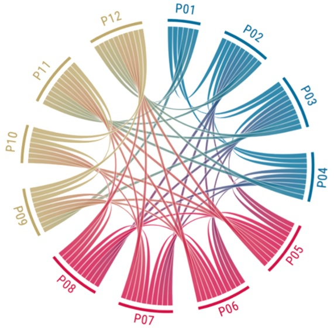

# The Chord Diagram

Please have a look at the following chord diagram:



Please try to create something similar. You can find the (example) data for this project in the "Data" folder. 

<https://github.com/Dr-Eberle-Zentrum/Advanced-data-processing-with-R/blob/main/Projects/FerSoe/Project1/Data/Chord_test.csv>

The data contains a list of projects (P1 to P12). Every P (1-12) number is an own project which has connections to other projects, for example because they use the same sample or the same method of analyzing data. The table shows only if these projects are linked to each other (1) or if they are not linked (0). If they are linked to each other, there should be also a line between these projects in the graphic. 

The color scheme does not matter and can be chosen to your own liking. Furthermore, the chord diagram above is just an example, as the data given here will not result in the same diagram. Also the looks of the chord diagrams produced by R, might differ quite a bit from the example above.

Please have a short look at the data:

```{r echo=FALSE}

url = "https://raw.githubusercontent.com/Dr-Eberle-Zentrum/Advanced-data-processing-with-R/main/Projects/FerSoe/Project1/Data/Chord_test.csv"

data_pr<- read.csv(url, sep = ";")


data_pr
```

As you can see, the data is stored in a kind of correlation table.That means that only half of the "triangle" is filled with values. In such a correlation table, one triangle is obsolete because it contains the same information as the other half. The NA values are therefore contained in the other half of the triangle. For example if your go to the **column** of P2 and look at the value for the connection with P1, this is empty (NA). When you go to the **row** of P2 and look than at the value for the connection with P1, you can see that this is 1. 
You might need to reformat the data into the wide or long format, depending on the package that you will be using to solve this task.

## First suggested steps

First suggested steps would be

-   downloading/integrating the data
-   searching for a package that creates chord diagrams
-   rearrangement of the data structure, according to the chord diagram package


## Optional Task
Colors: 
Try the following colors

* P01 to P04 into a blue(ish) color and

* P05 to P008 into a red(ish) color

* P09 to P12 into a golden(ish) color

The color should shift into the other color if the projects are connected with a project from another color category.