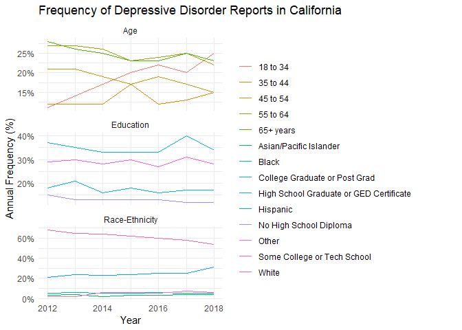

# **Frequency of Depressive Disorder Reports in California**

**Solution for Gulmira’s Project from Silin**

------------------------------------------------------------------------

### **1. Step: Install Packages and Read Data**

------------------------------------------------------------------------

    library(tidyverse)
    dt <- read_csv("../adult-depression.csv")

Let’s take a first look at the dataset:

<table>
<colgroup>
<col style="width: 4%" />
<col style="width: 12%" />
<col style="width: 32%" />
<col style="width: 8%" />
<col style="width: 15%" />
<col style="width: 6%" />
<col style="width: 10%" />
<col style="width: 10%" />
</colgroup>
<thead>
<tr class="header">
<th style="text-align: right;">Year</th>
<th style="text-align: left;">Strata</th>
<th style="text-align: left;">Strata Name</th>
<th style="text-align: right;">Frequency</th>
<th style="text-align: right;">Weighted Frequency</th>
<th style="text-align: right;">Percent</th>
<th style="text-align: right;">Lower 95% CL</th>
<th style="text-align: right;">Upper 95% CL</th>
</tr>
</thead>
<tbody>
<tr class="odd">
<td style="text-align: right;">2012</td>
<td style="text-align: left;">Total</td>
<td style="text-align: left;">Total</td>
<td style="text-align: right;">1920</td>
<td style="text-align: right;">NA</td>
<td style="text-align: right;">11.74</td>
<td style="text-align: right;">11.11</td>
<td style="text-align: right;">12.37</td>
</tr>
<tr class="even">
<td style="text-align: right;">2012</td>
<td style="text-align: left;">Sex</td>
<td style="text-align: left;">Male</td>
<td style="text-align: right;">561</td>
<td style="text-align: right;">1116664</td>
<td style="text-align: right;">8.12</td>
<td style="text-align: right;">7.32</td>
<td style="text-align: right;">8.92</td>
</tr>
<tr class="odd">
<td style="text-align: right;">2012</td>
<td style="text-align: left;">Sex</td>
<td style="text-align: left;">Female</td>
<td style="text-align: right;">1359</td>
<td style="text-align: right;">2163108</td>
<td style="text-align: right;">15.25</td>
<td style="text-align: right;">14.30</td>
<td style="text-align: right;">16.20</td>
</tr>
<tr class="even">
<td style="text-align: right;">2012</td>
<td style="text-align: left;">Race-Ethnicity</td>
<td style="text-align: left;">White</td>
<td style="text-align: right;">1314</td>
<td style="text-align: right;">1806371</td>
<td style="text-align: right;">14.57</td>
<td style="text-align: right;">13.67</td>
<td style="text-align: right;">15.46</td>
</tr>
<tr class="odd">
<td style="text-align: right;">2012</td>
<td style="text-align: left;">Race-Ethnicity</td>
<td style="text-align: left;">Black</td>
<td style="text-align: right;">97</td>
<td style="text-align: right;">222022</td>
<td style="text-align: right;">13.54</td>
<td style="text-align: right;">10.44</td>
<td style="text-align: right;">16.65</td>
</tr>
<tr class="even">
<td style="text-align: right;">2012</td>
<td style="text-align: left;">Race-Ethnicity</td>
<td style="text-align: left;">Hispanic</td>
<td style="text-align: right;">412</td>
<td style="text-align: right;">923174</td>
<td style="text-align: right;">9.98</td>
<td style="text-align: right;">8.91</td>
<td style="text-align: right;">11.05</td>
</tr>
<tr class="odd">
<td style="text-align: right;">2012</td>
<td style="text-align: left;">Race-Ethnicity</td>
<td style="text-align: left;">Asian/Pacific Islander</td>
<td style="text-align: right;">61</td>
<td style="text-align: right;">220418</td>
<td style="text-align: right;">5.48</td>
<td style="text-align: right;">3.92</td>
<td style="text-align: right;">7.03</td>
</tr>
<tr class="even">
<td style="text-align: right;">2012</td>
<td style="text-align: left;">Race-Ethnicity</td>
<td style="text-align: left;">Other</td>
<td style="text-align: right;">36</td>
<td style="text-align: right;">107786</td>
<td style="text-align: right;">17.34</td>
<td style="text-align: right;">11.09</td>
<td style="text-align: right;">23.60</td>
</tr>
<tr class="odd">
<td style="text-align: right;">2012</td>
<td style="text-align: left;">Education</td>
<td style="text-align: left;">No High School Diploma</td>
<td style="text-align: right;">282</td>
<td style="text-align: right;">579047</td>
<td style="text-align: right;">14.43</td>
<td style="text-align: right;">12.60</td>
<td style="text-align: right;">16.26</td>
</tr>
<tr class="even">
<td style="text-align: right;">2012</td>
<td style="text-align: left;">Education</td>
<td style="text-align: left;">High School Graduate or GED
Certificate</td>
<td style="text-align: right;">337</td>
<td style="text-align: right;">665672</td>
<td style="text-align: right;">11.44</td>
<td style="text-align: right;">9.98</td>
<td style="text-align: right;">12.89</td>
</tr>
<tr class="odd">
<td style="text-align: right;">2012</td>
<td style="text-align: left;">Education</td>
<td style="text-align: left;">Some College or Tech School</td>
<td style="text-align: right;">563</td>
<td style="text-align: right;">947473</td>
<td style="text-align: right;">13.25</td>
<td style="text-align: right;">11.95</td>
<td style="text-align: right;">14.55</td>
</tr>
<tr class="even">
<td style="text-align: right;">2012</td>
<td style="text-align: left;">Education</td>
<td style="text-align: left;">College Graduate or Post Grad</td>
<td style="text-align: right;">717</td>
<td style="text-align: right;">1040822</td>
<td style="text-align: right;">10.00</td>
<td style="text-align: right;">9.11</td>
<td style="text-align: right;">10.90</td>
</tr>
<tr class="odd">
<td style="text-align: right;">2012</td>
<td style="text-align: left;">Income</td>
<td style="text-align: left;">&lt; $20,000</td>
<td style="text-align: right;">642</td>
<td style="text-align: right;">1118292</td>
<td style="text-align: right;">16.97</td>
<td style="text-align: right;">15.42</td>
<td style="text-align: right;">18.51</td>
</tr>
<tr class="even">
<td style="text-align: right;">2012</td>
<td style="text-align: left;">Income</td>
<td style="text-align: left;">$20,000 - $34,999</td>
<td style="text-align: right;">295</td>
<td style="text-align: right;">490532</td>
<td style="text-align: right;">12.39</td>
<td style="text-align: right;">10.67</td>
<td style="text-align: right;">14.10</td>
</tr>
<tr class="odd">
<td style="text-align: right;">2012</td>
<td style="text-align: left;">Income</td>
<td style="text-align: left;">$35,000 - $49,999</td>
<td style="text-align: right;">187</td>
<td style="text-align: right;">296225</td>
<td style="text-align: right;">9.88</td>
<td style="text-align: right;">8.16</td>
<td style="text-align: right;">11.60</td>
</tr>
<tr class="even">
<td style="text-align: right;">2012</td>
<td style="text-align: left;">Income</td>
<td style="text-align: left;">$50,000 - $74,999</td>
<td style="text-align: right;">250</td>
<td style="text-align: right;">440798</td>
<td style="text-align: right;">12.65</td>
<td style="text-align: right;">10.82</td>
<td style="text-align: right;">14.49</td>
</tr>
<tr class="odd">
<td style="text-align: right;">2012</td>
<td style="text-align: left;">Income</td>
<td style="text-align: left;">$75,000 - $99,999</td>
<td style="text-align: right;">160</td>
<td style="text-align: right;">290492</td>
<td style="text-align: right;">10.17</td>
<td style="text-align: right;">8.26</td>
<td style="text-align: right;">12.07</td>
</tr>
<tr class="even">
<td style="text-align: right;">2012</td>
<td style="text-align: left;">Income</td>
<td style="text-align: left;">$100,000+</td>
<td style="text-align: right;">270</td>
<td style="text-align: right;">454444</td>
<td style="text-align: right;">8.31</td>
<td style="text-align: right;">7.17</td>
<td style="text-align: right;">9.46</td>
</tr>
<tr class="odd">
<td style="text-align: right;">2012</td>
<td style="text-align: left;">Age</td>
<td style="text-align: left;">18 to 34</td>
<td style="text-align: right;">219</td>
<td style="text-align: right;">705000</td>
<td style="text-align: right;">7.63</td>
<td style="text-align: right;">6.55</td>
<td style="text-align: right;">8.72</td>
</tr>
<tr class="even">
<td style="text-align: right;">2012</td>
<td style="text-align: left;">Age</td>
<td style="text-align: left;">35 to 44</td>
<td style="text-align: right;">240</td>
<td style="text-align: right;">576639</td>
<td style="text-align: right;">11.13</td>
<td style="text-align: right;">9.57</td>
<td style="text-align: right;">12.69</td>
</tr>
<tr class="odd">
<td style="text-align: right;">2012</td>
<td style="text-align: left;">Age</td>
<td style="text-align: left;">45 to 54</td>
<td style="text-align: right;">409</td>
<td style="text-align: right;">770238</td>
<td style="text-align: right;">14.67</td>
<td style="text-align: right;">13.14</td>
<td style="text-align: right;">16.20</td>
</tr>
<tr class="even">
<td style="text-align: right;">2012</td>
<td style="text-align: left;">Age</td>
<td style="text-align: left;">55 to 64</td>
<td style="text-align: right;">511</td>
<td style="text-align: right;">692056</td>
<td style="text-align: right;">17.19</td>
<td style="text-align: right;">15.55</td>
<td style="text-align: right;">18.82</td>
</tr>
<tr class="odd">
<td style="text-align: right;">2012</td>
<td style="text-align: left;">Age</td>
<td style="text-align: left;">65+ years</td>
<td style="text-align: right;">541</td>
<td style="text-align: right;">535838</td>
<td style="text-align: right;">12.63</td>
<td style="text-align: right;">11.38</td>
<td style="text-align: right;">13.87</td>
</tr>
<tr class="even">
<td style="text-align: right;">2013</td>
<td style="text-align: left;">Total</td>
<td style="text-align: left;">Total</td>
<td style="text-align: right;">1689</td>
<td style="text-align: right;">NA</td>
<td style="text-align: right;">13.08</td>
<td style="text-align: right;">12.33</td>
<td style="text-align: right;">13.82</td>
</tr>
<tr class="odd">
<td style="text-align: right;">2013</td>
<td style="text-align: left;">Sex</td>
<td style="text-align: left;">Male</td>
<td style="text-align: right;">539</td>
<td style="text-align: right;">1307668</td>
<td style="text-align: right;">9.53</td>
<td style="text-align: right;">8.53</td>
<td style="text-align: right;">10.52</td>
</tr>
</tbody>
</table>

**The current dataset…**

1.  has 8 columns and 161 rows.

2.  contains one observation per row and one variable per column.

The dataset is already tidy, but it would be more readable if we
converted the data into a wide format with each year in a separate
column.

### **2. Step: Convert Data into Wide Format**

------------------------------------------------------------------------

    dt_wide <- dt %>%
      pivot_longer(cols = c(Frequency, `Weighted Frequency`, Percent, `Lower 95% CL`, `Upper 95% CL`), 
                   names_to = "Metric", 
                   values_to = "Value") %>%
      pivot_wider(names_from = Year, 
                  values_from = Value)

The dataset in wide format looks like this:

<table style="width:100%;">
<colgroup>
<col style="width: 12%" />
<col style="width: 9%" />
<col style="width: 15%" />
<col style="width: 8%" />
<col style="width: 8%" />
<col style="width: 8%" />
<col style="width: 8%" />
<col style="width: 8%" />
<col style="width: 8%" />
<col style="width: 8%" />
</colgroup>
<thead>
<tr class="header">
<th style="text-align: left;">Strata</th>
<th style="text-align: left;">Strata Name</th>
<th style="text-align: left;">Metric</th>
<th style="text-align: right;">2012</th>
<th style="text-align: right;">2013</th>
<th style="text-align: right;">2014</th>
<th style="text-align: right;">2015</th>
<th style="text-align: right;">2016</th>
<th style="text-align: right;">2017</th>
<th style="text-align: right;">2018</th>
</tr>
</thead>
<tbody>
<tr class="odd">
<td style="text-align: left;">Total</td>
<td style="text-align: left;">Total</td>
<td style="text-align: left;">Frequency</td>
<td style="text-align: right;">1920.00</td>
<td style="text-align: right;">1689.00</td>
<td style="text-align: right;">1309.00</td>
<td style="text-align: right;">1848.00</td>
<td style="text-align: right;">1645.00</td>
<td style="text-align: right;">1550.00</td>
<td style="text-align: right;">1964.00</td>
</tr>
<tr class="even">
<td style="text-align: left;">Total</td>
<td style="text-align: left;">Total</td>
<td style="text-align: left;">Weighted Frequency</td>
<td style="text-align: right;">NA</td>
<td style="text-align: right;">NA</td>
<td style="text-align: right;">NA</td>
<td style="text-align: right;">NA</td>
<td style="text-align: right;">NA</td>
<td style="text-align: right;">NA</td>
<td style="text-align: right;">NA</td>
</tr>
<tr class="odd">
<td style="text-align: left;">Total</td>
<td style="text-align: left;">Total</td>
<td style="text-align: left;">Percent</td>
<td style="text-align: right;">11.74</td>
<td style="text-align: right;">13.08</td>
<td style="text-align: right;">13.30</td>
<td style="text-align: right;">12.92</td>
<td style="text-align: right;">13.77</td>
<td style="text-align: right;">19.04</td>
<td style="text-align: right;">17.78</td>
</tr>
<tr class="even">
<td style="text-align: left;">Total</td>
<td style="text-align: left;">Total</td>
<td style="text-align: left;">Lower 95% CL</td>
<td style="text-align: right;">11.11</td>
<td style="text-align: right;">12.33</td>
<td style="text-align: right;">12.29</td>
<td style="text-align: right;">11.98</td>
<td style="text-align: right;">12.53</td>
<td style="text-align: right;">17.10</td>
<td style="text-align: right;">15.96</td>
</tr>
<tr class="odd">
<td style="text-align: left;">Total</td>
<td style="text-align: left;">Total</td>
<td style="text-align: left;">Upper 95% CL</td>
<td style="text-align: right;">12.37</td>
<td style="text-align: right;">13.82</td>
<td style="text-align: right;">14.31</td>
<td style="text-align: right;">13.87</td>
<td style="text-align: right;">15.00</td>
<td style="text-align: right;">20.98</td>
<td style="text-align: right;">19.59</td>
</tr>
<tr class="even">
<td style="text-align: left;">Sex</td>
<td style="text-align: left;">Male</td>
<td style="text-align: left;">Frequency</td>
<td style="text-align: right;">561.00</td>
<td style="text-align: right;">539.00</td>
<td style="text-align: right;">469.00</td>
<td style="text-align: right;">652.00</td>
<td style="text-align: right;">590.00</td>
<td style="text-align: right;">525.00</td>
<td style="text-align: right;">758.00</td>
</tr>
<tr class="odd">
<td style="text-align: left;">Sex</td>
<td style="text-align: left;">Male</td>
<td style="text-align: left;">Weighted Frequency</td>
<td style="text-align: right;">1116664.00</td>
<td style="text-align: right;">1307668.00</td>
<td style="text-align: right;">1424768.00</td>
<td style="text-align: right;">1332773.00</td>
<td style="text-align: right;">1559409.00</td>
<td style="text-align: right;">2001004.00</td>
<td style="text-align: right;">1835759.00</td>
</tr>
<tr class="even">
<td style="text-align: left;">Sex</td>
<td style="text-align: left;">Male</td>
<td style="text-align: left;">Percent</td>
<td style="text-align: right;">8.12</td>
<td style="text-align: right;">9.53</td>
<td style="text-align: right;">10.46</td>
<td style="text-align: right;">9.73</td>
<td style="text-align: right;">11.38</td>
<td style="text-align: right;">14.61</td>
<td style="text-align: right;">13.44</td>
</tr>
<tr class="odd">
<td style="text-align: left;">Sex</td>
<td style="text-align: left;">Male</td>
<td style="text-align: left;">Lower 95% CL</td>
<td style="text-align: right;">7.32</td>
<td style="text-align: right;">8.53</td>
<td style="text-align: right;">9.06</td>
<td style="text-align: right;">8.47</td>
<td style="text-align: right;">9.69</td>
<td style="text-align: right;">11.78</td>
<td style="text-align: right;">11.34</td>
</tr>
<tr class="even">
<td style="text-align: left;">Sex</td>
<td style="text-align: left;">Male</td>
<td style="text-align: left;">Upper 95% CL</td>
<td style="text-align: right;">8.92</td>
<td style="text-align: right;">10.52</td>
<td style="text-align: right;">11.87</td>
<td style="text-align: right;">11.00</td>
<td style="text-align: right;">13.07</td>
<td style="text-align: right;">17.43</td>
<td style="text-align: right;">15.55</td>
</tr>
<tr class="odd">
<td style="text-align: left;">Sex</td>
<td style="text-align: left;">Female</td>
<td style="text-align: left;">Frequency</td>
<td style="text-align: right;">1359.00</td>
<td style="text-align: right;">1150.00</td>
<td style="text-align: right;">840.00</td>
<td style="text-align: right;">1196.00</td>
<td style="text-align: right;">1055.00</td>
<td style="text-align: right;">1025.00</td>
<td style="text-align: right;">1206.00</td>
</tr>
<tr class="even">
<td style="text-align: left;">Sex</td>
<td style="text-align: left;">Female</td>
<td style="text-align: left;">Weighted Frequency</td>
<td style="text-align: right;">2163108.00</td>
<td style="text-align: right;">2337817.00</td>
<td style="text-align: right;">2268864.00</td>
<td style="text-align: right;">2264798.00</td>
<td style="text-align: right;">2270100.00</td>
<td style="text-align: right;">3301418.00</td>
<td style="text-align: right;">3106910.00</td>
</tr>
<tr class="odd">
<td style="text-align: left;">Sex</td>
<td style="text-align: left;">Female</td>
<td style="text-align: left;">Percent</td>
<td style="text-align: right;">15.25</td>
<td style="text-align: right;">16.52</td>
<td style="text-align: right;">16.03</td>
<td style="text-align: right;">16.01</td>
<td style="text-align: right;">16.09</td>
<td style="text-align: right;">23.33</td>
<td style="text-align: right;">21.96</td>
</tr>
<tr class="even">
<td style="text-align: left;">Sex</td>
<td style="text-align: left;">Female</td>
<td style="text-align: left;">Lower 95% CL</td>
<td style="text-align: right;">14.30</td>
<td style="text-align: right;">15.42</td>
<td style="text-align: right;">14.57</td>
<td style="text-align: right;">14.61</td>
<td style="text-align: right;">14.30</td>
<td style="text-align: right;">20.65</td>
<td style="text-align: right;">19.08</td>
</tr>
<tr class="odd">
<td style="text-align: left;">Sex</td>
<td style="text-align: left;">Female</td>
<td style="text-align: left;">Upper 95% CL</td>
<td style="text-align: right;">16.20</td>
<td style="text-align: right;">17.62</td>
<td style="text-align: right;">17.50</td>
<td style="text-align: right;">17.41</td>
<td style="text-align: right;">17.88</td>
<td style="text-align: right;">26.01</td>
<td style="text-align: right;">24.84</td>
</tr>
<tr class="even">
<td style="text-align: left;">Race-Ethnicity</td>
<td style="text-align: left;">White</td>
<td style="text-align: left;">Frequency</td>
<td style="text-align: right;">1314.00</td>
<td style="text-align: right;">1103.00</td>
<td style="text-align: right;">832.00</td>
<td style="text-align: right;">1143.00</td>
<td style="text-align: right;">988.00</td>
<td style="text-align: right;">903.00</td>
<td style="text-align: right;">1053.00</td>
</tr>
<tr class="odd">
<td style="text-align: left;">Race-Ethnicity</td>
<td style="text-align: left;">White</td>
<td style="text-align: left;">Weighted Frequency</td>
<td style="text-align: right;">1806371.00</td>
<td style="text-align: right;">1979888.00</td>
<td style="text-align: right;">2050639.00</td>
<td style="text-align: right;">1992472.00</td>
<td style="text-align: right;">2061696.00</td>
<td style="text-align: right;">2740044.00</td>
<td style="text-align: right;">2567015.00</td>
</tr>
<tr class="even">
<td style="text-align: left;">Race-Ethnicity</td>
<td style="text-align: left;">White</td>
<td style="text-align: left;">Percent</td>
<td style="text-align: right;">14.57</td>
<td style="text-align: right;">15.97</td>
<td style="text-align: right;">16.99</td>
<td style="text-align: right;">16.54</td>
<td style="text-align: right;">17.28</td>
<td style="text-align: right;">22.81</td>
<td style="text-align: right;">21.54</td>
</tr>
<tr class="odd">
<td style="text-align: left;">Race-Ethnicity</td>
<td style="text-align: left;">White</td>
<td style="text-align: left;">Lower 95% CL</td>
<td style="text-align: right;">13.67</td>
<td style="text-align: right;">14.91</td>
<td style="text-align: right;">15.49</td>
<td style="text-align: right;">15.13</td>
<td style="text-align: right;">15.47</td>
<td style="text-align: right;">19.97</td>
<td style="text-align: right;">18.93</td>
</tr>
<tr class="even">
<td style="text-align: left;">Race-Ethnicity</td>
<td style="text-align: left;">White</td>
<td style="text-align: left;">Upper 95% CL</td>
<td style="text-align: right;">15.46</td>
<td style="text-align: right;">17.02</td>
<td style="text-align: right;">18.49</td>
<td style="text-align: right;">17.95</td>
<td style="text-align: right;">19.09</td>
<td style="text-align: right;">25.64</td>
<td style="text-align: right;">24.15</td>
</tr>
<tr class="odd">
<td style="text-align: left;">Race-Ethnicity</td>
<td style="text-align: left;">Black</td>
<td style="text-align: left;">Frequency</td>
<td style="text-align: right;">97.00</td>
<td style="text-align: right;">93.00</td>
<td style="text-align: right;">66.00</td>
<td style="text-align: right;">84.00</td>
<td style="text-align: right;">91.00</td>
<td style="text-align: right;">70.00</td>
<td style="text-align: right;">107.00</td>
</tr>
<tr class="even">
<td style="text-align: left;">Race-Ethnicity</td>
<td style="text-align: left;">Black</td>
<td style="text-align: left;">Weighted Frequency</td>
<td style="text-align: right;">222022.00</td>
<td style="text-align: right;">252871.00</td>
<td style="text-align: right;">200851.00</td>
<td style="text-align: right;">160058.00</td>
<td style="text-align: right;">203913.00</td>
<td style="text-align: right;">251661.00</td>
<td style="text-align: right;">234716.00</td>
</tr>
<tr class="odd">
<td style="text-align: left;">Race-Ethnicity</td>
<td style="text-align: left;">Black</td>
<td style="text-align: left;">Percent</td>
<td style="text-align: right;">13.54</td>
<td style="text-align: right;">15.46</td>
<td style="text-align: right;">13.23</td>
<td style="text-align: right;">10.68</td>
<td style="text-align: right;">13.55</td>
<td style="text-align: right;">17.35</td>
<td style="text-align: right;">15.82</td>
</tr>
<tr class="even">
<td style="text-align: left;">Race-Ethnicity</td>
<td style="text-align: left;">Black</td>
<td style="text-align: left;">Lower 95% CL</td>
<td style="text-align: right;">10.44</td>
<td style="text-align: right;">11.91</td>
<td style="text-align: right;">8.79</td>
<td style="text-align: right;">7.37</td>
<td style="text-align: right;">9.15</td>
<td style="text-align: right;">11.05</td>
<td style="text-align: right;">9.76</td>
</tr>
<tr class="odd">
<td style="text-align: left;">Race-Ethnicity</td>
<td style="text-align: left;">Black</td>
<td style="text-align: left;">Upper 95% CL</td>
<td style="text-align: right;">16.65</td>
<td style="text-align: right;">19.02</td>
<td style="text-align: right;">17.67</td>
<td style="text-align: right;">13.98</td>
<td style="text-align: right;">17.96</td>
<td style="text-align: right;">23.64</td>
<td style="text-align: right;">21.89</td>
</tr>
</tbody>
</table>

For plotting purposes, the annual percentage of each stratum is needed.
However, the given `percent` does not appear to represent the annual
percentage. Let’s verify this.

### **3. Step: Check What the Given Percentage Represents**

------------------------------------------------------------------------

Check if the given percentage matches the `Frequency`.

    dt_total <- dt %>%
      filter(Strata == "Total") %>%
      select(Year, Total_Frequency = Frequency) %>% 
      right_join(dt, by = "Year") 

    round(dt_total$`Frequency` / dt_total$Total_Frequency, 2) == dt_total$Percent

    ##   [1] FALSE FALSE FALSE FALSE FALSE FALSE FALSE FALSE FALSE FALSE FALSE FALSE
    ##  [13] FALSE FALSE FALSE FALSE FALSE FALSE FALSE FALSE FALSE FALSE FALSE FALSE
    ##  [25] FALSE FALSE FALSE FALSE FALSE FALSE FALSE FALSE FALSE FALSE FALSE FALSE
    ##  [37] FALSE FALSE FALSE FALSE FALSE FALSE FALSE FALSE FALSE FALSE FALSE FALSE
    ##  [49] FALSE FALSE FALSE FALSE FALSE FALSE FALSE FALSE FALSE FALSE FALSE FALSE
    ##  [61] FALSE FALSE FALSE FALSE FALSE FALSE FALSE FALSE FALSE FALSE FALSE FALSE
    ##  [73] FALSE FALSE FALSE FALSE FALSE FALSE FALSE FALSE FALSE FALSE FALSE FALSE
    ##  [85] FALSE FALSE FALSE FALSE FALSE FALSE FALSE FALSE FALSE FALSE FALSE FALSE
    ##  [97] FALSE FALSE FALSE FALSE FALSE FALSE FALSE FALSE FALSE FALSE FALSE FALSE
    ## [109] FALSE FALSE FALSE FALSE FALSE FALSE FALSE FALSE FALSE FALSE FALSE FALSE
    ## [121] FALSE FALSE FALSE FALSE FALSE FALSE FALSE FALSE FALSE FALSE FALSE FALSE
    ## [133] FALSE FALSE FALSE FALSE FALSE FALSE FALSE FALSE FALSE FALSE FALSE FALSE
    ## [145] FALSE FALSE FALSE FALSE FALSE FALSE FALSE FALSE FALSE FALSE FALSE FALSE
    ## [157] FALSE FALSE FALSE FALSE FALSE

Check if the given percentage matches the `Weighted Frequency`.

    dt %>% 
      group_by(Year) %>%
      filter(Strata != "Total") %>%
      summarise(Total_Weighted_Frequency = sum(`Weighted Frequency`)) %>% 
      right_join(dt %>% 
                   filter(Strata != "Total"), 
                 by = "Year") %>% 
      mutate(match = round(`Weighted Frequency` / Total_Weighted_Frequency, 2) == Percent) %>% .$match

    ##   [1] FALSE FALSE FALSE FALSE FALSE FALSE FALSE FALSE FALSE FALSE FALSE FALSE
    ##  [13] FALSE FALSE FALSE FALSE FALSE FALSE FALSE FALSE FALSE FALSE FALSE FALSE
    ##  [25] FALSE FALSE FALSE FALSE FALSE FALSE FALSE FALSE FALSE FALSE FALSE FALSE
    ##  [37] FALSE FALSE FALSE FALSE FALSE FALSE FALSE FALSE FALSE FALSE FALSE FALSE
    ##  [49] FALSE FALSE FALSE FALSE FALSE FALSE FALSE FALSE FALSE FALSE FALSE FALSE
    ##  [61] FALSE FALSE FALSE FALSE FALSE FALSE FALSE FALSE FALSE FALSE FALSE FALSE
    ##  [73] FALSE FALSE FALSE FALSE FALSE FALSE FALSE FALSE FALSE FALSE FALSE FALSE
    ##  [85] FALSE FALSE FALSE FALSE FALSE FALSE FALSE FALSE FALSE FALSE FALSE FALSE
    ##  [97] FALSE FALSE FALSE FALSE FALSE FALSE FALSE FALSE FALSE FALSE FALSE FALSE
    ## [109] FALSE FALSE FALSE FALSE FALSE FALSE FALSE FALSE FALSE FALSE FALSE FALSE
    ## [121] FALSE FALSE FALSE FALSE FALSE FALSE FALSE FALSE FALSE FALSE FALSE FALSE
    ## [133] FALSE FALSE FALSE FALSE FALSE FALSE FALSE FALSE FALSE FALSE FALSE FALSE
    ## [145] FALSE FALSE FALSE FALSE FALSE FALSE FALSE FALSE FALSE FALSE

Conclusion: The given `Percent` matches neither the `Frequency` not the
`Weighted Frequency`. Therefore, we need to calculate the annual
percentage for each stratum.

### **4. Step: Calculate the Annual Percentage and Prepare for Plotting**

------------------------------------------------------------------------

    dt_annual <- dt_total %>%
      select(Year, Strata, `Strata Name`, Frequency, Total_Frequency) %>%
      mutate(`Annual Frequency` = round(Frequency / Total_Frequency, 2))

### **5. Step: Plot the Data**

------------------------------------------------------------------------

    dt_annual %>% 
      filter(Strata %in% c("Race-Ethnicity", "Education", "Age")) %>%
      ggplot(aes(x = Year, y = `Annual Frequency`, color = `Strata Name`, group = `Strata Name`)) +
      geom_line() +
      facet_wrap(~Strata, scales = "free_y", ncol = 1) +
      theme_minimal() +
      scale_y_continuous( labels = scales::percent) +
      labs(
        y = "Annual Frequency (%)", 
        title = "Frequency of Depressive Disorder Reports in California",
      ) +
      theme(
        legend.position = "right",
        legend.title = element_blank(),
        plot.margin = margin(5, 50, 5, 5)
      )

