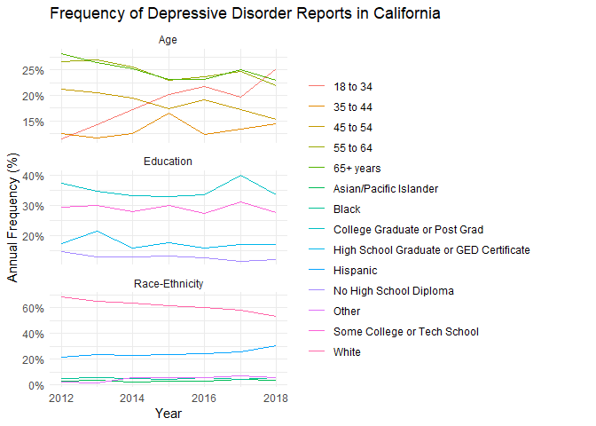

# **Frequency of Depressive Disorder Reports in California**

**Solution for Gulmira’s Project from Silin**

------------------------------------------------------------------------

## Data Manipulation

------------------------------------------------------------------------

    library(tidyverse)

    dt <- read_csv("../adult-depression.csv")

    total_frequency <- dt %>%
      filter(Strata == "Total") %>% 
      select(Year, Total_Frequency = Frequency)

    dt_plot <- dt %>%
      left_join(total_frequency, by = "Year") %>%    # combine Total Frequency with the original data
      select(Year, Strata, `Strata Name`, Frequency, Total_Frequency, `Lower 95% CL`, `Upper 95% CL`) %>%
      rowwise() %>%
      mutate(`Annual Frequency` = round(Frequency / Total_Frequency * 100, 2)) %>% # Calculate Annual Frequency
      filter(Strata %in% c("Race-Ethnicity", "Education", "Age")) %>% 
      select(-Total_Frequency) %>% print()

    ## # A tibble: 98 × 7
    ## # Rowwise: 
    ##     Year Strata         `Strata Name`    Frequency `Lower 95% CL` `Upper 95% CL`
    ##    <dbl> <chr>          <chr>                <dbl>          <dbl>          <dbl>
    ##  1  2012 Race-Ethnicity White                 1314          13.7           15.5 
    ##  2  2012 Race-Ethnicity Black                   97          10.4           16.6 
    ##  3  2012 Race-Ethnicity Hispanic               412           8.91          11.0 
    ##  4  2012 Race-Ethnicity Asian/Pacific I…        61           3.92           7.03
    ##  5  2012 Race-Ethnicity Other                   36          11.1           23.6 
    ##  6  2012 Education      No High School …       282          12.6           16.3 
    ##  7  2012 Education      High School Gra…       337           9.98          12.9 
    ##  8  2012 Education      Some College or…       563          12.0           14.6 
    ##  9  2012 Education      College Graduat…       717           9.11          10.9 
    ## 10  2012 Age            18 to 34               219           6.55           8.72
    ## # ℹ 88 more rows
    ## # ℹ 1 more variable: `Annual Frequency` <dbl>

## Plotting

------------------------------------------------------------------------

    dt_plot %>% 
      ggplot(aes(x = Year, y = `Annual Frequency`, color = `Strata Name`, group = `Strata Name`)) +
      geom_line() +
      # geom_ribbon(aes(ymin = `Lower 95% CL`, ymax = `Upper 95% CL`), alpha = 0.2) +
      #I assume that the Upper and Lower 95% CL data is not an annual percentage, so it doesn't match the lines drawn by geom_line. And I haven't figured out how that percentage was derived in the original dataframe, so I haven't found out how to calculate the annual data for an Upper and Lower 95% CL either...
      facet_wrap(~Strata, scales = "free_y", ncol = 1) +
      theme_minimal() +
      scale_y_continuous(
        labels = function(x) paste0(x, "%")  # add % to y-axis
      ) +
     labs(
      y = "Annual Frequency (%)", 
      title = "Frequency of Depressive Disorder Reports in California",
      ) +
      theme(
        legend.position = "right",
        legend.title = element_blank(),
        plot.margin = margin(5, 50, 5, 5)
      )

