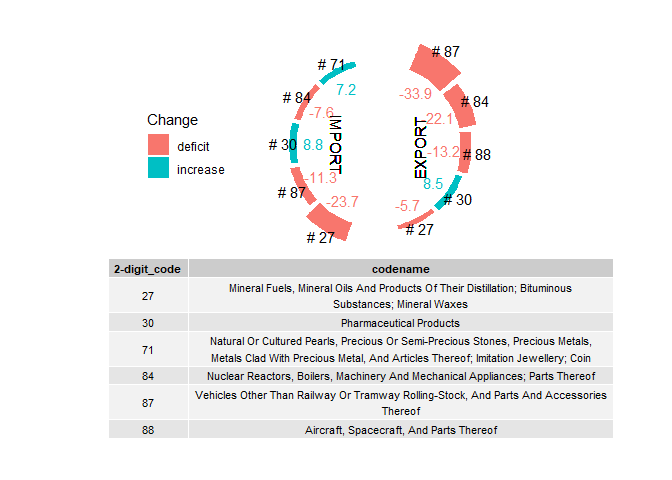

    library(tidyverse)

    # set working directory to source file location
    library(this.path)
    setwd(this.path::here())

    # read data
    library(haven)
    data <-
      str_c("Data",2019:2020,".dta") |>
      map(read_dta) |>
      bind_rows()

    # data cleanup according to task description
    cleanData <-
      data |>
      mutate(`2-digit_code` = str_sub(hs_product_code,1,2)) |>
      select(-hs_product_code, location_code, partner_code) |>
      group_by(year,`2-digit_code`) |>
      summarize( export_value = sum(export_value),
                 import_value = sum(import_value),
                 .groups = "drop") |>
      pivot_wider(names_from=year, values_from=ends_with("value")) |>
      left_join( read_csv("HS_2Digit_List.csv"), by=c(`2-digit_code` = "code")) |>
      mutate( codename = str_to_title(codename))

    library("ggpmisc") # to add table

    plotData <-
      cleanData |>
      drop_na(codename) |> # there are some codenames missing
      mutate(
        Export_Diff = export_value_2020-export_value_2019,
        Import_Diff = import_value_2020-import_value_2019
        ) |>
      select(-contains("value")) |>
      pivot_longer(ends_with("Diff"), names_to = "trade") |>
      group_by(trade) |>
      slice_max(abs(value), n=5) |>
      ungroup() |>
      arrange(trade,desc(abs(value))) |>
      mutate(id = 1:n(),
             id = ifelse(trade=="Import_Diff",id+1,id),
             change = if_else(value<0,"deficit","increase"))

    plotData |>
      ggplot(aes(x=id, y=abs(value), fill=change)) +
      labs(fill="Change",
           x=NULL,
           y=NULL)+
      theme_void() +
      theme(
        axis.text = element_blank(),
        axis.ticks = element_blank(),
        legend.position = 'left',
        plot.margin = margin(0,0,5,0, "cm")
      )+
      geom_bar(stat = "identity") +
      geom_text(aes(label=str_c("# ",`2-digit_code`), y=abs(value)+8*10^9)) +
      geom_text(aes(label= round(value/10^9, digits = 1), col=change), y=-2*10^10) +
      guides(color=FALSE) +
      ylim(-10^11,4.2* 10^10) +
      xlim(-0.2,12)+
      geom_text(x=3, y=-5*10^10, label="EXPORT", angle=90)+
      geom_text(x=9, y=-5*10^10, label="IMPORT", angle=270)+
      coord_polar(clip = 'off')+
      annotate(geom = "table",
             x = 6.2,
             y = 4*10^10,
             label = list(plotData |>
                            select(`2-digit_code`, codename) |>
                            distinct() |>
                            mutate(codename = str_wrap(codename,width=80) |> str_c(sep="\n")) |>
                            arrange(`2-digit_code`)),
             hjust=0.5,
             vjust=1,
             size=3)

