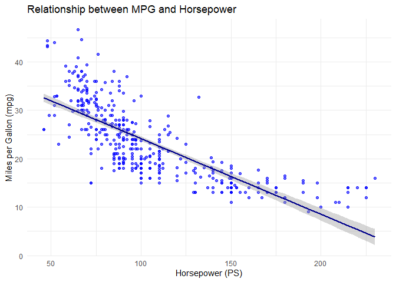
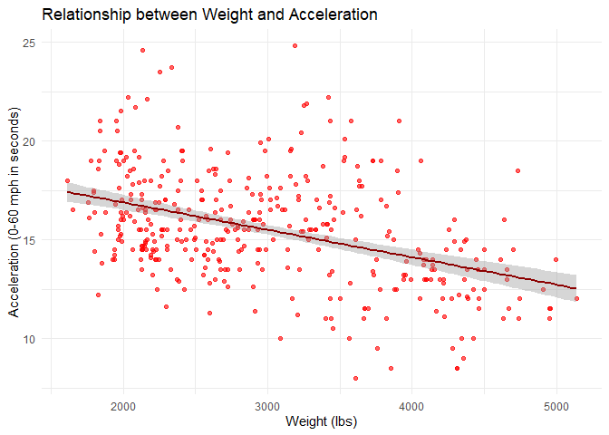
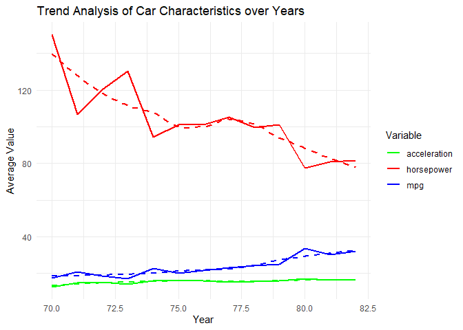
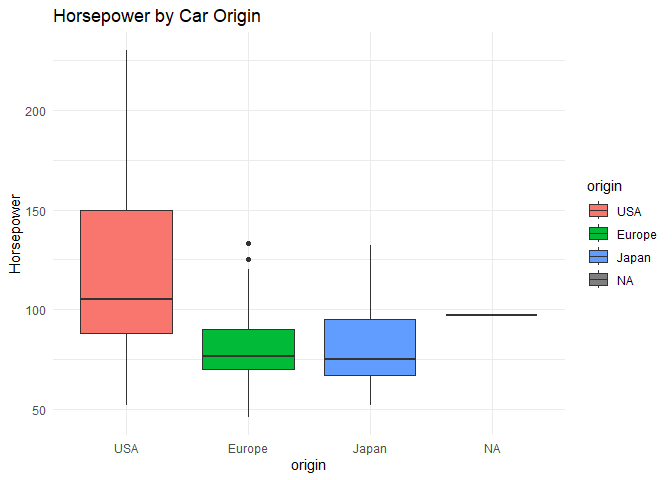
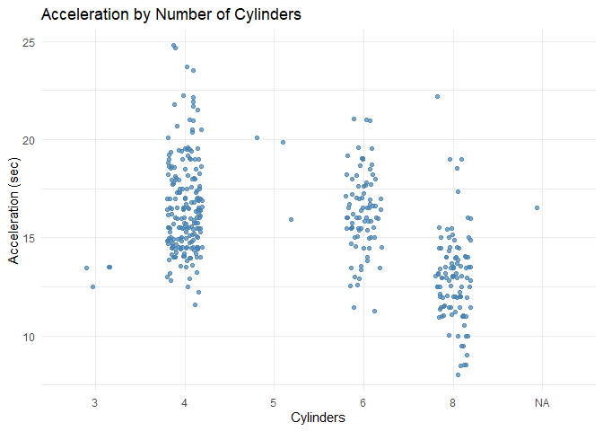
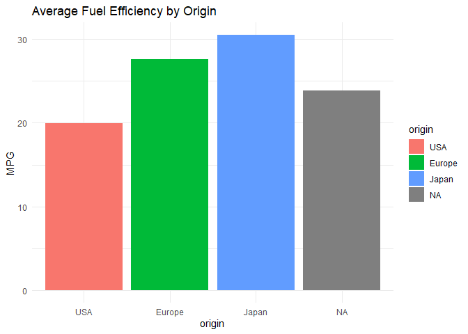

    library(tidyverse) 

    ## ── Attaching core tidyverse packages ──────────────────────── tidyverse 2.0.0 ──
    ## ✔ dplyr     1.1.4     ✔ readr     2.1.5
    ## ✔ forcats   1.0.0     ✔ stringr   1.5.1
    ## ✔ ggplot2   3.5.1     ✔ tibble    3.2.1
    ## ✔ lubridate 1.9.3     ✔ tidyr     1.3.1
    ## ✔ purrr     1.0.2     
    ## ── Conflicts ────────────────────────────────────────── tidyverse_conflicts() ──
    ## ✖ dplyr::filter() masks stats::filter()
    ## ✖ dplyr::lag()    masks stats::lag()
    ## ℹ Use the conflicted package (<http://conflicted.r-lib.org/>) to force all conflicts to become errors

    library(readr) 
    library(dplyr)
    library(ggplot2)

    # read csv
    car <- read_csv("Auto_data.csv", show_col_types = FALSE)

## Data preparation

    ## 1: Ensure each variable has its own column and each observation its own row
    #check structure and summary of the data set 

    str(car)

    ## spc_tbl_ [395 × 9] (S3: spec_tbl_df/tbl_df/tbl/data.frame)
    ##  $ mpg         : num [1:395] 18 15 18 16 17 15 14 14 14 14 ...
    ##  $ cylinders   : num [1:395] 8 8 8 8 8 8 8 8 8 8 ...
    ##  $ displacement: num [1:395] 307 350 318 304 302 429 454 440 440 455 ...
    ##  $ horsepower  : num [1:395] 130 165 150 150 140 198 220 215 215 225 ...
    ##  $ weight      : num [1:395] 3504 3693 3436 3433 3449 ...
    ##  $ acceleration: num [1:395] 12 11.5 11 12 10.5 10 9 8.5 8.5 10 ...
    ##  $ year        : num [1:395] 70 70 70 70 70 70 70 70 70 70 ...
    ##  $ origin      : num [1:395] 1 1 1 1 1 1 1 1 1 1 ...
    ##  $ name        : chr [1:395] "chevrolet chevelle malibu" "buick skylark 320" "plymouth satellite" "amc rebel sst" ...
    ##  - attr(*, "spec")=
    ##   .. cols(
    ##   ..   mpg = col_double(),
    ##   ..   cylinders = col_double(),
    ##   ..   displacement = col_double(),
    ##   ..   horsepower = col_double(),
    ##   ..   weight = col_double(),
    ##   ..   acceleration = col_double(),
    ##   ..   year = col_double(),
    ##   ..   origin = col_double(),
    ##   ..   name = col_character()
    ##   .. )
    ##  - attr(*, "problems")=<externalptr>

    summary(car)

    ##       mpg          cylinders     displacement     horsepower        weight    
    ##  Min.   : 9.00   Min.   :3.00   Min.   : 68.0   Min.   : 46.0   Min.   :1613  
    ##  1st Qu.:17.00   1st Qu.:4.00   1st Qu.:105.0   1st Qu.: 75.5   1st Qu.:2226  
    ##  Median :22.45   Median :4.00   Median :151.0   Median : 95.0   Median :2807  
    ##  Mean   :23.40   Mean   :5.48   Mean   :195.2   Mean   :104.7   Mean   :2981  
    ##  3rd Qu.:29.00   3rd Qu.:8.00   3rd Qu.:302.0   3rd Qu.:127.0   3rd Qu.:3620  
    ##  Max.   :46.60   Max.   :8.00   Max.   :455.0   Max.   :230.0   Max.   :5140  
    ##  NA's   :1       NA's   :1      NA's   :2                       NA's   :2     
    ##   acceleration        year           origin          name          
    ##  Min.   : 8.00   Min.   :70.00   Min.   :1.000   Length:395        
    ##  1st Qu.:13.72   1st Qu.:73.00   1st Qu.:1.000   Class :character  
    ##  Median :15.50   Median :76.00   Median :1.000   Mode  :character  
    ##  Mean   :15.52   Mean   :75.96   Mean   :1.574                     
    ##  3rd Qu.:17.00   3rd Qu.:79.00   3rd Qu.:2.000                     
    ##  Max.   :24.80   Max.   :82.00   Max.   :3.000                     
    ##  NA's   :1                       NA's   :1

    glimpse(car)

    ## Rows: 395
    ## Columns: 9
    ## $ mpg          <dbl> 18, 15, 18, 16, 17, 15, 14, 14, 14, 14, 15, 15, 14, 15, 1…
    ## $ cylinders    <dbl> 8, 8, 8, 8, 8, 8, 8, 8, 8, 8, 8, 8, 8, 8, 8, 4, 6, 6, 6, …
    ## $ displacement <dbl> 307, 350, 318, 304, 302, 429, 454, 440, 440, 455, 390, 38…
    ## $ horsepower   <dbl> 130, 165, 150, 150, 140, 198, 220, 215, 215, 225, 190, 17…
    ## $ weight       <dbl> 3504, 3693, 3436, 3433, 3449, 4341, 4354, 4312, 4312, 442…
    ## $ acceleration <dbl> 12.0, 11.5, 11.0, 12.0, 10.5, 10.0, 9.0, 8.5, 8.5, 10.0, …
    ## $ year         <dbl> 70, 70, 70, 70, 70, 70, 70, 70, 70, 70, 70, 70, 70, 70, 7…
    ## $ origin       <dbl> 1, 1, 1, 1, 1, 1, 1, 1, 1, 1, 1, 1, 1, 1, 1, 3, 1, 1, 1, …
    ## $ name         <chr> "chevrolet chevelle malibu", "buick skylark 320", "plymou…

    #check if values are missing
    colSums(is.na(car))

    ##          mpg    cylinders displacement   horsepower       weight acceleration 
    ##            1            1            2            0            2            1 
    ##         year       origin         name 
    ##            0            1            3

    ## 2: Convert categorical variables into factors with descriptive labels
    car <- car %>%
      mutate(origin = factor(origin,
                             levels = c(1, 2, 3),
                             labels = c("USA", "Europe", "Japan")))
    #transfer horsepower to numeric

    ## 3: Identify and report any duplicate rows in the dataset
    duplicates <- car[duplicated(car), ]
    n_duplicates <- nrow(duplicates)
    n_duplicates

    ## [1] 3

    duplicates

    ## # A tibble: 3 × 9
    ##     mpg cylinders displacement horsepower weight acceleration  year origin name 
    ##   <dbl>     <dbl>        <dbl>      <dbl>  <dbl>        <dbl> <dbl> <fct>  <chr>
    ## 1  14           8          440        215   4312          8.5    70 USA    plym…
    ## 2  17           6          250        100   3329         15.5    71 USA    chev…
    ## 3  27.5         4          134         95   2560         14.2    78 Japan  toyo…

    ## 4: Discuss whether duplicates are meaningful or should be removed.
    ## 5: Identify columns with missing values.
    colSums(is.na(car))

    ##          mpg    cylinders displacement   horsepower       weight acceleration 
    ##            1            1            2            0            2            1 
    ##         year       origin         name 
    ##            0            1            3

    ## 6: Summarize the number and percentage of missing values.
    missing_summary <- car%>%
      summarise_all(~sum(is.na(.))) %>%
      pivot_longer(everything(), names_to = "variable", values_to = "missing_count") %>%
      mutate(percent_missing = round((missing_count / nrow(car)) * 100, 2))

    missing_summary

    ## # A tibble: 9 × 3
    ##   variable     missing_count percent_missing
    ##   <chr>                <int>           <dbl>
    ## 1 mpg                      1            0.25
    ## 2 cylinders                1            0.25
    ## 3 displacement             2            0.51
    ## 4 horsepower               0            0   
    ## 5 weight                   2            0.51
    ## 6 acceleration             1            0.25
    ## 7 year                     0            0   
    ## 8 origin                   1            0.25
    ## 9 name                     3            0.76

    ## 7: Decide how to handle the missing values (e.g., remove, impute, or analyze separately).
    ## 8: Create a new variable for the **power-to-weight ratio** and store it in a new column.

    car <- car %>%
      mutate(power_to_weight = horsepower / weight)

\##Data visualization \#Scatterplot: relationship between mpg and
horsepower

    ggplot(car, aes(x = horsepower, y = mpg)) +
      geom_point(alpha = 0.6, color = "blue") +
      geom_smooth(method = "lm", se = TRUE, color = "darkblue") +
      labs(title = "Relationship between MPG and Horsepower",
           x = "Horsepower (PS)",
           y = "Miles per Gallon (mpg)") +
      theme_minimal()

    ## `geom_smooth()` using formula = 'y ~ x'

    ## Warning: Removed 1 row containing non-finite outside the scale range
    ## (`stat_smooth()`).

    ## Warning: Removed 1 row containing missing values or values outside the scale range
    ## (`geom_point()`).

\#Scatterplot: relationship between weight and acceleration

    ggplot(car, aes(x = weight, y = acceleration)) +
      geom_point(alpha = 0.6, color = "red") +
      geom_smooth(method = "lm", se = TRUE, color = "darkred") +
      labs(title = "Relationship between Weight and Acceleration",
           x = "Weight (lbs)",
           y = "Acceleration (0-60 mph in seconds)") +
      theme_minimal()

    ## `geom_smooth()` using formula = 'y ~ x'

    ## Warning: Removed 3 rows containing non-finite outside the scale range
    ## (`stat_smooth()`).

    ## Warning: Removed 3 rows containing missing values or values outside the scale range
    ## (`geom_point()`).

\#trend analysis

    car_yearly <- car %>%
      group_by(year) %>%
      summarise(
        avg_mpg = mean(mpg, na.rm = TRUE),
        avg_hp = mean(horsepower, na.rm = TRUE),
        avg_acc = mean(acceleration, na.rm = TRUE)
      )

    ggplot(car_yearly, aes(x = year)) +
      geom_line(aes(y = avg_mpg, color = "mpg"), size = 1) +
      geom_smooth(aes(y = avg_mpg, color = "mpg"), method = "loess", se = FALSE, linetype = "dashed") +
      geom_line(aes(y = avg_hp, color = "horsepower"), linewidth = 1) +
      geom_smooth(aes(y = avg_hp, color = "horsepower"), method = "loess", se = FALSE, linetype = "dashed") +
      geom_line(aes(y = avg_acc, color = "acceleration"), size = 1) +
      geom_smooth(aes(y = avg_acc, color = "acceleration"), method = "loess", se = FALSE, linetype = "dashed") +
      scale_color_manual(
        name = "Variable",
        values = c("mpg" = "blue", "horsepower" = "red", "acceleration" = "green")
      ) +
      labs(title = "Trend Analysis of Car Characteristics over Years",
           x = "Year",
           y = "Average Value") +
      theme_minimal()

    ## Warning: Using `size` aesthetic for lines was deprecated in ggplot2 3.4.0.
    ## ℹ Please use `linewidth` instead.
    ## This warning is displayed once every 8 hours.
    ## Call `lifecycle::last_lifecycle_warnings()` to see where this warning was
    ## generated.

    ## `geom_smooth()` using formula = 'y ~ x'
    ## `geom_smooth()` using formula = 'y ~ x'
    ## `geom_smooth()` using formula = 'y ~ x'

\# further data visualisation to answer your questions \# origins that
tend to have the most powerful/fastest cars

    ggplot(car, aes(x = origin, y = horsepower, fill = origin)) +
      geom_boxplot() +
      labs(title = "Horsepower by Car Origin", y = "Horsepower") +
      theme_minimal()

# relationship between cylinders and acceleration

    ggplot(car, aes(x = factor(cylinders), y = acceleration)) +
      geom_jitter(width = 0.2, color = "steelblue", alpha = 0.7) +
      labs(title = "Acceleration by Number of Cylinders",
           x = "Cylinders", y = "Acceleration (sec)") +
      theme_minimal()

    ## Warning: Removed 1 row containing missing values or values outside the scale range
    ## (`geom_point()`).

# fastest car for each model

    fastest_cars <- car %>%
      group_by(year) %>%
      slice_min(acceleration, with_ties = FALSE) %>%
      select(year, name, acceleration)

    print(fastest_cars)

    ## # A tibble: 13 × 3
    ## # Groups:   year [13]
    ##     year name                      acceleration
    ##    <dbl> <chr>                            <dbl>
    ##  1    70 plymouth 'cuda 340                 8  
    ##  2    71 pontiac catalina brougham         11.5
    ##  3    72 mercury marquis                   11  
    ##  4    73 pontiac grand prix                 9.5
    ##  5    74 dodge coronet custom (sw)         13.5
    ##  6    75 pontiac catalina                  11.5
    ##  7    76 chevy c10                         12  
    ##  8    77 pontiac grand prix lj             11.1
    ##  9    78 ford futura                       11.2
    ## 10    79 chevrolet citation                11.3
    ## 11    80 datsun 280-zx                     11.4
    ## 12    81 chevrolet citation                12.6
    ## 13    82 dodge rampage                     11.6

# origin that has the most fuel-efficient cars on average

    car %>%
      group_by(origin) %>%
      summarise(avg_mpg = mean(mpg, na.rm = TRUE)) %>%
      ggplot(aes(x = origin, y = avg_mpg, fill = origin)) +
      geom_col() +
      labs(title = "Average Fuel Efficiency by Origin", y = "MPG") +
      theme_minimal()

## Results

-Negative Relationship between MPG and horsepower: the more horsepower,
the lower the MGP -Negative Relationship between weight and
acceleration, heavier cars tend to take less time to accelerate, but the
data is fluctuating -&gt; doesn’t seem intuitive -Acceleration is mostly
stable over the time, there is a small increase in mpg over time.
Horsepower decreased a lot -&gt; the sharp drop in horsepower around
1980 is remarkable

-cars from the US have the highest horsepower -the more cylinder the
lower the acceleration -the table shows for each year the fastest car
(lowest acceleration) -japan seems to have the most average fuel
efficient cars
