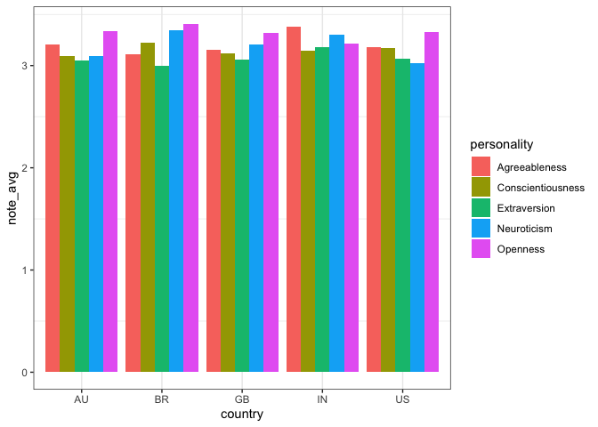

    library(tidyverse)

    ## ── Attaching packages ─────────────────────────────────────── tidyverse 1.3.2 ──
    ## ✔ ggplot2 3.4.0      ✔ purrr   1.0.0 
    ## ✔ tibble  3.1.8      ✔ dplyr   1.0.10
    ## ✔ tidyr   1.2.1      ✔ stringr 1.5.0 
    ## ✔ readr   2.1.3      ✔ forcats 0.5.2 
    ## ── Conflicts ────────────────────────────────────────── tidyverse_conflicts() ──
    ## ✖ dplyr::filter() masks stats::filter()
    ## ✖ dplyr::lag()    masks stats::lag()

    library(ggplot2)
    library(dplyr)

    df<- read.csv("/Users/huangziyi/BIG5.csv")
    target <- c("US", "GB", "IN", "AU", "BR")

    df<-  filter(df, country %in% target) %>%
      mutate (O= (O1+O2+O3+O4+O5+O6+O7+O8+O9+O10)/10) %>%
      mutate (C= (C1+C2+C3+C4+C5+C6+C7+C8+C9+C10)/10) %>%
      mutate (E= (E1+E2+E3+E4+E5+E6+E7+E8+E9+E10)/10) %>%
      mutate (A= (A1+A2+A3+A4+A5+A6+A7+A8+A9+A10)/10) %>%
      mutate (N= (N1+N2+N3+N4+N5+N6+N7+N8+N9+N10)/10) %>%
      pivot_longer(c(`O`, `C`,`E`, `A`, `N`), names_to="personality", values_to = "note") %>%
      select("country", "personality", "note")

    class(df$note)="Numeric"

    df<- df%>%group_by(country, personality) %>% summarise(note_avg=mean(note))

    ## `summarise()` has grouped output by 'country'. You can override using the
    ## `.groups` argument.

    plot<- ggplot(df, aes (x=country, y=note_avg, fill=personality))+
      geom_bar(stat = "identity",
               position = "dodge")+
      scale_fill_discrete(labels = c("Agreeableness", "Conscientiousness", "Extraversion", "Neuroticism", "Openness"))+
      theme_bw() +
      theme(panel.grid.major.y = element_blank())

    print(plot)

