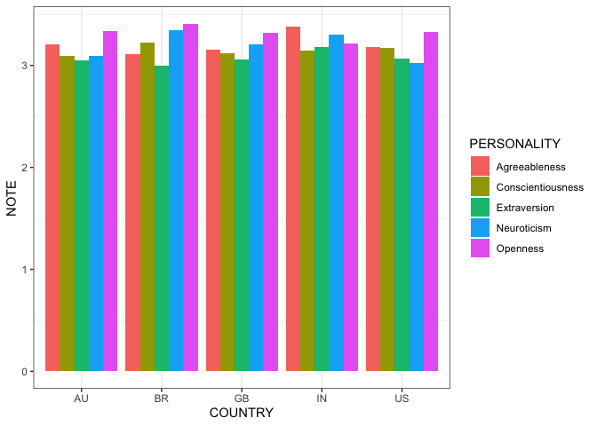

    library(tidyverse)

    ## ── Attaching packages ─────────────────────────────────────── tidyverse 1.3.2 ──
    ## ✔ ggplot2 3.4.0      ✔ purrr   1.0.0 
    ## ✔ tibble  3.1.8      ✔ dplyr   1.0.10
    ## ✔ tidyr   1.2.1      ✔ stringr 1.5.0 
    ## ✔ readr   2.1.3      ✔ forcats 0.5.2 
    ## ── Conflicts ────────────────────────────────────────── tidyverse_conflicts() ──
    ## ✖ dplyr::filter() masks stats::filter()
    ## ✖ dplyr::lag()    masks stats::lag()

    library(ggplot2)
    library(dplyr)

    df<- read.csv("/Users/huangziyi/BIG5.csv")
    target <- c("US", "GB", "IN", "AU", "BR")
    df<-  filter(df, country %in% target)

    df <- 
      mutate (df, O= (O1+O2+O3+O4+O5+O6+O7+O8+O9+O10)/10) %>%
      mutate (df, C= (C1+C2+C3+C4+C5+C6+C7+C8+C9+C10)/10) %>%
      mutate (df, E= (E1+E2+E3+E4+E5+E6+E7+E8+E9+E10)/10) %>%
      mutate (df, A= (A1+A2+A3+A4+A5+A6+A7+A8+A9+A10)/10) %>%
      mutate (df, N= (N1+N2+N3+N4+N5+N6+N7+N8+N9+N10)/10)

    df<- df %>% 
      pivot_longer(c(`O`, `C`,`E`, `A`, `N`), names_to="personality", values_to = "note")

    df<- df%>%
      select("country", "personality", "note")

    class(df$note)="Numeric"

    dfUSO<- filter (df, country=="US", personality=="O")
    dfUSC<- filter (df, country=="US", personality=="C")
    dfUSE<- filter (df, country=="US", personality=="E")
    dfUSA<- filter (df, country=="US", personality=="A")
    dfUSN<- filter (df, country=="US", personality=="N")
    dfGBO<- filter (df, country=="GB", personality=="O")
    dfGBC<- filter (df, country=="GB", personality=="C")
    dfGBE<- filter (df, country=="GB", personality=="E")
    dfGBA<- filter (df, country=="GB", personality=="A")
    dfGBN<- filter (df, country=="GB", personality=="N")
    dfINO<- filter (df, country=="IN", personality=="O")
    dfINC<- filter (df, country=="IN", personality=="C")
    dfINE<- filter (df, country=="IN", personality=="E")
    dfINA<- filter (df, country=="IN", personality=="A")
    dfINN<- filter (df, country=="IN", personality=="N")
    dfAUO<- filter (df, country=="AU", personality=="O")
    dfAUC<- filter (df, country=="AU", personality=="C")
    dfAUE<- filter (df, country=="AU", personality=="E")
    dfAUA<- filter (df, country=="AU", personality=="A")
    dfAUN<- filter (df, country=="AU", personality=="N")
    dfBRO<- filter (df, country=="BR", personality=="O")
    dfBRC<- filter (df, country=="BR", personality=="C")
    dfBRE<- filter (df, country=="BR", personality=="E")
    dfBRA<- filter (df, country=="BR", personality=="A")
    dfBRN<- filter (df, country=="BR", personality=="N")

    noteUSO=mean(dfUSO$note)
    noteUSC=mean(dfUSC$note)
    noteUSA=mean(dfUSA$note)
    noteUSE=mean(dfUSE$note)
    noteUSN=mean(dfUSN$note)
    noteGBO=mean(dfGBO$note)
    noteGBC=mean(dfGBC$note)
    noteGBE=mean(dfGBE$note)
    noteGBA=mean(dfGBA$note)
    noteGBN=mean(dfGBN$note)
    noteINO=mean(dfINO$note)
    noteINC=mean(dfINC$note)
    noteINE=mean(dfINE$note)
    noteINA=mean(dfINA$note)
    noteINN=mean(dfINN$note)
    noteAUO=mean(dfAUO$note)
    noteAUC=mean(dfAUC$note)
    noteAUE=mean(dfAUE$note)
    noteAUA=mean(dfAUA$note)
    noteAUN=mean(dfAUN$note)
    noteBRO=mean(dfBRO$note)
    noteBRC=mean(dfBRC$note)
    noteBRE=mean(dfBRE$note)
    noteBRA=mean(dfBRA$note)
    noteBRN=mean(dfBRN$note)

    note_mean <- c(noteUSA, noteUSC, noteUSE, noteUSN, noteUSO, noteGBA, noteGBC, noteGBE, noteGBN, noteGBO, noteINA, noteINC, noteINE, noteINN, noteINO, noteAUA, noteAUC, noteAUE, noteAUN, noteAUO, noteBRA, noteBRC, noteBRE, noteBRN, noteBRO)

    data<-data.frame(COUNTRY=rep(c("US", "GB", "IN", "AU", "BR"), each=5), 
                     PERSONALITY=rep(c("A", "C", "E", "N", "O"), times=5), 
                     NOTE=note_mean)

    plot<- ggplot(data, aes (x=COUNTRY, y=NOTE, fill=PERSONALITY))+
      geom_bar(stat = "identity",
               position = "dodge")+
      scale_fill_discrete(labels = c("Agreeableness", "Conscientiousness", "Extraversion", "Neuroticism", "Openness"))+
      theme_bw() +
      theme(panel.grid.major.y = element_blank())

    print(plot)

