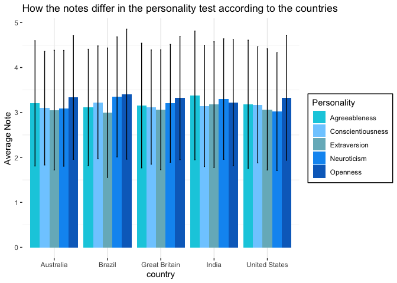

    library(readr)
    library(tidyverse)

    ## ── Attaching packages ─────────────────────────────────────── tidyverse 1.3.2 ──
    ## ✔ ggplot2 3.4.0      ✔ dplyr   1.0.10
    ## ✔ tibble  3.1.8      ✔ stringr 1.5.0 
    ## ✔ tidyr   1.2.1      ✔ forcats 0.5.2 
    ## ✔ purrr   1.0.0      
    ## ── Conflicts ────────────────────────────────────────── tidyverse_conflicts() ──
    ## ✖ dplyr::filter() masks stats::filter()
    ## ✖ dplyr::lag()    masks stats::lag()

    library(dplyr)
    library(ggplot2)
    library(readxl)
    library(ggrepel)
    library(stringr)

    df<- read.csv("/Users/huangziyi/BIG5.csv")
    target <- c("US", "GB", "IN", "AU", "BR")

    df<-  filter(df, country %in% target) %>%
      pivot_longer(c(str_c("O", 1:10), str_c("C", 1:10), str_c("E", 1:10), str_c("A", 1:10), str_c("N", 1:10)), names_to="personality", values_to = "note") %>%
      select("country", "personality", "note")%>%
      mutate(BIG=str_c(str_sub(personality, start=1, end=1))) 

    sd <- df%>%group_by(country, BIG) %>% summarise(note_sd=sd(note))

    ## `summarise()` has grouped output by 'country'. You can override using the
    ## `.groups` argument.

    avg <- df%>% group_by(country, BIG) %>% summarise(note_avg=mean(note))

    ## `summarise()` has grouped output by 'country'. You can override using the
    ## `.groups` argument.

    avg$sd<-sd$note_sd
    avg$country <- factor(avg$country)

    plot<- ggplot(avg, aes (x=country, y=note_avg, fill=BIG))+
      geom_bar(stat = "identity",
               position = "dodge")+
      geom_errorbar(aes(ymin=note_avg-sd, ymax=note_avg+sd), width=.1,position=position_dodge(.9))+
      geom_line() +
      theme_bw() +
      theme(panel.grid.major.y = element_blank()) +
      theme(legend.background = element_rect(fill = "white", colour = "black"))+
     theme(panel.border = element_blank())+
      scale_x_discrete(labels = c("Australia","Brazil","Great Britain", "India", "United States"))+
      scale_fill_manual(values = c("#06CDE0", "#7fcdff", "#76b6c4" , "#0A98F2", "#066EC5"), labels = c("Agreeableness", "Conscientiousness", "Extraversion", "Neuroticism", "Openness")) +
       labs(y = "Average Note", fill="Personality", title="How the notes differ in the personality test according to the countries") 
      
      

    print(plot)

    ## `geom_line()`: Each group consists of only one observation.
    ## ℹ Do you need to adjust the group aesthetic?

