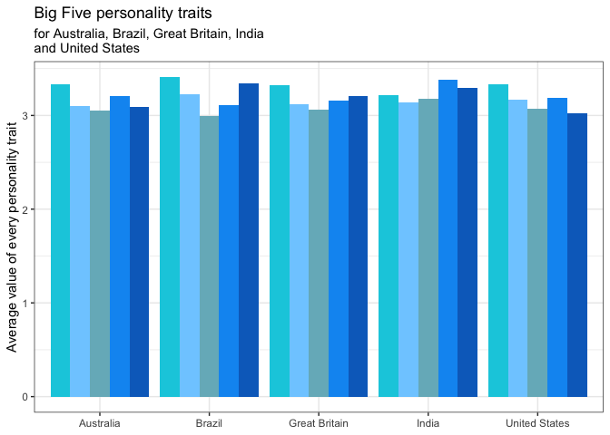
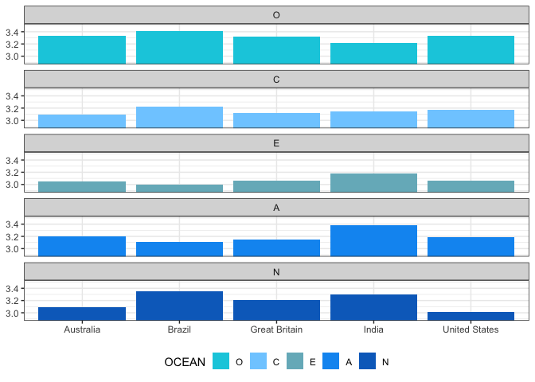

## OCEAN: BIG5 Personalities

### Henning’s Project

First thing I did, I filtered the dataset, summarised the means and
ordered levels in the OCEAN factor column.

The new dataset (df1) has only three columns: country, OCEAN (to see
what kind of trait is represented by the value, cause i’m working with a
long table) and the value for the personality trait.

    df1 <- 
    df %>%
        filter(country %in% c("US", "GB", "IN", "AU", "BR")) %>%
        select(-race,-age,-engnat,-gender,-hand,-source) %>%
        group_by(country) %>%
        summarise(      
          O = mean(mean(c_across(O1:O10))), 
          C = mean(mean(c_across(C1:C10))), 
          E = mean(mean(c_across(E1:E10))), 
          A = mean(mean(c_across(A1:A10))), 
          N = mean(mean(c_across(N1:N10)))
          ) %>%
        pivot_longer(cols = 2:6, names_to = "OCEAN") %>%
        mutate(OCEAN = factor(OCEAN, levels=c("O", "C", "E", "A", "N")))

    print(df1)

    ## # A tibble: 25 × 3
    ##    country OCEAN value
    ##    <chr>   <fct> <dbl>
    ##  1 AU      O      3.34
    ##  2 AU      C      3.10
    ##  3 AU      E      3.05
    ##  4 AU      A      3.20
    ##  5 AU      N      3.09
    ##  6 BR      O      3.41
    ##  7 BR      C      3.23
    ##  8 BR      E      3.00
    ##  9 BR      A      3.11
    ## 10 BR      N      3.35
    ## # ℹ 15 more rows

## Plotting

I plotted two graphs: 1.st to represent the personality chart of each of
the five countries

2.nd to compare each personality trait across the countries.

There was a suggestion to plot the traits horizonally but I didn’t
really like the view.

## Final Graph

And after plotting the two graphs I uned them on one board. I added some
annotations like what do the OCEAN-traits and the scale mean and thats
it. Here I present you my final graph :sparkles:

