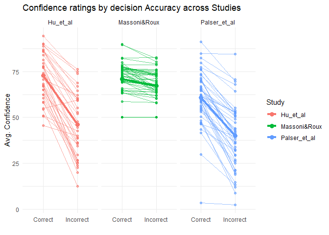
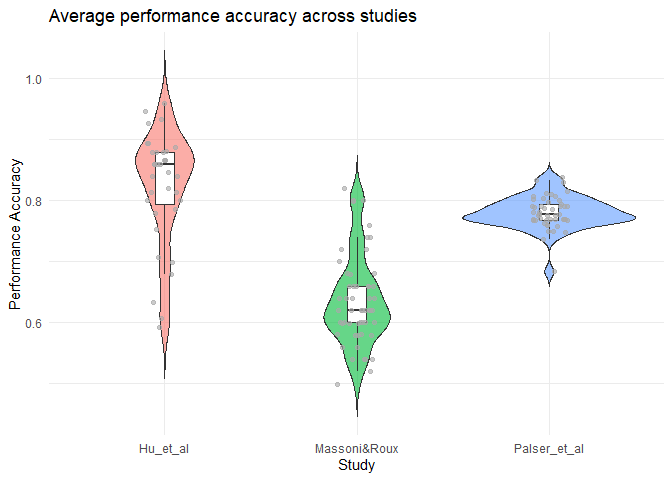

## Cleaning the data

### Study 1

    massoni <- massoni %>%
      filter(Subj_idx >= 67, Subj_idx <= 120) %>%                    # second study only
      mutate(Study_id = "Massoni&Roux")                              # add study_id column

    # calculate average performance per subject
    massoni_subj_perf <- massoni %>%
      group_by(Subj_idx, Study_id) %>%                               # group by subject and keep study_id
      summarise(average_performance = mean(Accuracy, na.rm = TRUE))  # calc average performance

### Study 2

    palser <- palser %>%
      drop_na() %>%                                                  # exclude responses with exceeded deadline
      filter(Condition == "Baseline") %>%                            # following the suggestion to make this study more comparable to the others
      mutate(Study_id = "Palser_et_al",                              # add study_id column
             Accuracy = ifelse(Response == Stimulus, 1, 0))          # add accuracy column

    # again calculate average performance per subject, same as above
    palser_subj_perf <- palser %>%
      group_by(Subj_idx, Study_id) %>%
      summarise(average_performance = mean(Accuracy, na.rm = TRUE))

### Study 3

    # following a similar pattern as above:
    hu <- hu %>%
      mutate(Study_id = "Hu_et_al")

    hu_subj_perf <- hu %>%
      group_by(Subj_idx, Study_id) %>%
      summarise(average_performance = mean(Accuracy, na.rm = TRUE))

### All studies

Rescaling of the confidence ratings to 0 to 100:

    massoni <- massoni %>%
      mutate(Confidence = Confidence * 100)

    # palser is already scaled well, except for the bounds 0 and 99, but Ill just ignore that

    hu <- hu %>%
      mutate(Confidence = (Confidence - 1) / 5 * 100) # rescale from 1-6 to 0-100

### Merging the datasets to aggregated dataframes:

Firstly, shift subject indices to avoid overlap:

    palser <- palser %>%  
      mutate(Subj_idx = Subj_idx + max(massoni$Subj_idx)) # shift by largest massoni subject index

    hu <- hu %>%
      mutate(Subj_idx = Subj_idx + max(palser$Subj_idx))  # shift by largest palser subject index

Now merge the datasets into two new dataframes:

    select_relevant <- function(df) {
      df %>%
        select(Subj_idx, Study_id, Accuracy, Confidence)
    }

    confidence <- bind_rows(
      select_relevant(massoni),
      select_relevant(palser),
      select_relevant(hu)
    )

    performance <- bind_rows(
      massoni_subj_perf,
      palser_subj_perf,
      hu_subj_perf
    )

resulting in these two final dataframes:

<table>
<thead>
<tr>
<th style="text-align: right;">Subj_idx</th>
<th style="text-align: left;">Study_id</th>
<th style="text-align: right;">Accuracy</th>
<th style="text-align: right;">Confidence</th>
</tr>
</thead>
<tbody>
<tr>
<td style="text-align: right;">67</td>
<td style="text-align: left;">Massoni&amp;Roux</td>
<td style="text-align: right;">1</td>
<td style="text-align: right;">80</td>
</tr>
<tr>
<td style="text-align: right;">67</td>
<td style="text-align: left;">Massoni&amp;Roux</td>
<td style="text-align: right;">0</td>
<td style="text-align: right;">85</td>
</tr>
<tr>
<td style="text-align: right;">67</td>
<td style="text-align: left;">Massoni&amp;Roux</td>
<td style="text-align: right;">1</td>
<td style="text-align: right;">80</td>
</tr>
<tr>
<td style="text-align: right;">67</td>
<td style="text-align: left;">Massoni&amp;Roux</td>
<td style="text-align: right;">1</td>
<td style="text-align: right;">75</td>
</tr>
<tr>
<td style="text-align: right;">67</td>
<td style="text-align: left;">Massoni&amp;Roux</td>
<td style="text-align: right;">0</td>
<td style="text-align: right;">80</td>
</tr>
<tr>
<td style="text-align: right;">67</td>
<td style="text-align: left;">Massoni&amp;Roux</td>
<td style="text-align: right;">1</td>
<td style="text-align: right;">75</td>
</tr>
</tbody>
</table>

<table>
<thead>
<tr>
<th style="text-align: right;">Subj_idx</th>
<th style="text-align: left;">Study_id</th>
<th style="text-align: right;">average_performance</th>
</tr>
</thead>
<tbody>
<tr>
<td style="text-align: right;">67</td>
<td style="text-align: left;">Massoni&amp;Roux</td>
<td style="text-align: right;">0.58</td>
</tr>
<tr>
<td style="text-align: right;">68</td>
<td style="text-align: left;">Massoni&amp;Roux</td>
<td style="text-align: right;">0.66</td>
</tr>
<tr>
<td style="text-align: right;">69</td>
<td style="text-align: left;">Massoni&amp;Roux</td>
<td style="text-align: right;">0.54</td>
</tr>
<tr>
<td style="text-align: right;">70</td>
<td style="text-align: left;">Massoni&amp;Roux</td>
<td style="text-align: right;">0.70</td>
</tr>
<tr>
<td style="text-align: right;">71</td>
<td style="text-align: left;">Massoni&amp;Roux</td>
<td style="text-align: right;">0.60</td>
</tr>
<tr>
<td style="text-align: right;">72</td>
<td style="text-align: left;">Massoni&amp;Roux</td>
<td style="text-align: right;">0.66</td>
</tr>
</tbody>
</table>

## Data visualization 1: Confidence ratings and performance accuracy across studies

Firstly, filter out all subjects that have only correct or only
incorrect responses.

    subjects_to_include <- confidence %>%
      group_by(Subj_idx) %>%
      summarise(n_correct   = sum(Accuracy == 1),
                n_incorrect = sum(Accuracy == 0)) %>%
      filter(n_correct > 0, n_incorrect > 0) %>%
      pull(Subj_idx)

    confidence_filtered <- confidence %>%
      filter(Subj_idx %in% subjects_to_include)

Now the means per subject and study can be calculated:

    # in preperation for plotting, create txt labels
    confidence_filtered <- confidence_filtered %>%
      mutate(Label = ifelse(Accuracy == 1, "Correct", "Incorrect"))

    confidence_means_individual <- confidence_filtered %>%
      group_by(Subj_idx, Study_id, Label) %>%
      summarise(mean_conf = mean(Confidence, na.rm = TRUE))

    confidence_means_group <- confidence_filtered %>%
      group_by(Study_id, Label) %>%
      summarise(mean_conf = mean(Confidence, na.rm = TRUE))

Final plot:

    ggplot() +
      # individual lines
      geom_line(data = confidence_means_individual, 
                aes(x = Label, y = mean_conf, group = Subj_idx, color = Study_id), 
                alpha = 0.6) +  # slightly transparent to make group lines stand out more
      # individual points
      geom_point(data = confidence_means_individual, 
                 aes(x = Label, y = mean_conf, color = Study_id), 
                 alpha = 0.6) +
      # group lines
      geom_line(data = confidence_means_group, 
                aes(x = Label, y = mean_conf, group = Study_id, color = Study_id), 
                linewidth = 1.5) +
      # group points
      geom_point(data = confidence_means_group, 
                 aes(x = Label, y = mean_conf, color = Study_id), 
                 size = 3) +
      facet_wrap(~ Study_id) +  # panel for each study
      theme_minimal() +
      labs(
        title = "Confidence ratings by decision Accuracy across Studies",
        x = "",
        y = "Avg. Confidence",
        color = "Study"
      ) +
      theme(legend.position = "right")

## Data visualization 2: Performance accuracy across studies

This was very straightforward thanks to the amazing drawing provided.
The following plot shows where most participants fall in terms of their
average performance accuracy across the three studies (violin: actual
distribution of the data, boxplot: median and range, jitter: individual
data points spread out)

    ggplot(performance, aes(x = Study_id, y = average_performance, fill = Study_id)) +
      geom_violin(alpha = 0.6, trim = FALSE) +
      # boxplot with outliers hidden as jitter also shows them
      geom_boxplot(width = 0.1, fill = "white", outlier.shape = NA) +
      # each individual participants performance score (jittered as in the drawing)
      geom_jitter(width = 0.1, alpha = 0.6, size = 1.5, color = "darkgray") +
      theme_minimal() +
      labs(
        title = "Average performance accuracy across studies",
        x = "Study",
        y = "Performance Accuracy"
      ) +
      theme(legend.position = "none")

## Closing remarks

The data very much confirms that correct decisions usually have higher
confidence ratings than incorrect ones, as you stated in your
visualization 1 task, and its also interesting to see how well the
participants performed across the three studies!

Thank you for this interesting project and especially for the pretty
drawings, they helped a lot!
