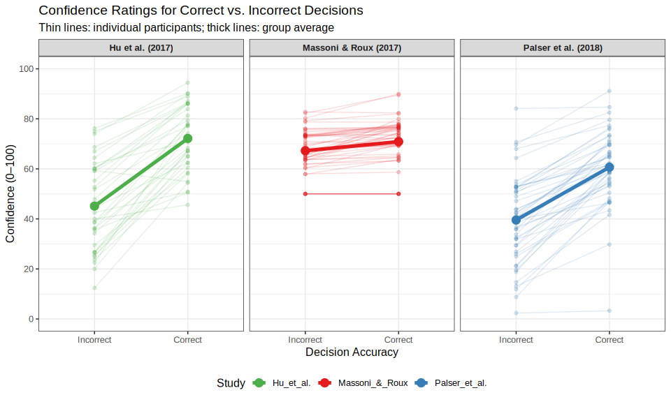
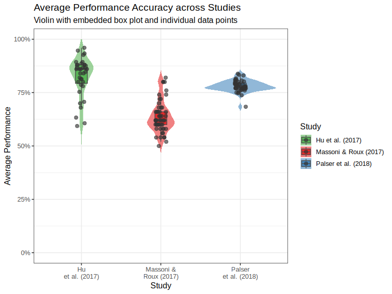

Cross-Study Confidence-Ratings – Solution
================
Copilot
2026-03-27

- [Overview](#overview)
- [Setup](#setup)
- [Data Loading and Cleaning](#data-loading-and-cleaning)
  - [Study 1 – Massoni & Roux (2017)](#study-1--massoni--roux-2017)
  - [Study 2 – Palser et al. (2018)](#study-2--palser-et-al-2018)
  - [Study 3 – Hu et al. (2017)](#study-3--hu-et-al-2017)
  - [Combining All Studies](#combining-all-studies)
    - [Harmonising participant IDs](#harmonising-participant-ids)
    - [Combined `confidence` dataset](#combined-confidence-dataset)
    - [Combined `performance` dataset](#combined-performance-dataset)
- [Visualization 1 – Confidence by Decision Accuracy (Spaghetti
  Plot)](#visualization-1--confidence-by-decision-accuracy-spaghetti-plot)
  - [Interpretation of Visualization
    1](#interpretation-of-visualization-1)
- [Visualization 2 – Average Performance Accuracy across
  Studies](#visualization-2--average-performance-accuracy-across-studies)
  - [Interpretation of Visualization
    2](#interpretation-of-visualization-2)
- [References](#references)

# Overview

This document presents a reproducible analysis of confidence ratings
across three psychological studies. Using the `tidyverse` suite of
packages we (1) load and clean each dataset, (2) combine them on a
common confidence scale, (3) compare how confidence relates to decision
accuracy at both the individual and group levels, and (4) compare
average performance accuracy across studies.

------------------------------------------------------------------------

# Setup

``` r
library(tidyverse)
```

------------------------------------------------------------------------

# Data Loading and Cleaning

## Study 1 – Massoni & Roux (2017)

Participants performed a perceptual dot-quantity task and rated their
confidence on a **0–1 scale** (0 %–100 % in 5 % steps). The CSV actually
contains two studies. The project description asks us to use only
**Study 2** (participants 67–120), where no manipulation of stimulus
difficulty was applied.

``` r
# Load
massoni_raw <- read_csv(
  "Massoni_2017/data_Massoni_2017.csv",
  show_col_types = FALSE
)

# Keep only the second sub-study and relevant variables
massoni <- massoni_raw %>%
  filter(Study == 2) %>%
  select(Subj_idx, Stimulus, Response, Confidence, Accuracy) %>%
  mutate(study_id = "Massoni_&_Roux")

# How many participants?
massoni_n <- n_distinct(massoni$Subj_idx)   # 54
cat("Massoni Study-2 participants:", massoni_n, "\n")
```

    ## Massoni Study-2 participants: 54

**Confidence scale conversion**: The raw values are on a 0–1 scale. We
multiply by 100 so that all studies end up on a 0–100 scale.

``` r
massoni <- massoni %>%
  mutate(Confidence = Confidence * 100)
```

**Performance data (Massoni)**: Calculate each participant’s average
accuracy.

``` r
perf_massoni <- massoni %>%
  group_by(Subj_idx, study_id) %>%
  summarise(average_performance = mean(Accuracy), .groups = "drop")
```

------------------------------------------------------------------------

## Study 2 – Palser et al. (2018)

Participants judged which interval (first or second) contained a Gabor
patch and rated confidence on a **1–99 scale**. There are trials where
the response deadline was exceeded (missing `Confidence` / `Response`),
which are excluded. We retain only the **Baseline** condition to
maximise comparability with the other studies.

``` r
palser_raw <- read_csv(
  "Palser_2018/data_Palser_2018.csv",
  show_col_types = FALSE
)

palser <- palser_raw %>%
  filter(Condition == "Baseline") %>%        # Baseline only
  filter(!is.na(Confidence), !is.na(Response)) %>%  # Remove deadline trials
  select(Subj_idx, Stimulus, Response, Confidence) %>%
  # Accuracy: 1 if response matches stimulus, 0 otherwise
  mutate(
    Accuracy  = if_else(Stimulus == Response, 1L, 0L),
    study_id  = "Palser_et_al."
  )

palser_n <- n_distinct(palser$Subj_idx)   # 48
cat("Palser participants:", palser_n, "\n")
```

    ## Palser participants: 48

**Confidence scale conversion**: Following the project instructions, we
treat the Palser scale as already located within a 0–100 range (i.e. the
scale goes from 0 to 100 but participants never used 0 or 100).
Confidence values slightly above 99 (artefacts present in the data) are
clamped to 100.

``` r
palser <- palser %>%
  mutate(Confidence = pmin(Confidence, 100))
```

**Performance data (Palser)**:

``` r
perf_palser <- palser %>%
  group_by(Subj_idx, study_id) %>%
  summarise(average_performance = mean(Accuracy), .groups = "drop")
```

------------------------------------------------------------------------

## Study 3 – Hu et al. (2017)

Participants completed a word-recognition memory task. After encoding a
set of words, they were shown each encoded word paired with a new word
and had to choose the previously seen one. Confidence was rated on a
**1–6 scale**. No experimental manipulations were applied.

``` r
hu_raw <- read_csv(
  "Hu_2017/data_Hu_2017.csv",
  show_col_types = FALSE
)

hu <- hu_raw %>%
  select(Subj_idx, Stimulus, Response, Confidence, Accuracy) %>%
  mutate(study_id = "Hu_et_al.")

hu_n <- n_distinct(hu$Subj_idx)   # 35
cat("Hu participants:", hu_n, "\n")
```

    ## Hu participants: 35

**Confidence scale conversion**: The 1–6 scale is linearly rescaled to
0–100:

$$\text{Confidence}_{0-100} = \frac{\text{Confidence}_{1-6} - 1}{5} \times 100$$

``` r
hu <- hu %>%
  mutate(Confidence = (Confidence - 1) / 5 * 100)
```

**Performance data (Hu)**:

``` r
perf_hu <- hu %>%
  group_by(Subj_idx, study_id) %>%
  summarise(average_performance = mean(Accuracy), .groups = "drop")
```

------------------------------------------------------------------------

## Combining All Studies

### Harmonising participant IDs

Because each study uses its own numbering starting at 1, participants
with the same `Subj_idx` across studies are different people. We create
a globally unique `Subj_idx` by adding cumulative sample-size offsets:

| Study          | Original IDs | Offset | New IDs   |
|----------------|--------------|--------|-----------|
| Massoni & Roux | 67 – 120     | −66    | 1 – 54    |
| Palser et al.  | 1 – 48       | +54    | 55 – 102  |
| Hu et al.      | 1 – 35       | +102   | 103 – 137 |

``` r
# Massoni Study-2 participants run from 67 to 120 → remap to 1 to 54
massoni <- massoni %>%
  mutate(Subj_idx = Subj_idx - 66)   # 67→1, 68→2, …, 120→54

perf_massoni <- perf_massoni %>%
  mutate(Subj_idx = Subj_idx - 66)

# Palser participants 1–48 → add 54
palser <- palser %>%
  mutate(Subj_idx = Subj_idx + massoni_n)

perf_palser <- perf_palser %>%
  mutate(Subj_idx = Subj_idx + massoni_n)

# Hu participants 1–35 → add 54+48 = 102
hu <- hu %>%
  mutate(Subj_idx = Subj_idx + massoni_n + palser_n)

perf_hu <- perf_hu %>%
  mutate(Subj_idx = Subj_idx + massoni_n + palser_n)
```

### Combined `confidence` dataset

Keep only the variables needed for Visualization 1.

``` r
confidence <- bind_rows(
  massoni  %>% select(Subj_idx, study_id, Accuracy, Confidence),
  palser   %>% select(Subj_idx, study_id, Accuracy, Confidence),
  hu       %>% select(Subj_idx, study_id, Accuracy, Confidence)
)

glimpse(confidence)
```

    ## Rows: 12,682
    ## Columns: 4
    ## $ Subj_idx   <dbl> 1, 1, 1, 1, 1, 1, 1, 1, 1, 1, 1, 1, 1, 1, 1, 1, 1, 1, 1, 1,…
    ## $ study_id   <chr> "Massoni_&_Roux", "Massoni_&_Roux", "Massoni_&_Roux", "Mass…
    ## $ Accuracy   <dbl> 1, 0, 1, 1, 0, 1, 1, 1, 1, 0, 0, 0, 1, 0, 1, 1, 1, 0, 0, 1,…
    ## $ Confidence <dbl> 80, 85, 80, 75, 80, 75, 80, 80, 80, 75, 75, 80, 80, 75, 70,…

### Combined `performance` dataset

``` r
performance <- bind_rows(perf_massoni, perf_palser, perf_hu)

glimpse(performance)
```

    ## Rows: 137
    ## Columns: 3
    ## $ Subj_idx            <dbl> 1, 2, 3, 4, 5, 6, 7, 8, 9, 10, 11, 12, 13, 14, 15,…
    ## $ study_id            <chr> "Massoni_&_Roux", "Massoni_&_Roux", "Massoni_&_Rou…
    ## $ average_performance <dbl> 0.58, 0.66, 0.54, 0.70, 0.60, 0.66, 0.74, 0.62, 0.…

------------------------------------------------------------------------

# Visualization 1 – Confidence by Decision Accuracy (Spaghetti Plot)

**Goal**: Show how confidence differs between correct and incorrect
decisions for each study, both at the individual and group level.

``` r
# Per-participant mean confidence for correct (1) and incorrect (0) decisions
conf_individual <- confidence %>%
  mutate(Accuracy = factor(Accuracy, levels = c(0, 1),
                           labels = c("Incorrect", "Correct"))) %>%
  group_by(Subj_idx, study_id, Accuracy) %>%
  summarise(mean_conf = mean(Confidence), .groups = "drop")

# Exclude participants who have ONLY correct or ONLY incorrect trials
valid_subs <- conf_individual %>%
  group_by(Subj_idx) %>%
  filter(n_distinct(Accuracy) == 2) %>%
  ungroup()

# Group-level mean confidence (based on valid participants only)
conf_group <- valid_subs %>%
  group_by(study_id, Accuracy) %>%
  summarise(mean_conf = mean(mean_conf), .groups = "drop")
```

``` r
study_colours <- c(
  "Massoni_&_Roux" = "#E41A1C",
  "Palser_et_al."  = "#377EB8",
  "Hu_et_al."      = "#4DAF4A"
)

ggplot() +
  # Individual spaghetti lines (transparent)
  geom_line(
    data  = valid_subs,
    aes(x = Accuracy, y = mean_conf,
        group = Subj_idx, colour = study_id),
    alpha = 0.15, linewidth = 0.5
  ) +
  # Individual data points (transparent)
  geom_point(
    data  = valid_subs,
    aes(x = Accuracy, y = mean_conf, colour = study_id),
    alpha = 0.2, size = 1.5
  ) +
  # Group average line (prominent)
  geom_line(
    data  = conf_group,
    aes(x = Accuracy, y = mean_conf,
        group = study_id, colour = study_id),
    linewidth = 1.8
  ) +
  # Group average points
  geom_point(
    data  = conf_group,
    aes(x = Accuracy, y = mean_conf, colour = study_id),
    size = 4
  ) +
  facet_wrap(~ study_id, nrow = 1,
             labeller = as_labeller(c(
               "Massoni_&_Roux" = "Massoni & Roux (2017)",
               "Palser_et_al."  = "Palser et al. (2018)",
               "Hu_et_al."      = "Hu et al. (2017)"
             ))) +
  scale_colour_manual(values = study_colours, name = "Study") +
  scale_y_continuous(limits = c(0, 100), breaks = seq(0, 100, 20)) +
  labs(
    title    = "Confidence Ratings for Correct vs. Incorrect Decisions",
    subtitle = "Thin lines: individual participants; thick lines: group average",
    x        = "Decision Accuracy",
    y        = "Confidence (0–100)"
  ) +
  theme_bw(base_size = 12) +
  theme(
    legend.position = "bottom",
    strip.text      = element_text(face = "bold")
  )
```

<figure>

<figcaption aria-hidden="true">Spaghetti plot of confidence ratings for
correct vs. incorrect decisions. Thin, transparent lines represent
individual participants; thick, opaque lines with points show the group
average. The three studies are shown in separate panels.</figcaption>
</figure>

## Interpretation of Visualization 1

The spaghetti plot reveals the relationship between confidence and
decision accuracy in all three studies:

- **Metacognitive sensitivity**: In all three studies, the group-average
  confidence is visibly *higher* for correct decisions than for
  incorrect ones (the group line rises from left to right). This pattern
  is the expected signature of *metacognitive sensitivity* — the ability
  to introspect on one’s own performance — and appears to hold across
  three distinct tasks (perceptual dot-quantity, Gabor-patch detection,
  and word recognition).

- **Individual variation (spaghetti)**: The individual lines show
  considerable variability. While the majority of participants show the
  expected direction (higher confidence on correct trials), some
  participants show a flat or even reversed pattern. These participants
  may have limited metacognitive access to their own performance or may
  have adopted unusual confidence-rating strategies. *Note*: because the
  interpretation of individual trajectories can be influenced by trial
  count per participant, this observation should be treated with
  caution.

- **Cross-study differences**: The absolute level of confidence and the
  magnitude of the correct–incorrect difference appear to differ across
  studies. However, because the original confidence scales were
  different (0–1, 1–99, 1–6) and had to be harmonised, direct
  comparisons of absolute levels should be interpreted cautiously. The
  confidence scale transformation preserves relative differences within
  each study but may not make absolute values perfectly comparable
  across studies.

------------------------------------------------------------------------

# Visualization 2 – Average Performance Accuracy across Studies

**Goal**: Compare participants’ overall accuracy between the three
studies using violin plots with embedded box plots and individual data
points.

``` r
# Set a fixed random seed for reproducibility of jitter positions
set.seed(42)

ggplot(performance,
       aes(x = study_id, y = average_performance, fill = study_id)) +
  # Violin
  geom_violin(alpha = 0.55, trim = FALSE, colour = NA) +
  # Box plot (suppressing outliers – they are shown as jittered points below)
  geom_boxplot(width = 0.15, alpha = 0.85, outlier.shape = NA,
               colour = "grey30") +
  # Individual data points
  geom_jitter(width = 0.07, alpha = 0.65, size = 2.2, colour = "grey20") +
  scale_fill_manual(
    values = c(
      "Massoni_&_Roux" = "#E41A1C",
      "Palser_et_al."  = "#377EB8",
      "Hu_et_al."      = "#4DAF4A"
    ),
    name   = "Study",
    labels = c(
      "Massoni_&_Roux" = "Massoni & Roux (2017)",
      "Palser_et_al."  = "Palser et al. (2018)",
      "Hu_et_al."      = "Hu et al. (2017)"
    )
  ) +
  scale_x_discrete(
    labels = c(
      "Massoni_&_Roux" = "Massoni &\nRoux (2017)",
      "Palser_et_al."  = "Palser\net al. (2018)",
      "Hu_et_al."      = "Hu\net al. (2017)"
    )
  ) +
  scale_y_continuous(limits = c(0, 1), labels = scales::percent_format()) +
  labs(
    title    = "Average Performance Accuracy across Studies",
    subtitle = "Violin with embedded box plot and individual data points",
    x        = "Study",
    y        = "Average Performance"
  ) +
  theme_bw(base_size = 12) +
  theme(legend.position = "right")
```

<figure>

<figcaption aria-hidden="true">Violin plots of average performance
accuracy per participant for each study, with embedded box plots and
individual data points (jittered for visibility).</figcaption>
</figure>

## Interpretation of Visualization 2

- **Above-chance performance**: In all three studies the median average
  performance is clearly above the 50 % chance level (the horizontal
  midpoint of the y-axis). This confirms that participants in each task
  performed meaningfully better than random guessing, validating the
  task designs.

- **Study differences**: Hu et al. (2017) — the word-recognition task —
  shows the highest median accuracy and a relatively compact
  distribution, suggesting that participants found the memory task
  comparatively easy or that the stimuli were well-chosen for the target
  population. Massoni & Roux

  2017) and Palser et al. (2018) — both perceptual tasks — show somewhat
        lower median accuracy. *Please note*: these cross-study
        comparisons may partly reflect task difficulty rather than any
        inherent difference in participants’ cognitive abilities.

- **Distribution shape**: The violin plots reveal that the distributions
  differ in shape. Hu et al. appears more bell-shaped and narrow,
  whereas the perceptual studies show somewhat wider distributions with
  more spread toward lower accuracy levels.

- **Important caveat**: Direct comparisons of performance accuracy
  across studies should be treated with caution. The three studies
  differ in task type (perceptual vs. memory), number of trials,
  difficulty levels, and participant samples. Any differences in average
  performance could be attributable to these design features rather than
  reflecting genuine differences in participant ability.

------------------------------------------------------------------------

# References

Hu, X., Liu, Z., Chen, W., Zheng, J., Su, N., Wang, W., … & Luo, L.
(2017). Individual Differences in the Accuracy of Judgments of Learning
Are Related to the Gray Matter Volume and Functional Connectivity of the
Left Mid-Insula. *Frontiers in Human Neuroscience*, 11, 399.

Massoni, S., & Roux, N. (2017). Optimal Group Decision: A Matter of
Confidence Calibration. *Journal of Mathematical Psychology*, 79,
121–130.

Palser, E. R., Fotopoulou, A., & Kilner, J. M. (2018). Altering movement
parameters disrupts metacognitive accuracy. *Consciousness and
Cognition*, 57, 33–40.
