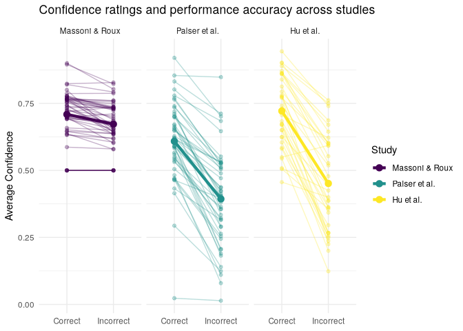
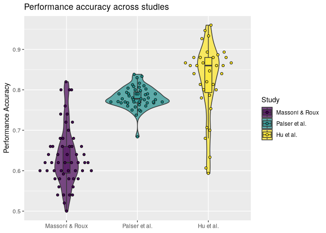

# Cross-Study Confidence-Ratings Project

For this project we use three datasets from the Confidence database
available on the Open Science Framework (OSF). All studies in this
database analyze different psychological constructs, but have the same
structure concerning their experimental paradigm: Participants are
presented with a stimulus and perform some sort of task on it
(e.g. determine if they have seen a picture before) for which their
performance can be evaluated in a binary fashion (correct/incorrect).
Subsequently, they are asked to rate their confidence in their answer.

For the solution of this project no AI was used, and no code of other
submissions was looked at, only the resulting plots where used for
inspiration.

## Data import and cleanup

We are importing the data from a local csv, each study provides a text
file that helps with the interpretation and cleanup of their data.

### Massoni & Roux

The Massoni dataset includes two studies, so we filter out the first
incompatible study, other then that the dataset is well behaved and does
not need any special processing or cleanup.

### Palser et al.

For Palser we need to append a Accuracy col as the dataset does not
include one, we do this by comparing the Stimulus with the Response and
set equality to 1 and otherwise 0.

Also the Palser study does not include a confidence scale from 0 to 1
(0-&gt;100%). In the text file the authors say that the scale is
1-&gt;99 but that the program was not restricted, which meant, that ~17
values where above 99, which means I would either need to filter out
everything above 99 or set it to 99 as the users where just
overconfident. Probably the correct thing would be throwing it out, so
I’ve set them to 99 :D

### Hu et al.

The Hu et al. dataset is again very well behaved, the only data
processing we need to do is normalizing their used confidence scale from
1 to 6 to again 0-&gt;1.

### All Studies

#### Normalization

The Project description suggests a different normalization but I have
chosen a simpler mathematical normalization for 2 simple reasons,
because of the study design and the absense of a true 0 in study 2 and 3
we do not get a 1 to 1 comparison anyway, since the scale design can
already influence the participants. So we can do a simpler untidy
normalization as it won’t be the most influencial factor as study 3 is
ordinal not interval, for the participants the difference between 1 → 2
may not equal 4 → 5 psychologically.

So since we are searching for is not real comparability but reasonable
alignment, and therefore a simple normalization is in my eyes the way to
go.

#### Participant ID

As we need to combine the data of three studies into one dataframe and
Jakob very intelligently noticed that the Participant IDs could overlap
in such cases, which could be ignored if we always keep the StudyID as
additional reference column, but this would make data analysis harder so
a simple encoding is very helpful in this case.

The suggestion was to add the sample size of study 1 to every ID in
study 2 but this sadly does not avoid any collition, additionally in
this case the IDs of study 1 start with 67, and the IDs of study 2 start
with 1, so there is actually a very high chance we are generating a
collition here instead of solving it.

I would prefer an operation that is easily reversible without having to
know much about the data. Luckily as CS major we constantly have to
learn modular arithmetic and for the first time it is actually useful.
We can use “Restklassen” (Congruence classes) to encode the 3 lists, we
can simply use modulo (math) or bitshift (computer science) for that, I
will use modulo for it as it is simpler to understand and reason about
without computer science knowledge.

The idea behind it is the following, we need 3 unique “Classes” and they
are not allowed to overlap, so we multiply every number with a different
residue from dividing (modulo) numbers by 3

$$
participantIDs\_1 = 3 \times x + 0 \\\\
participantIDs\_2 = 3 \times x + 1 \\\\
participantIDs\_3 = 3 \times x + 2
$$
That way we can never have overlapping numbers. And even better, I had
already created a factor for the studies, so we can use the factor as
numeric input for:
$$
i = Rfactor - 1 \\\\
participantID = 3x+i
$$
And reversing it becomes easy:
$$ 
x = \frac{(y - i)}{3}
$$
i can be calculated simply by doing
*i* = *y* mod  3

# Data visualization

## Spaghetti plot

    confidence %>%
        filter_out(.by = Subj_idx, ifelse(mean(Accuracy) == 1 || mean(Accuracy) == 0, TRUE, FALSE)) %>%
        mutate(
            Study_id = factor(Study_id,
                levels = c("Masoni", "Palser", "Hu"),
                labels = c("Massoni & Roux", "Palser et al.", "Hu et al.")
            )
        ) %>%
        mutate(Accuracy = factor(Accuracy, levels = c(1, 0), labels = c("Correct", "Incorrect"))) %>%
        group_by(Study_id, Subj_idx, Accuracy) %>%
        summarise(Confidence = mean(Confidence)) %>%
        ggplot(aes(Accuracy, Confidence, color = Study_id)) +
        geom_line(aes(group = Subj_idx), alpha = 0.3) +
        geom_point(aes(group = Subj_idx), alpha = 0.3) +
        stat_summary(aes(group = Study_id), fun = mean, geom = "line", linewidth = 1.5) +
        stat_summary(aes(group = Study_id), fun = mean, geom = "point", size = 3) +
        facet_wrap(~Study_id) +
        labs(
            title = "Confidence ratings and performance accuracy across studies",
            x = NULL,
            y = "Average Confidence",
            color = "Study"
        ) +
        theme_minimal()

    ## `summarise()` has regrouped the output.
    ## ℹ Summaries were computed grouped by Study_id, Subj_idx, and Accuracy.
    ## ℹ Output is grouped by Study_id and Subj_idx.
    ## ℹ Use `summarise(.groups = "drop_last")` to silence this message.
    ## ℹ Use `summarise(.by = c(Study_id, Subj_idx, Accuracy))` for per-operation
    ##   grouping (`?dplyr::dplyr_by`) instead.

## Violin plot

    performance %>%
        mutate(
            Study_id = factor(Study_id,
                levels = c("Masoni", "Palser", "Hu"),
                labels = c("Massoni & Roux", "Palser et al.", "Hu et al.")
            )
        ) %>%
        ggplot(aes(Study_id, Avg_Accuracy, fill = Study_id)) +
        geom_violin(alpha = 0.7) +
        geom_boxplot(alpha = 0.5, outliers = FALSE, width = 0.1) +
        geom_quasirandom(color = "black", shape = 21) +
        labs(
            x = NULL,
            y = "Performance Accuracy",
            title = "Performance accuracy across studies",
            fill = "Study"
        )

