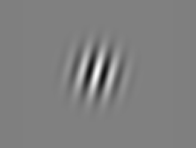
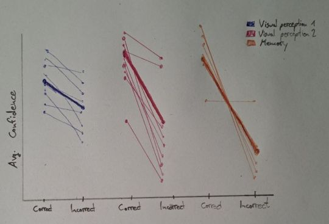
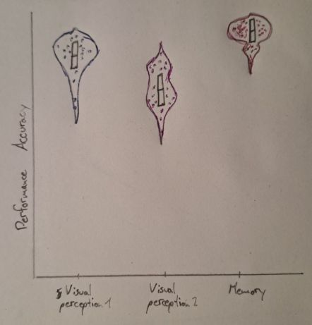

Cross-Study Confidence-Ratings Project
================
Jakob Raatschen

# Confidence Ratings in Three Psychological Studies

For this project we use three datasets from the Confidence database
available on the Open Science Framework (OSF). All studies in this
database analyse different psychological constructs, but have the same
structure concerning their experimental paradigm: Participants are
presented with a stimulus and perform some sort of task on it
(e.g. determine if they have seen a picture before) for which there
performance can be evaluated in a binary fashion (correct/incorrect).
Subsequently, they are asked to rate their confidence in their answer.

In this project you are supposed to (1) compare across three studies how
confidence relates to the performance of the participants and (2)
compare average performance accuracies between studies.

The data sets are not too wrangled, the challenges will be rather to
find ways to appropriately compare the studies.

## Study 1: Massoni & Roux (2017)

The first dataset is from a study by Massoni and Roux (2017) who tested
participants in a perceptual decision making task. Participants had to
decide between two circles which one contained more dots. After each
trial they were asked to rate their confidence in their answer on a
scale from 0% to 100% with increments of 5%.

## Study 2: Palser et al. (2018)

The second dataset is from a study by Palser et al. (2018) who also
investigated confidence ratings in a perceptual decision making task.
Gabor patches were presented in either a first (1) or second (2)
interval. Participants had to decide, if they either saw the stimulus in
the first or second interval and then rate their confidence in their
answer on a scale from 1 to 99 with increments of 1.

##### Gabor Patches as Stimuli in Study 2

## Study 3: Hu et al. (2017)

The third dataset is from a study by Hu et al. (2017) who investigated
memory performance in a recognition task. In an encoding phase (first
presentation of stimuli) a subset of words were presented one after the
other. In a subsequent retrieval phase (second presentation of the
stimuli) the already shown words were paired with a word that had not
been shown before. Participants had to decide which of the two words
they had seen before and then rate their confidence in their answer on a
scale from 1 to 6. No experimental manipulations (like stimulus
difficulty) were applied in this study.

### Data Cleaning

#### Study 1

The data set actually contains two studies. We only want to use the
second study (Participants 67 to 120), as here no manipulation of the
stimulus difficulty (presentation time of stimulus) was applied. Also
add a a variable indicating the analysed construct (e.g. “visual
perception”)

A variable on the accuracy of the response already exists, so you do not
need to create one. However, calculate the average performance for each
participant and add the scores to the data frame.

#### Study 2

The variable has a manipulation condition including movement priming. As
this mainly impacts the reaction time and we do not investigate that
part, you can theoretically ignore this variable. Alternatively, you can
only consider the “Baseline” condition, as here no priming occured,
making it most comparable to other studies.

There are Nan values (for trials where the response deadline was
exceeded). Exclude these trials.

There is a “Contrast” variable, which I assume indicates the contrast of
the presented stimuli, however, this is not being explained in the
Readme file. For our purposes it should be fine to ignore this variable.

Add a a variable indicating the analysed construct (e.g. “visual
perception”).

Add a variable indicating the performance accuracy of the participants.
For this, you can compare the participants’ answer with the correct
answer and assign a value of 1 for correct answers and 0 for incorrect
answers. Also, calculate the average performance for each participant
and add the scores to the data frame.

#### Study 3

Add a variable indicating the analysed construct (e.g. “memory”)

A variable on the accuracy of the response already exists, so you do not
need to create one. However, calculate the average performance for each
participant and add the scores to the data frame.

#### All studies

Because we want to compare the confidence ratings across the studies, we
need to obtain a common scale for the confidence ratings. Think about
what scale can best be used across studies. This is a bit tricky, to
simplify it act as if for study 2 the scale is from 0 to 100 and
participants just never indicated a confidence of 0 or 100 (alternative
challenge for study 2: for 50% of the confidence ratings at 99 change
the score to 100 (the same for 1 and 0), these 50% should be randomly
selected. Afterwards think about how to rescale across the 3 studies to
have comparable scales). The transformed scales will most likely have
its scientific limitations, for our purposes it should be acceptable to
look past this.

Finally, try to concatenate the datasets into one data frame. For this,
variable names need to be consistent and an additional variable
indicating the study is needed. Adjusting the subj_idx variable so there
is no overlap between participants is also needed. Furthermore, all
variables that are unique to one of the studies should be removed.

## Data visualization 1: Confidence ratings and performance accuracy across studies

The goal should be to create a figure comparing confidence ratings for
correct and incorrect decisions for each study on both a group and an
individual level. For correct decisions confidence should be high, for
incorrect decisions low.

On the x-Axis for each study the differentiation between correct and
incorrect should be made on the y-Axis the confidence ratings. Label the
studies based on the colour of the data points/lines and create a legend
explaining the colours.

For each study you will need to calculate the average confidence ratings
on an individual and group level for correct and incorrect decisions.

It could make sense to visualize the data points in a spaghetti plot
connecting the confidence ratings for correct and incorrect decisions
for each participant with more transparent lines and the average across
all participants with a more prominent line.

If there are any participants that had NO incorrect or NO correct
decisions, exclude them for this specific visualization.

#### Hand Drawn Plot for Visualization 1

<figure>

<figcaption aria-hidden="true">Spaghetti Plot as one
possibility</figcaption>
</figure>

## Data visualization 2: Performance accuracy across studies

For this part we will need a new dependent variable that moves away from
confidence ratings and focuses on the actual performance of the
participants. For this we need the earlier added variable of performance
accuracy.

The plot should have on the x-Axis the 3 studies and on the y-Axis the
performance scores. For the visualization I suggesst violin plots for
each study with individual data points and a boxplot within each violin
plot. If you have a reasonable other vision that visualizes the data
comparably, feel free to pursue that instead.

#### Hand Drawn Plot for Visualization 2

<figure>

<figcaption aria-hidden="true">Violin Plot as one
possibility</figcaption>
</figure>
