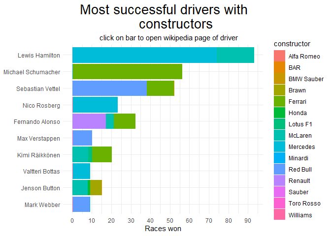

# This is my **Formula One Solution**

### Dear Jana,

after i first took a closer look in your provided `archive.zip`and
sorted out the `.csv` tables of intrest.

My first thoughts been its just some selecting/deselecting and joining
and go on with the visualization part.

Honestly i even tried to cheat and prepared the `.csv`s already with
**OpenRefine** 😁 [Download
Link](https://github.com/OpenRefine/OpenRefine/releases/download/3.7.6/openrefine-win-with-java-3.7.6.zip)

But by accident i imported the wrong `.csv` dats and already after
trying to import the second `.csv` from your provided
[archive.zip](https://github.com/Dr-Eberle-Zentrum/Data-projects-with-R-and-GitHub/blob/main/Projects/JanaKimmich/archive.zip)
folder, i came to this wunderful idea of creating this
[**drop\_n\_slice\_folder**](https://github.com/Dr-Eberle-Zentrum/Data-projects-with-R-and-GitHub/tree/Nicos_tryOut_branch/Jana_Formula_One/drop_n_slice_folder)
for you ! 😁

I wasn’t actuall sure if you wanna extend this project anytime to the
other `.csv` dats aswell, but it should work with some minor
adjustments.

*I didn’t fully wrapped my head around already, mightbe snippets could
be recycled, for the:*
[**SOP-Issue**](https://github.com/Dr-Eberle-Zentrum/Data-projects-with-R-and-GitHub/blob/main/Projects/blubbi90/StandardOperatingProcedureLayout/project_description_v0.1.md)

------------------------------------------------------------------------

I found it prettxy intresting and useful to see the **Top-10** Winners
of diffrent years as well, so i used an [Interactive RMD
Documents](http://rmarkdown.rstudio.com/authoring_shiny.html). With the
***shiny package***’, you can embed Shiny inputs and outputs in your
document. Outputs are automatically updated whenever inputs change.

(*If you wanna learn more about, click the*
[*Link*](http://rmarkdown.rstudio.com/authoring_shiny.html))

        Note: I didnt get it working proper, so this will only be the simple static Markdown file version.

------------------------------------------------------------------------

So let us come back to this fantastic
[**drop\_n\_slice\_folder**](https://github.com/Dr-Eberle-Zentrum/Data-projects-with-R-and-GitHub/tree/Nicos_tryOut_branch/Jana_Formula_One/drop_n_slice_folder)
📁 and let’s have an closer look how it actuall works and helps to solve
[your **Formula One
Issue:**](https://github.com/Dr-Eberle-Zentrum/Data-projects-with-R-and-GitHub/blob/main/Projects/JanaKimmich/project-description.md)

------------------------------------------------------------------------

## The **Drop\_n\_slice folder** 📂!!

------------------------------------------------------------------------

#### So let us take a look inside the folder.

------------------------------------------------------------------------

    ## [1] "constructors.csv"     "driver_standings.csv" "drivers.csv"         
    ## [4] "races.csv"            "results.csv"

------------------------------------------------------------------------

So you can see, we identified all `.csv`’s with the tables of interest,
and pushed them together in the **drop\_n\_slice folder**.

The rest of the .csv’s is in the **commit\_out folder**.

They could easily added, if data inside is of interest, and is
related/connected in anyway within the `result.csv`.

*(current by containing (column ID)*

------------------------------------------------------------------------

### Now we need to import all these .csv tables into R, best all at once

------------------------------------------------------------------------

Therefor I wrote you an function ( `auto_import_csv` ), which do exactly
that.

*You know i’m lazy* 😁

But first:

    #drop_path <- file.path(getwd(), "Solution/drop_n_slice")
    drop_path <- "Solution\\drop_n_slice"

------------------------------------------------------------------------

Here we define the folder-path, which contains the table’s of interest
and should be imported

------------------------------------------------------------------------

    auto_import_csv <- function(file_path){
      
      file_list <- list.files(path = file_path, pattern = "\\.csv$", full.names = TRUE)        #-> here we could change the auto import to other data type's 
      data_frames <- list()
      
      for (file in file_list) {
        df_name <- tools::file_path_sans_ext(basename(file))  # uses filename as dataframe
        data_frames[[df_name]] <- read.csv(file)
      }
      
      return(data_frames)
    }
    once_in_all_together <- auto_import_csv(drop_path)

------------------------------------------------------------------------

And ***magic appear***, it pushes us all tables of interest in One big
list of dataframe together , calling it `once_in_all_together`

------------------------------------------------------------------------

#### Let’s take a look into the structure of:

**once\_in\_all\_together:**

------------------------------------------------------------------------

    ## List of 5
    ##  $ constructors    :'data.frame':    211 obs. of  5 variables:
    ##   ..$ constructorId : int [1:211] 1 2 3 4 5 6 7 8 9 10 ...
    ##   ..$ constructorRef: chr [1:211] "mclaren" "bmw_sauber" "williams" "renault" ...
    ##   ..$ name          : chr [1:211] "McLaren" "BMW Sauber" "Williams" "Renault" ...
    ##   ..$ nationality   : chr [1:211] "British" "German" "British" "French" ...
    ##   ..$ url           : chr [1:211] "http://en.wikipedia.org/wiki/McLaren" "http://en.wikipedia.org/wiki/BMW_Sauber" "http://en.wikipedia.org/wiki/Williams_Grand_Prix_Engineering" "http://en.wikipedia.org/wiki/Renault_in_Formula_One" ...
    ##  $ driver_standings:'data.frame':    34124 obs. of  7 variables:
    ##   ..$ driverStandingsId: int [1:34124] 1 2 3 4 5 6 7 8 9 10 ...
    ##   ..$ raceId           : int [1:34124] 18 18 18 18 18 18 18 18 19 19 ...
    ##   ..$ driverId         : int [1:34124] 1 2 3 4 5 6 7 8 1 2 ...
    ##   ..$ points           : num [1:34124] 10 8 6 5 4 3 2 1 14 11 ...
    ##   ..$ position         : int [1:34124] 1 2 3 4 5 6 7 8 1 3 ...
    ##   ..$ positionText     : chr [1:34124] "1" "2" "3" "4" ...
    ##   ..$ wins             : int [1:34124] 1 0 0 0 0 0 0 0 1 0 ...
    ##  $ drivers         :'data.frame':    857 obs. of  9 variables:
    ##   ..$ driverId   : int [1:857] 1 2 3 4 5 6 7 8 9 10 ...
    ##   ..$ driverRef  : chr [1:857] "hamilton" "heidfeld" "rosberg" "alonso" ...
    ##   ..$ number     : chr [1:857] "44" "\\N" "6" "14" ...
    ##   ..$ code       : chr [1:857] "HAM" "HEI" "ROS" "ALO" ...
    ##   ..$ forename   : chr [1:857] "Lewis" "Nick" "Nico" "Fernando" ...
    ##   ..$ surname    : chr [1:857] "Hamilton" "Heidfeld" "Rosberg" "Alonso" ...
    ##   ..$ dob        : chr [1:857] "1985-01-07" "1977-05-10" "1985-06-27" "1981-07-29" ...
    ##   ..$ nationality: chr [1:857] "British" "German" "German" "Spanish" ...
    ##   ..$ url        : chr [1:857] "http://en.wikipedia.org/wiki/Lewis_Hamilton" "http://en.wikipedia.org/wiki/Nick_Heidfeld" "http://en.wikipedia.org/wiki/Nico_Rosberg" "http://en.wikipedia.org/wiki/Fernando_Alonso" ...
    ##  $ races           :'data.frame':    1101 obs. of  18 variables:
    ##   ..$ raceId     : int [1:1101] 1 2 3 4 5 6 7 8 9 10 ...
    ##   ..$ year       : int [1:1101] 2009 2009 2009 2009 2009 2009 2009 2009 2009 2009 ...
    ##   ..$ round      : int [1:1101] 1 2 3 4 5 6 7 8 9 10 ...
    ##   ..$ circuitId  : int [1:1101] 1 2 17 3 4 6 5 9 20 11 ...
    ##   ..$ name       : chr [1:1101] "Australian Grand Prix" "Malaysian Grand Prix" "Chinese Grand Prix" "Bahrain Grand Prix" ...
    ##   ..$ date       : chr [1:1101] "2009-03-29" "2009-04-05" "2009-04-19" "2009-04-26" ...
    ##   ..$ time       : chr [1:1101] "06:00:00" "09:00:00" "07:00:00" "12:00:00" ...
    ##   ..$ url        : chr [1:1101] "http://en.wikipedia.org/wiki/2009_Australian_Grand_Prix" "http://en.wikipedia.org/wiki/2009_Malaysian_Grand_Prix" "http://en.wikipedia.org/wiki/2009_Chinese_Grand_Prix" "http://en.wikipedia.org/wiki/2009_Bahrain_Grand_Prix" ...
    ##   ..$ fp1_date   : chr [1:1101] "\\N" "\\N" "\\N" "\\N" ...
    ##   ..$ fp1_time   : chr [1:1101] "\\N" "\\N" "\\N" "\\N" ...
    ##   ..$ fp2_date   : chr [1:1101] "\\N" "\\N" "\\N" "\\N" ...
    ##   ..$ fp2_time   : chr [1:1101] "\\N" "\\N" "\\N" "\\N" ...
    ##   ..$ fp3_date   : chr [1:1101] "\\N" "\\N" "\\N" "\\N" ...
    ##   ..$ fp3_time   : chr [1:1101] "\\N" "\\N" "\\N" "\\N" ...
    ##   ..$ quali_date : chr [1:1101] "\\N" "\\N" "\\N" "\\N" ...
    ##   ..$ quali_time : chr [1:1101] "\\N" "\\N" "\\N" "\\N" ...
    ##   ..$ sprint_date: chr [1:1101] "\\N" "\\N" "\\N" "\\N" ...
    ##   ..$ sprint_time: chr [1:1101] "\\N" "\\N" "\\N" "\\N" ...
    ##  $ results         :'data.frame':    26080 obs. of  18 variables:
    ##   ..$ resultId       : int [1:26080] 1 2 3 4 5 6 7 8 9 10 ...
    ##   ..$ raceId         : int [1:26080] 18 18 18 18 18 18 18 18 18 18 ...
    ##   ..$ driverId       : int [1:26080] 1 2 3 4 5 6 7 8 9 10 ...
    ##   ..$ constructorId  : int [1:26080] 1 2 3 4 1 3 5 6 2 7 ...
    ##   ..$ number         : chr [1:26080] "22" "3" "7" "5" ...
    ##   ..$ grid           : int [1:26080] 1 5 7 11 3 13 17 15 2 18 ...
    ##   ..$ position       : chr [1:26080] "1" "2" "3" "4" ...
    ##   ..$ positionText   : chr [1:26080] "1" "2" "3" "4" ...
    ##   ..$ positionOrder  : int [1:26080] 1 2 3 4 5 6 7 8 9 10 ...
    ##   ..$ points         : num [1:26080] 10 8 6 5 4 3 2 1 0 0 ...
    ##   ..$ laps           : int [1:26080] 58 58 58 58 58 57 55 53 47 43 ...
    ##   ..$ time           : chr [1:26080] "1:34:50.616" "+5.478" "+8.163" "+17.181" ...
    ##   ..$ milliseconds   : chr [1:26080] "5690616" "5696094" "5698779" "5707797" ...
    ##   ..$ fastestLap     : chr [1:26080] "39" "41" "41" "58" ...
    ##   ..$ rank           : chr [1:26080] "2" "3" "5" "7" ...
    ##   ..$ fastestLapTime : chr [1:26080] "1:27.452" "1:27.739" "1:28.090" "1:28.603" ...
    ##   ..$ fastestLapSpeed: chr [1:26080] "218.300" "217.586" "216.719" "215.464" ...
    ##   ..$ statusId       : int [1:26080] 1 1 1 1 1 11 5 5 4 3 ...

------------------------------------------------------------------------

**Okay this big bastard is a way to fat and ugly, lets slice em down**
of the columns of interest.

------------------------------------------------------------------------

### Therefor, you’ve probably already guessed, i created a function:

We’ll call it **the big\_slicer**

Now let’s finish the job:

------------------------------------------------------------------------

    big_slicer <- function(on_tibble_list){
      tibble_list_intrest_col <- sapply(on_tibble_list, function(on_each_tibble){
        
        # might be better to store searching patter outside of the function 4 better edit control
        
        select_columns_of_intrest <- dplyr::select(on_each_tibble, matches("^(result|race|driver|constructor)Id$"), contains("name"), matches("nationality"), matches("wins"), matches("year")) # matches("points"), matches("^positionOrder$"), matches("rank"
        return(select_columns_of_intrest)
        })
      return(tibble_list_intrest_col)
    }

    slice_it <- big_slicer(once_in_all_together)

------------------------------------------------------------------------

I created a search list, but dunno, the **bang\_bang\_bang\_operator**
is not willing to **!!! bang** the list inside the select-function !

------------------------------------------------------------------------

`search_list <- list(`

`matches("^(result|race|driver|constructor)Id$"),`

`contains("name"),`

`matches("nationality"),`

`matches("wins"),`

`matches("year")`

------------------------------------------------------------------------

*kaquing* let’s take a look what we got left in:

**slice\_it:**

------------------------------------------------------------------------

    ## List of 5
    ##  $ constructors    :'data.frame':    211 obs. of  3 variables:
    ##   ..$ constructorId: int [1:211] 1 2 3 4 5 6 7 8 9 10 ...
    ##   ..$ name         : chr [1:211] "McLaren" "BMW Sauber" "Williams" "Renault" ...
    ##   ..$ nationality  : chr [1:211] "British" "German" "British" "French" ...
    ##  $ driver_standings:'data.frame':    34124 obs. of  3 variables:
    ##   ..$ raceId  : int [1:34124] 18 18 18 18 18 18 18 18 19 19 ...
    ##   ..$ driverId: int [1:34124] 1 2 3 4 5 6 7 8 1 2 ...
    ##   ..$ wins    : int [1:34124] 1 0 0 0 0 0 0 0 1 0 ...
    ##  $ drivers         :'data.frame':    857 obs. of  4 variables:
    ##   ..$ driverId   : int [1:857] 1 2 3 4 5 6 7 8 9 10 ...
    ##   ..$ forename   : chr [1:857] "Lewis" "Nick" "Nico" "Fernando" ...
    ##   ..$ surname    : chr [1:857] "Hamilton" "Heidfeld" "Rosberg" "Alonso" ...
    ##   ..$ nationality: chr [1:857] "British" "German" "German" "Spanish" ...
    ##  $ races           :'data.frame':    1101 obs. of  3 variables:
    ##   ..$ raceId: int [1:1101] 1 2 3 4 5 6 7 8 9 10 ...
    ##   ..$ name  : chr [1:1101] "Australian Grand Prix" "Malaysian Grand Prix" "Chinese Grand Prix" "Bahrain Grand Prix" ...
    ##   ..$ year  : int [1:1101] 2009 2009 2009 2009 2009 2009 2009 2009 2009 2009 ...
    ##  $ results         :'data.frame':    26080 obs. of  4 variables:
    ##   ..$ resultId     : int [1:26080] 1 2 3 4 5 6 7 8 9 10 ...
    ##   ..$ raceId       : int [1:26080] 18 18 18 18 18 18 18 18 18 18 ...
    ##   ..$ driverId     : int [1:26080] 1 2 3 4 5 6 7 8 9 10 ...
    ##   ..$ constructorId: int [1:26080] 1 2 3 4 1 3 5 6 2 7 ...

------------------------------------------------------------------------

***looks pretty dope ain’t !?***

Okay, okay, there’s still some fine tuning to be done…

…let’s get this final surgery manually done.

------------------------------------------------------------------------

And sort out the unnecessary:

-   `names` in races,
-   `nationality` in constructors.

------------------------------------------------------------------------

    {
    slice_it$races <- slice_it$races %>% # should work with map anyhow aswell
      dplyr::select(-name)

    slice_it$constructors <- slice_it$constructors %>%
      dplyr::select(-nationality)

    finally_all_sorted <- slice_it
    }

------------------------------------------------------------------------

If we take now a closer look at the structure of:

**finally\_all\_sorted:**

------------------------------------------------------------------------

    ## List of 5
    ##  $ constructors    :'data.frame':    211 obs. of  2 variables:
    ##   ..$ constructorId: int [1:211] 1 2 3 4 5 6 7 8 9 10 ...
    ##   ..$ name         : chr [1:211] "McLaren" "BMW Sauber" "Williams" "Renault" ...
    ##  $ driver_standings:'data.frame':    34124 obs. of  3 variables:
    ##   ..$ raceId  : int [1:34124] 18 18 18 18 18 18 18 18 19 19 ...
    ##   ..$ driverId: int [1:34124] 1 2 3 4 5 6 7 8 1 2 ...
    ##   ..$ wins    : int [1:34124] 1 0 0 0 0 0 0 0 1 0 ...
    ##  $ drivers         :'data.frame':    857 obs. of  4 variables:
    ##   ..$ driverId   : int [1:857] 1 2 3 4 5 6 7 8 9 10 ...
    ##   ..$ forename   : chr [1:857] "Lewis" "Nick" "Nico" "Fernando" ...
    ##   ..$ surname    : chr [1:857] "Hamilton" "Heidfeld" "Rosberg" "Alonso" ...
    ##   ..$ nationality: chr [1:857] "British" "German" "German" "Spanish" ...
    ##  $ races           :'data.frame':    1101 obs. of  2 variables:
    ##   ..$ raceId: int [1:1101] 1 2 3 4 5 6 7 8 9 10 ...
    ##   ..$ year  : int [1:1101] 2009 2009 2009 2009 2009 2009 2009 2009 2009 2009 ...
    ##  $ results         :'data.frame':    26080 obs. of  4 variables:
    ##   ..$ resultId     : int [1:26080] 1 2 3 4 5 6 7 8 9 10 ...
    ##   ..$ raceId       : int [1:26080] 18 18 18 18 18 18 18 18 18 18 ...
    ##   ..$ driverId     : int [1:26080] 1 2 3 4 5 6 7 8 9 10 ...
    ##   ..$ constructorId: int [1:26080] 1 2 3 4 1 3 5 6 2 7 ...

------------------------------------------------------------------------

We can see, we **only** got the columns of interest left and those
containing `Id`.

------------------------------------------------------------------------

**Next:**

We want to get all data frame’s (table’s, previous .csv’s) into one
table by their respective Id-column.

Due to, these data frame’s are inside of a lists, it was a bit tricky to
find access.

But anyway, these are so many Id’s and I’m lazy. So i wrote a function
again, to do the job.

This time we call it:

**create\_big\_picture:**

------------------------------------------------------------------------

    search_for_col_id <- "Id$" 

    create_big_picture <- function(finally_all_sorted){
      do_big_picture <- finally_all_sorted$results
      for (kind_of_list in names(finally_all_sorted)){
        if (kind_of_list != "results") { # get sure 'results'table wont get joined into it self
          
          #match_columns <- colnames(finally_all_sorted[[kind_of_list]])[str_detect(colnames(finally_all_sorted[[kind_of_list]]), search_for_col_id)]
          
        match_columns <- grep(search_for_col_id, colnames(finally_all_sorted[[kind_of_list]]), value = TRUE, ignore.case = TRUE)
        do_big_picture <- do_big_picture%>%
          left_join(finally_all_sorted[[kind_of_list]], match_columns)
        }
      }
      return(do_big_picture)
    }
    big_picture <- create_big_picture(finally_all_sorted)

------------------------------------------------------------------------

Because, the function is giving us:

#### **THE BIG Picture:**

------------------------------------------------------------------------

    ##   resultId raceId driverId constructorId       name wins forename    surname
    ## 1        1     18        1             1    McLaren    1    Lewis   Hamilton
    ## 2        2     18        2             2 BMW Sauber    0     Nick   Heidfeld
    ## 3        3     18        3             3   Williams    0     Nico    Rosberg
    ## 4        4     18        4             4    Renault    0 Fernando     Alonso
    ## 5        5     18        5             1    McLaren    0   Heikki Kovalainen
    ## 6        6     18        6             3   Williams    0   Kazuki   Nakajima
    ##   nationality year
    ## 1     British 2008
    ## 2      German 2008
    ## 3      German 2008
    ## 4     Spanish 2008
    ## 5     Finnish 2008
    ## 6    Japanese 2008

------------------------------------------------------------------------

**Here** it is, finally the **Big Picture !**

      I hope i can somehow magical do an fancy html graph out of it, in the lasting hours
      otherwise it was just a waste of time to function up all the cleaning

------------------------------------------------------------------------

**Now** let’s have a look into the data…

… luckily the column `wins` already counts the total wins per season.

        -> needed the cumsum()-function
        

to mutate a new variable:

`total wins`

------------------------------------------------------------------------

#### Next we need to filter for:

-   year’s of interest
-   top x drivers.

------------------------------------------------------------------------

And put it all in a pipe so called:

**pipe\_hammer**

------------------------------------------------------------------------

    pipe_hammer <- big_picture %>% 
      filter(year %in%(2000:2020))%>%
      group_by(year, driverId) %>%
      filter(wins == max(wins))%>%
      distinct(driverId, year, wins,.keep_all=TRUE)%>% #slice(1)%>%#                                   <- with and without something is not right need to get rid of doubles or n
      ungroup()%>%
      group_by(driverId)%>%
      mutate(sum_wins_along = cumsum(wins[order(year)]))%>%
      arrange(desc(sum_wins_along))%>%
      ungroup()%>%
      filter(driverId %in% head(unique(driverId[order(sum_wins_along, decreasing = TRUE)]), 10)) %>%
      dplyr::select(year, forename, surname, nationality, wins, sum_wins_along, name )%>%  #            -> to arrange 
      
                                #columns of table in better way, won't be needed if not showing, could be just:  
      
                                #select(contains("na(me|tionality)", "wins"), "year") 
      
      rename("constructor" = name)%>%
       mutate( year = as.factor(year), #                             -> might be a dumb idea to factorize
               
                                                                      #year-number, let's see.......
              constructor = as.factor(constructor))

------------------------------------------------------------------------

**As you can see, within the pipe we’re using:**

-   first a `filter()`-function to look for years of interest and reduce
    the data amount wer’e further wrangling with.

-   `group_by(year, driverID)%>%` and

-   `filter(wins == max(wins)) %>%slice(1) %>%`

to know when the season is over and to get the total season win count
only once

-   `group_by(driverId) %>%`

    `mutate(sum_wins_along = cumsum(wins[order(year)])) %>%`

    `arrange(desc(sum_wins_along))`

to get the total win count per driver.

        -> to know to apply the `cumSum()`-function here, was probably  the hardest.

-   the rest is just same selecting and arranging and factorizing.

------------------------------------------------------------------------

#### **Let’s have a look in the output:**

------------------------------------------------------------------------

    ## # A tibble: 118 × 7
    ##    year  forename  surname    nationality  wins sum_wins_along constructor
    ##    <fct> <chr>     <chr>      <chr>       <int>          <int> <fct>      
    ##  1 2020  Lewis     Hamilton   British        11             93 Mercedes   
    ##  2 2019  Lewis     Hamilton   British        11             82 Mercedes   
    ##  3 2018  Lewis     Hamilton   British        11             71 Mercedes   
    ##  4 2017  Lewis     Hamilton   British         9             60 Mercedes   
    ##  5 2000  Michael   Schumacher German          9             56 Ferrari    
    ##  6 2010  Michael   Schumacher German          0             56 Mercedes   
    ##  7 2011  Michael   Schumacher German          0             56 Mercedes   
    ##  8 2012  Michael   Schumacher German          0             56 Mercedes   
    ##  9 2019  Sebastian Vettel     German          1             52 Ferrari    
    ## 10 2020  Sebastian Vettel     German          0             52 Ferrari    
    ## # ℹ 108 more rows

------------------------------------------------------------------------

**This already looks pretty dope right, but we’re not done yet…**

------------------------------------------------------------------------

#### Next we need to tidy up the data to get it fancy visualized

------------------------------------------------------------------------

I tried to get my head around, whats the appropriate structure for.

My first assumption be to apply the `pivot_longer`-function to each
&lt;datatyp&gt; class.

And again, couse i’m tired, writing stuff twice, i wrote a function to:

-   identify unique &lt;datatyp&gt; in a Dataframe,
-   and generate a list of lists(datatyps) with column (names)

This time we just call it:

**find\_datayps\_classes**

------------------------------------------------------------------------

    find_datayps_classes <- function(df){
      uniq_datatypes_in_df <- unique(sapply(df, class))        # stores vector of unique datatypes via typeof-func
      col_names_of_all_datatyp <- list()
      
      for (datatyp in uniq_datatypes_in_df) {
        col_name <- names(df)[sapply(df, class) == datatyp]
        col_names_of_all_datatyp[[datatyp]] <- col_name
      }
      return(col_names_of_all_datatyp)
    }
    showMe <- find_datayps_classes(pipe_hammer)

------------------------------------------------------------------------

    ## $factor
    ## [1] "year"        "constructor"
    ## 
    ## $character
    ## [1] "forename"    "surname"     "nationality"
    ## 
    ## $integer
    ## [1] "wins"           "sum_wins_along"

------------------------------------------------------------------------

Okay okay I’m not sure if it was necessary for the next step or useful
at all, but anyway, might be of interest to recycle

------------------------------------------------------------------------

**Finally** we apply the `pivot_long`-function

to all columns of the corresponding &lt;datatyp&gt;.

Of course we’re using a function that for .

Here :

**pivot\_all\_at\_once:**

------------------------------------------------------------------------

    pivot_all_at_once <- function(df,showMe){
      long_df <- df
      
      for (dataclass in names(showMe)) {
        columns <- showMe[[dataclass]]
        names_to <- paste0(substr(dataclass, 1, 8), "_typ")
        values_to <- paste0(substr(dataclass, 1, 4), "_wert")

        long_df <- long_df%>%
          pivot_longer(cols = all_of(columns), names_to = names_to, values_to = values_to )
      }
      return(long_df)
    }

------------------------------------------------------------------------

To finally create our:

**final\_long\_picture:**:

------------------------------------------------------------------------

    ## # A tibble: 1,416 × 6
    ##    factor_typ  fact_wert characte_typ char_wert integer_typ    inte_wert
    ##    <chr>       <fct>     <chr>        <chr>     <chr>              <int>
    ##  1 year        2020      forename     Lewis     wins                  11
    ##  2 year        2020      forename     Lewis     sum_wins_along        93
    ##  3 year        2020      surname      Hamilton  wins                  11
    ##  4 year        2020      surname      Hamilton  sum_wins_along        93
    ##  5 year        2020      nationality  British   wins                  11
    ##  6 year        2020      nationality  British   sum_wins_along        93
    ##  7 constructor Mercedes  forename     Lewis     wins                  11
    ##  8 constructor Mercedes  forename     Lewis     sum_wins_along        93
    ##  9 constructor Mercedes  surname      Hamilton  wins                  11
    ## 10 constructor Mercedes  surname      Hamilton  sum_wins_along        93
    ## # ℹ 1,406 more rows

------------------------------------------------------------------------

## Now we can start the visualization Part: 🍺

------------------------------------------------------------------------

After the first attempts i already recognized, the
`final-long_picture`data structure **sucks** for the task.

**Let’s** try it with the `pipe_hammer` structure, before we’d tried to
*“tidy up”* the data.

Ok i see, for better computation we should bring the fore-surname
together in one cell as `full_name`

    name_combined <- pipe_hammer %>%
      mutate(full_name = paste(forename, surname, sep = " "))%>%
      dplyr::select(-c(forename, surname))
    name_combined

    ## # A tibble: 118 × 6
    ##    year  nationality  wins sum_wins_along constructor full_name         
    ##    <fct> <chr>       <int>          <int> <fct>       <chr>             
    ##  1 2020  British        11             93 Mercedes    Lewis Hamilton    
    ##  2 2019  British        11             82 Mercedes    Lewis Hamilton    
    ##  3 2018  British        11             71 Mercedes    Lewis Hamilton    
    ##  4 2017  British         9             60 Mercedes    Lewis Hamilton    
    ##  5 2000  German          9             56 Ferrari     Michael Schumacher
    ##  6 2010  German          0             56 Mercedes    Michael Schumacher
    ##  7 2011  German          0             56 Mercedes    Michael Schumacher
    ##  8 2012  German          0             56 Mercedes    Michael Schumacher
    ##  9 2019  German          1             52 Ferrari     Sebastian Vettel  
    ## 10 2020  German          0             52 Ferrari     Sebastian Vettel  
    ## # ℹ 108 more rows

------------------------------------------------------------------------

Yes we also could put this in the `pipe_hammer` later, first let’s see
if we can go on from here more easy.

------------------------------------------------------------------------

    # Reorder full_name based on wins

    name_combined$full_name <- reorder(name_combined$full_name, name_combined$wins)

    plot1 <- ggplot(data = name_combined, aes(x = full_name, fill = constructor)) +
      geom_bar() +
      coord_flip()+
      scale_y_continuous(breaks = seq(min(name_combined$wins), max(name_combined$sum_wins_along), by = 10)) +
      theme_minimal()+
      theme(axis.title.y = element_blank())

    # Add constructor color
    plot2 <- plot1 + geom_bar(aes(y = wins, color = constructor), stat = "identity")

    plot2 <- plot2 + labs(y = "Races won",
                          title = "Most successful drivers with \nconstructors",
                          subtitle = "click on bar to open wikipedia page of driver")

    # center title and make it bigger
    plot2 <- plot2 + theme(plot.title = element_text(size = 20,
                                                     hjust = 0.6),
                           plot.subtitle = element_text(hjust = 0.6))

    plot2

