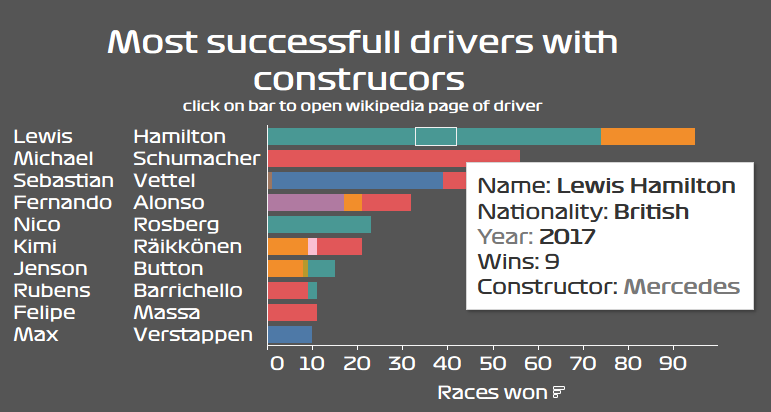

```{r setup, include=FALSE}
knitr::opts_chunk$set(echo = TRUE)
```
# Goal of the project
The goal of the project is to display the top ten formula one drivers in the range
of the years 2000-2020. "Top" in this case is for simplicity defined as the count of
the races that a driver won over the years. The chart should also contain the information 
in which year the driver drove for which constructor, his nationality and how many races
he won in that special year.

The data is from (https://www.kaggle.com/datasets/rohanrao/formula-1-world-championship-1950-2020), but it is also in the zip-folder archive.zip. There are many tables that
are not necessary for the project, only a few of them are, which can be
connected over the IDs. For instance there is a column named diverid in the table drivers.csv and in the table results.csv. Instead of storing the name and other information of the driver, in the result.csv, simply the ID of the driver is stored and the corresponding information of the driver with a specific ID can then be looked up in the drivers.csv.

The chart should look something like this (and be interactive and with no typo in the header :D):


Concerning the colors of the constructors, you should decide which color matches which constructor the best and assign this color to a specific constructor e.g. display the bar in this color according to the years the driver drove for this constructor. For instance for Ferrari I would suggest the color red.

The box shows a tooltip, meaning, if one hovers over the bar at a specific place, the tooltip with
the information shows up. For this, the package [plotly](https://plotly.com/r/) might be useful. It is also important to notice, that to be interactive the plot should be in an html output.


# Visualization priorities (high to low)
##Static part (very important)
- bar chart with x-axis and y-axis as displayed above
- bar colored according to the constructor the driver worked for in the corresponding year and add a legend at the right to display which color corresponds to which constructor
##Interactive part (nice-to-have)
- tooltip (when hovering over the bar, show the name and the nationality of the driver)
- bar segmented by year (does not have to be visible, only important for the tooltip, add the year
and the count of the races won in this year to the tooltip)
##Extra nice-to-have
- formula one font type
