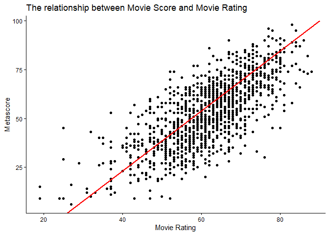
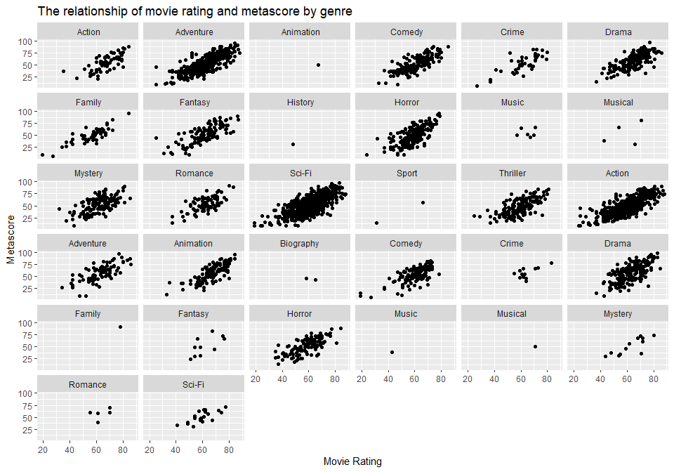
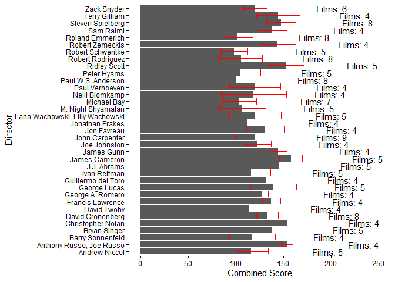
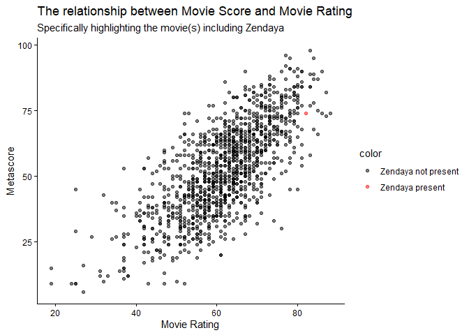
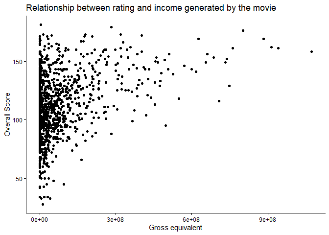

# Data manipultion Tasks

Note: I calculated the rate of inflation with this formula:
`Rate of Inflation = (Gross equivalent / Gross collection) - 1`

The new information in the table looks somewhat like this:

<table>
<colgroup>
<col style="width: 35%" />
<col style="width: 12%" />
<col style="width: 9%" />
<col style="width: 13%" />
<col style="width: 12%" />
<col style="width: 17%" />
</colgroup>
<thead>
<tr>
<th style="text-align: left;">Title</th>
<th style="text-align: right;">Movie Rating</th>
<th style="text-align: right;">Metascore</th>
<th style="text-align: right;">Overall Score</th>
<th style="text-align: right;">Release Year</th>
<th style="text-align: right;">Rate of Inflation</th>
</tr>
</thead>
<tbody>
<tr>
<td style="text-align: left;">Star Wars: El despertar de la Fuerza</td>
<td style="text-align: right;">78</td>
<td style="text-align: right;">80</td>
<td style="text-align: right;">158</td>
<td style="text-align: right;">2015</td>
<td style="text-align: right;">0.146</td>
</tr>
<tr>
<td style="text-align: left;">Vengadores: Endgame</td>
<td style="text-align: right;">84</td>
<td style="text-align: right;">78</td>
<td style="text-align: right;">162</td>
<td style="text-align: right;">2019</td>
<td style="text-align: right;">0.065</td>
</tr>
<tr>
<td style="text-align: left;">Avatar</td>
<td style="text-align: right;">78</td>
<td style="text-align: right;">83</td>
<td style="text-align: right;">161</td>
<td style="text-align: right;">2009</td>
<td style="text-align: right;">0.237</td>
</tr>
<tr>
<td style="text-align: left;">Black Panther</td>
<td style="text-align: right;">73</td>
<td style="text-align: right;">88</td>
<td style="text-align: right;">161</td>
<td style="text-align: right;">2018</td>
<td style="text-align: right;">0.087</td>
</tr>
<tr>
<td style="text-align: left;">Vengadores: Infinity War</td>
<td style="text-align: right;">84</td>
<td style="text-align: right;">68</td>
<td style="text-align: right;">152</td>
<td style="text-align: right;">2018</td>
<td style="text-align: right;">0.087</td>
</tr>
<tr>
<td style="text-align: left;">Jurassic World</td>
<td style="text-align: right;">70</td>
<td style="text-align: right;">59</td>
<td style="text-align: right;">129</td>
<td style="text-align: right;">2015</td>
<td style="text-align: right;">0.146</td>
</tr>
</tbody>
</table>

# Data visualization Tasks:

## The relationship between movie rating and metascore

Note: I put `Movie Rating` on the x, since there is no variable called
`Movie_Score` and context suggests that `Movie Rating` was intended.
Also, I removed `NA` in `Metascore`.

There seems to be a positive correlation. This would suggest that Movies
with a high Movie Rating also tend to have a high Metascore.

## How do different directors score?

Note: I only included the directors with the most movies (The 35
directors with the most movies).

## Optional Task

This plot is a bit harder to interpret. There seems to be some
(positive) correlation, however, most movies didn’t make that much money
compared to the other movies.
