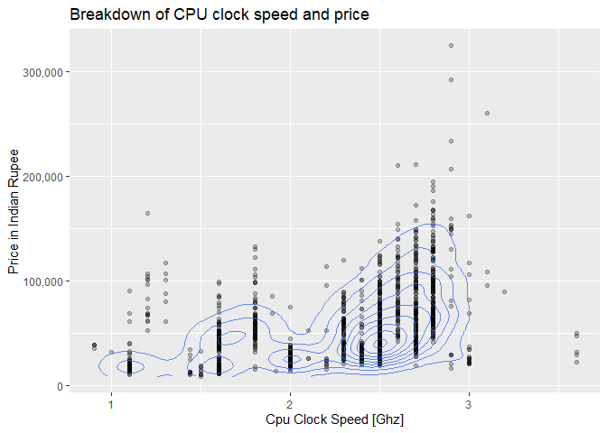
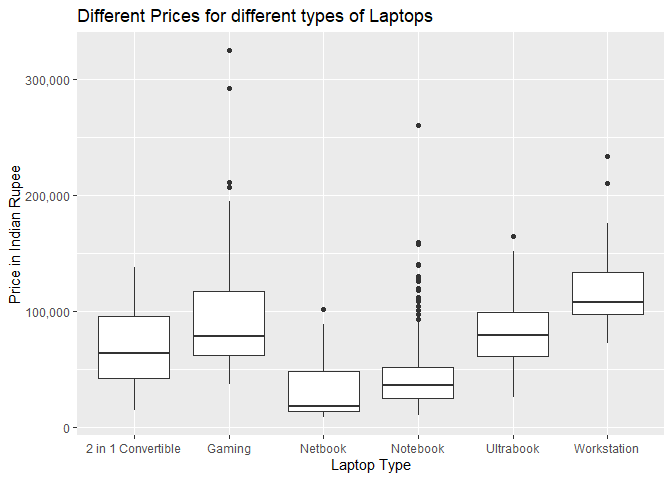
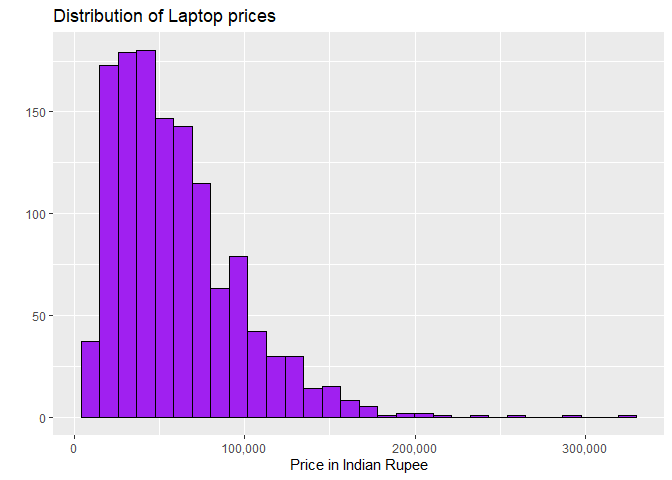
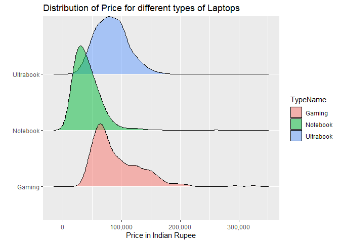

## Solution of “Wrangling and Analyzing Laptop Market Data”

First loading the necessary libraries:

    ## Warning: package 'ggridges' was built under R version 4.5.3

Doing all the data transformations:

    uncleanData <- "data/laptopData.csv" %>% 
      read_csv(na = c("", "NA", "?"))

      #1
    data <- uncleanData %>% 
      drop_na() %>% 
      select(-1) %>% 
      #2
      mutate(Ram = as.integer(str_replace_all(Ram, "GB", ""))) %>% 
      mutate(Weight = as.double(str_replace_all(Weight, "kg", ""))) %>% 
      mutate(Cpu_clock = as.double(str_extract(Cpu, "\\d+\\.?\\d*(?=GHz)"))) %>% 
      #3
      mutate(HasIPS = str_detect(ScreenResolution, "IPS")) %>% 
      mutate(HasRetina = str_detect(ScreenResolution, "Retina")) %>%
      mutate(Width = as.integer(str_extract(ScreenResolution, "\\d+(?=x)"))) %>% 
      mutate(Height = as.integer(str_extract(ScreenResolution, "(?<=x)\\d+"))) %>% 
        mutate(OpSys = case_when(
        str_detect(OpSys, regex("windows", ignore_case = TRUE)) ~ "Windows",
        str_detect(OpSys, regex("mac", ignore_case = TRUE)) ~ "macOS",
        TRUE ~ OpSys
        ))

<table>
<caption>After the data manipulation the table looks like this</caption>
<colgroup>
<col style="width: 3%" />
<col style="width: 4%" />
<col style="width: 3%" />
<col style="width: 17%" />
<col style="width: 13%" />
<col style="width: 1%" />
<col style="width: 9%" />
<col style="width: 14%" />
<col style="width: 2%" />
<col style="width: 3%" />
<col style="width: 4%" />
<col style="width: 4%" />
<col style="width: 3%" />
<col style="width: 4%" />
<col style="width: 2%" />
<col style="width: 3%" />
</colgroup>
<thead>
<tr>
<th style="text-align: left;">Company</th>
<th style="text-align: left;">TypeName</th>
<th style="text-align: right;">Inches</th>
<th style="text-align: left;">ScreenResolution</th>
<th style="text-align: left;">Cpu</th>
<th style="text-align: right;">Ram</th>
<th style="text-align: left;">Memory</th>
<th style="text-align: left;">Gpu</th>
<th style="text-align: left;">OpSys</th>
<th style="text-align: right;">Weight</th>
<th style="text-align: right;">Price</th>
<th style="text-align: right;">Cpu_clock</th>
<th style="text-align: left;">HasIPS</th>
<th style="text-align: left;">HasRetina</th>
<th style="text-align: right;">Width</th>
<th style="text-align: right;">Height</th>
</tr>
</thead>
<tbody>
<tr>
<td style="text-align: left;">Apple</td>
<td style="text-align: left;">Ultrabook</td>
<td style="text-align: right;">13.3</td>
<td style="text-align: left;">IPS Panel Retina Display 2560x1600</td>
<td style="text-align: left;">Intel Core i5 2.3GHz</td>
<td style="text-align: right;">8</td>
<td style="text-align: left;">128GB SSD</td>
<td style="text-align: left;">Intel Iris Plus Graphics 640</td>
<td style="text-align: left;">macOS</td>
<td style="text-align: right;">1.37</td>
<td style="text-align: right;">71378.68</td>
<td style="text-align: right;">2.3</td>
<td style="text-align: left;">TRUE</td>
<td style="text-align: left;">TRUE</td>
<td style="text-align: right;">2560</td>
<td style="text-align: right;">1600</td>
</tr>
<tr>
<td style="text-align: left;">Apple</td>
<td style="text-align: left;">Ultrabook</td>
<td style="text-align: right;">13.3</td>
<td style="text-align: left;">1440x900</td>
<td style="text-align: left;">Intel Core i5 1.8GHz</td>
<td style="text-align: right;">8</td>
<td style="text-align: left;">128GB Flash Storage</td>
<td style="text-align: left;">Intel HD Graphics 6000</td>
<td style="text-align: left;">macOS</td>
<td style="text-align: right;">1.34</td>
<td style="text-align: right;">47895.52</td>
<td style="text-align: right;">1.8</td>
<td style="text-align: left;">FALSE</td>
<td style="text-align: left;">FALSE</td>
<td style="text-align: right;">1440</td>
<td style="text-align: right;">900</td>
</tr>
<tr>
<td style="text-align: left;">HP</td>
<td style="text-align: left;">Notebook</td>
<td style="text-align: right;">15.6</td>
<td style="text-align: left;">Full HD 1920x1080</td>
<td style="text-align: left;">Intel Core i5 7200U 2.5GHz</td>
<td style="text-align: right;">8</td>
<td style="text-align: left;">256GB SSD</td>
<td style="text-align: left;">Intel HD Graphics 620</td>
<td style="text-align: left;">No OS</td>
<td style="text-align: right;">1.86</td>
<td style="text-align: right;">30636.00</td>
<td style="text-align: right;">2.5</td>
<td style="text-align: left;">FALSE</td>
<td style="text-align: left;">FALSE</td>
<td style="text-align: right;">1920</td>
<td style="text-align: right;">1080</td>
</tr>
<tr>
<td style="text-align: left;">Apple</td>
<td style="text-align: left;">Ultrabook</td>
<td style="text-align: right;">15.4</td>
<td style="text-align: left;">IPS Panel Retina Display 2880x1800</td>
<td style="text-align: left;">Intel Core i7 2.7GHz</td>
<td style="text-align: right;">16</td>
<td style="text-align: left;">512GB SSD</td>
<td style="text-align: left;">AMD Radeon Pro 455</td>
<td style="text-align: left;">macOS</td>
<td style="text-align: right;">1.83</td>
<td style="text-align: right;">135195.34</td>
<td style="text-align: right;">2.7</td>
<td style="text-align: left;">TRUE</td>
<td style="text-align: left;">TRUE</td>
<td style="text-align: right;">2880</td>
<td style="text-align: right;">1800</td>
</tr>
</tbody>
</table>

Doing the Visualizations, Nr.3 was not possible as far as I could tell,
so instead I drew them after each other.

    #1
    data %>% 
      ggplot(aes(x = Cpu_clock, y = Price)) +
      geom_point(alpha = 0.25) +
      geom_density2d(alpha = 0.75) +
      scale_y_continuous(labels = label_comma()) +
      labs(x = "Cpu Clock Speed [Ghz]",
           y = "Price in Indian Rupee",
           title = "Breakdown of CPU clock speed and price")

    #2
    data %>% 
      ggplot(aes(x = TypeName, y = Price)) +
      geom_boxplot() +
      scale_y_continuous(labels = label_comma()) +
      labs(x = "Laptop Type",
           y = "Price in Indian Rupee",
           title = "Different Prices for different types of Laptops")

    #3
    # Histogram
    data %>% 
      ggplot(aes(x = Price)) +
      geom_histogram(color = "black", fill = "purple") +
      scale_x_continuous(labels = label_comma()) +
      labs(x = "Price in Indian Rupee",
           y = "",
           title = "Distribution of Laptop prices")

    # Ridgeline
    data %>% 
      ggplot(aes(x = Price)) +
      geom_density_ridges(data = data %>%
                            filter( TypeName %in% c("Notebook", "Ultrabook", "Gaming")), 
                          aes(y = TypeName, scale = 1.5, fill = TypeName), alpha = 0.5) +
      labs(x = "Price in Indian Rupee",
           y = "",
           title = "Distribution of Price for different types of Laptops") +
      scale_x_continuous(labels = label_comma())

