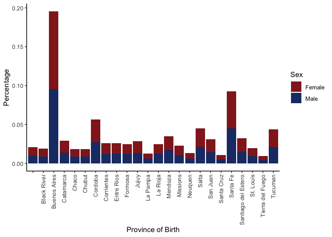

    library(tidyverse)

    ## ── Attaching core tidyverse packages ──────────────────────── tidyverse 2.0.0 ──
    ## ✔ dplyr     1.1.4     ✔ readr     2.1.5
    ## ✔ forcats   1.0.0     ✔ stringr   1.5.1
    ## ✔ ggplot2   3.5.1     ✔ tibble    3.2.1
    ## ✔ lubridate 1.9.3     ✔ tidyr     1.3.1
    ## ✔ purrr     1.0.2     
    ## ── Conflicts ────────────────────────────────────────── tidyverse_conflicts() ──
    ## ✖ dplyr::filter() masks stats::filter()
    ## ✖ dplyr::lag()    masks stats::lag()
    ## ℹ Use the conflicted package (<http://conflicted.r-lib.org/>) to force all conflicts to become errors

    library(ggplot2)

# Solution to Joschka’s Project by Meri

So right now the data wrangling is still very messy, because I am
splitting the Data set into “sub-datasets”. However I was unsure of how
to perform the filtering in parallel on the data set (maybe using `if` /
`ifelse`? I am just guessing here), so I’d love to get some feedback on
that!

## Data filtering

First I am loading the data and filtering on eligibility based on the
employment criteria.

    # Load data from RData file
    load("~/Desktop/R2_DataProjects/R2_Data_Projects_Git/Projects/Joschka8878/Data.RData")

    # Filtering for eligibility
    # There is probably a better way to do this (e.g. filtering in one step) but this also works
    eligible <- Data %>% 
      group_by(Household) %>% 
      filter(any(Age <= 18))    # Child under 18

    # Unemployed
    eliunemployed <- eligible %>% 
      filter(any(Unemployed == 1)) %>% 
      ungroup()

    # Informal workers
    elidom <- eligible %>% 
      filter(any(Employment_Position %in% c("Unpaid Family Worker"))) %>% 
      ungroup()

    eliinf <- eligible %>% 
      filter_at(vars(Paid_Vacation, Bonus, Sick_Days, Health_Insurance, Pension_Discount), any_vars(. =="No"))

    # Earning less than minium wage
    elimin <- eligible %>% 
      filter(any(Individual_Income < Min_Wage)) %>% 
      ungroup()

    # Combining all into one dataframe
    eligibleall <- rbind(eliunemployed, elidom, elimin, eliinf) %>% 
      distinct()

Next I am filtering for Eligible/ Non-Eligible Households and their
origin (Argentina or Abroad).

    # Eligible + Born in Argentina
    non_im_eg <- eligibleall %>% 
      filter(Family_Relationship %in% c("Head of Household", "Spouse")) %>% 
      filter(Country_Of_Birth == "Argentina") %>% 
      mutate(Status = "Born in Argentina") %>% 
      mutate(Eligible = "Eligible")

    # Not Eligible + Born in Argentina
    non_im_non <- Data %>% 
      filter(Family_Relationship %in% c("Head of Household", "Spouse")) %>% 
      filter(Country_Of_Birth == "Argentina") %>% 
      mutate(Status = "Born in Argentina") %>% 
      mutate(Eligible = "Not Eligible")
    non_im_non[!(non_im_non$Household %in% non_im_eg$Household),]

    # Eligible + Born Abroad
    im_eg <- eligibleall %>% 
      filter(Age > 18) %>% 
      filter(Family_Relationship == "Head of Household") %>% 
      filter(Country_Of_Birth != "Argentina") %>% 
      mutate(Status = "Born Abroad")%>% 
      mutate(Eligible = "Eligible")

    # Not Eligible + Born Abroad
    im_non <- Data %>% 
      filter(Family_Relationship == "Head of Household") %>% 
      filter(Country_Of_Birth == "Argentina") %>% 
      mutate(Status = "Born Abroad") %>% 
      mutate(Eligible = "Not Eligible")
    im_non <- im_non[!(im_non$Household %in% im_eg$Household),]

    # Combining all into one dataframe
    data_im <- rbind(non_im_eg, im_eg, non_im_non, im_non)

## Visualization

First (a):

> the percentage of heads of households & their spouses who are
> immigrants who are eligible for the AUH vs. the percentage of heads of
> Households & their spouses who are non-immigrants and are eligible for
> the AUH

Here I group my adjusted data set by Status (= Origin of Birth) and
Eligibility, before summarising the percentage of each of the four
groups (count of entries `n()` by total number of entries
`length(data_im$Household)`), filtering for eligible households after
that to only plot those. Plotting is just a basic ggplot boxplot with
the Percentages as labels (using the `plyr::round_any` to round the
percentages).

    data_im %>% 
      group_by(Status, Eligible) %>% 
      summarise(Percentage = n()/length(data_im$Household)) %>% 
      filter(Eligible == "Eligible") %>% 
      ungroup() %>% 
      ggplot(aes(x = as.factor(Status), y = Percentage))+
      geom_col(fill="#26466C")+
      geom_text(aes(label = plyr::round_any(Percentage, 0.0001, round)), nudge_y = 0.025)+
      theme_classic()+
      xlab("")+
      ylab("Percentage of HoH receiving AUH")+
      ggtitle("Percentage of Argentinian HoHs receiving AUH")

Second (b):

> the percentage of heads of households & their spouses who are
> immigrants who are eligible for the AUH vs. the percentage of heads of
> households & their spouses who are immigrants who are NOT eligible for
> the AUH

Basically I tackled this the same way as (a) only creating another
dataframe (yikes, I know…) to have the correct length/ number of entries
for the Percentage. Probably a better way to do that using only the
original dataframe, but I did not have the time to get around to do that
(Sorry!).

    data_imonly <- rbind(im_eg, im_non)

    data_imonly %>% 
      group_by(Eligible) %>% 
      summarise(Percentage = n()/length(data_imonly$Household)) %>% 
      ungroup() %>% 
      ggplot(aes(x = as.factor(Eligible), y = Percentage))+
      geom_col(fill="#26466C")+
      geom_text(aes(label = plyr::round_any(Percentage, 0.0001, round)), nudge_y = 0.025)+
      theme_classic()+
      xlab("")+
      ylab("Percentage of HoHs")+
      ggtitle("Eligibility of Immigrants for AUH")

 And
lastly onto (c):

> of all those who are eligible, what are the percentages based on age
> group (create age ranges), country of origin (within South America),
> province of origin (if born in Argentina), and education level.

Starting with the age, where I cut the age into ranges before
calculating the Percentage as usual.

    eligibleall %>% 
      mutate(Age_Range = cut(Age, c(0,20,30,40,50,60,70,80,90,Inf))) %>% 
      group_by(Age_Range, Sex) %>% 
      summarise(Percentage = n()/length(data_im$Household)) %>% 
      ungroup() %>%
      ggplot(aes(fill = Sex, y=Percentage, x = Age_Range))+
      geom_bar(position = "stack", stat = "identity")+
      scale_fill_manual(values = c("#932322","#1D3A74"))+
      scale_x_discrete(labels = c("(0,20]" = "0-20",
                                "(20,30]" = "20-30",
                                "(30,40]" = "30-40",
                                "(40,50]" = "40-50",
                                "(50,60]" = "50-60",
                                "(60,70]" = "60-70",
                                "(70,80]" = "70-80",
                                "(80,90]" = "80-90",
                                "(90,Inf]" = "90 or older",
                                "NA" = "Not specified"))+
      theme_classic()+
      theme(axis.text.x = element_text(angle = 90, vjust = 0.5, hjust = 1))+
      xlab("Age Category")+
      ggtitle("Eligibilty by Age")

Next by country of Birth (if born outside of Argentia):

    eligibleall %>% 
      filter(Country_Of_Birth != "Argentina") %>% 
      group_by(Country_Of_Birth, Sex) %>% 
      summarise(Percentage = n()/length(eligibleall$Household)) %>% 
      ungroup() %>%
      ggplot(aes(fill = Sex, y=Percentage, x =Country_Of_Birth))+
      geom_bar(position = "stack", stat = "identity")+
      scale_fill_manual(values = c("#932322","#1D3A74"))+
      theme_classic()+ # Has to be called BEFORE the theme(axis.text)
      theme(axis.text.x = element_text(angle = 90, vjust = 0.5, hjust = 1))+
      xlab("Country of Birth")

Just South American Countries

    eligibleall %>% 
      filter(Country_Of_Birth %in% c("BOLIVIA",
                                     "BRASIL",
                                     "CHILE",
                                     "COLOMBIA",
                                     "ECUADOR",
                                     "PERU",
                                     "PARAGUAY",
                                     "URUGUAY",
                                     "VENEZUELA")) %>% 
      group_by(Country_Of_Birth, Sex) %>% 
      summarise(Percentage = n()/length(eligibleall$Household)) %>% 
      ungroup() %>%
      ggplot(aes(fill = Sex, y=Percentage, x =Country_Of_Birth))+
      geom_bar(position = "stack", stat = "identity")+
      scale_fill_manual(values = c("#932322","#1D3A74"))+
      theme_classic()+ # Has to be called BEFORE the theme(axis.text)
      theme(axis.text.x = element_text(angle = 90, vjust = 0.5, hjust = 1))+
      xlab("Country of Birth")

Province of birth (if born in Argentina)

    eligibleall %>% 
      filter(Country_Of_Birth == "Argentina") %>% 
      group_by(Province_of_Birth, Sex) %>% 
      summarise(Percentage = n()/length(data_im$Household)) %>% 
      ungroup() %>%
      ggplot(aes(fill = Sex, y=Percentage, x = Province_of_Birth))+
      geom_bar(position = "stack", stat = "identity")+
      scale_fill_manual(values = c("#932322","#1D3A74"))+
      theme_classic()+
      theme(axis.text.x = element_text(angle = 90, vjust = 0.5, hjust = 1))+
      xlab("Province of Birth")

And last but not least Education level:

    eligibleall %>% 
      group_by(Education_Level, Sex) %>% 
      summarise(Percentage = n()/length(data_im$Household)) %>% 
      ungroup() %>%
      ggplot(aes(fill = Sex, y=Percentage, x = Education_Level))+
      geom_bar(position = "stack", stat = "identity")+
      scale_fill_manual(values = c("#932322","#1D3A74"))+
      theme_classic()+
      theme(axis.text.x = element_text(angle = 90, vjust = 0.5, hjust = 1))+
      xlab("Level of Education")

