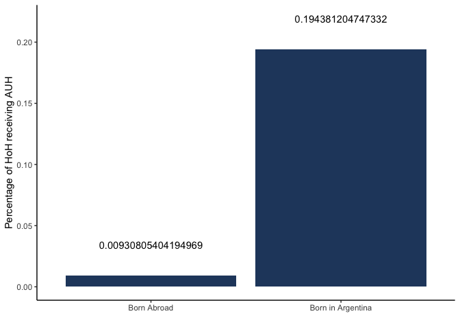
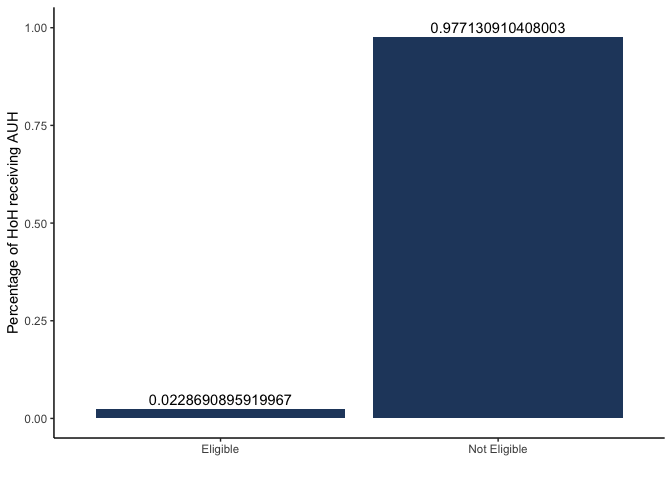
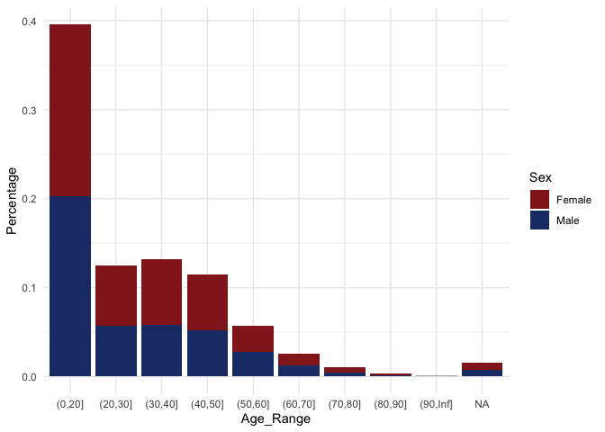
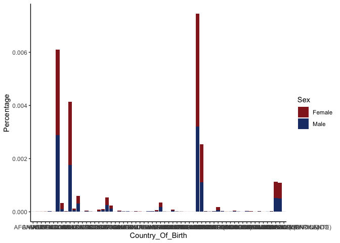
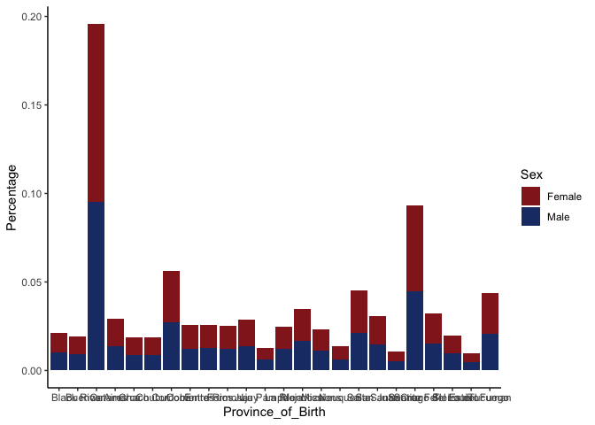
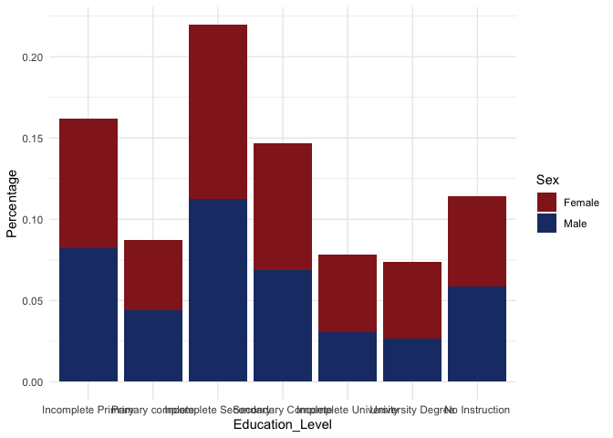

    library(tidyverse)

    ## ── Attaching core tidyverse packages ──────────────────────── tidyverse 2.0.0 ──
    ## ✔ dplyr     1.1.4     ✔ readr     2.1.5
    ## ✔ forcats   1.0.0     ✔ stringr   1.5.1
    ## ✔ ggplot2   3.5.1     ✔ tibble    3.2.1
    ## ✔ lubridate 1.9.3     ✔ tidyr     1.3.1
    ## ✔ purrr     1.0.2     
    ## ── Conflicts ────────────────────────────────────────── tidyverse_conflicts() ──
    ## ✖ dplyr::filter() masks stats::filter()
    ## ✖ dplyr::lag()    masks stats::lag()
    ## ℹ Use the conflicted package (<http://conflicted.r-lib.org/>) to force all conflicts to become errors

    library(ggplot2)

So right now the data wrangling is still very messy. I was having
problems filtering for multiple criteria at the same time, so I will try
to fix this part in the future!

Also some of the plotting is still very wonky, so I will try to fix that
as well!

    # Load data from RData file
    load("~/Desktop/R2_DataProjects/R2_Data_Projects_Git/Projects/Joschka8878/Data.RData")

    # Filtering for eligibility
    # There is probably a better way to do this (e.g. filtering in one step) but this also works
    eligible <- Data %>% 
      group_by(Household) %>% 
      filter(any(Age <= 18))    # Child under 18

    eliunemployed <- eligible %>% 
      filter(any(Employment_Status == "Unemployed")) %>% 
      ungroup()

    elidom <- eligible %>% 
      filter(any(Employment_Position %in% c("Unpaid Family Worker"))) %>% 
      ungroup()

    elimin <- eligible %>% 
      filter(any(Individual_Income < Min_Wage)) %>% 
      ungroup()

    eligibleall <- rbind(eliunemployed, elidom, elimin) %>% 
      distinct()
    # unemployed, domestic worker or informal worker/ self-employed worker earning less than minimum wage (that is)

    # mockeli <- eligibleall %>% 
    #   group_by(Household) %>% 
    #   filter(Age <= 18) %>% 
    #   summarise(AUH_Count = n()) %>% 
    #   ungroup() %>% 
    #   filter(AUH_Count > 0)
    # eligibleall <- merge(eligibleall, mockeli, by = "Household") 
    # Only mother (of two eligible parents recieves AUH)
    # maximum of 5 AUHs

    non_im_eg <- eligibleall %>% 
      filter(Age > 18) %>% 
      filter(Family_Relationship == "Head of Household") %>% 
      filter(Country_Of_Birth == "Argentina") %>% 
      mutate(Status = "Born in Argentina") %>% 
      mutate(Eligible = "Eligible")
    # non_im$AUH_Count[non_im$AUH_Count > 5] <- 5
    non_im_non <- Data %>% 
      filter(Family_Relationship == "Head of Household") %>% 
      filter(Country_Of_Birth == "Argentina") %>% 
      mutate(Status = "Born in Argentina") %>% 
      mutate(Eligible = "Not Eligible")
    non_im_non[!(non_im_non$Household %in% non_im_eg$Household),]

    im_eg <- eligibleall %>% 
      filter(Age > 18) %>% 
      filter(Family_Relationship == "Head of Household") %>% 
      filter(Country_Of_Birth != "Argentina") %>% 
      mutate(Status = "Born Abroad")%>% 
      mutate(Eligible = "Eligible")
    # im$AUH_Count[im$AUH_Count > 5] <- 5
    im_non <- Data %>% 
      filter(Family_Relationship == "Head of Household") %>% 
      filter(Country_Of_Birth == "Argentina") %>% 
      mutate(Status = "Born Abroad") %>% 
      mutate(Eligible = "Not Eligible")
    im_non <- im_non[!(im_non$Household %in% im_eg$Household),]

    data_im <- rbind(non_im_eg, im_eg, non_im_non, im_non)

    # data_im %>% 
    #   group_by(Status) %>% 
    #   summarise(Sum = sum(AUH_Count)) %>% 
    #   mutate(Percentage = Sum/length(unique(Data$Household))) %>% 
    #   #ungroup() %>% 
    #   #mutate(Sum = Sum/ sum(Sum)) %>% 
    #   ggplot(aes(x = as.factor(Status), y = Percentage))+
    #   geom_col(fill="#26466C")+
    #   geom_text(aes(label = Sum), nudge_y = 0.025)+
    #   theme_classic()+
    #   xlab("")+
    #   ylab("Percentage of HoH receiving AUH")+
    #   guides(fill = "none")

    data_im %>% 
      group_by(Status, Eligible) %>% 
      summarise(Percentage = n()/length(data_im$Household)) %>% 
      filter(Eligible == "Eligible") %>% 
      ungroup() %>% 
      ggplot(aes(x = as.factor(Status), y = Percentage))+
      geom_col(fill="#26466C")+
      geom_text(aes(label = Percentage), nudge_y = 0.025)+
      theme_classic()+
      xlab("")+
      ylab("Percentage of HoH receiving AUH")

    ## `summarise()` has grouped output by 'Status'. You can override using the
    ## `.groups` argument.

    data_imonly <- rbind(im_eg, im_non)

    data_imonly %>% 
      group_by(Eligible) %>% 
      summarise(Percentage = n()/length(data_imonly$Household)) %>% 
      ungroup() %>% 
      ggplot(aes(x = as.factor(Eligible), y = Percentage))+
      geom_col(fill="#26466C")+
      geom_text(aes(label = Percentage), nudge_y = 0.025)+
      theme_classic()+
      xlab("")+
      ylab("Percentage of HoH receiving AUH")

    eligibleall %>% 
      mutate(Age_Range = cut(Age, c(0,20,30,40,50,60,70,80,90,Inf))) %>% 
      group_by(Age_Range, Sex) %>% 
      summarise(Percentage = n()/length(data_im$Household)) %>% 
      ungroup() %>%
      ggplot(aes(fill = Sex, y=Percentage, x = Age_Range))+
      geom_bar(position = "stack", stat = "identity")+
      scale_fill_manual(values = c("#932322","#1D3A74"))+
      theme(axis.text.x = element_text(angle = 90, vjust = 0.5, hjust = 1))+
      theme_minimal()

    ## `summarise()` has grouped output by 'Age_Range'. You can override using the
    ## `.groups` argument.

    eligibleall %>% 
      filter(Country_Of_Birth != "Argentina") %>% 
      group_by(Country_Of_Birth, Sex) %>% 
      summarise(Percentage = n()/length(eligibleall$Household)) %>% 
      ungroup() %>%
      ggplot(aes(fill = Sex, y=Percentage, x =Country_Of_Birth))+
      geom_bar(position = "stack", stat = "identity")+
      scale_fill_manual(values = c("#932322","#1D3A74"))+
      theme(axis.text.x = element_text(angle = 90, vjust = 0.5, hjust = 1))+
      theme_classic()

    ## `summarise()` has grouped output by 'Country_Of_Birth'. You can override using
    ## the `.groups` argument.

    eligibleall %>% 
      filter(Country_Of_Birth == "Argentina") %>% 
      group_by(Province_of_Birth, Sex) %>% 
      summarise(Percentage = n()/length(data_im$Household)) %>% 
      ungroup() %>%
      ggplot(aes(fill = Sex, y=Percentage, x = Province_of_Birth))+
      geom_bar(position = "stack", stat = "identity")+
      scale_fill_manual(values = c("#932322","#1D3A74"))+
      theme(axis.text.x = element_text(angle = 90, vjust = 0.5, hjust = 1))+
      theme_classic()

    ## `summarise()` has grouped output by 'Province_of_Birth'. You can override using
    ## the `.groups` argument.

    eligibleall %>% 
      group_by(Education_Level, Sex) %>% 
      summarise(Percentage = n()/length(data_im$Household)) %>% 
      ungroup() %>%
      ggplot(aes(fill = Sex, y=Percentage, x = Education_Level))+
      geom_bar(position = "stack", stat = "identity")+
      scale_fill_manual(values = c("#932322","#1D3A74"))+
      theme(axis.text.x = element_text(angle = 90, vjust = 0.5, hjust = 1))+
      theme_minimal()

    ## `summarise()` has grouped output by 'Education_Level'. You can override using
    ## the `.groups` argument.

