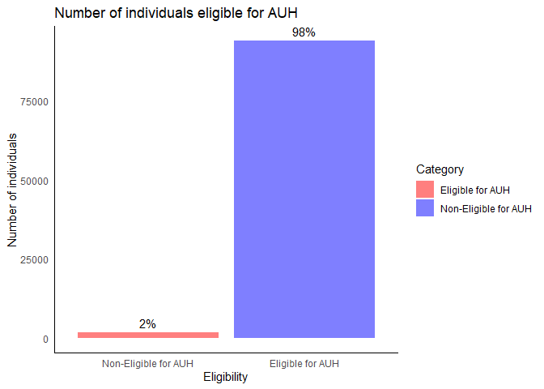
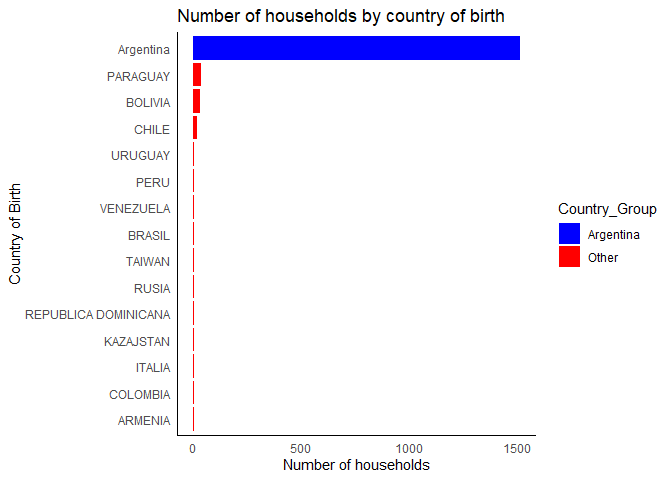
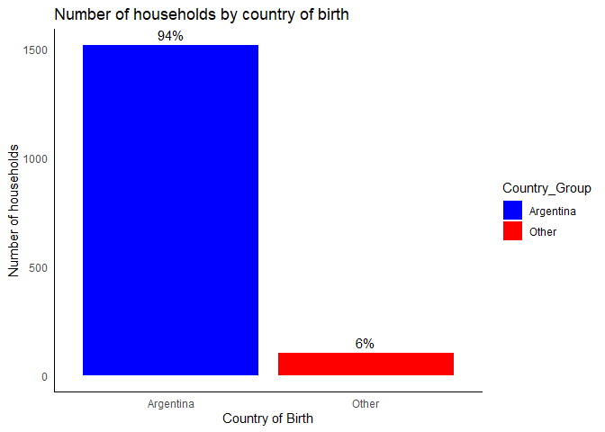
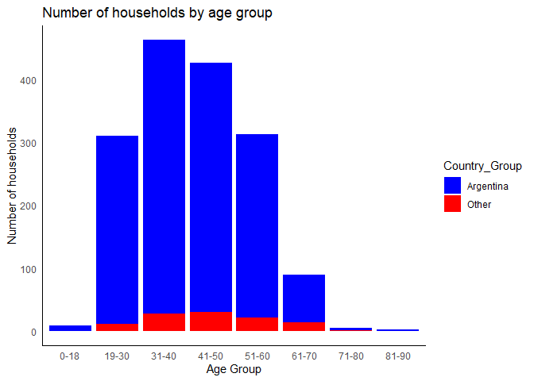
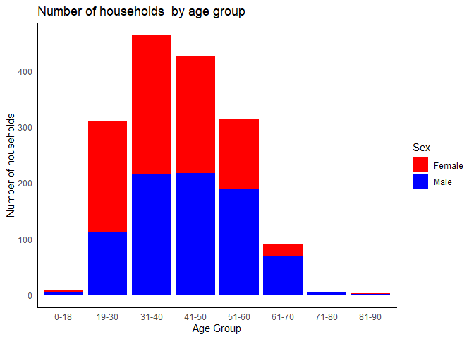

## Load the data

First let’s load the data.

    library(here)

    ## here() starts at C:/Lehre/Data-projects-with-R-and-GitHub

    library(tidyverse)

    ## ── Attaching core tidyverse packages ──────────────────────── tidyverse 2.0.0 ──
    ## ✔ dplyr     1.1.1     ✔ readr     2.1.4
    ## ✔ forcats   1.0.0     ✔ stringr   1.5.0
    ## ✔ ggplot2   3.4.1     ✔ tibble    3.2.1
    ## ✔ lubridate 1.9.2     ✔ tidyr     1.3.0
    ## ✔ purrr     1.0.1

    ## ── Conflicts ────────────────────────────────────────── tidyverse_conflicts() ──
    ## ✖ dplyr::filter() masks stats::filter()
    ## ✖ dplyr::lag()    masks stats::lag()
    ## ℹ Use the conflicted package (<http://conflicted.r-lib.org/>) to force all conflicts to become errors

    # Navigate to a subdirectory within your project
    setwd(here::here("Projects/Joschka8878"))
    # Load the data from the RData file located in the same folder as this Rmd file
    load("Data.RData")

    Data$Country_Group <- ifelse(Data$Country_Of_Birth == "Argentina", "Argentina", "Other")

    # Remove duplicates and keep the unique rows for each individual
    Data_original <- Data %>%
        distinct(Individual, .keep_all = TRUE) %>%
        select(Household, everything()) %>%
        filter(Family_Relationship == "Head of Household") 

## Explorig the data

Let’s explore the data a bit.

    # Summary of the data
    summary(Data)

    ##       Year         Quarter      Family_Relationship     Sex           
    ##  Min.   :2017   Min.   :1.000   Length:699644       Length:699644     
    ##  1st Qu.:2017   1st Qu.:1.000   Class :character    Class :character  
    ##  Median :2018   Median :2.000   Mode  :character    Mode  :character  
    ##  Mean   :2018   Mean   :2.493                                         
    ##  3rd Qu.:2019   3rd Qu.:3.000                                         
    ##  Max.   :2019   Max.   :4.000                                         
    ##                                                                       
    ##       Age                      Education_Level   Employment_Status 
    ##  Min.   : -1.00   Incomplete Primary   :102387   Length:699644     
    ##  1st Qu.: 16.00   Primary complete     : 91620   Class :character  
    ##  Median : 32.00   Incomplete Secondary :144779   Mode  :character  
    ##  Mean   : 34.65   Secondary Complete   :133599                     
    ##  3rd Qu.: 52.00   Incomplete University: 79535                     
    ##  Max.   :110.00   University Degree    : 84299                     
    ##                   No Instruction       : 63425                     
    ##  Employment_Position Paid_Vacation         Bonus            Sick_Days        
    ##  Length:699644       Length:699644      Length:699644      Length:699644     
    ##  Class :character    Class :character   Class :character   Class :character  
    ##  Mode  :character    Mode  :character   Mode  :character   Mode  :character  
    ##                                                                              
    ##                                                                              
    ##                                                                              
    ##                                                                              
    ##  Health_Insurance   Pension_Discount   Individual_Income Household_Income 
    ##  Length:699644      Length:699644      Min.   :      0   Min.   :      0  
    ##  Class :character   Class :character   1st Qu.:      0   1st Qu.:   8300  
    ##  Mode  :character   Mode  :character   Median :   4300   Median :  21700  
    ##                                        Mean   :   9740   Mean   :  27954  
    ##                                        3rd Qu.:  15000   3rd Qu.:  39000  
    ##                                        Max.   :3000000   Max.   :3080000  
    ##                                        NA's   :56933                      
    ##  Country_Of_Birth     Household        Individual         Min_Wage    
    ##  Length:699644      Min.   :217480   Min.   : 728062   Min.   : 8060  
    ##  Class :character   1st Qu.:285175   1st Qu.: 948982   1st Qu.: 8860  
    ##  Mode  :character   Median :352686   Median :1167336   Median : 9500  
    ##                     Mean   :352461   Mean   :1165905   Mean   :10931  
    ##                     3rd Qu.:417311   3rd Qu.:1376288   3rd Qu.:12500  
    ##                     Max.   :493861   Max.   :1618217   Max.   :16875  
    ##                                                                       
    ##  Domestic_Worker    Unemployed         Poverty       Province_of_Birth 
    ##  Min.   :0.0000   Min.   :0.00000   Min.   :0.0000   Length:699644     
    ##  1st Qu.:0.0000   1st Qu.:0.00000   1st Qu.:0.0000   Class :character  
    ##  Median :0.0000   Median :0.00000   Median :0.0000   Mode  :character  
    ##  Mean   :0.0304   Mean   :0.03134   Mean   :0.2705                     
    ##  3rd Qu.:0.0000   3rd Qu.:0.00000   3rd Qu.:1.0000                     
    ##  Max.   :1.0000   Max.   :1.00000   Max.   :1.0000                     
    ##                                                                        
    ##  Country_Group     
    ##  Length:699644     
    ##  Class :character  
    ##  Mode  :character  
    ##                    
    ##                    
    ##                    
    ## 

    # Variable names
    names(Data)

    ##  [1] "Year"                "Quarter"             "Family_Relationship"
    ##  [4] "Sex"                 "Age"                 "Education_Level"    
    ##  [7] "Employment_Status"   "Employment_Position" "Paid_Vacation"      
    ## [10] "Bonus"               "Sick_Days"           "Health_Insurance"   
    ## [13] "Pension_Discount"    "Individual_Income"   "Household_Income"   
    ## [16] "Country_Of_Birth"    "Household"           "Individual"         
    ## [19] "Min_Wage"            "Domestic_Worker"     "Unemployed"         
    ## [22] "Poverty"             "Province_of_Birth"   "Country_Group"

    #number of rows
    nrow(Data)

    ## [1] 699644

## Data Cleaning

We will create a new data frame with the columns we need for the
analysis.

    Data <- Data %>%
        distinct(Individual, .keep_all = TRUE) %>%
        select(Household, everything()) %>%
        filter(Family_Relationship == "Head of Household") %>%
        left_join(Data %>%
                                filter(Family_Relationship %in% c("Child/stepchild", "Grandchild")) %>%
                                group_by(Household) %>%
                                summarise(Number_of_Children = n()),
                            by = "Household") %>%
        filter(!is.na(Number_of_Children)) %>%
        filter(Unemployed == 1)

We removed duplicates and selected only the head of the household. We
then joined the data with the number of children in the household. Then,
we removed the households without children. Finally, we filtered the
households where the head of the household is unemployed.

## Data Analysis

We may compare the number of individual in the Data frame and the
Data\_original frame. This will let us know how many of the total
individuals (Data\_original) are elegible for the AUH program (Data).

    library(dplyr)
    library(ggplot2)

    total_individuals <- nrow(Data_original)

    eligible_individuals <- nrow(Data)

    non_eligible_individuals <- total_individuals - eligible_individuals

    summary_df <- data.frame(
        Category = c("Non-Eligible for AUH", "Eligible for AUH"),
        Count = c(non_eligible_individuals, eligible_individuals),
        Percentage = c(non_eligible_individuals / total_individuals, eligible_individuals / total_individuals)
    )

    ggplot(summary_df, aes(x = Category, y = Count, fill = Category)) +
      geom_bar(stat = "identity", alpha = 0.5) +
      geom_text(aes(label = scales::percent(Percentage)), vjust = -0.5) +
      theme_minimal() +
      labs(title = "Number of individuals eligible for AUH",
          x = "Eligibility",
          y = "Number of individuals") +
      scale_fill_manual(values = c("Non-Eligible for AUH" = "blue", "Eligible for AUH" = "red")) +
      scale_x_discrete(labels = c("Non-Eligible for AUH", "Eligible for AUH"))+ 
        theme(panel.grid.major = element_blank(), panel.grid.minor = element_blank(),
              panel.background = element_blank(), axis.line = element_line(colour = "black"))

From the total number of households (Data\_original), we can see that
only 2% of the individuals are eligible for the AUH program because they
are unemployed and have children.

## Analyze the elegible households by criteria

First, we will count the number of households by country of birth.

    conteos <- Data %>%
        count(Country_Of_Birth) %>%
        arrange((n))

    Data$Country_Of_Birth <- factor(Data$Country_Of_Birth, levels = conteos$Country_Of_Birth)

    ggplot(Data, aes(x = Country_Of_Birth, fill = Country_Group)) +
        geom_bar() +
        coord_flip() + 
        theme_minimal() +
        labs(title = "Number of households by country of birth",
            x = "Country of Birth",
            y = "Number of households") +
        scale_fill_manual(values = c("Argentina" = "blue", "Other" = "red"))+ 
        theme(panel.grid.major = element_blank(), panel.grid.minor = element_blank(),
              panel.background = element_blank(), axis.line = element_line(colour = "black"))

Instead of plotting the number of households by country of birth, we may
compare if the household is from Argentina or not.

    ggplot(Data, aes(x = Country_Group, fill = Country_Group)) +
        geom_bar() +
        theme_minimal() +
        labs(title = "Number of households by country of birth",
            x = "Country of Birth",
            y = "Number of households") +
        scale_fill_manual(values = c("Argentina" = "blue", "Other" = "red"))+
        #add the percentage of households in each category
        geom_text(aes(label = scales::percent((..count..)/sum(..count..))), stat = "count", vjust = -0.5) + 
        theme(panel.grid.major = element_blank(), panel.grid.minor = element_blank(),
              panel.background = element_blank(), axis.line = element_line(colour = "black"))

    ## Warning: The dot-dot notation (`..count..`) was deprecated in ggplot2 3.4.0.
    ## ℹ Please use `after_stat(count)` instead.
    ## This warning is displayed once every 8 hours.
    ## Call `lifecycle::last_lifecycle_warnings()` to see where this warning was
    ## generated.

We may compare the number of households by age and nationality.

    Data$Age_Group <- cut(Data$Age, breaks = c(0, 18, 30, 40, 50, 60, 70, 80, 90, 100), labels = c("0-18", "19-30", "31-40", "41-50", "51-60", "61-70", "71-80", "81-90", "91-100"))

    ggplot(Data, aes(x = Age_Group, fill = Country_Group)) +
        geom_bar() +
        theme_minimal() +
        labs(title = "Number of households by age group",
            x = "Age Group",
            y = "Number of households") +
        scale_fill_manual(values = c("Argentina" = "blue", "Other" = "red"))+ 
        theme(panel.grid.major = element_blank(), panel.grid.minor = element_blank(),
              panel.background = element_blank(), axis.line = element_line(colour = "black"))

We may compare the number of households by age and sex.

    ggplot(Data, aes(x = Age_Group, fill= Sex)) +
        geom_bar() +
        theme_minimal() +
        labs(title = "Number of households  by age group",
            x = "Age Group",
            y = "Number of households") +
        scale_fill_manual(values= c("Male" = "blue", "Female" = "red")) + 
        theme(panel.grid.major = element_blank(), panel.grid.minor = element_blank(),
              panel.background = element_blank(), axis.line = element_line(colour = "black"))

