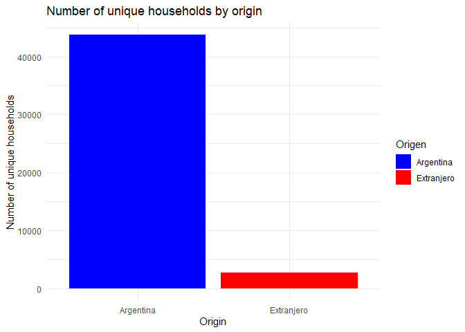
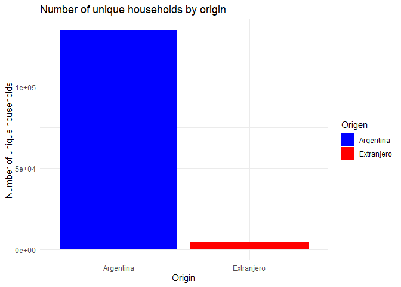

## Load the data

First let’s load the data.

    #set the working directory to the folder where this file is located
    setwd(dirname(rstudioapi::getActiveDocumentContext()$path))
    library(tidyverse)

    ## ── Attaching core tidyverse packages ──────────────────────── tidyverse 2.0.0 ──
    ## ✔ dplyr     1.1.1     ✔ readr     2.1.4
    ## ✔ forcats   1.0.0     ✔ stringr   1.5.0
    ## ✔ ggplot2   3.4.1     ✔ tibble    3.2.1
    ## ✔ lubridate 1.9.2     ✔ tidyr     1.3.0
    ## ✔ purrr     1.0.1     
    ## ── Conflicts ────────────────────────────────────────── tidyverse_conflicts() ──
    ## ✖ dplyr::filter() masks stats::filter()
    ## ✖ dplyr::lag()    masks stats::lag()
    ## ℹ Use the conflicted package (<http://conflicted.r-lib.org/>) to force all conflicts to become errors

    # Load the data from the RData file that is in the same folder as this Rmd file
    load(paste0(getwd(), "/EPH_DATA.RData"))

    #count the number of rows
    nrow(EPH_DATA)

    ## [1] 235332

## Explorig the data

Let’s explore the data a bit.

    # Summary of the data
    summary(EPH_DATA)

    ##                            CODUSU            ANO4        TRIMESTRE    
    ##  TQRMNORXWHKNKOCDEHMHF00493095:    44   Min.   :2017   Min.   :1.000  
    ##  TQRMNOPQQHJOMOCDEGJBF00500753:    37   1st Qu.:2017   1st Qu.:2.000  
    ##  TQRMNOPUYHKOKPCDEFOCD00472376:    36   Median :2017   Median :2.000  
    ##  TQRMNORTXHMOKOCDEHJGH00510783:    36   Mean   :2017   Mean   :2.495  
    ##  TQRMNOQXTHKOKPCDEFOCD00489396:    32   3rd Qu.:2017   3rd Qu.:3.000  
    ##  TQRMNORTVHMOKOCDEHJGH00510908:    31   Max.   :2017   Max.   :4.000  
    ##  (Other)                      :235116                                 
    ##    NRO_HOGAR        COMPONENTE          H15             REGION      MAS_500   
    ##  Min.   : 1.000   Min.   : 1.000   Min.   :0.0000   Min.   : 1.00   N:127286  
    ##  1st Qu.: 1.000   1st Qu.: 1.000   1st Qu.:1.0000   1st Qu.:40.00   S:108046  
    ##  Median : 1.000   Median : 2.000   Median :1.0000   Median :42.00             
    ##  Mean   : 1.057   Mean   : 2.644   Mean   :0.8551   Mean   :34.42             
    ##  3rd Qu.: 1.000   3rd Qu.: 4.000   3rd Qu.:1.0000   3rd Qu.:43.00             
    ##  Max.   :72.000   Max.   :65.000   Max.   :2.0000   Max.   :44.00             
    ##                                                                               
    ##    AGLOMERADO       PONDERA            CH03             CH04     
    ##  Min.   : 2.00   Min.   :  23.0   Min.   : 1.000   Min.   :1.00  
    ##  1st Qu.:12.00   1st Qu.: 139.0   1st Qu.: 1.000   1st Qu.:1.00  
    ##  Median :23.00   Median : 243.0   Median : 3.000   Median :2.00  
    ##  Mean   :23.89   Mean   : 467.8   Mean   : 2.528   Mean   :1.52  
    ##  3rd Qu.:33.00   3rd Qu.: 561.0   3rd Qu.: 3.000   3rd Qu.:2.00  
    ##  Max.   :93.00   Max.   :7647.0   Max.   :10.000   Max.   :2.00  
    ##                                                                  
    ##          CH05             CH06             CH07            CH08        
    ##            : 30980   Min.   : -1.00   Min.   :1.000   Min.   :  1.000  
    ##  13/03/2013:    29   1st Qu.: 16.00   1st Qu.:2.000   1st Qu.:  1.000  
    ##  01/09/2000:    27   Median : 32.00   Median :5.000   Median :  1.000  
    ##  09/09/1999:    27   Mean   : 34.57   Mean   :3.507   Mean   :  2.331  
    ##  11/06/1998:    27   3rd Qu.: 52.00   3rd Qu.:5.000   3rd Qu.:  4.000  
    ##  13/09/2004:    27   Max.   :110.00   Max.   :9.000   Max.   :123.000  
    ##  (Other)   :204215                                                     
    ##       CH09            CH10            CH11             CH12       
    ##  Min.   :1.000   Min.   :0.000   Min.   :0.0000   Min.   : 0.000  
    ##  1st Qu.:1.000   1st Qu.:1.000   1st Qu.:0.0000   1st Qu.: 2.000  
    ##  Median :1.000   Median :2.000   Median :0.0000   Median : 4.000  
    ##  Mean   :1.119   Mean   :1.675   Mean   :0.3772   Mean   : 3.783  
    ##  3rd Qu.:1.000   3rd Qu.:2.000   3rd Qu.:1.0000   3rd Qu.: 4.000  
    ##  Max.   :9.000   Max.   :9.000   Max.   :9.0000   Max.   :99.000  
    ##                                                                   
    ##       CH13           CH14                CH15          CH15_COD     
    ##  Min.   :0.000   Length:235332      Min.   :1.000   Min.   :  6.00  
    ##  1st Qu.:1.000   Class1:labelled    1st Qu.:1.000   1st Qu.: 18.00  
    ##  Median :1.000   Class2:character   Median :1.000   Median : 50.00  
    ##  Mean   :1.443   Mode  :character   Mean   :1.453   Mean   : 82.38  
    ##  3rd Qu.:2.000                      3rd Qu.:1.000   3rd Qu.: 90.00  
    ##  Max.   :9.000                      Max.   :9.000   Max.   :999.00  
    ##                                                     NA's   :198001  
    ##       CH16          CH16_COD         NIVEL_ED         ESTADO     
    ##  Min.   :0.000   Min.   :  6.00   Min.   :1.000   Min.   :0.000  
    ##  1st Qu.:1.000   1st Qu.: 14.00   1st Qu.:2.000   1st Qu.:1.000  
    ##  Median :1.000   Median : 42.00   Median :4.000   Median :3.000  
    ##  Mean   :1.402   Mean   : 74.37   Mean   :3.698   Mean   :2.294  
    ##  3rd Qu.:1.000   3rd Qu.: 82.00   3rd Qu.:5.000   3rd Qu.:3.000  
    ##  Max.   :9.000   Max.   :999.00   Max.   :7.000   Max.   :4.000  
    ##                  NA's   :231950                                  
    ##     CAT_OCUP        CAT_INAC         IMPUTA             PP02C1       
    ##  Min.   :0.000   Min.   :0.000   Min.   :0.000000   Min.   :0.00000  
    ##  1st Qu.:0.000   1st Qu.:0.000   1st Qu.:0.000000   1st Qu.:0.00000  
    ##  Median :0.000   Median :1.000   Median :0.000000   Median :0.00000  
    ##  Mean   :1.177   Mean   :1.718   Mean   :0.002125   Mean   :0.04999  
    ##  3rd Qu.:3.000   3rd Qu.:3.000   3rd Qu.:0.000000   3rd Qu.:0.00000  
    ##  Max.   :9.000   Max.   :7.000   Max.   :1.000000   Max.   :2.00000  
    ##  NA's   :3       NA's   :2       NA's   :4                           
    ##      PP02C2            PP02C3            PP02C4            PP02C5       
    ##  Min.   :0.00000   Min.   :0.00000   Min.   :0.00000   Min.   :0.00000  
    ##  1st Qu.:0.00000   1st Qu.:0.00000   1st Qu.:0.00000   1st Qu.:0.00000  
    ##  Median :0.00000   Median :0.00000   Median :0.00000   Median :0.00000  
    ##  Mean   :0.03695   Mean   :0.04597   Mean   :0.05444   Mean   :0.05214  
    ##  3rd Qu.:0.00000   3rd Qu.:0.00000   3rd Qu.:0.00000   3rd Qu.:0.00000  
    ##  Max.   :2.00000   Max.   :2.00000   Max.   :2.00000   Max.   :2.00000  
    ##                                                                         
    ##      PP02C6            PP02C7            PP02C8            PP02E       
    ##  Min.   :0.00000   Min.   :0.00000   Min.   :0.00000   Min.   :0.0000  
    ##  1st Qu.:0.00000   1st Qu.:0.00000   1st Qu.:0.00000   1st Qu.:0.0000  
    ##  Median :0.00000   Median :0.00000   Median :0.00000   Median :0.0000  
    ##  Mean   :0.03982   Mean   :0.05272   Mean   :0.05523   Mean   :0.0143  
    ##  3rd Qu.:0.00000   3rd Qu.:0.00000   3rd Qu.:0.00000   3rd Qu.:0.0000  
    ##  Max.   :2.00000   Max.   :2.00000   Max.   :2.00000   Max.   :5.0000  
    ##                                                                        
    ##      PP02H            PP02I            PP03C            PP03D       
    ##  Min.   :0.0000   Min.   :0.0000   Min.   :0.00     Min.   :0.00    
    ##  1st Qu.:0.0000   1st Qu.:0.0000   1st Qu.:1.00     1st Qu.:0.00    
    ##  Median :0.0000   Median :0.0000   Median :1.00     Median :0.00    
    ##  Mean   :0.8205   Mean   :0.8178   Mean   :1.04     Mean   :0.18    
    ##  3rd Qu.:2.0000   3rd Qu.:2.0000   3rd Qu.:1.00     3rd Qu.:0.00    
    ##  Max.   :2.0000   Max.   :2.0000   Max.   :2.00     Max.   :9.00    
    ##  NA's   :2        NA's   :2        NA's   :139013   NA's   :139013  
    ##     PP3E_TOT         PP3F_TOT          PP03G            PP03H       
    ##  Min.   :  0.0    Min.   :  0.00   Min.   :1.00     Min.   :0.00    
    ##  1st Qu.: 24.0    1st Qu.:  0.00   1st Qu.:2.00     1st Qu.:0.00    
    ##  Median : 40.0    Median :  0.00   Median :2.00     Median :0.00    
    ##  Mean   : 37.1    Mean   :  1.42   Mean   :1.86     Mean   :0.16    
    ##  3rd Qu.: 48.0    3rd Qu.:  0.00   3rd Qu.:2.00     3rd Qu.:0.00    
    ##  Max.   :999.0    Max.   :999.00   Max.   :9.00     Max.   :9.00    
    ##  NA's   :139013   NA's   :139013   NA's   :139013   NA's   :139013  
    ##      PP03I            PP03J           INTENSI           PP04A       
    ##  Min.   :1.00     Min.   :1.00     Min.   :1.00     Min.   :0.00    
    ##  1st Qu.:2.00     1st Qu.:2.00     1st Qu.:2.00     1st Qu.:2.00    
    ##  Median :2.00     Median :2.00     Median :2.00     Median :2.00    
    ##  Mean   :1.87     Mean   :1.87     Mean   :2.29     Mean   :1.78    
    ##  3rd Qu.:2.00     3rd Qu.:2.00     3rd Qu.:3.00     3rd Qu.:2.00    
    ##  Max.   :9.00     Max.   :9.00     Max.   :4.00     Max.   :9.00    
    ##  NA's   :139013   NA's   :139013   NA's   :139013   NA's   :139013  
    ##   PP04B_COD             PP04B1           PP04B2         PP04B3_MES    
    ##  Length:235332      Min.   :0.00     Min.   : 0.0     Min.   : 0.00   
    ##  Class :character   1st Qu.:2.00     1st Qu.: 0.0     1st Qu.: 0.00   
    ##  Mode  :character   Median :2.00     Median : 0.0     Median : 0.00   
    ##                     Mean   :1.93     Mean   : 0.1     Mean   : 0.12   
    ##                     3rd Qu.:2.00     3rd Qu.: 0.0     3rd Qu.: 0.00   
    ##                     Max.   :2.00     Max.   :20.0     Max.   :99.00   
    ##                     NA's   :139013   NA's   :139013   NA's   :139013  
    ##    PP04B3_ANO       PP04B3_DIA         PP04C           PP04C99      
    ##  Min.   : 0.00    Min.   : 0.00    Min.   : 0.00    Min.   :0.00    
    ##  1st Qu.: 0.00    1st Qu.: 0.00    1st Qu.: 2.00    1st Qu.:0.00    
    ##  Median : 0.00    Median : 0.00    Median : 6.00    Median :0.00    
    ##  Mean   : 0.32    Mean   : 0.05    Mean   :16.09    Mean   :0.56    
    ##  3rd Qu.: 0.00    3rd Qu.: 0.00    3rd Qu.:10.00    3rd Qu.:0.00    
    ##  Max.   :99.00    Max.   :99.00    Max.   :99.00    Max.   :9.00    
    ##  NA's   :139013   NA's   :139013   NA's   :139013   NA's   :139013  
    ##   PP04D_COD             PP04G          PP05B2_MES       PP05B2_ANO    
    ##  Length:235332      Min.   : 0.0     Min.   : 0.00    Min.   : 0.00   
    ##  Class :character   1st Qu.: 1.0     1st Qu.: 0.00    1st Qu.: 0.00   
    ##  Mode  :character   Median : 1.0     Median : 0.00    Median : 0.00   
    ##                     Mean   : 2.6     Mean   : 0.01    Mean   : 0.03   
    ##                     3rd Qu.: 4.0     3rd Qu.: 0.00    3rd Qu.: 0.00   
    ##                     Max.   :99.0     Max.   :99.00    Max.   :99.00   
    ##                     NA's   :139013   NA's   :139013   NA's   :139013  
    ##    PP05B2_DIA        PP05C_1          PP05C_2          PP05C_3      
    ##  Min.   : 0.00    Min.   :0.00     Min.   :0.00     Min.   :0.00    
    ##  1st Qu.: 0.00    1st Qu.:0.00     1st Qu.:0.00     1st Qu.:0.00    
    ##  Median : 0.00    Median :0.00     Median :0.00     Median :0.00    
    ##  Mean   : 0.01    Mean   :0.37     Mean   :0.56     Mean   :0.57    
    ##  3rd Qu.: 0.00    3rd Qu.:0.00     3rd Qu.:0.00     3rd Qu.:0.00    
    ##  Max.   :99.00    Max.   :9.00     Max.   :9.00     Max.   :9.00    
    ##  NA's   :139013   NA's   :139013   NA's   :139013   NA's   :139013  
    ##      PP05E            PP05F            PP05H            PP06A       
    ##  Min.   :0.00     Min.   :0.00     Min.   :0.00     Min.   :0.00    
    ##  1st Qu.:0.00     1st Qu.:0.00     1st Qu.:0.00     1st Qu.:0.00    
    ##  Median :0.00     Median :0.00     Median :0.00     Median :0.00    
    ##  Mean   :0.25     Mean   :1.74     Mean   :1.32     Mean   :0.44    
    ##  3rd Qu.:0.00     3rd Qu.:0.00     3rd Qu.:0.00     3rd Qu.:0.00    
    ##  Max.   :9.00     Max.   :9.00     Max.   :9.00     Max.   :9.00    
    ##  NA's   :139013   NA's   :139013   NA's   :139013   NA's   :139013  
    ##      PP06C            PP06D              PP06E            PP06H       
    ##  Min.   :    -9   Min.   :    -9.0   Min.   :0.00     Min.   :0.00    
    ##  1st Qu.:     0   1st Qu.:     0.0   1st Qu.:0.00     1st Qu.:0.00    
    ##  Median :     0   Median :     0.0   Median :0.00     Median :0.00    
    ##  Mean   :  1445   Mean   :   566.6   Mean   :0.17     Mean   :0.07    
    ##  3rd Qu.:     0   3rd Qu.:     0.0   3rd Qu.:0.00     3rd Qu.:0.00    
    ##  Max.   :300000   Max.   :240000.0   Max.   :9.00     Max.   :2.00    
    ##  NA's   :139013   NA's   :139013     NA's   :139013   NA's   :139013  
    ##      PP07A            PP07C            PP07D            PP07E       
    ##  Min.   :0.00     Min.   :0.00     Min.   :0.00     Min.   :0.00    
    ##  1st Qu.:0.00     1st Qu.:0.00     1st Qu.:0.00     1st Qu.:0.00    
    ##  Median :5.00     Median :2.00     Median :0.00     Median :0.00    
    ##  Mean   :3.49     Mean   :1.49     Mean   :0.81     Mean   :0.42    
    ##  3rd Qu.:6.00     3rd Qu.:2.00     3rd Qu.:0.00     3rd Qu.:0.00    
    ##  Max.   :9.00     Max.   :9.00     Max.   :9.00     Max.   :9.00    
    ##  NA's   :139013   NA's   :139013   NA's   :139013   NA's   :139013  
    ##      PP07F1           PP07F2           PP07F3           PP07F4      
    ##  Min.   :0.0      Min.   :0.00     Min.   :0.00     Min.   :0.00    
    ##  1st Qu.:0.0      1st Qu.:0.00     1st Qu.:0.00     1st Qu.:0.00    
    ##  Median :2.0      Median :2.00     Median :2.00     Median :2.00    
    ##  Mean   :1.4      Mean   :1.49     Mean   :1.48     Mean   :1.44    
    ##  3rd Qu.:2.0      3rd Qu.:2.00     3rd Qu.:2.00     3rd Qu.:2.00    
    ##  Max.   :9.0      Max.   :9.00     Max.   :9.00     Max.   :9.00    
    ##  NA's   :139013   NA's   :139013   NA's   :139013   NA's   :139013  
    ##      PP07F5           PP07G1           PP07G2           PP07G3      
    ##  Min.   :0.00     Min.   :0.00     Min.   :0.00     Min.   :0.00    
    ##  1st Qu.:0.00     1st Qu.:0.00     1st Qu.:0.00     1st Qu.:0.00    
    ##  Median :5.00     Median :1.00     Median :1.00     Median :1.00    
    ##  Mean   :3.04     Mean   :0.98     Mean   :0.98     Mean   :0.99    
    ##  3rd Qu.:5.00     3rd Qu.:1.00     3rd Qu.:1.00     3rd Qu.:1.00    
    ##  Max.   :5.00     Max.   :9.00     Max.   :9.00     Max.   :9.00    
    ##  NA's   :139013   NA's   :139013   NA's   :139013   NA's   :139013  
    ##      PP07G4          PP07G_59          PP07H            PP07I       
    ##  Min.   :0.00     Min.   :0.00     Min.   :0.00     Min.   :0.00    
    ##  1st Qu.:0.00     1st Qu.:0.00     1st Qu.:0.00     1st Qu.:0.00    
    ##  Median :1.00     Median :0.00     Median :1.00     Median :0.00    
    ##  Mean   :0.98     Mean   :1.06     Mean   :0.99     Mean   :0.47    
    ##  3rd Qu.:1.00     3rd Qu.:0.00     3rd Qu.:1.00     3rd Qu.:0.00    
    ##  Max.   :9.00     Max.   :5.00     Max.   :9.00     Max.   :9.00    
    ##  NA's   :139013   NA's   :139013   NA's   :139013   NA's   :139013  
    ##      PP07J            PP07K            PP08D1           PP08D4       
    ##  Min.   :0.00     Min.   :0.00     Min.   :    -9   Min.   :  -9.00  
    ##  1st Qu.:0.00     1st Qu.:0.00     1st Qu.:     0   1st Qu.:   0.00  
    ##  Median :1.00     Median :1.00     Median :  5600   Median :   0.00  
    ##  Mean   :0.89     Mean   :1.42     Mean   :  8344   Mean   :   2.29  
    ##  3rd Qu.:1.00     3rd Qu.:1.00     3rd Qu.: 14000   3rd Qu.:   0.00  
    ##  Max.   :9.00     Max.   :9.00     Max.   :300000   Max.   :7000.00  
    ##  NA's   :139013   NA's   :139013   NA's   :139013   NA's   :139013   
    ##      PP08F1            PP08F2            PP08J1            PP08J2        
    ##  Min.   :   -9.0   Min.   :  -9.00   Min.   :   -9.0   Min.   :    -9.0  
    ##  1st Qu.:    0.0   1st Qu.:   0.00   1st Qu.:    0.0   1st Qu.:     0.0  
    ##  Median :    0.0   Median :   0.00   Median :    0.0   Median :     0.0  
    ##  Mean   :  109.3   Mean   :   5.55   Mean   :  471.6   Mean   :    23.1  
    ##  3rd Qu.:    0.0   3rd Qu.:   0.00   3rd Qu.:    0.0   3rd Qu.:     0.0  
    ##  Max.   :80000.0   Max.   :9999.00   Max.   :75000.0   Max.   :750000.0  
    ##  NA's   :139013    NA's   :139013    NA's   :139013    NA's   :139013    
    ##      PP08J3             PP09A                    PP09A_ESP     
    ##  Min.   :   -9.00   Min.   :0.00                      :235223  
    ##  1st Qu.:    0.00   1st Qu.:0.00     todo el pais     :    16  
    ##  Median :    0.00   Median :0.00     la plata         :    11  
    ##  Mean   :    4.46   Mean   :0.34     interior del pais:     6  
    ##  3rd Qu.:    0.00   3rd Qu.:0.00     en todo el pais  :     3  
    ##  Max.   :38000.00   Max.   :9.00     La plata         :     2  
    ##  NA's   :139013     NA's   :139013   (Other)          :    71  
    ##      PP09B            PP09C                     PP09C_ESP          PP10A       
    ##  Min.   :0.00     Min.   :0.00                       :234950   Min.   :0.00    
    ##  1st Qu.:0.00     1st Qu.:0.00     Rio Negro - Viedma:    27   1st Qu.:2.00    
    ##  Median :0.00     Median :0.00     RIO NEGRO- VIEDMA :    18   Median :3.00    
    ##  Mean   :0.19     Mean   :0.01     RIO NEGRO - VIEDMA:    17   Mean   :3.25    
    ##  3rd Qu.:0.00     3rd Qu.:0.00     A&ntilde;elo      :    16   3rd Qu.:5.00    
    ##  Max.   :2.00     Max.   :3.00     SANTA FE          :    16   Max.   :9.00    
    ##  NA's   :139013   NA's   :139013   (Other)           :   288   NA's   :228287  
    ##      PP10C            PP10D            PP10E            PP11A       
    ##  Min.   :0.00     Min.   :0.00     Min.   :0.00     Min.   :0.00    
    ##  1st Qu.:1.00     1st Qu.:0.00     1st Qu.:1.00     1st Qu.:1.00    
    ##  Median :2.00     Median :1.00     Median :2.00     Median :2.00    
    ##  Mean   :1.56     Mean   :0.71     Mean   :2.47     Mean   :1.52    
    ##  3rd Qu.:2.00     3rd Qu.:1.00     3rd Qu.:4.00     3rd Qu.:2.00    
    ##  Max.   :9.00     Max.   :9.00     Max.   :9.00     Max.   :3.00    
    ##  NA's   :228287   NA's   :228287   NA's   :228287   NA's   :228287  
    ##   PP11B_COD             PP11B1         PP11B2_MES       PP11B2_ANO    
    ##  Length:235332      Min.   :0.00     Min.   : 0.00    Min.   : 0.0    
    ##  Class1:labelled    1st Qu.:1.00     1st Qu.: 0.00    1st Qu.: 0.0    
    ##  Class2:character   Median :2.00     Median : 0.00    Median : 0.0    
    ##  Mode  :character   Mean   :1.44     Mean   : 0.21    Mean   : 0.1    
    ##                     3rd Qu.:2.00     3rd Qu.: 0.00    3rd Qu.: 0.0    
    ##                     Max.   :9.00     Max.   :99.00    Max.   :99.0    
    ##                     NA's   :228287   NA's   :228287   NA's   :228287  
    ##    PP11B2_DIA         PP11C           PP11C99        PP11D_COD        
    ##  Min.   : 0.00    Min.   : 0.00    Min.   :0.00     Length:235332     
    ##  1st Qu.: 0.00    1st Qu.: 0.00    1st Qu.:0.00     Class1:labelled   
    ##  Median : 0.00    Median : 2.00    Median :0.00     Class2:character  
    ##  Mean   : 0.15    Mean   :12.11    Mean   :0.54     Mode  :character  
    ##  3rd Qu.: 0.00    3rd Qu.: 6.00    3rd Qu.:0.00                       
    ##  Max.   :99.00    Max.   :99.00    Max.   :9.00                       
    ##  NA's   :228287   NA's   :228287   NA's   :228287                     
    ##    PP11G_ANO        PP11G_MES        PP11G_DIA          PP11L       
    ##  Min.   : 0.00    Min.   : 0.00    Min.   : 0.00    Min.   :0.0     
    ##  1st Qu.: 0.00    1st Qu.: 0.00    1st Qu.: 0.00    1st Qu.:0.0     
    ##  Median : 0.00    Median : 0.00    Median : 0.00    Median :0.0     
    ##  Mean   : 1.17    Mean   : 1.25    Mean   : 1.65    Mean   :0.4     
    ##  3rd Qu.: 0.00    3rd Qu.: 1.00    3rd Qu.: 0.00    3rd Qu.:0.0     
    ##  Max.   :99.00    Max.   :99.00    Max.   :99.00    Max.   :9.0     
    ##  NA's   :228287   NA's   :228287   NA's   :228287   NA's   :228287  
    ##      PP11L1           PP11M            PP11N            PP11O       
    ##  Min.   :0.00     Min.   :0.00     Min.   :0.00     Min.   :0.00    
    ##  1st Qu.:0.00     1st Qu.:0.00     1st Qu.:0.00     1st Qu.:0.00    
    ##  Median :0.00     Median :0.00     Median :1.00     Median :1.00    
    ##  Mean   :0.69     Mean   :0.96     Mean   :1.11     Mean   :2.53    
    ##  3rd Qu.:1.00     3rd Qu.:3.00     3rd Qu.:2.00     3rd Qu.:4.00    
    ##  Max.   :3.00     Max.   :3.00     Max.   :9.00     Max.   :9.00    
    ##  NA's   :228287   NA's   :228287   NA's   :228287   NA's   :228287  
    ##      PP11P            PP11Q            PP11R            PP11S       
    ##  Min.   :0.00     Min.   :0.0      Min.   :0.00     Min.   :0.00    
    ##  1st Qu.:0.00     1st Qu.:0.0      1st Qu.:0.00     1st Qu.:0.00    
    ##  Median :0.00     Median :0.0      Median :0.00     Median :0.00    
    ##  Mean   :0.24     Mean   :0.2      Mean   :0.22     Mean   :0.22    
    ##  3rd Qu.:0.00     3rd Qu.:0.0      3rd Qu.:0.00     3rd Qu.:0.00    
    ##  Max.   :9.00     Max.   :9.0      Max.   :2.00     Max.   :2.00    
    ##  NA's   :228287   NA's   :228287   NA's   :228287   NA's   :228287  
    ##      PP11T             P21           DECOCUR            IDECOCUR        
    ##  Min.   :0.00     Min.   :    -9   Length:235332      Length:235332     
    ##  1st Qu.:0.00     1st Qu.:     0   Class1:labelled    Class1:labelled   
    ##  Median :2.00     Median :     0   Class2:character   Class2:character  
    ##  Mean   :1.16     Mean   :  4279   Mode  :character   Mode  :character  
    ##  3rd Qu.:2.00     3rd Qu.:  6000                                        
    ##  Max.   :9.00     Max.   :300000                                        
    ##  NA's   :228287                                                         
    ##    RDECOCUR           GDECOCUR           PDECOCUR           ADECOCUR        
    ##  Length:235332      Length:235332      Length:235332      Length:235332     
    ##  Class1:labelled    Class1:labelled    Class1:labelled    Class1:labelled   
    ##  Class2:character   Class2:character   Class2:character   Class2:character  
    ##  Mode  :character   Mode  :character   Mode  :character   Mode  :character  
    ##                                                                             
    ##                                                                             
    ##                                                                             
    ##     PONDIIO           TOT_P12              P47T          DECINDR         
    ##  Min.   :    0.0   Min.   :    -9.0   Min.   :    -9   Length:235332     
    ##  1st Qu.:  131.0   1st Qu.:     0.0   1st Qu.:     0   Class1:labelled   
    ##  Median :  233.0   Median :     0.0   Median :   720   Class2:character  
    ##  Mean   :  467.8   Mean   :   222.2   Mean   :  6451   Mode  :character  
    ##  3rd Qu.:  526.0   3rd Qu.:     0.0   3rd Qu.: 10000                     
    ##  Max.   :13844.0   Max.   :200000.0   Max.   :870000                     
    ##                                       NA's   :232                        
    ##    IDECINDR           RDECINDR           GDECINDR           PDECINDR        
    ##  Length:235332      Length:235332      Length:235332      Length:235332     
    ##  Class1:labelled    Class1:labelled    Class1:labelled    Class1:labelled   
    ##  Class2:character   Class2:character   Class2:character   Class2:character  
    ##  Mode  :character   Mode  :character   Mode  :character   Mode  :character  
    ##                                                                             
    ##                                                                             
    ##                                                                             
    ##    ADECINDR             PONDII             V2_M             V3_M         
    ##  Length:235332      Min.   :    0.0   Min.   :    -9   Min.   :    -9.0  
    ##  Class1:labelled    1st Qu.:  128.0   1st Qu.:     0   1st Qu.:     0.0  
    ##  Class2:character   Median :  230.0   Median :     0   Median :     0.0  
    ##  Mode  :character   Mean   :  467.9   Mean   :  1452   Mean   :    41.5  
    ##                     3rd Qu.:  514.0   3rd Qu.:     0   3rd Qu.:     0.0  
    ##                     Max.   :12319.0   Max.   :150000   Max.   :800000.0  
    ##                                                                          
    ##       V4_M              V5_M               V8_M               V9_M          
    ##  Min.   :   -9.0   Min.   :   -9.00   Min.   :   -9.00   Min.   :    -9.00  
    ##  1st Qu.:    0.0   1st Qu.:    0.00   1st Qu.:    0.00   1st Qu.:     0.00  
    ##  Median :    0.0   Median :    0.00   Median :    0.00   Median :     0.00  
    ##  Mean   :    3.9   Mean   :   96.82   Mean   :   60.48   Mean   :     9.36  
    ##  3rd Qu.:    0.0   3rd Qu.:    0.00   3rd Qu.:    0.00   3rd Qu.:     0.00  
    ##  Max.   :30000.0   Max.   :45000.00   Max.   :90000.00   Max.   :150000.00  
    ##                                                                             
    ##      V10_M               V11_M              V12_M             V18_M          
    ##  Min.   :    -9.00   Min.   :   -9.00   Min.   :   -9.0   Min.   :    -9.00  
    ##  1st Qu.:     0.00   1st Qu.:    0.00   1st Qu.:    0.0   1st Qu.:     0.00  
    ##  Median :     0.00   Median :    0.00   Median :    0.0   Median :     0.00  
    ##  Mean   :     9.58   Mean   :    9.33   Mean   :  123.3   Mean   :     4.14  
    ##  3rd Qu.:     0.00   3rd Qu.:    0.00   3rd Qu.:    0.0   3rd Qu.:     0.00  
    ##  Max.   :200000.00   Max.   :35000.00   Max.   :80000.0   Max.   :180000.00  
    ##                                                                              
    ##      V19_AM             V21_M               T_VI             ITF        
    ##  Min.   :  -9.000   Min.   :   -9.00   Min.   :    -9   Min.   :     0  
    ##  1st Qu.:   0.000   1st Qu.:    0.00   1st Qu.:     0   1st Qu.:  5000  
    ##  Median :   0.000   Median :    0.00   Median :     0   Median : 16000  
    ##  Mean   :   0.033   Mean   :   92.72   Mean   :  1874   Mean   : 20043  
    ##  3rd Qu.:   0.000   3rd Qu.:    0.00   3rd Qu.:     0   3rd Qu.: 28500  
    ##  Max.   :6700.000   Max.   :60000.00   Max.   :800000   Max.   :870000  
    ##                                                                         
    ##     DECIFR            IDECIFR            RDECIFR            GDECIFR         
    ##  Length:235332      Length:235332      Length:235332      Length:235332     
    ##  Class1:labelled    Class1:labelled    Class1:labelled    Class1:labelled   
    ##  Class2:character   Class2:character   Class2:character   Class2:character  
    ##  Mode  :character   Mode  :character   Mode  :character   Mode  :character  
    ##                                                                             
    ##                                                                             
    ##                                                                             
    ##    PDECIFR            ADECIFR               IPCF           DECCFR         
    ##  Length:235332      Length:235332      Min.   :     0   Length:235332     
    ##  Class1:labelled    Class1:labelled    1st Qu.:  1267   Class1:labelled   
    ##  Class2:character   Class2:character   Median :  4217   Class2:character  
    ##  Mode  :character   Mode  :character   Mean   :  5914   Mode  :character  
    ##                                        3rd Qu.:  8000                     
    ##                                        Max.   :870000                     
    ##                                                                           
    ##    IDECCFR            RDECCFR            GDECCFR            PDECCFR         
    ##  Length:235332      Length:235332      Length:235332      Length:235332     
    ##  Class1:labelled    Class1:labelled    Class1:labelled    Class1:labelled   
    ##  Class2:character   Class2:character   Class2:character   Class2:character  
    ##  Mode  :character   Mode  :character   Mode  :character   Mode  :character  
    ##                                                                             
    ##                                                                             
    ##                                                                             
    ##    ADECCFR              PONDIH           region           adequi_hogar   
    ##  Length:235332      Min.   :    0.0   Length:235332      Min.   : 0.630  
    ##  Class1:labelled    1st Qu.:   85.0   Class :character   1st Qu.: 2.240  
    ##  Class2:character   Median :  207.0   Mode  :character   Median : 3.190  
    ##  Mode  :character   Mean   :  467.8                      Mean   : 3.352  
    ##                     3rd Qu.:  437.0                      3rd Qu.: 4.230  
    ##                     Max.   :17703.0                      Max.   :15.810  
    ##                                                                          
    ##    CBA_hogar         CBT_hogar      situacion         country_of_birth  
    ##  Min.   :  994.5   Min.   : 2238   Length:235332      Length:235332     
    ##  1st Qu.: 4128.7   1st Qu.: 9983   Class :character   Class :character  
    ##  Median : 5915.8   Median :14449   Mode  :character   Mode  :character  
    ##  Mean   : 6277.0   Mean   :15374                                        
    ##  3rd Qu.: 7882.1   3rd Qu.:19337                                        
    ##  Max.   :33357.6   Max.   :82183                                        
    ##                                                                         
    ##  province_of_birth  country_residence_5yearsago province_residence_5yearsago
    ##  Length:235332      Length:235332               Length:235332               
    ##  Class :character   Class :character            Class :character            
    ##  Mode  :character   Mode  :character            Mode  :character            
    ##                                                                             
    ##                                                                             
    ##                                                                             
    ##                                                                             
    ##  caes_version       PP04B_label        caes_seccion_cod   caes_seccion_label
    ##  Length:235332      Length:235332      Length:235332      Length:235332     
    ##  Class :character   Class :character   Class :character   Class :character  
    ##  Mode  :character   Mode  :character   Mode  :character   Mode  :character  
    ##                                                                             
    ##                                                                             
    ##                                                                             
    ##                                                                             
    ##  caes_division_cod  caes_division_label caes_eph_cod      
    ##  Length:235332      Length:235332       Length:235332     
    ##  Class :character   Class :character    Class :character  
    ##  Mode  :character   Mode  :character    Mode  :character  
    ##                                                           
    ##                                                           
    ##                                                           
    ##                                                           
    ##                                             caes_eph_label    CATEGORIA        
    ##  Comercio                                          : 17704   Length:235332     
    ##  Administracion publica, defensa y seguridad social: 11205   Class :character  
    ##  Construccion                                      :  9802   Mode  :character  
    ##  Industria manufacturera                           :  9542                     
    ##  Ensenanza                                         :  8869                     
    ##  (Other)                                           : 39197                     
    ##  NA's                                              :139013                     
    ##   JERARQUIA          TECNOLOGIA        CALIFICACION      
    ##  Length:235332      Length:235332      Length:235332     
    ##  Class :character   Class :character   Class :character  
    ##  Mode  :character   Mode  :character   Mode  :character  
    ##                                                          
    ##                                                          
    ##                                                          
    ## 

    # Variable names
    names(EPH_DATA)

    ##   [1] "CODUSU"                       "ANO4"                        
    ##   [3] "TRIMESTRE"                    "NRO_HOGAR"                   
    ##   [5] "COMPONENTE"                   "H15"                         
    ##   [7] "REGION"                       "MAS_500"                     
    ##   [9] "AGLOMERADO"                   "PONDERA"                     
    ##  [11] "CH03"                         "CH04"                        
    ##  [13] "CH05"                         "CH06"                        
    ##  [15] "CH07"                         "CH08"                        
    ##  [17] "CH09"                         "CH10"                        
    ##  [19] "CH11"                         "CH12"                        
    ##  [21] "CH13"                         "CH14"                        
    ##  [23] "CH15"                         "CH15_COD"                    
    ##  [25] "CH16"                         "CH16_COD"                    
    ##  [27] "NIVEL_ED"                     "ESTADO"                      
    ##  [29] "CAT_OCUP"                     "CAT_INAC"                    
    ##  [31] "IMPUTA"                       "PP02C1"                      
    ##  [33] "PP02C2"                       "PP02C3"                      
    ##  [35] "PP02C4"                       "PP02C5"                      
    ##  [37] "PP02C6"                       "PP02C7"                      
    ##  [39] "PP02C8"                       "PP02E"                       
    ##  [41] "PP02H"                        "PP02I"                       
    ##  [43] "PP03C"                        "PP03D"                       
    ##  [45] "PP3E_TOT"                     "PP3F_TOT"                    
    ##  [47] "PP03G"                        "PP03H"                       
    ##  [49] "PP03I"                        "PP03J"                       
    ##  [51] "INTENSI"                      "PP04A"                       
    ##  [53] "PP04B_COD"                    "PP04B1"                      
    ##  [55] "PP04B2"                       "PP04B3_MES"                  
    ##  [57] "PP04B3_ANO"                   "PP04B3_DIA"                  
    ##  [59] "PP04C"                        "PP04C99"                     
    ##  [61] "PP04D_COD"                    "PP04G"                       
    ##  [63] "PP05B2_MES"                   "PP05B2_ANO"                  
    ##  [65] "PP05B2_DIA"                   "PP05C_1"                     
    ##  [67] "PP05C_2"                      "PP05C_3"                     
    ##  [69] "PP05E"                        "PP05F"                       
    ##  [71] "PP05H"                        "PP06A"                       
    ##  [73] "PP06C"                        "PP06D"                       
    ##  [75] "PP06E"                        "PP06H"                       
    ##  [77] "PP07A"                        "PP07C"                       
    ##  [79] "PP07D"                        "PP07E"                       
    ##  [81] "PP07F1"                       "PP07F2"                      
    ##  [83] "PP07F3"                       "PP07F4"                      
    ##  [85] "PP07F5"                       "PP07G1"                      
    ##  [87] "PP07G2"                       "PP07G3"                      
    ##  [89] "PP07G4"                       "PP07G_59"                    
    ##  [91] "PP07H"                        "PP07I"                       
    ##  [93] "PP07J"                        "PP07K"                       
    ##  [95] "PP08D1"                       "PP08D4"                      
    ##  [97] "PP08F1"                       "PP08F2"                      
    ##  [99] "PP08J1"                       "PP08J2"                      
    ## [101] "PP08J3"                       "PP09A"                       
    ## [103] "PP09A_ESP"                    "PP09B"                       
    ## [105] "PP09C"                        "PP09C_ESP"                   
    ## [107] "PP10A"                        "PP10C"                       
    ## [109] "PP10D"                        "PP10E"                       
    ## [111] "PP11A"                        "PP11B_COD"                   
    ## [113] "PP11B1"                       "PP11B2_MES"                  
    ## [115] "PP11B2_ANO"                   "PP11B2_DIA"                  
    ## [117] "PP11C"                        "PP11C99"                     
    ## [119] "PP11D_COD"                    "PP11G_ANO"                   
    ## [121] "PP11G_MES"                    "PP11G_DIA"                   
    ## [123] "PP11L"                        "PP11L1"                      
    ## [125] "PP11M"                        "PP11N"                       
    ## [127] "PP11O"                        "PP11P"                       
    ## [129] "PP11Q"                        "PP11R"                       
    ## [131] "PP11S"                        "PP11T"                       
    ## [133] "P21"                          "DECOCUR"                     
    ## [135] "IDECOCUR"                     "RDECOCUR"                    
    ## [137] "GDECOCUR"                     "PDECOCUR"                    
    ## [139] "ADECOCUR"                     "PONDIIO"                     
    ## [141] "TOT_P12"                      "P47T"                        
    ## [143] "DECINDR"                      "IDECINDR"                    
    ## [145] "RDECINDR"                     "GDECINDR"                    
    ## [147] "PDECINDR"                     "ADECINDR"                    
    ## [149] "PONDII"                       "V2_M"                        
    ## [151] "V3_M"                         "V4_M"                        
    ## [153] "V5_M"                         "V8_M"                        
    ## [155] "V9_M"                         "V10_M"                       
    ## [157] "V11_M"                        "V12_M"                       
    ## [159] "V18_M"                        "V19_AM"                      
    ## [161] "V21_M"                        "T_VI"                        
    ## [163] "ITF"                          "DECIFR"                      
    ## [165] "IDECIFR"                      "RDECIFR"                     
    ## [167] "GDECIFR"                      "PDECIFR"                     
    ## [169] "ADECIFR"                      "IPCF"                        
    ## [171] "DECCFR"                       "IDECCFR"                     
    ## [173] "RDECCFR"                      "GDECCFR"                     
    ## [175] "PDECCFR"                      "ADECCFR"                     
    ## [177] "PONDIH"                       "region"                      
    ## [179] "adequi_hogar"                 "CBA_hogar"                   
    ## [181] "CBT_hogar"                    "situacion"                   
    ## [183] "country_of_birth"             "province_of_birth"           
    ## [185] "country_residence_5yearsago"  "province_residence_5yearsago"
    ## [187] "caes_version"                 "PP04B_label"                 
    ## [189] "caes_seccion_cod"             "caes_seccion_label"          
    ## [191] "caes_division_cod"            "caes_division_label"         
    ## [193] "caes_eph_cod"                 "caes_eph_label"              
    ## [195] "CATEGORIA"                    "JERARQUIA"                   
    ## [197] "TECNOLOGIA"                   "CALIFICACION"

    #number of rows
    nrow(EPH_DATA)

    ## [1] 235332

The original dataset cointains 235,332 records and 198 variables, not
all of them are relevant for the analysis. Let’s filter the data to
include only the relevant variables. According to the document “Diseño
de Registro y Estructura para las bases preliminares Hogar y Personas”
(design of the register and structure for the preliminary household and
person databases), the variable “NRO\_HOGAR” is the household
identifier, the Variable CH03 define the role of the person in the
household and the variable CH06 is the age of the person. We first need
to filter the data to include only the people that are the head of the
household and kids under 18 years old.

    #Count the number of kids under 18 years old
    sum(EPH_DATA$CH06 < 18)

    ## [1] 64542

    # Filter the data to include only the head of the household and kids under 18 years old
    EPH_DATA <- EPH_DATA[EPH_DATA$CH03 == 1 | EPH_DATA$CH06 < 18, ]
    #number of rows
    nrow(EPH_DATA)

    ## [1] 139472

We have now 139,451, however, not all households have kids under 18
years old. Lets now filter the data again to include only houses with
kids under 18 years old.

    # Filter the data to include only houses with kids under 18 years old
    EPH_DATA <- EPH_DATA[EPH_DATA$NRO_HOGAR %in% EPH_DATA[EPH_DATA$CH06 < 18, ]$NRO_HOGAR, ]
    #number of rows
    nrow(EPH_DATA)

    ## [1] 139451

We have now 139,451 records. Now lets separate the people that was born
in Argentina from the people that was born in other countries to compare
the chances to apply for the program. According to the same document,
the variable “CH15” is the country of birth of the person.

The options 1, 2 and 3 correspond to Argentina, so we will filter the
data to include only the people that was born in Argentina. The options
4,5 and 9 are for foreign countries. Let’s add a new column to indicate
the origin of the person.

    # Add a new column to indicate the origin of the person
    EPH_DATA$Origen <- ifelse(EPH_DATA$CH15 %in% c(1,2,3), 'Argentina', 'Extranjero')
    #count the number of people by origin
    table(EPH_DATA$Origen)

    ## 
    ##  Argentina Extranjero 
    ##     134995       4456

    # Count the number of unique households by origin
    conteos_unicos <- EPH_DATA %>%
        group_by(Origen) %>%
        summarise(Count = n_distinct(CODUSU))

    # Create a bar plot
    ggplot(data = conteos_unicos, aes(x = Origen, y = Count, fill = Origen)) +
        geom_col() +
        labs(title = "Number of unique households by origin",
                 x = "Origin",
                 y = "Number of unique households") +
        scale_fill_manual(values = c("Argentina" = "blue", "Extranjero" = "red")) +
        theme_minimal()

This plot shows the number of households were at least one person under
18 lives by origin of the people. If we want to compare the chances of
applying for the program between households with people born in
Argentina and households with people born in other countries, we need to
consider additional filters to make the comparison more accurate. For
example, we could filter the data to include only households with kids
under 18 years old and with a monthly income below a certain threshold.

The avobe code can be simplified by using the `dplyr` package for
applying the filters and summarizing the data. The following code shows
how to do this.

    library(dplyr)
    library(ggplot2)

    EPH_DATA %>%
        filter(CH03 == 1 | CH06 < 18) %>%
        filter(NRO_HOGAR %in% .$NRO_HOGAR[CH06 < 18]) %>%
        mutate(Origen = ifelse(CH15 %in% c(1, 2, 3), 'Argentina', 'Extranjero')) %>%
        count(Origen) %>%
        ggplot(aes(x = Origen, y = n, fill = Origen)) +
            geom_col() +
            labs(title = "Number of unique households by origin",
                     x = "Origin",
                     y = "Number of unique households") +
            scale_fill_manual(values = c("Argentina" = "blue", "Extranjero" = "red")) +
            theme_minimal()

