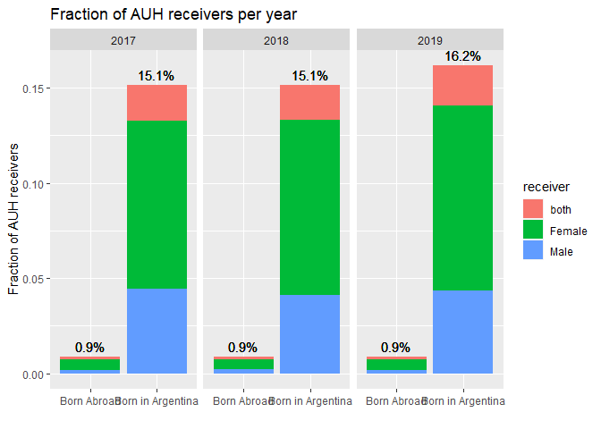

    ## ── Attaching core tidyverse packages ──────────────────────── tidyverse 2.0.0 ──
    ## ✔ dplyr     1.1.1     ✔ readr     2.1.4
    ## ✔ forcats   1.0.0     ✔ stringr   1.5.0
    ## ✔ ggplot2   3.4.1     ✔ tibble    3.2.1
    ## ✔ lubridate 1.9.2     ✔ tidyr     1.3.0
    ## ✔ purrr     1.0.1     
    ## ── Conflicts ────────────────────────────────────────── tidyverse_conflicts() ──
    ## ✖ dplyr::filter() masks stats::filter()
    ## ✖ dplyr::lag()    masks stats::lag()
    ## ℹ Use the conflicted package (<http://conflicted.r-lib.org/>) to force all conflicts to become errors

    # import data
    load("Data.RData")

    auhHousholds <- 
      Data |> 
      # get number of persons per year and quarter
      group_by(Year,Quarter) |> 
      mutate( n_perYearQuarter = sum(Family_Relationship %in% c("Head of Household", "Spouse/partner"))) |>
      ungroup() |>
      # get number of persons per year 
      group_by(Year) |> 
      mutate( n_perYear = Household[Family_Relationship %in% c("Head of Household", "Spouse/partner")] |> unique() |> length()) |>
      ungroup() |>
      # check if informal worker
      mutate(across(c(Paid_Vacation, Bonus, Sick_Days, Health_Insurance, Pension_Discount), 
                    ~case_when(.x == "Yes" ~ TRUE,
                               .default = FALSE)),
             InformalWorker = (Paid_Vacation+ Bonus+ Sick_Days+ Health_Insurance+ Pension_Discount) < 5
                              | Employment_Position == "Unpaid Family Worker"
            ) |> 
      # reduce to one AUH receiver per household
      group_by(Year,Quarter,Household) |> 
      # check number of children under age 18 per household
      mutate( n_children = sum( Family_Relationship == "Child/stepchild" 
                                & Age < 18) ) |> 
      # reduce households to parents with children
      filter( n_children > 0
              , Family_Relationship %in% c("Head of Household", "Spouse/partner") 
              # filter working conditions
              , Employment_Status %in% c("Employed", "Unemployed")
              # drop missing data
              , Individual_Income > 0 
              ) |> 
      # check if AUH receiver
      filter(
        Unemployed == 1 
        | (Employment_Position == "Laborer or Employee" 
           & Domestic_Worker == 1)
        | (Employment_Position == "Laborer or Employee" 
           & InformalWorker
           & Individual_Income < Min_Wage)
        | (Employment_Position == "Self-Employed" 
           & Individual_Income < Min_Wage)
      ) |> 
      # store per household who is AUH receiver
      mutate( receiver = case_when(
        n() == 1 ~ Sex,
        n() > 1 ~ "both",
        .default = NA
        ) ,
        Immigrant = Province_of_Birth == "0"
      ) |>
      # reduce household to one row per household
      slice_head(n=1) |>
      # reduce to columns of interest
      select(Immigrant, Year, Quarter, Household, receiver, n_perYear, n_perYearQuarter) |>
      ungroup()

    auhHousholds |> 
      group_by(Year, Immigrant, receiver) |> 
      summarize(fraction = n()/ first(n_perYear), n_perYear = first(n_perYear)) |>
      mutate(fraction_all = sum(fraction)) |> 
      ggplot(aes(x=ifelse(Immigrant,"Born Abroad","Born in Argentina"), 
                          y=fraction, fill=receiver)) +
      facet_wrap(~Year) +
      geom_bar(stat="identity") +
      # overall values above bars
      geom_text(aes(y=fraction_all, label=scales::percent(fraction_all, accuracy = 0.1)), vjust=-0.5) +
      labs(title="Fraction of AUH receivers per year", y="Fraction of AUH receivers", x="")

    ## `summarise()` has grouped output by 'Year', 'Immigrant'. You can override using
    ## the `.groups` argument.

