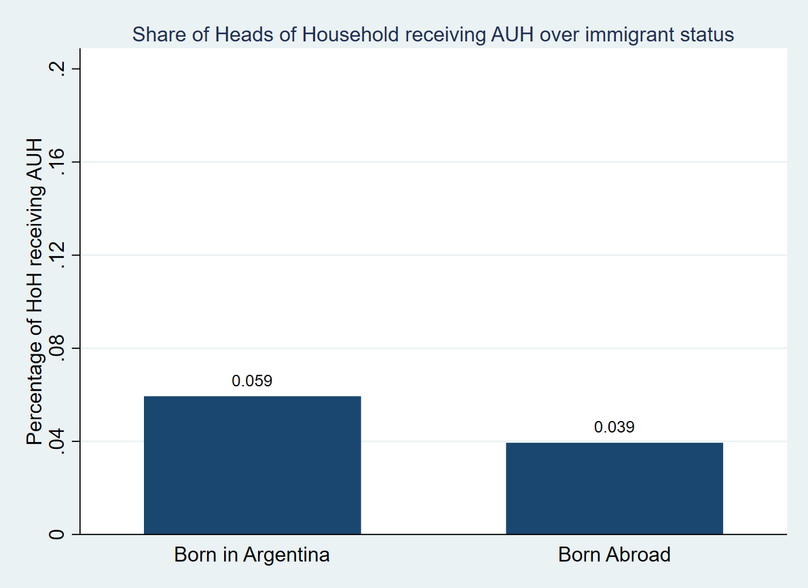

## Project Objective

My project has three primary objectives. The first two of those are if (a) the majority of immigrants in Argentina benefit from the Asignación Universal por Hijo (AUH -- "Universal Child Allowance") social welfare program, and (b) if the majority of the beneficiaries of this program are immigrants. The third objective (c) is to characterize the beneficiaries of this particular program. In other words, what trends in province/country of origin, age, gender, and education level of the recipients of the AUH exist.

## Background

In recent years, the current government of Argentina has been asserting that immigrants are the primary beneficiaries of various social welfare programs in Argentina. Although this household survey from which this data stems from does not explicitly ask whether an individual benefits from any social welfare programs, the questions can be used to determine eligibility for such programs. Following the example of Mariana Marchionni, I assume intention-to-treat, i.e. all those who are eligible also benefit from the AUH program. By identifying whether an individual fulfills the social program's criteria, one is able to determine whether they (most likely) receive the benefits from the program or not.

## Data Set

The data set sources from the [Argentinian Department of Statistics](https://www.indec.gob.ar/indec/web/Institucional-Indec-BasesDeDatos). The survey is known as the Encuesta Permanente de Hogares (EPH - "The Permanent Household Survey"), and I will be using data from 2017-2019. The survey includes a general household section and individual section, the latter of which asks each household resident questions on background, employment, and income. Using these variables, I can identify the criteria for receiving the benefits from the AUH program, (details to be explained later) and then measure up the share of immigrants and non-immigrants eligible for the program. The csv file has been trimmed to only include variables necessary for this analysis.

The following are the the variables contained in the data set: Year, Quarter, Family_Relationship, Sex, Age, Education_Level, Employment_Position, Paid_Vacation, Bonus, Sick_Days, Health_Insurance, Pension_Discount, Individual_Income, House_Income, Country_of_Birth, Household, Individual, Min_Wage, Domestic_Worker, Unemployed, Poverty, and Province_of_Birth.

## Data Manipulation Goals:

The first course of action is to identify the criteria for eligibility of receiving the AUH. In brief, the AUH is a cash transfer program aimed at unemployed and informal workers earning below minimum wage with children or dependents, somewhat similar to the German institution of "Kindergeld". Additionally, in Argentina, approximately 30% of minors receive the AUH, so it is a very well-known and widespread program. Note that, a household may receive multiple transfer payments, one for each child or dependent with a max of five. The survey contains information on the familial relation of house residents to one another, so the head of household and his/her spouse are the relevant individuals whose employment type will be analyzed. Using these guidelines, I can identify whether either of the parents/guardians are eligible to receive any (and how many) transfer payments.

The following are the criteria for receiving the AUH: A parent who has children under the age of 18 and is either unemployed, a domestic worker, an informal worker earning less than minimum wage, or self-employed and earning less than minimum wage. A parent receives one AUH per child under 18 with a max of five. If both parents are eligible, the mother is the one to receive the AUH(s). In this analysis, we are only interested in whether a parent could receive [any number]{.underline} of AUHs.

Informal workers are individuals who are not legally employed by the company. That is, the company does not pay taxes and/or does not provide required social protection/entitlement for that employee. If any of the following criteria are fulfilled, that individual is informally employed: No paid vacation, no bonus, no sick days, no health insurance provided by company, no pension discount, or whose employment position is an unpaid family worker.

### Other Notes:

-   As a simplification, [only the Head of Household and the Spouse will be considered as potential recipients of the AUH]{.underline}
-   Code "0" identifies cases to which the analyzed sequence does not correspond
-   Code "9" correspond to the category "Don't know/No answer"
-   An exception is the amount of income, in which case the non-response is identified with code "-9"
-   Age of "-1" is not yet born or less than one year old
-   Use Dummy Variable "Unemployed" as indicator for unemployment
-   Individual Variable: each Individual has a unique ID (NOTE: Individuals are sometimes surveyed in more than one quarter or year, so each "Individual" ID is not necessarily unique between different quarters/years)
-   Household Variable: All individuals belonging to the same Household have the same Household ID
-   Min_Wage Variable: In the current Year/Quarter, what is the current minimum wage

## Data Visualization Goals:

Data visualization will be relatively simple bar graphs measuring (a) the percentage of heads of households & their spouses who are immigrants who are eligible for the AUH vs. the percentage of heads of Households & their spouses who are non-immigrants and are eligible for the AUH; (b) the percentage of heads of households & their spouses who are immigrants who are eligible for the AUH vs. the percentage of heads of households & their spouses who are immigrants who are NOT eligible for the AUH; and (c) of those heads of household and spouses who are eligible, what are the percentages based on gender, age group (create age ranges), country of origin (within South America), province of origin (if born in Argentina), and education level (each being a separate graph).

Here is a sample graph from other years, specifically for heads of household: 

And here is a rough idea of my data visualization for part (c), with the y being the fraction or count and x being the categorical variables: 

## References

Garganta, S., Gasparini, L., Marchionni, M. et al. The Effect of Cash Transfers on Fertility: Evidence from Argentina. Popul Res Policy Rev 36, 1–24 (2017). <https://doi.org/10.1007/s11113-016-9417-x>
